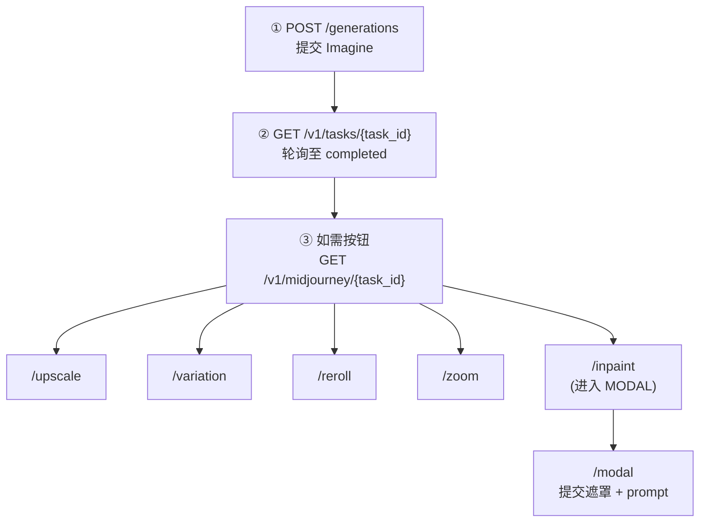

# Seedance / Seedream / Upscaler / Seed Audio / 可灵·海螺·Vidu / Zhenzhen / Suno / Midjourney API（api.seedance.nz）

> 异步任务型接口：提交任务 → 轮询结果 → 拿到媒体直链。
> Seedance 视频按 Token；HappyHorse / Wan / 超分等按秒或金额；**可灵 / 海螺 / Vidu 为按次计费**；**Zhenzhen 扩展 / Suno / Midjourney 按上游消耗结算**。多退少补，失败全额退款。
> 本文件为 AI 友好的 Markdown 版完整 API 文档，可直接投喂给 Cursor、Claude Code、Codex 等 AI 编程工具。
> 人类可读的网页版：https://api.seedance.nz/docs/

## 基本信息

- Base URL: `https://api.seedance.nz`
- 鉴权：所有接口都要求请求头 `Authorization: Bearer <API Key>`（在 https://api.seedance.nz/keys 「API 令牌」页面创建，形如 `sk-xxxx`）
- 接口一览：
 - `POST /v1/videos` — 提交视频生成任务（异步）
 - `GET /v1/videos/{task_id}` — 查询视频任务（OpenAI Video 风格响应）
 - `POST /v1/videos`（model=`zhenzhen-upscaler`）— **视频超分**（独立分类，见下方专节）
 - `POST /v1/image/generations` — 提交图片生成任务（异步）
 - `GET /v1/image/generations/{task_id}` — 查询图片任务（通用 TaskDto 响应）
 - `POST /v1/audio/generations` — 提交音频生成任务（异步；不是 `/v1/audio/speech`）
 - `GET /v1/audio/generations/{task_id}` — 查询音频任务（通用 TaskDto 响应）
 - `POST /v1/chat/completions` — **文本对话（同步/流式）**，模型 `qwen/qwen3.8-max`、`zhenzhen/gk-4.6`、`kimi-k3`（OpenAI Chat Completions 兼容）
 - `POST /v1/audio/transcriptions` — **语音转写（同步）**，模型 `whisper-1`（multipart；不经 bridge）
 - `POST /v1/music/generations[/:action]` — **Suno 音乐**提交（异步；SKU=`suno-*`）
 - `GET /v1/music/tasks/{task_id}` — **Suno 音乐**查询（透传 `music[]`）
 - `POST /v1/midjourney/generations[/:action]` — **Midjourney**提交（异步；SKU=`midjourney-*`）
 - `GET /v1/midjourney/tasks/{task_id}` — **Midjourney**查询（MJ 风格 + cost）
 - `POST /v1/files/upload` — 上传参考素材，换取 24 小时有效的公网直链（免费）
 - `GET /api/usage/wallet/` — **查询账户钱包余额**（Bearer sk；非令牌额度）
- 旧版视频端点 `POST /v1/video/generations` + `GET /v1/video/generations/{task_id}` 仅为兼容保留，新接入视频请用 `/v1/videos`。


### 查询钱包余额

用 API Key 查询**账户钱包余额**（控制台钱包，不是令牌 remain_quota）：

```bash
curl https://api.seedance.nz/api/usage/wallet/ \
 -H "Authorization: Bearer sk-xxxx"
```

响应示例：

```json
{
  "code": true,
  "message": "ok",
  "data": {
    "object": "wallet_balance",
    "quota": 1500000,
    "used_quota": 250000,
    "total_available": 1500000,
    "amount": 3.0,
    "used_amount": 0.5,
    "display_type": "CNY",
    "username": "demo",
    "group": "default"
  }
}
```

- 路径：`GET /api/usage/wallet/`
- 鉴权：`Authorization: Bearer sk-xxxx`（TokenAuthReadOnly；过期/耗尽令牌也可查询，封禁用户除外）
- `amount`：展示货币余额（本站通常为 CNY）；`quota` / `total_available`：内部额度单位
- 勿与 `GET /api/usage/token/`（令牌剩余额度）混淆

### 文本对话（qwen/qwen3.8-max / zhenzhen/gk-4.6 / kimi-k3）

同步 OpenAI Chat Completions 兼容接口：

```bash
curl -X POST https://api.seedance.nz/v1/chat/completions \
 -H "Authorization: Bearer sk-xxxx" \
 -H "Content-Type: application/json" \
 -d '{
  "model": "qwen/qwen3.8-max",
  "stream": false,
  "max_tokens": 256,
  "messages": [{"role":"user","content":"你好"}]
}'
```

- 路径：`POST /v1/chat/completions`（同步；可选 `stream=true`）
- 模型：`qwen/qwen3.8-max`（Qwen 3.8 Max，1M 上下文；支持工具调用、推理、Web Search 与结构化输出）
- 模型：`zhenzhen/gk-4.6`（GK 4.6 海外版，500K 上下文；支持视觉输入、工具调用、推理与流式输出）
- 模型：`kimi-k3`（Kimi K3，约 1M 上下文；默认启用推理）
- 计费：按 Token 用量结算（输入/输出倍率以控制台定价页为准）；失败不计费
- GK 4.6 阶梯价：输入上下文 `<200K` tokens 时，输入/输出/缓存读取为 ¥14/¥42/¥3.5 每 1M tokens；`>=200K` 时为 ¥28/¥84/¥7；最终按海外上游实际账单换算结算
- 与异步图/视频、`/v1/audio/*` 不是同一路径

### 语音转写（whisper-1）

同步接口，不轮询：

```bash
curl -X POST https://api.seedance.nz/v1/audio/transcriptions \
 -H "Authorization: Bearer sk-xxxx" \
 -F "file=@/path/to/audio.mp3" \
 -F "model=whisper-1" \
 -F "response_format=json"
```

- 支持格式：mp3 / wav / flac / m4a / mp4 / ogg / opus / aac / aiff（**不支持 webm**）
- `response_format`：`json`（默认）/ `verbose_json` / `srt` / `text` / `vtt`
- 计费：按音频时长，1 分钟 = 1000 tokens
- 与异步 Seed Audio（`/v1/audio/generations`）不是同一路径

## 典型调用流程

### 视频
1. 如有本地参考素材，先调 `POST /v1/files/upload` 换取 URL。
2. 调 `POST /v1/videos` 提交，记录返回的 `id`。
3. 每 3~5 秒调 `GET /v1/videos/{id}`，直到 `status` 为 `completed` 或 `failed`。
4. 成功时从 `metadata.url` 取视频直链并立即下载转存。

### 视频超分（Zhenzhen Upscaler）
1. 如有本地 MP4，先调 `POST /v1/files/upload` 换取 URL。
2. 调 `POST /v1/videos`，`model=zhenzhen-upscaler`，在 `metadata.content` 传一条 `video_url`，`metadata.resolution` 指定目标分辨率。
3. 轮询同普通视频任务；成功后下载结果视频并转存。

### 图片
1. 图生图如需参考图，先上传换 URL。
2. 调 `POST /v1/image/generations` 提交，记录 `task_id` / `id`。
3. 每 3~5 秒调 `GET /v1/image/generations/{id}`，直到 `data.status` 为 `SUCCESS` 或 `FAILURE`。
4. 成功时从 `data.result_url`（或 `data.data.content.image_url`）取图片直链并立即下载转存。

### 音频
1. 如需参考音频/图片，先上传换 URL。
2. 调 `POST /v1/audio/generations` 提交，记录 `task_id` / `id`。
3. 每 3~5 秒调 `GET /v1/audio/generations/{id}`，直到 `data.status` 为 `SUCCESS` 或 `FAILURE`。
4. 成功时从 `data.result_url`（或 `data.data.content.audio_url`）取音频直链并立即下载转存。

---

## POST /v1/videos — 提交视频生成任务

Content-Type: `application/json`

### 请求体字段

| 字段 | 类型 | 必填 | 说明 |
| --- | --- | --- | --- |
| `model` | string | 是 | 模型名，见下方「模型列表」。后缀决定任务类型：`-t2v` 文生视频 / `-i2v` 图生视频 / `-multi` 多模态视频 |
| `prompt` | string | `-t2v`/`-multi` 必填，`-i2v` 可选 | 文本提示词，最长 20480 字符。多模态场景可用 `@Image 1`、`@Video 1` 指代第几个参考素材 |
| `images` | string[] | `-i2v` 必填 | 参考图片 URL 数组，仅 `-i2v` 使用。1 张 = 首帧图；2 张时第 2 张为尾帧图。也可用单数字段 `image`（单个 URL 字符串）代替 |
| `seconds` | string | 否 | 视频时长（秒），字符串类型。`"4"` ~ `"15"` 的整数，或 `"-1"`（模型智能选择时长）。默认 `"5"` |
| `metadata` | object | 否 | 生成参数集合，见下表 |

### metadata 对象字段（均可选）

| 字段 | 类型 | 说明 |
| --- | --- | --- |
| `resolution` | string | 分辨率，默认 `720p`。Standard 档：`480p`/`720p`/`1080p`/`2k`/`4k`/`native1080p`/`native4k`；Fast、Mini 档：`480p`/`720p`/`1080p`/`2k`/`4k`。其中 `1080p`/`2k`/`4k` 为超分档，另收附加费（见「价格」） |
| `ratio` | string | 画面比例，默认 `adaptive`（自适应）。可选 `16:9`/`4:3`/`1:1`/`3:4`/`9:16`/`21:9` |
| `seed` | integer | 随机种子，`-1`（默认，随机）~ `2147483647` |
| `generate_audio` | boolean | 是否生成配音/音效，默认 `true` |
| `return_last_frame` | boolean | 是否额外返回视频最后一帧图片，默认 `false` |
| `content` | array | 仅 `-multi` 模型使用，参考素材数组，见下方 |

### 各任务类型的传参方式与素材限制

| 任务类型 | 传参方式 | 素材限制 |
| --- | --- | --- |
| `-t2v` 文生视频 | 只传 `prompt` | 无素材 |
| `-i2v` 图生视频 | `prompt`（可选）+ 顶层 `images` | 图片 1~2 张：第 1 张首帧（必填），第 2 张尾帧（可选）。JPG/JPEG/PNG/WEBP，单张 ≤30MB |
| `-multi` 多模态视频 | `prompt`（必填）+ `metadata.content` | 图片 ≤9 张（JPG/JPEG/PNG/WEBP，单张 ≤30MB）；视频 ≤3 个（MP4，单个 ≤50MB）；音频 ≤3 个（MP3/WAV，单个 ≤50MB，国内版 Fast 档 ≤15MB）。三类可混合，至少 1 个参考素材 |

### metadata.content 数组元素结构（仅 -multi 模型）

```json
{ "type": "image_url", "image_url": { "url": "https://..." } }
{ "type": "video_url", "video_url": { "url": "https://..." } }
{ "type": "audio_url", "audio_url": { "url": "https://..." } }
```

- 传入 `video_url` 参考视频后，整个任务按「有参考视频」的更低 Token 单价档计费。
- 注意：一旦传了 `metadata.content`，它会整体覆盖顶层 `images` 的效果。多模态场景把图片也写进 `content` 数组，不要再单独传顶层 `images`。

### 请求示例（文生视频）

```bash
curl -X POST https://api.seedance.nz/v1/videos \
 -H "Authorization: Bearer sk-xxxx" \
 -H "Content-Type: application/json" \
 -d '{
 "model": "seedance-2.0-mini-t2v",
 "prompt": "a calm lake at sunrise, cinematic light",
 "seconds": "5",
 "metadata": { "resolution": "480p" }
 }'
```

注意（Windows PowerShell）：把 JSON 写入文件后用 `--data-binary "@request.json"` 提交，直接在命令行拼接带空格的 JSON 会被拆成多个参数导致请求失败。

### 请求示例（多模态：1 张图 + 1 个视频，换人）

```json
{
 "model": "seedance-2.0-standard-multi",
 "prompt": "把 @Video 1 中的人物替换成 @Image 1 中的人物",
 "seconds": "5",
 "metadata": {
 "resolution": "1080p",
 "content": [
 { "type": "image_url", "image_url": { "url": "https://your-cdn.example.com/person.png" } },
 { "type": "video_url", "video_url": { "url": "https://your-cdn.example.com/source.mp4" } }
 ]
 }
}
```

### 响应（200，提交成功）

```json
{
 "id": "task_xxxxxxxxxxxx",
 "object": "video",
 "model": "seedance-2.0-mini-t2v",
 "status": "queued",
 "progress": 0,
 "created_at": 1783377182
}
```

---

## GET /v1/videos/{task_id} — 查询任务状态与结果

路径参数 `task_id` 为提交任务时返回的 `id`。建议每 3~5 秒轮询一次。

### status 取值

| status | 含义 |
| --- | --- |
| `queued` | 排队中 |
| `in_progress` | 生成中，`progress` 为 0~100 的进度百分比 |
| `completed` | 生成成功，`metadata.url` 为视频直链 |
| `failed` | 生成失败，详见 `error.code`/`error.message`，费用全额退还 |

### 响应示例

生成中：

```json
{
 "id": "task_xxxxxxxxxxxx",
 "object": "video",
 "model": "seedance-2.0-mini-t2v",
 "status": "in_progress",
 "progress": 50,
 "created_at": 1783377182,
 "metadata": { "url": "" }
}
```

生成成功（`metadata.url` 为带签名有效期的临时直链，请立即下载转存）：

```json
{
 "id": "task_xxxxxxxxxxxx",
 "object": "video",
 "model": "seedance-2.0-mini-t2v",
 "status": "completed",
 "progress": 100,
 "created_at": 1783377182,
 "completed_at": 1783377298,
 "metadata": { "url": "https://.../output.mp4?X-Tos-Signature=..." }
}
```

生成失败：

```json
{
 "id": "task_xxxxxxxxxxxx",
 "object": "video",
 "model": "seedance-2.0-mini-t2v",
 "status": "failed",
 "progress": 100,
 "error": { "code": "video_generation_failed", "message": "..." }
}
```

---

## 视频超分（Zhenzhen Upscaler）— 独立分类

把已有 MP4 提升到更高分辨率。走 `POST /v1/videos`（兼容 `POST /v1/video/generations`），查询同普通视频任务。

- 模型：`zhenzhen-upscaler`（上游 `rhart-video/video-upscaler`）
- 必填：`metadata.content` 中恰好 1 条 `video_url`（MP4，最长约 10 分钟）
- 可选：`metadata.resolution` → 目标分辨率 `720p` / `1080p` / `2k` / `4k`（默认 `1080p`）
- `prompt` / `seconds` 不参与上游提交（时长由上游从输入视频读取）
- 计费：按输入时长 × 目标分辨率单价；price-preview 全额预扣，终态按 `thirdPartyConsumeMoney` 结算

### 请求示例

```json
{
 "model": "zhenzhen-upscaler",
 "prompt": "upscale",
 "metadata": {
 "resolution": "1080p",
 "content": [
 { "type": "video_url", "video_url": { "url": "https://your-cdn.example.com/source.mp4" } }
 ]
 }
}
```

### 牌价（元 / 秒，指导价）

| 目标分辨率 | 单价 |
| --- | --- |
| 720p | ¥0.14 |
| 1080p | ¥0.21 |
| 2k | ¥0.35 |
| 4k | ¥0.56 |

与 Seedance 生成后再升分辨率的「超分附加费」不是同一套计费。

---

## POST /v1/files/upload — 上传参考素材

Content-Type: `multipart/form-data`，表单字段 `file`（二进制文件）。上传免费。

- 支持格式：图片 JPG/JPEG/PNG/WEBP、音频 MP3/WAV/FLAC、视频 MP4/AVI/MOV/MKV
- 单文件 ≤50MB（生成任务对素材另有大小限制，见上文）
- 频率限制：每令牌每分钟 10 次、每天 200 次，超限返回 429
- 返回的 URL 仅 24 小时有效，不是图床/网盘，请在有效期内提交生成任务

### 请求示例

```bash
curl -X POST https://api.seedance.nz/v1/files/upload \
 -H "Authorization: Bearer sk-xxxx" \
 -F "file=@/path/to/person.png"
```

### 响应（200）

```json
{
 "url": "https://.../xxxx.png?q-sign-algorithm=...",
 "file_type": "image",
 "size": 3490,
 "expires_in": 86400
}
```

把返回的 `url` 直接填入视频的 `images` / `metadata.content`，或图片的 `images`。

### 参考素材 URL 的通用要求

- 必须是 `http(s)://` 公网直链：请求该 URL 能直接得到文件本身（`Content-Type` 为对应媒体类型）
- 不支持：base64 内嵌、本地文件路径、需要登录的链接、网盘分享页（百度网盘/阿里云盘分享链接打开是网页，无法使用）
- URL 需在任务整个执行期间保持可访问；带签名的临时 URL 请确保有效期足够
- 素材不符合要求时任务会提交失败或生成失败，费用全额退还

---

## POST /v1/audio/generations — 提交音频生成任务

支持 `doubao-seed-audio-1.0`、Mureka BGM/歌曲、MiniMax Speech 2.8/Voice Clone/Music 2.6、Qwen3 TTS。Mureka BGM 请求须在
`prompt` 与 `metadata.instrumental_id` 中二选一；`metadata.n` 为 1–3（默认 2，
¥0.34/条），`metadata.stream` 默认 false。成功时 `result_url` 为第一条音频，
完整有序列表位于 `data.content.audio_urls`。

Content-Type: `application/json`

> 异步 Seed Audio，**不是**同步 TTS `POST /v1/audio/speech`。

### 请求体字段

| 字段 | 类型 | 必填 | 说明 |
| --- | --- | --- | --- |
| `model` | string | 是 | `doubao-seed-audio-1.0` |
| `prompt` | string | 是 | 文本提示词，5 ~ 2048 字符 → 上游 `text_prompt` |
| `images` | string[] | 否 | 参考图（取首张）；不可与 speaker / 参考音频同时用 |
| `metadata` | object | 否 | 见下表 |

### metadata 字段

| 字段 | 类型 | 说明 |
| --- | --- | --- |
| `speaker` | string | 音色 ID；与 `audio_url` / `images` 互斥 |
| `audio_url` / `audio_urls` | string \| string[] | 参考音频，最多 3；与 speaker / images 互斥 |
| `format` | string | `wav` / `mp3` / `pcm` / `ogg_opus`，默认 `wav` |
| `sample_rate` | string | `8000` / `16000` / `24000` / `32000` / `44100`，默认 `24000` |
| `speech_rate` | integer | `-50` ~ `100`，未传默认 `0` |
| `loudness_rate` | integer | `-50` ~ `100`，未传默认 `0` |
| `pitch_rate` | integer | `-12` ~ `12`，未传默认 `0` |

### 请求示例

```bash
curl -X POST https://api.seedance.nz/v1/audio/generations \
 -H "Authorization: Bearer sk-xxxx" \
 -H "Content-Type: application/json" \
 -d '{
 "model": "doubao-seed-audio-1.0",
 "prompt": "gentle rain falling on a quiet city street at night",
 "metadata": {
 "speaker": "zh_male_shaonianzixin_uranus_bigtts",
 "format": "mp3",
 "sample_rate": "24000"
 }
 }'
```

### 提交响应（200）

```json
{
 "id": "task_xxxxxxxxxxxx",
 "task_id": "task_xxxxxxxxxxxx",
 "status": "queued",
 "model": "doubao-seed-audio-1.0",
 "created_at": 1783870738
}
```

---

## GET /v1/audio/generations/{task_id} — 查询音频任务

返回通用任务记录（与图片查询相同）。建议每 3~5 秒轮询。

### data.status 取值

| status | 含义 |
| --- | --- |
| `NOT_START` / `SUBMITTED` | 排队中 |
| `IN_PROGRESS` | 生成中 |
| `SUCCESS` | 成功，`data.result_url` 为音频直链 |
| `FAILURE` | 失败，见 `fail_reason`，全额退款 |

### 成功响应（节选）

```json
{
 "code": "success",
 "data": {
 "task_id": "task_xxxxxxxxxxxx",
 "status": "SUCCESS",
 "progress": "100%",
 "result_url": "https://.../output.mp3",
 "quota": 42000,
 "data": {
 "status": "succeeded",
 "content": { "audio_url": "https://.../output.mp3" }
 }
 }
}
```

---

## POST /v1/image/generations — 提交图片生成任务

Content-Type: `application/json`

### 请求体字段

| 字段 | 类型 | 必填 | 说明 |
| --- | --- | --- | --- |
| `model` | string | 是 | Seedream：`seedream-v5-pro-*`（含 `layer-decomposition`）/ `dola-seedream-5.0-pro-*`；Zhenzhen Image G-2：`zhenzhen-image-g2-t2i` / `zhenzhen-image-g2-i2i`；Zhenzhen 扩展：`zhenzhen-image-g-v2-lowprice` / `zhenzhen-image-gk-v15` / `zhenzhen-image-gk-v15-edit` / `zhenzhen-image-gk-v2` / `zhenzhen-image-nb-*` |
| `prompt` | string | 视模型 | 普通 Seedream：5 ~ 2000 字符；图层拆分：可选，0 ~ 2000 字符；Zhenzhen Image G-2：最长 20000 字符 |
| `images` | string[] | i2i / 图层拆分必填 | 普通 i2i 最多 10 张；图层拆分恰好 1 张（≤30MB）。也可用单数字段 `image` |
| `metadata` | object | 否 | 见下表 |

### metadata 字段

| 字段 | 类型 | 说明 |
| --- | --- | --- |
| `resolution` | string | 普通 Seedream：`1k` / `2k`（优先于宽高）；图层拆分：`auto` / `1k` / `1.5k` / `2k`；Zhenzhen Image G-2：**仅 `1k`** |
| `ratio` | string | 仅 Zhenzhen Image G-2：宽高比 → `aspectRatio`（如 `16:9` / `9:16` / `1:1`） |
| `width` | integer | 仅 Seedream：240 ~ 8192，未传 resolution 时生效 |
| `height` | integer | 仅 Seedream：240 ~ 8192，未传 resolution 时生效 |
| `output_format` | string | 仅 Seedream：`jpeg` / `png`（Zhenzhen Image G-2 不支持） |

### 请求示例（文生图）

```bash
curl -X POST https://api.seedance.nz/v1/image/generations \
 -H "Authorization: Bearer sk-xxxx" \
 -H "Content-Type: application/json" \
 -d '{
 "model": "seedream-v5-pro-t2i",
 "prompt": "高端护肤品电商主图，纯白柔光展台，玻璃精华瓶",
 "metadata": { "resolution": "2k", "output_format": "jpeg" }
 }'
```

### 请求示例（图生图）

```json
{
 "model": "seedream-v5-pro-i2i",
 "prompt": "横版复古馆藏风美妆宣传海报，藏青深蓝色哑光底",
 "images": ["https://your-cdn.example.com/ref.png"],
 "metadata": { "resolution": "1k", "output_format": "jpeg" }
}
```

### 请求示例（图层拆分）

```json
{
 "model": "seedream-v5-pro-layer-decomposition",
 "images": ["https://your-cdn.example.com/source.png"],
 "metadata": { "resolution": "auto", "output_format": "jpeg" }
}
```

### 提交响应（200）

```json
{
 "id": "task_xxxxxxxxxxxx",
 "task_id": "task_xxxxxxxxxxxx",
 "status": "queued",
 "model": "seedream-v5-pro-t2i",
 "created_at": 1783717700
}
```

---

## GET /v1/image/generations/{task_id} — 查询图片任务

返回通用任务记录（与视频的 OpenAI Video 风格不同）。建议每 3~5 秒轮询。

### data.status 取值

| status | 含义 |
| --- | --- |
| `NOT_START` / `SUBMITTED` | 排队中 |
| `IN_PROGRESS` | 生成中 |
| `SUCCESS` | 成功，`data.result_url` 为图片直链 |
| `FAILURE` | 失败，见 `fail_reason`，全额退款 |

### 成功响应（节选）

```json
{
 "code": "success",
 "data": {
 "task_id": "task_xxxxxxxxxxxx",
 "status": "SUCCESS",
 "progress": "100%",
 "result_url": "https://.../output.jpg",
 "quota": 270000,
 "data": {
 "status": "succeeded",
 "content": {
   "image_url": "https://.../base.jpg",
   "image_urls": ["https://.../base.jpg", "https://.../layer-1.png"]
 }
 }
 }
}
```

---

## 模型列表

### 视频模型（Seedance 2.0，共 18 个）

模型名格式：`seedance-2.0-[global-]{tier}-{task}`

- `[global-]`：省略 = 国内版（`.cn` / CNY）；`global-` = 国际版（`.ai` / USD→CNY）
- `{tier}`：`standard` / `fast` / `mini`
- `{task}`：`t2v` / `i2v` / `multi`

国内版 9 个：

```
seedance-2.0-standard-t2v seedance-2.0-standard-i2v seedance-2.0-standard-multi
seedance-2.0-fast-t2v seedance-2.0-fast-i2v seedance-2.0-fast-multi
seedance-2.0-mini-t2v seedance-2.0-mini-i2v seedance-2.0-mini-multi
```

国际版 9 个：

```
seedance-2.0-global-standard-t2v seedance-2.0-global-standard-i2v seedance-2.0-global-standard-multi
seedance-2.0-global-fast-t2v seedance-2.0-global-fast-i2v seedance-2.0-global-fast-multi
seedance-2.0-global-mini-t2v seedance-2.0-global-mini-i2v seedance-2.0-global-mini-multi
```

### 视频模型（Seedance 2.5 Standard Token，共 6 个）

仅 Standard。分辨率 `480p`/`720p`/`1080p`/`2k`/`4k`（无 native）；时长 4–30s 或 `metadata.duration=-1`。
多模态最多 **50** 个参考：30 图 + 10 视频 + 10 音频（单段音视频 2–30s，总长 ≤30s；不同于 2.0 的 9/3/3）。

```
seedance-2.5-standard-t2v seedance-2.5-standard-i2v seedance-2.5-standard-multi
seedance-2.5-global-standard-t2v seedance-2.5-global-standard-i2v seedance-2.5-global-standard-multi
```

### 图片模型（Seedream v5 Pro / Dola / Zhenzhen Image G-2）

```
seedream-v5-pro-t2i # 文生图（国内 .cn）
seedream-v5-pro-i2i # 图生图（国内，需 images）
seedream-v5-pro-layer-decomposition # 图层拆分（国内；单图输入；底图 + 最多 16 图层）
dola-seedream-5.0-pro-t2i # 文生图（海外 .ai）
dola-seedream-5.0-pro-i2i # 图生图（海外，需 images）
dola-seedream-5.0-pro-layer-decomposition # 图层拆分（海外；单图输入；底图 + 有序图层 URL）
zhenzhen-image-g2-t2i # Zhenzhen Image G-2 文生图（resolution 仅 1k；可选 ratio）
zhenzhen-image-g2-i2i # Zhenzhen Image G-2 图生图（需 images；resolution 仅 1k；ratio→aspectRatio）
```

### 图片模型（Qwen-Image 3.0 / 3.0-Pro，共 8 个）

```
qwen-image-3.0-t2i # 文生图（国内 .cn）
qwen-image-3.0-i2i # 图像编辑（国内；images 1–3）
qwen-image-3.0-pro-t2i # Pro 文生图（国内）
qwen-image-3.0-pro-i2i # Pro 图像编辑（国内；images 1–3）
qwen-image-3.0-global-t2i # 文生图（海外 .ai）
qwen-image-3.0-global-i2i # 图像编辑（海外）
qwen-image-3.0-global-pro-t2i # Pro 文生图（海外）
qwen-image-3.0-global-pro-i2i # Pro 图像编辑（海外）
```

参数：`prompt`（≤3000）；可选 `n`(1–6→imageNum)、`negative_prompt`（≤600）、`prompt_extend`、`metadata.prompt_extend_mode`(`direct`|`agent`)、`metadata.seed`；
`metadata.ratio`+`metadata.resolution`(1k|2k) 或 `size`(如 `1024*1024`)；省略 size 由上游按提示词自动推荐。
`qwen-image-3.0-global-*` 请求直达 RunningHub.ai 海外站（`rh_host=ai` + 海外 Key），不是国内站回源。
Pro 牌价参考（CNY）：输出 1K ≈¥0.23/张、2K ≈¥0.45/张；编辑另计输入约 ¥0.02/张。标准文生图约 ¥0.16/张。实际按 `thirdPartyConsumeMoney` 结算。

### 视频模型（Wan 2.7 Spicy，1 个）

```
wan-2.7-spicy-i2v # 图生视频；images[0]→imageUrl；seconds=2..15；720p|1080p；可选 audio_url/negative_prompt/prompt_extend
```

牌价（按秒，指导价）：720p ¥0.91/s，1080p ¥1.4/s。

### 图片模型（Wan 2.7 海外，共 3 个）

```
wan-2.7-global-t2i # 文生图；prompt≤5000；可选 width/height=512..4096、thinking_mode
wan-2.7-global-i2i # 图像编辑；images 1–9；prompt≤2048
wan-2.7-global-i2i-pro # Pro 图像编辑；images 1–9；prompt≤2048
```

请求路径：`POST /v1/image/generations`，轮询：`GET /v1/image/generations/{id}`。三个 SKU 均直连 RunningHub.ai，`thirdPartyConsumeMoney` 为 USD，按 `RhAiUsdToCnyRate` 换算。

### 视频超分（Zhenzhen Upscaler，1 个）— 独立分类

详见上方专节「视频超分（Zhenzhen Upscaler）」。

```
zhenzhen-upscaler # video_url + targetResolution；720p|1080p|2k|4k
```

### 视频模型（HappyHorse 1.1，共 3 个）

```
happyhorse-1.1-t2v # 文生视频；resolution=720p|1080p；seconds=3..15；metadata.ratio→aspectRatio
happyhorse-1.1-i2v # 图生视频（需 images）；取首图为 imageUrl；prompt 可选
happyhorse-1.1-r2v # 参考图生视频；images 1~9 → imageUrls；prompt 可用「图1/图2」
```

牌价（按秒，指导价）：720p ¥0.69/s，1080p ¥0.92/s。不支持 `seconds=-1`。

### RunningHub OpenAPI 媒体模型（共 66 个）— **按次计费**

计费：按次（上游 `thirdPartyConsumeMoney`），**不是** Seedance Token 按量。price-preview 预扣 → 成功后按实际金额结算 → 失败全额退款。接口同 `/v1/videos`。

#### 可灵 Kling（28）

```
kling-v3.0-std-t2v kling-v3.0-pro-t2v kling-v3.0-std-i2v kling-v3.0-pro-i2v
kling-v3-turbo-std-t2v kling-v3-turbo-pro-t2v kling-v3-turbo-std-i2v kling-v3-turbo-pro-i2v
kling-v3-4k-t2v kling-v3-4k-i2v
kling-o3-std-t2v kling-o3-pro-t2v kling-o3-std-i2v kling-o3-pro-i2v
kling-o3-std-r2v kling-o3-pro-r2v kling-o3-std-edit kling-o3-pro-edit
kling-o3-4k-t2v kling-o3-4k-i2v kling-o3-4k-r2v
kling-v3.0-std-motion kling-v3.0-pro-motion kling-v3.0-4k-motion
kling-elements-advanced
kling-lip-sync-identify-face kling-lip-sync-tts kling-lip-sync-video
```

- i2v 常用 `firstImageUrl`（`images[0]`）；首尾帧用 `images[0]`+`images[1]`
- edit / motion 需 `video_url`；lip-sync 为多步（metadata 传 sessionId/faceId 等）

#### 海螺 Hailuo 2.3（6）

```
hailuo-2.3-t2v-standard hailuo-2.3-t2v-pro
hailuo-2.3-i2v-standard hailuo-2.3-i2v-pro
hailuo-2.3-fast-i2v hailuo-2.3-fast-pro-i2v
```

- i2v：`images[0]`→`imageUrl`；标准档时长多为 6/10 秒枚举

#### 海螺 Hailuo H3（6，国内 + 海外）

```
hailuo-h3-t2v
hailuo-h3-i2v
hailuo-h3-multi
hailuo-h3-global-t2v
hailuo-h3-global-i2v
hailuo-h3-global-multi
```

- 分辨率 `768P` / `2K`；时长 5–15 秒（字符串枚举）
- t2v / multi：`metadata.ratio`→`ratio`（含 `adaptive`）
- i2v：`images[0]`→`firstFrameUrl`，`images[1]`→`lastFrameUrl`
- multi：图片、视频和音频统一通过 `metadata.content` 传入，限制分别为 9、3、3
- `hailuo-h3-global-*` 走 RunningHub.ai 海外 Key 与 USD→CNY 结算

Hailuo H3 multi 与其他 `-multi` 模型一样，通过 `metadata.content` 传入所有参考素材：

```json
{
  "model": "hailuo-h3-global-multi",
  "prompt": "replace the person in @Video 1 with @Image 1",
  "seconds": "5",
  "metadata": {
    "resolution": "768P",
    "ratio": "16:9",
    "content": [
      { "type": "image_url", "image_url": { "url": "https://cdn.example.com/person.png" } },
      { "type": "video_url", "video_url": { "url": "https://cdn.example.com/source.mp4" } }
    ]
  }
}
```

#### MiniMax H3 Context IR（3，返回增强提示词）

```
minmax-h3-context-ir-text
minmax-h3-context-ir-image
minmax-h3-context-ir-multimodal
```

- 只增强视频提示词，不生成视频；提交 `/v1/video/generations`，轮询 `/v1/video/generations/{id}`
- 成功结果位于 `result_text`
- `prompt` 1–7000 字符，`seconds` 为 4–15 的字符串枚举
- text：`metadata.ratio` 必填，支持 `21:9|16:9|4:3|1:1|3:4|9:16`
- image：`images` 1–2 张，映射首帧/尾帧
- multimodal：图≤9、视频≤3、音频≤3，比例可选且支持 `adaptive`
- 按上游实际人民币 `thirdPartyConsumeMoney` 结算

#### FLUX 3 Video（8，国内 + 海外）

```
flux-3-video-t2v
flux-3-video-i2v
flux-3-video-v2v
flux-3-video-draft-enhance
flux-3-video-global-t2v
flux-3-video-global-i2v
flux-3-video-global-v2v
flux-3-video-global-draft-enhance
```

- `t2v`：`prompt`；`i2v`：`prompt` + `images`（1–10 张关键帧）
- `v2v`：`prompt` + `metadata.video_url`（单个 MP4）
- `draft-enhance`：`metadata.draft_cache`（来自上一条 `metadata.draft=true` 的完成任务）
- 通用：`seconds` 5–20；`metadata.resolution`=`hd`/`fhd`；`metadata.ratio`=`auto`/`21:9`/`2:1`/`16:9`/`4:3`/`1:1`/`3:4`/`9:16`
- 可选：`metadata.draft`、`metadata.generate_audio`、`metadata.safety_tolerance`（0 最严，4 最宽）
- `global` 变体走 RunningHub.ai 海外 Key 与 USD→CNY 结算

#### Minimax H3 OW（RH AI App，8）

```
minimax-h3-ow-t2v
minimax-h3-ow-r2v
minimax-h3-ow-i2v
minimax-h3-ow-r2v-fast
minimax-h3-ow-i2v-fast
minimax-h3-ow-fl2va-audio-drive-fast
minimax-h3-ow-ref2va-audio-drive-fast
minimax-h3-ow-t2v-fast
```

- 文生视频；经 RunningHub AI App（`run/ai-app/2084180204200747010`），强制 `instanceType=ultra`
- 时长：`5` / `10` / `15`；分辨率：`480p`（0.4mp）/ `720p`（1mp）
- `metadata.ratio`：`1:1` `2:3` `3:2` `3:4` `4:3` `9:16` `16:9`（默认）`21:9`
- t2v / r2v / i2v 固定零售（元）：480p 5/10/15s = 0.2/0.5/1.0；720p 5/10/15s = 0.5/1.0/2.0
- fast 五个 SKU 固定零售（元/次）：480p 5/10/15 秒 = 0.3/0.5/1.0；720p 对应为 2 倍 = 0.6/1.0/2.0；i2v-fast 仅支持 1 张首帧图；fl2va-audio-drive-fast/ref2va-audio-drive-fast 仅支持 1 张图和 `metadata.audio_urls[0]` 1 条音频 URL；`megapixels` 映射为 `0.4` / `1`（非上游成本透传；账上成本记 0）

#### Vidu Q3（15）

```
vidu-q3-pro-t2v vidu-q3-turbo-t2v vidu-q3-pro-fast-t2v
vidu-q3-pro-i2v vidu-q3-turbo-i2v vidu-q3-pro-fast-i2v
vidu-q3-pro-start-end vidu-q3-turbo-start-end vidu-q3-pro-fast-start-end
vidu-q3-r2v vidu-q3-mix-r2v vidu-q3-ad-r2v vidu-q3-drama-r2v
vidu-q3-drama-short-play vidu-q3-ad-short-play
```

- t2v：`metadata.ratio`→`aspectRatio`；start-end 需两张图；r2v 用 `images[]`→`imageUrls`
- short-play：`prompt`→`scriptContent`，`metadata.script_name`→`scriptName`


### Zhenzhen 扩展视频 / 图片（共 12 个）

视频走 `POST /v1/videos`（兼容 `/v1/video/generations`），图片走 `POST /v1/image/generations`。
按实际消耗结算：提交预扣、成功多退少补、失败全额退款。结果直链约 24 小时过期，请及时下载转存。
命名注意：`zhenzhen-image-g-v2-lowprice` 与 `zhenzhen-image-g2-*` 是不同模型。

#### 视频

```
zhenzhen-video-gk-v15 # 文生/图生视频；seconds 6–30；resolution 480p|720p；ratio 16:9|9:16|1:1|3:2|2:3；可选 images≤7
zhenzhen-video-v31-fast # 视频（fast）；时长固定 8s；resolution 720p|1080p|4k；ratio 16:9|9:16；images≤3（3 张=reference）
zhenzhen-video-v31-quality # 视频（quality）；同 fast 但禁止 reference（勿传 type=reference 或 3 张参考图）
zhenzhen-video-v31-lite # 视频（lite）；仅文生视频；禁 images / type；时长固定 8s；resolution 720p|1080p|4k；ratio 16:9|9:16
zhenzhen-video-g-omni-flash # 多模态视频（文/图/视频编辑）；prompt 和/或 images≤16 / metadata.video_url（≤1）/ metadata.extend_from_task_id（与 video_url 互斥）；resolution 仅 720p；时长不可指定
```

示例 · `zhenzhen-video-gk-v15`：

```json
{
 "model": "zhenzhen-video-gk-v15",
 "prompt": "A dog running on the beach, sunny weather, slow motion",
 "seconds": "6",
 "metadata": { "resolution": "480p", "ratio": "16:9" }
}
```

示例 · `zhenzhen-video-v31-fast`：

```json
{
 "model": "zhenzhen-video-v31-fast",
 "prompt": "Dolphins leaping in the azure ocean",
 "seconds": "8",
 "metadata": { "resolution": "720p", "ratio": "16:9" }
}
```

示例 · `zhenzhen-video-g-omni-flash`：

```json
{
 "model": "zhenzhen-video-g-omni-flash",
 "prompt": "a blue butterfly landing on a flower, macro, soft light",
 "metadata": { "ratio": "16:9", "resolution": "720p" }
}
```

`metadata.video_url` 改视频时：

```json
{
 "model": "zhenzhen-video-g-omni-flash",
 "prompt": "change the sky to sunset orange",
 "metadata": {
 "video_url": "https://cdn.example.com/clip.mp4",
 "ratio": "16:9",
 "resolution": "720p"
 }
}
```

#### 图片

```
zhenzhen-image-g-v2-lowprice # 文生图/图生图；resolution 1k|2k|4k；n 1–10；size 比例枚举或 WxH；可选 images≤16
zhenzhen-image-gk-v15 # 文生图；n 1–10；size 1:1|16:9|9:16|3:2|2:3
zhenzhen-image-gk-v15-edit # 图编辑；必填 images[]（取首张）；n 1–10
zhenzhen-image-gk-v2 # Grok Imagine 2.0 文生图；n 1–10；size 1:1|16:9|9:16|3:2|2:3
zhenzhen-image-nb-flash # Nano Banana；resolution 仅 1k；n=1；size 含 auto/21:9；可选 images≤14；prompt≤1000
zhenzhen-image-nb-2 # Nano Banana 2；resolution 0.5k|1k|2k|4k；n=1；含极端比例 1:8/8:1；可选 images≤14
zhenzhen-image-nb-2-lite # Nano Banana Lite；resolution 仅 1k；n 1–4；可选 images≤14
zhenzhen-image-nb-pro # Nano Banana Pro；resolution 1k|2k|4k；n=1；可选 images≤14
```

示例 · `zhenzhen-image-g-v2-lowprice`：

```json
{
 "model": "zhenzhen-image-g-v2-lowprice",
 "prompt": "A ginger cat sitting on a windowsill watching the sunset, watercolor",
 "n": 1,
 "size": "1:1",
 "metadata": { "resolution": "1k" }
}
```

示例 · `zhenzhen-image-gk-v15-edit`：

```json
{
 "model": "zhenzhen-image-gk-v15-edit",
 "prompt": "Change the background to a soft starry night sky, keep the subject",
 "images": ["https://cdn.example.com/original.png"],
 "n": 1
}
```

`size` / `n` 也可写在顶层；`metadata.ratio` / `metadata.size` 等价于比例字段。

### 音频模型（Doubao Seed Audio + Mureka BGM，共 3 个）

```
doubao-seed-audio-1.0 # POST /v1/audio/generations；prompt→text_prompt；可选 speaker / audio_url / images
mureka-v8-bgm # POST /v1/audio/generations；prompt / metadata.instrumental_id 二选一；n=1–3
mureka-v9-bgm # POST /v1/audio/generations；prompt / metadata.instrumental_id 二选一；n=1–3
minimax-speech-2.8-turbo # prompt + metadata.voice_id
minimax-speech-2.8-hd # prompt + metadata.voice_id
minimax-voice-clone # prompt + metadata.audio_url + metadata.custom_voice_id
minimax-music-2.6 # prompt/metadata.lyrics + metadata.is_instrumental
mureka-v9-song # metadata.lyrics；n=1–3；支持 vocal_id/melody_id/stream
mureka-o2-song # metadata.lyrics；n=1–3；支持 reference_id
qwen3-tts-flash # prompt + metadata.voice
qwen3-tts-instruct-flash # prompt + metadata.voice + 可选 instructions
```

牌价约 ¥0.004/秒（输出时长）。成功后读 `data.result_url`（音频）。

---

## 价格与计费

### 可灵 / 海螺 / Vidu（按次）

按次计费：上游金额 `thirdPartyConsumeMoney` 结算，非 Token。预扣 → 终态多退少补。具体金额以控制台预估与余额变动为准。

### 视频（Seedance Token 计费）

```
总费用 = Token 单价 × 实际消耗 Token 数 ÷ 1,000,000
 + 超分附加费单价 × 输出视频时长（秒） # 仅 1080p/2k/4k 超分档
```

- Token 消耗量由模型在任务完成后返回，与分辨率、时长、内容复杂度相关，提交前只能估算区间
- 提交时预扣额度仅为占位，任务成功后按实际用量结算并自动退还差额（多退少补）
- 提交失败、生成失败均全额退款
- 最终计费以控制台余额扣减为准

### Token 单价（人民币元 / 百万 Token）

`-multi` 模型传入参考视频（`video_url`）时按「有参考视频」低单价档计费；t2v、i2v 均按「无参考视频」档。国内版与国际版价格相同。

| 档位 | 分辨率 | 无参考视频 | 有参考视频 |
| --- | --- | --- | --- |
| Standard | 480p / 720p | 46 | 28 |
| Standard | 1080p / 2k / 4k / native1080p | 51 | 31 |
| Standard | native4k | 26 | 16 |
| Fast | 全部分辨率 | 37 | 22 |
| Mini | 全部分辨率 | 23 | 14 |

注：`native4k` 的 Token 单价最低，但 4K 原生输出单位时长消耗的 Token 数远高于低分辨率，总价并不低。`native1080p`/`native4k` 仅 Standard 档支持。

### 超分附加费（人民币元 / 秒，按输出视频时长计）

| 分辨率 | 附加费 |
| --- | --- |
| 480p / 720p / native1080p / native4k | 0（免费） |
| 1080p | 0.28 |
| 2k | 0.42 |
| 4k | 0.63 |

### 计费示例

`seedance-2.0-standard-t2v`（无参考视频）+ `1080p` + 输出 5 秒 + 实际消耗 400,000 Token：

```
Token 费用 = 51 × 400,000 ÷ 1,000,000 = ¥20.40
超分附加费 = 0.28 × 5 = ¥ 1.40
总费用 = ¥21.80
```

### 图片（Seedream，按上游金额结算）

```
总费用 = thirdPartyConsumeMoney（人民币）
```

- 提交前按价格预估全额预扣，成功后多退少补；失败全额退款
- 实测参考：`t2i` + `2k` ≈ ¥0.54 / 张；`i2i` + `1k` ≈ ¥0.27 / 张（最终以控制台为准）
- 国内图层拆分按输出张数 × 分辨率档计费：≤236 万像素 ¥0.27/张，>236 万像素 ¥0.54/张
- Dola 海外图层拆分：≤236 万像素 $0.041/张，>236 万像素 $0.081/张；USD 先按 `RhAiUsdToCnyRate` 换算
- 实测成功结果仅含有序图片 URL，没有 `z_index` / `bounding_box`；公共响应不合成这些字段


### Zhenzhen 扩展模型

按实际消耗结算（人民币）：提交预扣 → 成功多退少补 → 失败全额退款。结果 URL 约 24 小时过期。最终以控制台余额扣减为准。

### Midjourney（按上游 cost USD）

```
按任务完成后的实际上游消耗结算为人民币；提交预扣，成功多退少补，失败全额退款。具体金额以控制台预估与余额变动为准。
```

- 实测：`midjourney-imagine` @ v6.1 relax 常见 cost≈0.045 USD
- 详见专节「Midjourney」

### Suno（按上游 cost USD）

```
按任务完成后的实际上游消耗结算为人民币（部分工具类按次）；提交预扣，成功多退少补，失败全额退款。具体金额以控制台预估与余额变动为准。
```

- 实测：`suno-generation` @ v3.5 常见 cost≈0.05 USD（常 2 轨）
- 工具类无 cost 的 action 按次；失败全额退；详见专节「Suno 音乐」

### 视频超分（Zhenzhen Upscaler，独立分类）

按输入视频时长 × 目标分辨率单价；详见专节「视频超分（Zhenzhen Upscaler）」。

| 目标分辨率 | 单价（元 / 秒） |
| --- | --- |
| 720p | 0.14 |
| 1080p | 0.21 |
| 2k | 0.35 |
| 4k | 0.56 |

与上文 Seedance「超分附加费」无关。

---


## Midjourney（独立分类）— `/v1/midjourney/*`

> **不是** 旧版 `/mj/*` Discord 代理。计费 SKU=`midjourney-{action}`；body.`model`=`midjourney` 不参与路由。
> 结算：任务成功后按实际上游消耗结算；金额以控制台为准。

### 典型流程
1. `POST /v1/midjourney/generations`（或 `/imagine`），记录 `data[0].task_id`。
2. 每 3~5 秒 `GET /v1/midjourney/tasks/{task_id}`，直到 `SUCCESS` / `FAILURE`（或 `MODAL`）。
3. 成功时取 `image_urls` / `grid_image_url`；二次操作用公开 `task_id` + `index` 或 `custom_id`。

### POST /v1/midjourney/generations[/:action]

| 路径 | SKU |
| --- | --- |
| `POST /v1/midjourney/generations` | `midjourney-imagine` |
| `POST …/generations/imagine` | `midjourney-imagine` |
| `POST …/generations/{action}` | `midjourney-{action}` |

Imagine 必填 `prompt`；可选 `speed`=`relax|fast|turbo`、`size`、`version`、`image_urls` 等。

```bash
curl -X POST https://api.seedance.nz/v1/midjourney/generations \
 -H "Authorization: Bearer sk-xxxx" -H "Content-Type: application/json" \
 -d '{"prompt":"a small red apple on a white table","size":"1:1","version":"6.1","speed":"relax"}'
```

### GET /v1/midjourney/tasks/{task_id}

返回 MJ 风格字段（含 `buttons`），并附带结算用 `cost`（网关合并统一任务接口）。

### Action 一览（16）

`midjourney-imagine` `midjourney-blend` `midjourney-describe` `midjourney-edits` `midjourney-upscale` `midjourney-variation` `midjourney-high-variation` `midjourney-low-variation` `midjourney-reroll` `midjourney-zoom` `midjourney-pan` `midjourney-inpaint` `midjourney-modal` `midjourney-video` `midjourney-remix-strong` `midjourney-remix-subtle`

元数据：`GET /api/midjourney/actions`。

### Midjourney 计费

```
按任务完成后的实际上游消耗结算为人民币；提交预扣，成功多退少补，失败全额退款。具体金额以控制台预估与余额变动为准。
```

实测：`imagine` @ v6.1 relax 常见 cost≈0.045 USD。


---

## Suno 音乐（独立分类）— `/v1/music/*`

> **不是** Seed Audio（`/v1/audio/generations`）也 **不是** Whisper（`/v1/audio/transcriptions`）。
> 计费 SKU = 路径推导的 `suno-{action}`；body.`model` 固定/可写 `suno`，不参与路由。
> 结算：多数 action 按实际上游消耗结算，工具类按次；失败全额退；金额以控制台为准。

### 典型流程
1. `POST /v1/music/generations` 或 `…/generations/{action}`，记录 `data[0].task_id`。
2. 每 3~5 秒 `GET /v1/music/tasks/{task_id}`，直到 `data.status` 为 `completed` / `failed`。
3. 成功时从 `data.result.music[]` 取 `audio_url`（常见 2 轨），立即下载转存。
4. 二次处理用本站公开 `task_*` id（+ 可选 `audio_index`，1-based）。

### POST /v1/music/generations[/:action]

| 路径 | 计费 SKU |
| --- | --- |
| `POST /v1/music/generations` | `suno-generation` |
| `POST /v1/music/generations/{action}` | `suno-{action}`（kebab-case） |

#### generation 常用字段

| 字段 | 类型 | 必填 | 说明 |
| --- | --- | --- | --- |
| `version` | string | 是 | `v3.5`/`v4`/`v4.5`/`v4.5+`/`v4.5-all`/`v5`/`v5.5` |
| `prompt` | string | 是 | 灵感文案或歌词（取决于 `custom`） |
| `custom` | bool | 否 | `false` 灵感；`true` 自定义歌词 |
| `instrumental` | bool | 否 | `true` 纯伴奏 |
| `title` / `style` / `vocal_gender` | string | 否 | 曲名、风格标签、人声偏好 |
| `model` | string | 否 | 可写 `suno`；不参与路由 |

#### 二次处理引用

| 字段 | 场景 |
| --- | --- |
| `task_id` + `audio_index` | 多数基于已有轨的 action |
| `task_ids`（恰好 2） | `mashup` |
| `audioFilePath` / `audio_url` / `audio_urls` | upload / create-voice / inspo |
| `continue_at` / `start_s` / `end_s` / `duration_s` / `speed` | 按 action 必填 |

提交响应：

```json
{ "code": 200, "data": [{ "status": "submitted", "task_id": "task_xxxxxxxxxxxx" }] }
```

示例 · generation：

```bash
curl -X POST https://api.seedance.nz/v1/music/generations \
 -H "Authorization: Bearer sk-xxxx" \
 -H "Content-Type: application/json" \
 -d '{"model":"suno","custom":false,"version":"v5","prompt":"lo-fi piano with soft rain","instrumental":true}'
```

示例 · extend：

```bash
curl -X POST https://api.seedance.nz/v1/music/generations/extend \
 -H "Authorization: Bearer sk-xxxx" \
 -H "Content-Type: application/json" \
 -d '{"model":"suno","task_id":"task_xxx","audio_index":1,"continue_at":30,"version":"v5.5"}'
```

### GET /v1/music/tasks/{task_id}

成功时（节选）：

```json
{
 "code": 200,
 "data": {
 "id": "task_xxxxxxxxxxxx",
 "status": "completed",
 "progress": 100,
 "cost": 0.05,
 "result": {
 "music": [
 { "audio_url": "https://.../a.mp3", "duration": 103.56, "title": "..." },
 { "audio_url": "https://.../b.mp3", "duration": 86 }
 ]
 }
 }
}
```

### Action / SKU 一览（31）

生成类：`suno-generation` `suno-lyrics` `suno-upload` `suno-inspo` `suno-sounds` `suno-create-voice` `suno-upsample-tags`

任务引用类：`suno-extend` `suno-cover-song` `suno-mashup` `suno-stems` `suno-stems-all` `suno-wav` `suno-generate-mp4` `suno-concat` `suno-crop` `suno-fade-in` `suno-fade-out` `suno-remove-section` `suno-replace-music` `suno-adjust-speed` `suno-remaster` `suno-midi` `suno-bpm` `suno-aligned-lyrics` `suno-persona` `suno-vox` `suno-sample` `suno-add-vocals` `suno-add-instrumental` `suno-add-stem`

元数据：`GET /api/music/actions`（无需鉴权，返回 registry）。

### Suno 计费

```
按任务完成后的实际上游消耗结算为人民币（部分工具类按次）；提交预扣，成功多退少补，失败全额退款。具体金额以控制台预估与余额变动为准。
```

- 实测：`suno-generation` @ v3.5 常见 `cost≈0.05` USD（常 2 轨）
- 无 `cost` 的工具类 action 按次计费；本地 400 零扣费；失败全额退


---

## 错误处理

| HTTP | 场景 | 响应示例 |
| --- | --- | --- |
| 400 | 缺少必填参数（如 prompt） | `{"code":"invalid_request","message":"prompt is required"}` |
| 400 | 缺少任务类型所需素材（如 i2v 缺 images） | `{"code":"fail_to_fetch_task","message":"...image-to-video requires at least one input image..."}` |
| 401 | 鉴权失败 | 缺少或格式错误的 `Authorization` 头 |
| 429 | 上传接口超过频率限制 | 每令牌每分钟 10 次 / 每天 200 次 |
| 503 | model 不存在/未挂载 | `{"error":{"code":"model_not_found","message":"No available channel for model ..."}}` |

提交失败不会真正扣费；生成阶段失败通过查询接口的 `status: "failed"` + `error` 字段返回，同样全额退款。

---

## 完整代码示例

### Python

```python
import time
import requests

BASE_URL = "https://api.seedance.nz"
API_KEY = "sk-xxxxxxxxxxxx"
headers = {"Authorization": f"Bearer {API_KEY}", "Content-Type": "application/json"}

resp = requests.post(
 f"{BASE_URL}/v1/videos",
 headers=headers,
 json={
 "model": "seedance-2.0-mini-t2v",
 "prompt": "a calm lake at sunrise",
 "seconds": "5",
 "metadata": {"resolution": "480p"},
 },
)
resp.raise_for_status()
task_id = resp.json()["id"]

while True:
 result = requests.get(f"{BASE_URL}/v1/videos/{task_id}", headers=headers).json()
 if result["status"] in ("completed", "failed"):
 break
 time.sleep(3)

if result["status"] == "completed":
 print("video url:", result["metadata"]["url"])
else:
 print("failed:", result.get("error"))
```

### Node.js

```javascript
const BASE_URL = "https://api.seedance.nz";
const API_KEY = "sk-xxxxxxxxxxxx";
const headers = { Authorization: `Bearer ${API_KEY}`, "Content-Type": "application/json" };

const submit = await fetch(`${BASE_URL}/v1/videos`, {
 method: "POST",
 headers,
 body: JSON.stringify({
 model: "seedance-2.0-mini-t2v",
 prompt: "a calm lake at sunrise",
 seconds: "5",
 metadata: { resolution: "480p" },
 }),
});
const { id: taskId } = await submit.json();

let result;
do {
 await new Promise((r) => setTimeout(r, 3000));
 result = await (await fetch(`${BASE_URL}/v1/videos/${taskId}`, { headers })).json();
} while (!["completed", "failed"].includes(result.status));

console.log(result.status === "completed" ? result.metadata.url : result.error);
```

---

## 给 AI 编程工具的实现要点（Checklist）

- [ ] 视频用 `/v1/videos`；图片用 `/v1/image/generations`；音频用 `/v1/audio/generations`（不要与 `/v1/audio/speech` 混用）
- [ ] 视频 `seconds` 是字符串类型（如 `"5"`），不是数字
- [ ] 视频轮询终态：`completed` / `failed`，结果在 `metadata.url`
- [ ] 图片轮询终态：`data.status` 为 `SUCCESS` / `FAILURE`，结果在 `data.result_url`
- [ ] 轮询间隔 3~5 秒；成功后立即下载直链（临时签名，会过期）
- [ ] 视频 `-i2v` 用顶层 `images`；`-multi` 用 `metadata.content`（会覆盖 `images`）
- [ ] 图片 `i2i` 必须传 `images`（1~10 张）；`prompt` 长度 5~2000
- [ ] 图片 `metadata.resolution`（`1k`/`2k`）优先于 `width`/`height`
- [ ] 本地素材先经 `POST /v1/files/upload` 换直链（24 小时有效）
- [ ] API Key 放服务端环境变量，不要写进前端代码
- [ ] 失败任务无需重复扣费处理——网关自动全额退款


<!--SEEDANCE_MJ_SUNO_LLMS_START-->
# Midjourney & Suno（api.seedance.nz）

## MIDJOURNEY

### Midjourney API 概览 (#mj-overview)

# Midjourney API 概览

> **计费说明**：按路径模型名计费（如 `midjourney-imagine`）；任务成功后按实际上游消耗结算，失败全额退款；金额以控制台预估 / 实扣为准。轮询推荐 `GET /v1/midjourney/tasks/{task_id}`（兼容 `GET /v1/midjourney/{task_id}`）。


> - Midjourney 文生图（Imagine）/ 垫图 / 二次操作 / 图生视频接口总览
- 异步任务模式：提交后返回 task_id，轮询查询结果
- 新版路由自动注入 model=midjourney，支持原生 MJ 参数、body 结构化参数与 metadata 

**Base URL：** `https://api.seedance.nz`

 **鉴权：** `Authorization: Bearer <token>`

 新版 `/v1/midjourney/...` 路由会自动注入 `model=midjourney`，请求体不需要传 `model`。
## 快速开始

```bash
# 1. 提交绘图
curl -X POST https://api.seedance.nz/v1/midjourney/generations \
 -H "Authorization: Bearer <token>" \
 -H "Content-Type: application/json" \
 -d '{"prompt": "a cute cat, watercolor style --ar 16:9"}'

# 2. 查询结果（推荐轮询统一任务接口直到 status=completed）
curl https://api.seedance.nz/v1/tasks/task_01JWXXXX \
 -H "Authorization: Bearer <token>"

# 3. 放大第1张图
curl -X POST https://api.seedance.nz/v1/midjourney/generations/upscale \
 -H "Authorization: Bearer <token>" \
 -H "Content-Type: application/json" \
 -d '{"task_id": "task_01JWXXXX", "index": 1}'
```


## 接口总览

每个功能的完整字段、示例、注意事项见对应子页面。

| 功能 | 路径 | 文档 |
| ---------- | ---------------------------------------------------------------- | ---------------------------------- |
| 文生图（默认入口） | `POST /v1/midjourney/generations` | [Imagine](#mj-imagine) |
| 文生图（显式入口） | `POST /v1/midjourney/generations/imagine` | [Imagine](#mj-imagine) |
| 多图融合 | `POST /v1/midjourney/generations/blend` | [Blend](#mj-blend) |
| 图生文（识图） | `POST /v1/midjourney/generations/describe` | [Describe](#mj-describe) |
| 图片编辑 | `POST /v1/midjourney/generations/edits` | [Edits](#mj-edits) |
| 放大选图 | `POST /v1/midjourney/generations/upscale` | [Upscale](#mj-upscale) |
| 生成变体 | `POST /v1/midjourney/generations/variation` | [Variation](#mj-variation) |
| 大幅变体 | `POST /v1/midjourney/generations/high-variation` | [High Variation](#mj-high-variation) |
| 微调变体 | `POST /v1/midjourney/generations/low-variation` | [Low Variation](#mj-low-variation) |
| 重新生成 | `POST /v1/midjourney/generations/reroll` | [Reroll](#mj-reroll) |
| 缩放扩展 | `POST /v1/midjourney/generations/zoom` | [Zoom](#mj-zoom) |
| 平移扩展 | `POST /v1/midjourney/generations/pan` | [Pan](#mj-pan) |
| 局部重绘 | `POST /v1/midjourney/generations/inpaint` | [Inpaint](#mj-inpaint) |
| Modal 补充参数 | `POST /v1/midjourney/generations/modal` | [Modal](#mj-modal) |
| 图生视频 | `POST /v1/midjourney/generations/video` | [Video](#mj-video) |
| 重塑（强 / 弱） | `POST /v1/midjourney/generations/remix-strong` · `/remix-subtle` | [Remix](#mj-remix) |
| 任务查询 | `GET /v1/tasks/{task_id}` · `/v1/midjourney/{task_id}` | [任务查询](#mj-query) |

参考：[最佳实践](#mj-best-practices)（轮询 / 重试 / 排错） · [完整工作流示例](#mj-workflow)（端到端 curl + 客户端封装）

## 完整使用流程




## 错误处理

### 错误响应格式

```json
{
 "error": {
 "type": "invalid_request_error",
 "message": "prompt is required"
 }
}
```


### 常见错误

| HTTP 状态码 | type | 说明 |
| -------- | ----------------------- | ---------------- |
| 400 | `invalid_request_error` | 参数错误（缺少必填、格式错误等） |
| 401 | `authentication_error` | API Key 无效 |
| 402 | `payment_required` | 余额不足 |
| 404 | `not_found` | 任务不存在 |
| 429 | `rate_limit_error` | 请求频率超限 |
| 500 | `internal_error` | 服务器内部错误 |

### 任务失败

`fail_reason` 常见值：

* `Banned prompt detected` — 提示词含违禁内容
* `Task timeout` — 任务超时（超过 30 分钟未完成），已自动退款
* `No available upstream` — 服务暂不可用，请稍后重试

## 计费说明

MJ 新版统一模型名是 `midjourney`，通过 action、version、speed 生成计费 key。匹配顺序通常为：

```text
midjourney@<action>-<version>-<speed>
-> midjourney@<action>-<version>
-> midjourney@<action>-<speed>
-> midjourney@<action>
-> midjourney
```


| 操作 | 计费名称 | 说明 |
| -------------- | --------------------------------------------- | ---------------------- |
| Imagine | `midjourney@imagine[-version][-speed]` | 文生图 / 垫图 |
| Blend | `midjourney@blend[-speed]` | 多图融合 |
| Describe | `midjourney@describe[-speed]` | 图生文 |
| Edits | `midjourney@edits[-speed]` | 图片编辑 |
| Upscale | `midjourney@upscale[-version][-speed]` | 放大 |
| Variation | `midjourney@variation[-version][-speed]` | 变体 |
| High Variation | `midjourney@high_variation[-version][-speed]` | 强变体 |
| Low Variation | `midjourney@low_variation[-version][-speed]` | 弱变体 |
| Reroll | `midjourney@reroll[-version][-speed]` | 重新生成 |
| Zoom | `midjourney@zoom[-version][-speed]` | 缩放扩图 |
| Pan | `midjourney@pan[-version][-speed]` | 平移扩图 |
| Inpaint | `midjourney@inpaint[-version][-speed]` | 局部重绘入口 |
| Modal | `midjourney@modal[-speed]` | 局部重绘补参 |
| Video | `midjourney@video` / `midjourney@video-720p` | 图生视频，实扣 × `batch_size` |
| Remix Strong | `midjourney@remix_strong[-speed]` | 强重塑（仅 v8.1 / v8.2） |
| Remix Subtle | `midjourney@remix_subtle[-speed]` | 弱重塑（仅 v8.1 / v8.2） |

说明：

* `speed=relax` 或未传 `speed` 时，不追加 speed 后缀；`fast` / `turbo` 会追加对应后缀。
* 主版本归一化为 `v8.2`、`v8.1`、`v7`、`v6.1`、`v5.2`、`v5.1`。
* `niji=true + version=7/6` 归一化为 `niji7` / `niji6`。

> 具体价格以控制台模型定价页为准。任务失败会自动全额退款。


### Imagine（文生图） (#mj-imagine)

# Imagine（文生图）

> **计费说明**：按路径模型名计费（如 `midjourney-imagine`）；任务成功后按实际上游消耗结算，失败全额退款；金额以控制台预估 / 实扣为准。轮询推荐 `GET /v1/midjourney/tasks/{task_id}`（兼容 `GET /v1/midjourney/{task_id}`）。


> Midjourney 文生图 / 垫图。默认入口 /v1/midjourney/generations 与显式入口 /imagine 行为一致

```bash
curl --request POST \
--url https://api.seedance.nz/v1/midjourney/generations \
--header 'Authorization: Bearer <token>' \
--header 'Content-Type: application/json' \
--data '{
"prompt": "a beautiful sunset over mountains",
"size": "16:9",
"version": "6.1",
"speed": "fast"
}'
```


```python
import requests

url = "https://api.seedance.nz/v1/midjourney/generations"

payload = {
"prompt": "a beautiful sunset over mountains",
"size": "16:9",
"version": "6.1",
"speed": "fast"
}

headers = {
"Authorization": "Bearer <token>",
"Content-Type": "application/json"
}

response = requests.post(url, json=payload, headers=headers)

print(response.json())
```


```javascript
const url = "https://api.seedance.nz/v1/midjourney/generations";

const payload = {
prompt: "a beautiful sunset over mountains",
size: "16:9",
version: "6.1",
speed: "fast"
};

const headers = {
"Authorization": "Bearer <token>",
"Content-Type": "application/json"
};

fetch(url, {
method: "POST",
headers: headers,
body: JSON.stringify(payload)
})
.then(response => response.json())
.then(data => console.log(data))
.catch(error => console.error('Error:', error));
```


```go
package main

import (
"bytes"
"encoding/json"
"fmt"
"io/ioutil"
"net/http"
)

func main() {
url := "https://api.seedance.nz/v1/midjourney/generations"

payload := map[string]interface{}{
"prompt": "a beautiful sunset over mountains",
"size": "16:9",
"version": "6.1",
"speed": "fast",
}

jsonData, _ := json.Marshal(payload)

req, _ := http.NewRequest("POST", url, bytes.NewBuffer(jsonData))
req.Header.Set("Authorization", "Bearer <token>")
req.Header.Set("Content-Type", "application/json")

client := &http.Client{}
resp, err := client.Do(req)
if err != nil {
panic(err)
}
defer resp.Body.Close()

body, _ := ioutil.ReadAll(resp.Body)
fmt.Println(string(body))
}
```


```java
import java.net.http.HttpClient;
import java.net.http.HttpRequest;
import java.net.http.HttpResponse;
import java.net.URI;

public class Main {
public static void main(String[] args) throws Exception {
String url = "https://api.seedance.nz/v1/midjourney/generations";

String payload = """
{
"prompt": "a beautiful sunset over mountains",
"size": "16:9",
"version": "6.1",
"speed": "fast"
}
""";

HttpClient client = HttpClient.newHttpClient();
HttpRequest request = HttpRequest.newBuilder()
.uri(URI.create(url))
.header("Authorization", "Bearer <token>")
.header("Content-Type", "application/json")
.POST(HttpRequest.BodyPublishers.ofString(payload))
.build();

HttpResponse<String> response = client.send(request,
HttpResponse.BodyHandlers.ofString());

System.out.println(response.body());
}
}
```


```php
<?php

$url = "https://api.seedance.nz/v1/midjourney/generations";

$payload = [
"prompt" => "a beautiful sunset over mountains",
"size" => "16:9",
"version" => "6.1",
"speed" => "fast",
];

$ch = curl_init($url);
curl_setopt($ch, CURLOPT_RETURNTRANSFER, true);
curl_setopt($ch, CURLOPT_POST, true);
curl_setopt($ch, CURLOPT_POSTFIELDS, json_encode($payload));
curl_setopt($ch, CURLOPT_HTTPHEADER, [
"Authorization: Bearer <token>",
"Content-Type: application/json"
]);

$response = curl_exec($ch);
curl_close($ch);

echo $response;
?>
```


```ruby
require 'net/http'
require 'json'
require 'uri'

url = URI("https://api.seedance.nz/v1/midjourney/generations")

payload = {
prompt: "a beautiful sunset over mountains",
size: "16:9",
version: "6.1",
speed: "fast",
}

http = Net::HTTP.new(url.host, url.port)
http.use_ssl = true

request = Net::HTTP::Post.new(url)
request["Authorization"] = "Bearer <token>"
request["Content-Type"] = "application/json"
request.body = payload.to_json

response = http.request(request)
puts response.body
```


```swift
import Foundation

let url = URL(string: "https://api.seedance.nz/v1/midjourney/generations")!

let payload: [String: Any] = [
"prompt": "a beautiful sunset over mountains",
"size": "16:9",
"version": "6.1",
"speed": "fast",
]

var request = URLRequest(url: url)
request.httpMethod = "POST"
request.setValue("Bearer <token>", forHTTPHeaderField: "Authorization")
request.setValue("application/json", forHTTPHeaderField: "Content-Type")
request.httpBody = try? JSONSerialization.data(withJSONObject: payload)

let task = URLSession.shared.dataTask(with: request) { data, response, error in
if let error = error {
print("Error: \(error)")
return
}

if let data = data, let responseString = String(data: data, encoding: .utf8) {
print(responseString)
}
}

task.resume()
```


```csharp
using System;
using System.Net.Http;
using System.Text;
using System.Threading.Tasks;

class Program
{
static async Task Main(string[] args)
{
var url = "https://api.seedance.nz/v1/midjourney/generations";

var payload = @"{
""prompt"": ""a beautiful sunset over mountains"",
""size"": ""16:9"",
""version"": ""6.1"",
""speed"": ""fast""
}";

using var client = new HttpClient();
client.DefaultRequestHeaders.Add("Authorization", "Bearer <token>");

var content = new StringContent(payload, Encoding.UTF8, "application/json");
var response = await client.PostAsync(url, content);
var result = await response.Content.ReadAsStringAsync();

Console.WriteLine(result);
}
}
```


```c
#include <stdio.h>
#include <curl/curl.h>

int main(void) {
CURL *curl;
CURLcode res;

curl_global_init(CURL_GLOBAL_DEFAULT);
curl = curl_easy_init();

if(curl) {
const char *url = "https://api.seedance.nz/v1/midjourney/generations";
const char *payload = "{"
"\"prompt\":\"a beautiful sunset over mountains\","
"\"size\":\"16:9\","
"\"version\":\"6.1\","
"\"speed\":\"fast\""
"}";

struct curl_slist *headers = NULL;
headers = curl_slist_append(headers, "Authorization: Bearer <token>");
headers = curl_slist_append(headers, "Content-Type: application/json");

curl_easy_setopt(curl, CURLOPT_URL, url);
curl_easy_setopt(curl, CURLOPT_POSTFIELDS, payload);
curl_easy_setopt(curl, CURLOPT_HTTPHEADER, headers);

res = curl_easy_perform(curl);

if(res != CURLE_OK) {
fprintf(stderr, "curl_easy_perform() failed: %s\n",
curl_easy_strerror(res));
}

curl_slist_free_all(headers);
curl_easy_cleanup(curl);
}

curl_global_cleanup();
return 0;
}
```


```objectivec
#import <Foundation/Foundation.h>

int main(int argc, const char * argv[]) {
@autoreleasepool {
NSURL *url = [NSURL URLWithString:@"https://api.seedance.nz/v1/midjourney/generations"];

NSDictionary *payload = @{
@"prompt": @"a beautiful sunset over mountains",
@"size": @"16:9",
@"version": @"6.1",
@"speed": @"fast",
};

NSError *error;
NSData *jsonData = [NSJSONSerialization dataWithJSONObject:payload
options:0
error:&error];

NSMutableURLRequest *request = [NSMutableURLRequest requestWithURL:url];
[request setHTTPMethod:@"POST"];
[request setValue:@"Bearer <token>" forHTTPHeaderField:@"Authorization"];
[request setValue:@"application/json" forHTTPHeaderField:@"Content-Type"];
[request setHTTPBody:jsonData];

NSURLSessionDataTask *task = [[NSURLSession sharedSession] 
dataTaskWithRequest:request
completionHandler:^(NSData *data, NSURLResponse *response, NSError *error) {
if (error) {
NSLog(@"Error: %@", error);
return;
}
NSString *result = [[NSString alloc] initWithData:data 
encoding:NSUTF8StringEncoding];
NSLog(@"%@", result);
}];

[task resume];
[[NSRunLoop mainRunLoop] run];
}
return 0;
}
```


```ocaml
(* Requires cohttp and yojson libraries *)
open Lwt
open Cohttp
open Cohttp_lwt_unix

let url = "https://api.seedance.nz/v1/midjourney/generations"

let payload = {|{
"prompt": "a beautiful sunset over mountains",
"size": "16:9",
"version": "6.1",
"speed": "fast"
}|}

let () =
let headers = Header.init ()
|> fun h -> Header.add h "Authorization" "Bearer <token>"
|> fun h -> Header.add h "Content-Type" "application/json"
in
let body = Cohttp_lwt.Body.of_string payload in

let response = Client.post ~headers ~body (Uri.of_string url) >>= fun (resp, body) ->
body |> Cohttp_lwt.Body.to_string >|= fun body_str ->
print_endline body_str
in
Lwt_main.run response
```


```dart
import 'dart:convert';
import 'package:http/http.dart' as http;

void main() async {
final url = Uri.parse('https://api.seedance.nz/v1/midjourney/generations');

final payload = {
'prompt': 'a beautiful sunset over mountains',
'size': '16:9',
'version': '6.1',
'speed': 'fast',
};

final response = await http.post(
url,
headers: {
'Authorization': 'Bearer <token>',
'Content-Type': 'application/json',
},
body: jsonEncode(payload),
);

print(response.body);
}
```


```r
library(httr)
library(jsonlite)

url <- "https://api.seedance.nz/v1/midjourney/generations"

payload <- list(
prompt = "a beautiful sunset over mountains",
size = "16:9",
version = "6.1",
speed = "fast"
)

response <- POST(
url,
add_headers(
Authorization = "Bearer <token>",
`Content-Type` = "application/json"
),
body = toJSON(payload, auto_unbox = TRUE),
encode = "raw"
)

cat(content(response, "text"))
```

```json
{
"code": 200,
"data": [
{
"status": "submitted",
"task_id": "task_01KV52C0TEJSYZMCG0NCS4YWKK"
}
]
}
```


```json
{
"error": {
"code": 400,
"message": "请求参数无效",
"type": "invalid_request_error"
}
}
```


```json
{
"error": {
"code": 401,
"message": "身份验证失败，请检查您的API密钥",
"type": "authentication_error"
}
}
```


```json
{
"error": {
"code": 402,
"message": "账户余额不足，请充值后再试",
"type": "payment_required"
}
}
```


```json
{
"error": {
"code": 403,
"message": "访问被禁止，您没有权限访问此资源",
"type": "permission_error"
}
}
```


```json
{
"error": {
"code": 404,
"message": "任务不存在",
"type": "not_found_error"
}
}
```


```json
{
"error": {
"code": 422,
"message": "图片或提示词未通过内容审核，已自动退款",
"type": "invalid_request_error"
}
}
```


```json
{
"error": {
"code": 429,
"message": "请求过于频繁，请稍后再试",
"type": "rate_limit_error"
}
}
```


```json
{
"error": {
"code": 500,
"message": "服务器内部错误，请稍后重试",
"type": "server_error"
}
}
```


```json
{
"error": {
"code": 502,
"message": "网关错误，服务器暂时不可用",
"type": "bad_gateway"
}
}
```

默认文生图 / 垫图接口，等同于 `imagine`。显式入口 `/v1/midjourney/generations/imagine` 行为一致。

| 项目 | 内容 |
| ------ | ----------------------------------------- |
| action | `IMAGINE` |
| 计费 | `midjourney@imagine[-version][-speed]` |
| 必填 | `prompt` |
| 可选 | `image_urls`、Prompt 参数、`speed`、`metadata` |

## 请求参数

| 字段 | 类型 | 必填 | 说明 |
| ------------ | --------- | -- | ------------------------------------- |
| `prompt` | string | 是 | 提示词，支持原生 MJ 参数（如 `--ar 16:9 --v 6.1`） |
| `speed` | string | 否 | 速度模式：`relax`（默认）/ `fast` / `turbo` |
| `image_urls` | string\[] | 否 | 垫图 URL（图生图场景），支持 URL 或 base64 |
| `metadata` | object | 否 | 自定义元数据，会随任务保存，便于业务侧追踪 |

### 结构化参数（可选）

以下参数可以写在 body 里，也可以直接写在 prompt 中（如 `--ar 16:9`）。body 优先级高于 prompt。

| 字段 | 类型 | 等价 MJ 参数 | 说明 |
| ----------------- | ------ | ---------- | -------------------------------------------------------------------------- |
| `size` | string | `--ar` | 宽高比，如 `"16:9"`, `"1:1"`, `"9:16"` |
| `quality` | string | `--q` | 质量：`"0.25"`, `"0.5"`, `"1"`, `"2"` |
| `style` | string | `--style` | 风格：`"raw"` 等 |
| `version` | string | `--v` | 版本号。主版本会追加为 `--v <version>`；与 `niji: true` 搭配 `"7"` / `"6"` 时会归一化为 Niji 版本 |
| `seed` | int | `--seed` | 随机种子 |
| `negative_prompt` | string | `--no` | 负面提示词，如 `"ugly, blurry"` |
| `stylize` | int | `--s` | 风格化强度 (0-1000) |
| `chaos` | int | `--c` | 混乱度 (0-100) |
| `weird` | int | `--w` | 怪异度 (0-3000) |
| `tile` | bool | `--tile` | 平铺模式 |
| `niji` | bool | `--niji` | Niji 开关。推荐传 `niji: true` + `version: "7"` / `"6"` |
| `iw` | float | `--iw` | 图片权重 (0-3)，垫图时使用 |
| `cw` | int | `--cw` | 角色权重 (0-100) |
| `sw` | int | `--sw` | 风格权重 (0-1000) |
| `cref` | string | `--cref` | 角色参考图 URL |
| `sref` | string | `--sref` | 风格参考图 URL |
| `dref` | string | `--dref` | 深度参考图 URL |
| `dw` | float | `--dw` | 深度权重 (0-100) |
| `repeat` | int | `--repeat` | 重复生成次数 (2-40) |
| `raw` | bool | `--raw` | 原始风格 (v5.1+ 支持) |
| `draft` | bool | `--draft` | 草图模式 (v7+ 支持) |
| `hd` | bool | `--hd` | HD 高清 (仅 v8.1 / v8.2，未传 version 时后端自动补 `--v 8.1`) |
| `stop` | int | `--stop` | 提前停止 (10-100，仅 v5-6.1 / niji 5-6) |
| `extra` | string | 任意 `--xxx` | 逃生口，原样追加到 prompt 末尾 |

## 示例

**方式一：参数写在 prompt 里**

```json
{
 "prompt": "a beautiful sunset over mountains --ar 16:9 --v 6.1 --style raw --s 750"
}
```


**方式二：参数写在 body 里（推荐）**

```json
{
 "prompt": "a beautiful sunset over mountains",
 "size": "16:9",
 "version": "6.1",
 "style": "raw",
 "stylize": 750
}
```


**主版本与 Niji 版本**

```json
{
 "prompt": "anime girl in a moonlit garden",
 "niji": true,
 "version": "7",
 "size": "9:16"
}
```


> 线上已验证可用版本：`8.2`、`8.1`、`7`、`6.1`、`5.2`、`5.1`、`niji 7`、`niji 6`。主版本使用 body 字段 `version`；Niji 推荐传 `niji: true` + `version: "7"` / `"6"`，计费版本会归一化为 `niji7` / `niji6`。

**方式三：混合使用（body 优先）**

```json
{
 "prompt": "a beautiful sunset --ar 1:1",
 "size": "16:9"
}
```


> 最终 prompt: `a beautiful sunset --ar 16:9`（body 中的 `size` 覆盖了 prompt 中的 `--ar 1:1`）

**图生图（垫图）**

```json
{
 "prompt": "turn this product into a luxury studio photo",
 "image_urls": ["https://example.com/product.png"],
 "size": "1:1",
 "iw": 1.2
}
```


**Fast 模式**

```json
{
 "prompt": "a cute cat",
 "speed": "fast"
}
```


> `speed=relax` 或未传 `speed` 时不追加计费 speed 后缀；`fast` / `turbo` 会通过对应速度通道生效，并匹配对应计费 key。

## 响应

```json
{
 "code": 200,
 "data": [{
 "status": "submitted",
 "task_id": "task_01JWXXXXXXXXXXXX"
 }]
}
```


成功后通过[任务查询](#mj-query)轮询结果。


### Blend（多图融合） (#mj-blend)

# Blend（多图融合）

> **计费说明**：按路径模型名计费（如 `midjourney-imagine`）；任务成功后按实际上游消耗结算，失败全额退款；金额以控制台预估 / 实扣为准。轮询推荐 `GET /v1/midjourney/tasks/{task_id}`（兼容 `GET /v1/midjourney/{task_id}`）。


> 将 2–4 张图融合成一张新图（MJ 经典 blend），完全靠图融合，不支持 prompt

```bash
curl --request POST \
--url https://api.seedance.nz/v1/midjourney/generations/blend \
--header 'Authorization: Bearer <token>' \
--header 'Content-Type: application/json' \
--data '{
"image_urls": [
"https://example.com/a.png",
"https://example.com/b.png"
],
"dimensions": "SQUARE",
"speed": "fast"
}'
```


```python
import requests

url = "https://api.seedance.nz/v1/midjourney/generations/blend"

payload = {
"image_urls": [
"https://example.com/a.png",
"https://example.com/b.png"
],
"dimensions": "SQUARE",
"speed": "fast"
}

headers = {
"Authorization": "Bearer <token>",
"Content-Type": "application/json"
}

response = requests.post(url, json=payload, headers=headers)

print(response.json())
```


```javascript
const url = "https://api.seedance.nz/v1/midjourney/generations/blend";

const payload = {
image_urls: [
"https://example.com/a.png",
"https://example.com/b.png"
],
dimensions: "SQUARE",
speed: "fast"
};

const headers = {
"Authorization": "Bearer <token>",
"Content-Type": "application/json"
};

fetch(url, {
method: "POST",
headers: headers,
body: JSON.stringify(payload)
})
.then(response => response.json())
.then(data => console.log(data))
.catch(error => console.error('Error:', error));
```


```go
package main

import (
"bytes"
"encoding/json"
"fmt"
"io/ioutil"
"net/http"
)

func main() {
url := "https://api.seedance.nz/v1/midjourney/generations/blend"

payload := map[string]interface{}{
"image_urls": []string{
"https://example.com/a.png",
"https://example.com/b.png",
},
"dimensions": "SQUARE",
"speed": "fast",
}

jsonData, _ := json.Marshal(payload)

req, _ := http.NewRequest("POST", url, bytes.NewBuffer(jsonData))
req.Header.Set("Authorization", "Bearer <token>")
req.Header.Set("Content-Type", "application/json")

client := &http.Client{}
resp, err := client.Do(req)
if err != nil {
panic(err)
}
defer resp.Body.Close()

body, _ := ioutil.ReadAll(resp.Body)
fmt.Println(string(body))
}
```


```java
import java.net.http.HttpClient;
import java.net.http.HttpRequest;
import java.net.http.HttpResponse;
import java.net.URI;

public class Main {
public static void main(String[] args) throws Exception {
String url = "https://api.seedance.nz/v1/midjourney/generations/blend";

String payload = """
{
"image_urls": [
"https://example.com/a.png",
"https://example.com/b.png"
],
"dimensions": "SQUARE",
"speed": "fast"
}
""";

HttpClient client = HttpClient.newHttpClient();
HttpRequest request = HttpRequest.newBuilder()
.uri(URI.create(url))
.header("Authorization", "Bearer <token>")
.header("Content-Type", "application/json")
.POST(HttpRequest.BodyPublishers.ofString(payload))
.build();

HttpResponse<String> response = client.send(request,
HttpResponse.BodyHandlers.ofString());

System.out.println(response.body());
}
}
```


```php
<?php

$url = "https://api.seedance.nz/v1/midjourney/generations/blend";

$payload = [
"image_urls" => [
"https://example.com/a.png",
"https://example.com/b.png",
],
"dimensions" => "SQUARE",
"speed" => "fast",
];

$ch = curl_init($url);
curl_setopt($ch, CURLOPT_RETURNTRANSFER, true);
curl_setopt($ch, CURLOPT_POST, true);
curl_setopt($ch, CURLOPT_POSTFIELDS, json_encode($payload));
curl_setopt($ch, CURLOPT_HTTPHEADER, [
"Authorization: Bearer <token>",
"Content-Type: application/json"
]);

$response = curl_exec($ch);
curl_close($ch);

echo $response;
?>
```


```ruby
require 'net/http'
require 'json'
require 'uri'

url = URI("https://api.seedance.nz/v1/midjourney/generations/blend")

payload = {
image_urls: [
"https://example.com/a.png",
"https://example.com/b.png",
],
dimensions: "SQUARE",
speed: "fast",
}

http = Net::HTTP.new(url.host, url.port)
http.use_ssl = true

request = Net::HTTP::Post.new(url)
request["Authorization"] = "Bearer <token>"
request["Content-Type"] = "application/json"
request.body = payload.to_json

response = http.request(request)
puts response.body
```


```swift
import Foundation

let url = URL(string: "https://api.seedance.nz/v1/midjourney/generations/blend")!

let payload: [String: Any] = [
"image_urls": [
"https://example.com/a.png",
"https://example.com/b.png",
],
"dimensions": "SQUARE",
"speed": "fast",
]

var request = URLRequest(url: url)
request.httpMethod = "POST"
request.setValue("Bearer <token>", forHTTPHeaderField: "Authorization")
request.setValue("application/json", forHTTPHeaderField: "Content-Type")
request.httpBody = try? JSONSerialization.data(withJSONObject: payload)

let task = URLSession.shared.dataTask(with: request) { data, response, error in
if let error = error {
print("Error: \(error)")
return
}

if let data = data, let responseString = String(data: data, encoding: .utf8) {
print(responseString)
}
}

task.resume()
```


```csharp
using System;
using System.Net.Http;
using System.Text;
using System.Threading.Tasks;

class Program
{
static async Task Main(string[] args)
{
var url = "https://api.seedance.nz/v1/midjourney/generations/blend";

var payload = @"{
""image_urls"": [
""https://example.com/a.png"",
""https://example.com/b.png""
],
""dimensions"": ""SQUARE"",
""speed"": ""fast""
}";

using var client = new HttpClient();
client.DefaultRequestHeaders.Add("Authorization", "Bearer <token>");

var content = new StringContent(payload, Encoding.UTF8, "application/json");
var response = await client.PostAsync(url, content);
var result = await response.Content.ReadAsStringAsync();

Console.WriteLine(result);
}
}
```


```c
#include <stdio.h>
#include <curl/curl.h>

int main(void) {
CURL *curl;
CURLcode res;

curl_global_init(CURL_GLOBAL_DEFAULT);
curl = curl_easy_init();

if(curl) {
const char *url = "https://api.seedance.nz/v1/midjourney/generations/blend";
const char *payload = "{"
"\"image_urls\":[\"https://example.com/a.png\",\"https://example.com/b.png\"],"
"\"dimensions\":\"SQUARE\","
"\"speed\":\"fast\""
"}";

struct curl_slist *headers = NULL;
headers = curl_slist_append(headers, "Authorization: Bearer <token>");
headers = curl_slist_append(headers, "Content-Type: application/json");

curl_easy_setopt(curl, CURLOPT_URL, url);
curl_easy_setopt(curl, CURLOPT_POSTFIELDS, payload);
curl_easy_setopt(curl, CURLOPT_HTTPHEADER, headers);

res = curl_easy_perform(curl);

if(res != CURLE_OK) {
fprintf(stderr, "curl_easy_perform() failed: %s\n",
curl_easy_strerror(res));
}

curl_slist_free_all(headers);
curl_easy_cleanup(curl);
}

curl_global_cleanup();
return 0;
}
```


```objectivec
#import <Foundation/Foundation.h>

int main(int argc, const char * argv[]) {
@autoreleasepool {
NSURL *url = [NSURL URLWithString:@"https://api.seedance.nz/v1/midjourney/generations/blend"];

NSDictionary *payload = @{
@"image_urls": @[
@"https://example.com/a.png",
@"https://example.com/b.png",
],
@"dimensions": @"SQUARE",
@"speed": @"fast",
};

NSError *error;
NSData *jsonData = [NSJSONSerialization dataWithJSONObject:payload
options:0
error:&error];

NSMutableURLRequest *request = [NSMutableURLRequest requestWithURL:url];
[request setHTTPMethod:@"POST"];
[request setValue:@"Bearer <token>" forHTTPHeaderField:@"Authorization"];
[request setValue:@"application/json" forHTTPHeaderField:@"Content-Type"];
[request setHTTPBody:jsonData];

NSURLSessionDataTask *task = [[NSURLSession sharedSession] 
dataTaskWithRequest:request
completionHandler:^(NSData *data, NSURLResponse *response, NSError *error) {
if (error) {
NSLog(@"Error: %@", error);
return;
}
NSString *result = [[NSString alloc] initWithData:data 
encoding:NSUTF8StringEncoding];
NSLog(@"%@", result);
}];

[task resume];
[[NSRunLoop mainRunLoop] run];
}
return 0;
}
```


```ocaml
(* Requires cohttp and yojson libraries *)
open Lwt
open Cohttp
open Cohttp_lwt_unix

let url = "https://api.seedance.nz/v1/midjourney/generations/blend"

let payload = {|{
"image_urls": [
"https://example.com/a.png",
"https://example.com/b.png"
],
"dimensions": "SQUARE",
"speed": "fast"
}|}

let () =
let headers = Header.init ()
|> fun h -> Header.add h "Authorization" "Bearer <token>"
|> fun h -> Header.add h "Content-Type" "application/json"
in
let body = Cohttp_lwt.Body.of_string payload in

let response = Client.post ~headers ~body (Uri.of_string url) >>= fun (resp, body) ->
body |> Cohttp_lwt.Body.to_string >|= fun body_str ->
print_endline body_str
in
Lwt_main.run response
```


```dart
import 'dart:convert';
import 'package:http/http.dart' as http;

void main() async {
final url = Uri.parse('https://api.seedance.nz/v1/midjourney/generations/blend');

final payload = {
'image_urls': [
'https://example.com/a.png',
'https://example.com/b.png',
],
'dimensions': 'SQUARE',
'speed': 'fast',
};

final response = await http.post(
url,
headers: {
'Authorization': 'Bearer <token>',
'Content-Type': 'application/json',
},
body: jsonEncode(payload),
);

print(response.body);
}
```


```r
library(httr)
library(jsonlite)

url <- "https://api.seedance.nz/v1/midjourney/generations/blend"

payload <- list(
image_urls = list(
"https://example.com/a.png",
"https://example.com/b.png"
),
dimensions = "SQUARE",
speed = "fast"
)

response <- POST(
url,
add_headers(
Authorization = "Bearer <token>",
`Content-Type` = "application/json"
),
body = toJSON(payload, auto_unbox = TRUE),
encode = "raw"
)

cat(content(response, "text"))
```

```json
{
"code": 200,
"data": [
{
"status": "submitted",
"task_id": "task_01KV52C0TEJSYZMCG0NCS4YWKK"
}
]
}
```


```json
{
"error": {
"code": 400,
"message": "请求参数无效",
"type": "invalid_request_error"
}
}
```


```json
{
"error": {
"code": 401,
"message": "身份验证失败，请检查您的API密钥",
"type": "authentication_error"
}
}
```


```json
{
"error": {
"code": 402,
"message": "账户余额不足，请充值后再试",
"type": "payment_required"
}
}
```


```json
{
"error": {
"code": 403,
"message": "访问被禁止，您没有权限访问此资源",
"type": "permission_error"
}
}
```


```json
{
"error": {
"code": 404,
"message": "任务不存在",
"type": "not_found_error"
}
}
```


```json
{
"error": {
"code": 422,
"message": "图片或提示词未通过内容审核，已自动退款",
"type": "invalid_request_error"
}
}
```


```json
{
"error": {
"code": 429,
"message": "请求过于频繁，请稍后再试",
"type": "rate_limit_error"
}
}
```


```json
{
"error": {
"code": 500,
"message": "服务器内部错误，请稍后重试",
"type": "server_error"
}
}
```


```json
{
"error": {
"code": 502,
"message": "网关错误，服务器暂时不可用",
"type": "bad_gateway"
}
}
```

将 2–4 张图融合成一张新图（MJ 经典 blend 功能），完全靠图融合，**不支持 prompt 参数**。

| 项目 | 内容 |
| ------ | -------------------------- |
| action | `BLEND` |
| 计费 | `midjourney@blend[-speed]` |
| 必填 | `image_urls`（2–4 张） |

## 参数

| 字段 | 类型 | 必填 | 默认 | 说明 |
| ------------ | --------- | -- | -------- | --------------------------------------------------------------------------- |
| `image_urls` | string\[] | 是 | — | 垫图，2–4 张，后端自动转 base64；单图 ≤ 12 MiB |
| `dimensions` | string | 否 | `SQUARE` | 三档画面比例：`SQUARE`(1:1) / `PORTRAIT`(2:3) / `LANDSCAPE`(3:2)；传了 `size` 时被覆盖 |
| `size` | string | 否 | — | 自由比例，任意 `w:h`（如 `"16:9"`、`"9:16"`、`"21:9"`），**优先级高于 `dimensions`**，作为画面比例生效 |
| `speed` | string | 否 | `relax` | `relax` / `fast` / `turbo` |
| `metadata` | object | 否 | — | 自定义元数据 |

## 请求示例

三档比例（`dimensions`）：

```json
{
 "image_urls": [
 "https://example.com/a.png",
 "https://example.com/b.png"
 ],
 "dimensions": "SQUARE",
 "speed": "fast"
}
```


自由比例（`size`）：

```json
{
 "image_urls": [
 "https://example.com/a.png",
 "https://example.com/b.png"
 ],
 "size": "16:9",
 "speed": "fast"
}
```


> 最终 prompt 末尾会带 `--ar 16:9`。

## 注意

* 比例选择优先级：`size`（自由） > `dimensions`（三档） > 默认 `SQUARE`。
* `image_urls` 少于 2 张或多于 4 张返回 `400`。
* `blend` 没有独立版本参数；如需区分速度价格，可配置 `midjourney@blend-fast` / `midjourney@blend-turbo`。


### Describe（图生文） (#mj-describe)

# Describe（图生文）

> **计费说明**：按路径模型名计费（如 `midjourney-imagine`）；任务成功后按实际上游消耗结算，失败全额退款；金额以控制台预估 / 实扣为准。轮询推荐 `GET /v1/midjourney/tasks/{task_id}`（兼容 `GET /v1/midjourney/{task_id}`）。


> 图片反推 prompt，同步返回（1–3s），结果在 prompt / description 字段

```bash
curl --request POST \
--url https://api.seedance.nz/v1/midjourney/generations/describe \
--header 'Authorization: Bearer <token>' \
--header 'Content-Type: application/json' \
--data '{
"image_urls": [
"https://example.com/input.png"
],
"speed": "fast"
}'
```


```python
import requests

url = "https://api.seedance.nz/v1/midjourney/generations/describe"

payload = {
"image_urls": [
"https://example.com/input.png"
],
"speed": "fast"
}

headers = {
"Authorization": "Bearer <token>",
"Content-Type": "application/json"
}

response = requests.post(url, json=payload, headers=headers)

print(response.json())
```


```javascript
const url = "https://api.seedance.nz/v1/midjourney/generations/describe";

const payload = {
image_urls: [
"https://example.com/input.png"
],
speed: "fast"
};

const headers = {
"Authorization": "Bearer <token>",
"Content-Type": "application/json"
};

fetch(url, {
method: "POST",
headers: headers,
body: JSON.stringify(payload)
})
.then(response => response.json())
.then(data => console.log(data))
.catch(error => console.error('Error:', error));
```


```go
package main

import (
"bytes"
"encoding/json"
"fmt"
"io/ioutil"
"net/http"
)

func main() {
url := "https://api.seedance.nz/v1/midjourney/generations/describe"

payload := map[string]interface{}{
"image_urls": []string{
"https://example.com/input.png",
},
"speed": "fast",
}

jsonData, _ := json.Marshal(payload)

req, _ := http.NewRequest("POST", url, bytes.NewBuffer(jsonData))
req.Header.Set("Authorization", "Bearer <token>")
req.Header.Set("Content-Type", "application/json")

client := &http.Client{}
resp, err := client.Do(req)
if err != nil {
panic(err)
}
defer resp.Body.Close()

body, _ := ioutil.ReadAll(resp.Body)
fmt.Println(string(body))
}
```


```java
import java.net.http.HttpClient;
import java.net.http.HttpRequest;
import java.net.http.HttpResponse;
import java.net.URI;

public class Main {
public static void main(String[] args) throws Exception {
String url = "https://api.seedance.nz/v1/midjourney/generations/describe";

String payload = """
{
"image_urls": [
"https://example.com/input.png"
],
"speed": "fast"
}
""";

HttpClient client = HttpClient.newHttpClient();
HttpRequest request = HttpRequest.newBuilder()
.uri(URI.create(url))
.header("Authorization", "Bearer <token>")
.header("Content-Type", "application/json")
.POST(HttpRequest.BodyPublishers.ofString(payload))
.build();

HttpResponse<String> response = client.send(request,
HttpResponse.BodyHandlers.ofString());

System.out.println(response.body());
}
}
```


```php
<?php

$url = "https://api.seedance.nz/v1/midjourney/generations/describe";

$payload = [
"image_urls" => [
"https://example.com/input.png",
],
"speed" => "fast",
];

$ch = curl_init($url);
curl_setopt($ch, CURLOPT_RETURNTRANSFER, true);
curl_setopt($ch, CURLOPT_POST, true);
curl_setopt($ch, CURLOPT_POSTFIELDS, json_encode($payload));
curl_setopt($ch, CURLOPT_HTTPHEADER, [
"Authorization: Bearer <token>",
"Content-Type: application/json"
]);

$response = curl_exec($ch);
curl_close($ch);

echo $response;
?>
```


```ruby
require 'net/http'
require 'json'
require 'uri'

url = URI("https://api.seedance.nz/v1/midjourney/generations/describe")

payload = {
image_urls: [
"https://example.com/input.png",
],
speed: "fast",
}

http = Net::HTTP.new(url.host, url.port)
http.use_ssl = true

request = Net::HTTP::Post.new(url)
request["Authorization"] = "Bearer <token>"
request["Content-Type"] = "application/json"
request.body = payload.to_json

response = http.request(request)
puts response.body
```


```swift
import Foundation

let url = URL(string: "https://api.seedance.nz/v1/midjourney/generations/describe")!

let payload: [String: Any] = [
"image_urls": [
"https://example.com/input.png",
],
"speed": "fast",
]

var request = URLRequest(url: url)
request.httpMethod = "POST"
request.setValue("Bearer <token>", forHTTPHeaderField: "Authorization")
request.setValue("application/json", forHTTPHeaderField: "Content-Type")
request.httpBody = try? JSONSerialization.data(withJSONObject: payload)

let task = URLSession.shared.dataTask(with: request) { data, response, error in
if let error = error {
print("Error: \(error)")
return
}

if let data = data, let responseString = String(data: data, encoding: .utf8) {
print(responseString)
}
}

task.resume()
```


```csharp
using System;
using System.Net.Http;
using System.Text;
using System.Threading.Tasks;

class Program
{
static async Task Main(string[] args)
{
var url = "https://api.seedance.nz/v1/midjourney/generations/describe";

var payload = @"{
""image_urls"": [
""https://example.com/input.png""
],
""speed"": ""fast""
}";

using var client = new HttpClient();
client.DefaultRequestHeaders.Add("Authorization", "Bearer <token>");

var content = new StringContent(payload, Encoding.UTF8, "application/json");
var response = await client.PostAsync(url, content);
var result = await response.Content.ReadAsStringAsync();

Console.WriteLine(result);
}
}
```


```c
#include <stdio.h>
#include <curl/curl.h>

int main(void) {
CURL *curl;
CURLcode res;

curl_global_init(CURL_GLOBAL_DEFAULT);
curl = curl_easy_init();

if(curl) {
const char *url = "https://api.seedance.nz/v1/midjourney/generations/describe";
const char *payload = "{"
"\"image_urls\":[\"https://example.com/input.png\"],"
"\"speed\":\"fast\""
"}";

struct curl_slist *headers = NULL;
headers = curl_slist_append(headers, "Authorization: Bearer <token>");
headers = curl_slist_append(headers, "Content-Type: application/json");

curl_easy_setopt(curl, CURLOPT_URL, url);
curl_easy_setopt(curl, CURLOPT_POSTFIELDS, payload);
curl_easy_setopt(curl, CURLOPT_HTTPHEADER, headers);

res = curl_easy_perform(curl);

if(res != CURLE_OK) {
fprintf(stderr, "curl_easy_perform() failed: %s\n",
curl_easy_strerror(res));
}

curl_slist_free_all(headers);
curl_easy_cleanup(curl);
}

curl_global_cleanup();
return 0;
}
```


```objectivec
#import <Foundation/Foundation.h>

int main(int argc, const char * argv[]) {
@autoreleasepool {
NSURL *url = [NSURL URLWithString:@"https://api.seedance.nz/v1/midjourney/generations/describe"];

NSDictionary *payload = @{
@"image_urls": @[
@"https://example.com/input.png",
],
@"speed": @"fast",
};

NSError *error;
NSData *jsonData = [NSJSONSerialization dataWithJSONObject:payload
options:0
error:&error];

NSMutableURLRequest *request = [NSMutableURLRequest requestWithURL:url];
[request setHTTPMethod:@"POST"];
[request setValue:@"Bearer <token>" forHTTPHeaderField:@"Authorization"];
[request setValue:@"application/json" forHTTPHeaderField:@"Content-Type"];
[request setHTTPBody:jsonData];

NSURLSessionDataTask *task = [[NSURLSession sharedSession] 
dataTaskWithRequest:request
completionHandler:^(NSData *data, NSURLResponse *response, NSError *error) {
if (error) {
NSLog(@"Error: %@", error);
return;
}
NSString *result = [[NSString alloc] initWithData:data 
encoding:NSUTF8StringEncoding];
NSLog(@"%@", result);
}];

[task resume];
[[NSRunLoop mainRunLoop] run];
}
return 0;
}
```


```ocaml
(* Requires cohttp and yojson libraries *)
open Lwt
open Cohttp
open Cohttp_lwt_unix

let url = "https://api.seedance.nz/v1/midjourney/generations/describe"

let payload = {|{
"image_urls": [
"https://example.com/input.png"
],
"speed": "fast"
}|}

let () =
let headers = Header.init ()
|> fun h -> Header.add h "Authorization" "Bearer <token>"
|> fun h -> Header.add h "Content-Type" "application/json"
in
let body = Cohttp_lwt.Body.of_string payload in

let response = Client.post ~headers ~body (Uri.of_string url) >>= fun (resp, body) ->
body |> Cohttp_lwt.Body.to_string >|= fun body_str ->
print_endline body_str
in
Lwt_main.run response
```


```dart
import 'dart:convert';
import 'package:http/http.dart' as http;

void main() async {
final url = Uri.parse('https://api.seedance.nz/v1/midjourney/generations/describe');

final payload = {
'image_urls': [
'https://example.com/input.png',
],
'speed': 'fast',
};

final response = await http.post(
url,
headers: {
'Authorization': 'Bearer <token>',
'Content-Type': 'application/json',
},
body: jsonEncode(payload),
);

print(response.body);
}
```


```r
library(httr)
library(jsonlite)

url <- "https://api.seedance.nz/v1/midjourney/generations/describe"

payload <- list(
image_urls = list(
"https://example.com/input.png"
),
speed = "fast"
)

response <- POST(
url,
add_headers(
Authorization = "Bearer <token>",
`Content-Type` = "application/json"
),
body = toJSON(payload, auto_unbox = TRUE),
encode = "raw"
)

cat(content(response, "text"))
```

```json
{
"code": 200,
"data": [
{
"status": "submitted",
"task_id": "task_01KV52C0TEJSYZMCG0NCS4YWKK"
}
]
}
```


```json
{
"error": {
"code": 400,
"message": "请求参数无效",
"type": "invalid_request_error"
}
}
```


```json
{
"error": {
"code": 401,
"message": "身份验证失败，请检查您的API密钥",
"type": "authentication_error"
}
}
```


```json
{
"error": {
"code": 402,
"message": "账户余额不足，请充值后再试",
"type": "payment_required"
}
}
```


```json
{
"error": {
"code": 403,
"message": "访问被禁止，您没有权限访问此资源",
"type": "permission_error"
}
}
```


```json
{
"error": {
"code": 404,
"message": "任务不存在",
"type": "not_found_error"
}
}
```


```json
{
"error": {
"code": 422,
"message": "图片或提示词未通过内容审核，已自动退款",
"type": "invalid_request_error"
}
}
```


```json
{
"error": {
"code": 429,
"message": "请求过于频繁，请稍后再试",
"type": "rate_limit_error"
}
}
```


```json
{
"error": {
"code": 500,
"message": "服务器内部错误，请稍后重试",
"type": "server_error"
}
}
```


```json
{
"error": {
"code": 502,
"message": "网关错误，服务器暂时不可用",
"type": "bad_gateway"
}
}
```

图片反推 prompt。通常 1–3s 同步返回，但**仍走平台标准异步流**——提交后照常轮询查询。

| 项目 | 内容 |
| ------ | ----------------------------- |
| action | `DESCRIBE` |
| 计费 | `midjourney@describe[-speed]` |
| 必填 | `image_urls`（1 张） |

## 参数

| 字段 | 类型 | 必填 | 默认 | 说明 |
| ------------ | --------- | -- | ------- | ---------------------------- |
| `image_urls` | string\[] | 是 | — | 单张图；数组形式，多传只取第一张；单图 ≤ 12 MiB |
| `speed` | string | 否 | `relax` | `relax` / `fast` / `turbo` |
| `metadata` | object | 否 | — | 自定义元数据 |

## 请求示例

```json
{
 "image_urls": ["https://example.com/input.png"],
 "speed": "fast"
}
```


## 响应

文字结果在查询结果的 `prompt` / `description`，**不返回 `image_urls` / `grid_image_url`**。反推为 4 段带编号建议，用 `\n` 分隔、数字 emoji `1️⃣2️⃣3️⃣4️⃣` 前缀：

```json
{
 "id": "task_xxx",
 "status": "SUCCESS",
 "action": "DESCRIBE",
 "mode": "DESCRIBE",
 "prompt": "1️⃣ a serene mountain lake at sunrise --ar 3:2\n2️⃣ mountain landscape with reflections --v 6.1\n3️⃣ panoramic view of alpine lake --ar 16:9\n4️⃣ dawn light over still water --s 250",
 "description": "1️⃣ a serene mountain lake at sunrise --ar 3:2\n..."
}
```


## 注意

* describe 为独立处理通道，不占用普通生图的并发额度。
* 通常 1–3s 同步返回，但仍需轮询 `GET /v1/tasks/{task_id}`（或 `GET /v1/midjourney/{task_id}`）拿结果。
* 缺图返回 `400`；单图超 12 MiB 返回 `400`。


### Edits（图片编辑） (#mj-edits)

# Edits（图片编辑）

> **计费说明**：按路径模型名计费（如 `midjourney-imagine`）；任务成功后按实际上游消耗结算，失败全额退款；金额以控制台预估 / 实扣为准。轮询推荐 `GET /v1/midjourney/tasks/{task_id}`（兼容 `GET /v1/midjourney/{task_id}`）。


> 基于已有图 + prompt 改写整张图。适合背景替换、风格迁移、内容修改

```bash
curl --request POST \
--url https://api.seedance.nz/v1/midjourney/generations/edits \
--header 'Authorization: Bearer <token>' \
--header 'Content-Type: application/json' \
--data '{
"prompt": "replace the background with a modern kitchen, keep the product unchanged --ar 1:1",
"image_urls": [
"https://example.com/product.png"
],
"version": "8.1",
"speed": "fast"
}'
```


```python
import requests

url = "https://api.seedance.nz/v1/midjourney/generations/edits"

payload = {
"prompt": "replace the background with a modern kitchen, keep the product unchanged --ar 1:1",
"image_urls": [
"https://example.com/product.png"
],
"version": "8.1",
"speed": "fast"
}

headers = {
"Authorization": "Bearer <token>",
"Content-Type": "application/json"
}

response = requests.post(url, json=payload, headers=headers)

print(response.json())
```


```javascript
const url = "https://api.seedance.nz/v1/midjourney/generations/edits";

const payload = {
prompt: "replace the background with a modern kitchen, keep the product unchanged --ar 1:1",
image_urls: [
"https://example.com/product.png"
],
version: "8.1",
speed: "fast"
};

const headers = {
"Authorization": "Bearer <token>",
"Content-Type": "application/json"
};

fetch(url, {
method: "POST",
headers: headers,
body: JSON.stringify(payload)
})
.then(response => response.json())
.then(data => console.log(data))
.catch(error => console.error('Error:', error));
```


```go
package main

import (
"bytes"
"encoding/json"
"fmt"
"io/ioutil"
"net/http"
)

func main() {
url := "https://api.seedance.nz/v1/midjourney/generations/edits"

payload := map[string]interface{}{
"prompt": "replace the background with a modern kitchen, keep the product unchanged --ar 1:1",
"image_urls": []string{
"https://example.com/product.png",
},
"version": "8.1",
"speed": "fast",
}

jsonData, _ := json.Marshal(payload)

req, _ := http.NewRequest("POST", url, bytes.NewBuffer(jsonData))
req.Header.Set("Authorization", "Bearer <token>")
req.Header.Set("Content-Type", "application/json")

client := &http.Client{}
resp, err := client.Do(req)
if err != nil {
panic(err)
}
defer resp.Body.Close()

body, _ := ioutil.ReadAll(resp.Body)
fmt.Println(string(body))
}
```


```java
import java.net.http.HttpClient;
import java.net.http.HttpRequest;
import java.net.http.HttpResponse;
import java.net.URI;

public class Main {
public static void main(String[] args) throws Exception {
String url = "https://api.seedance.nz/v1/midjourney/generations/edits";

String payload = """
{
"prompt": "replace the background with a modern kitchen, keep the product unchanged --ar 1:1",
"image_urls": [
"https://example.com/product.png"
],
"version": "8.1",
"speed": "fast"
}
""";

HttpClient client = HttpClient.newHttpClient();
HttpRequest request = HttpRequest.newBuilder()
.uri(URI.create(url))
.header("Authorization", "Bearer <token>")
.header("Content-Type", "application/json")
.POST(HttpRequest.BodyPublishers.ofString(payload))
.build();

HttpResponse<String> response = client.send(request,
HttpResponse.BodyHandlers.ofString());

System.out.println(response.body());
}
}
```


```php
<?php

$url = "https://api.seedance.nz/v1/midjourney/generations/edits";

$payload = [
"prompt" => "replace the background with a modern kitchen, keep the product unchanged --ar 1:1",
"image_urls" => [
"https://example.com/product.png",
],
"version" => "8.1",
"speed" => "fast",
];

$ch = curl_init($url);
curl_setopt($ch, CURLOPT_RETURNTRANSFER, true);
curl_setopt($ch, CURLOPT_POST, true);
curl_setopt($ch, CURLOPT_POSTFIELDS, json_encode($payload));
curl_setopt($ch, CURLOPT_HTTPHEADER, [
"Authorization: Bearer <token>",
"Content-Type: application/json"
]);

$response = curl_exec($ch);
curl_close($ch);

echo $response;
?>
```


```ruby
require 'net/http'
require 'json'
require 'uri'

url = URI("https://api.seedance.nz/v1/midjourney/generations/edits")

payload = {
prompt: "replace the background with a modern kitchen, keep the product unchanged --ar 1:1",
image_urls: [
"https://example.com/product.png",
],
version: "8.1",
speed: "fast",
}

http = Net::HTTP.new(url.host, url.port)
http.use_ssl = true

request = Net::HTTP::Post.new(url)
request["Authorization"] = "Bearer <token>"
request["Content-Type"] = "application/json"
request.body = payload.to_json

response = http.request(request)
puts response.body
```


```swift
import Foundation

let url = URL(string: "https://api.seedance.nz/v1/midjourney/generations/edits")!

let payload: [String: Any] = [
"prompt": "replace the background with a modern kitchen, keep the product unchanged --ar 1:1",
"image_urls": [
"https://example.com/product.png",
],
"version": "8.1",
"speed": "fast",
]

var request = URLRequest(url: url)
request.httpMethod = "POST"
request.setValue("Bearer <token>", forHTTPHeaderField: "Authorization")
request.setValue("application/json", forHTTPHeaderField: "Content-Type")
request.httpBody = try? JSONSerialization.data(withJSONObject: payload)

let task = URLSession.shared.dataTask(with: request) { data, response, error in
if let error = error {
print("Error: \(error)")
return
}

if let data = data, let responseString = String(data: data, encoding: .utf8) {
print(responseString)
}
}

task.resume()
```


```csharp
using System;
using System.Net.Http;
using System.Text;
using System.Threading.Tasks;

class Program
{
static async Task Main(string[] args)
{
var url = "https://api.seedance.nz/v1/midjourney/generations/edits";

var payload = @"{
""prompt"": ""replace the background with a modern kitchen, keep the product unchanged --ar 1:1"",
""image_urls"": [
""https://example.com/product.png""
],
""version"": ""8.1"",
""speed"": ""fast""
}";

using var client = new HttpClient();
client.DefaultRequestHeaders.Add("Authorization", "Bearer <token>");

var content = new StringContent(payload, Encoding.UTF8, "application/json");
var response = await client.PostAsync(url, content);
var result = await response.Content.ReadAsStringAsync();

Console.WriteLine(result);
}
}
```


```c
#include <stdio.h>
#include <curl/curl.h>

int main(void) {
CURL *curl;
CURLcode res;

curl_global_init(CURL_GLOBAL_DEFAULT);
curl = curl_easy_init();

if(curl) {
const char *url = "https://api.seedance.nz/v1/midjourney/generations/edits";
const char *payload = "{"
"\"prompt\":\"replace the background with a modern kitchen, keep the product unchanged --ar 1:1\","
"\"image_urls\":[\"https://example.com/product.png\"],"
"\"version\":\"8.1\","
"\"speed\":\"fast\""
"}";

struct curl_slist *headers = NULL;
headers = curl_slist_append(headers, "Authorization: Bearer <token>");
headers = curl_slist_append(headers, "Content-Type: application/json");

curl_easy_setopt(curl, CURLOPT_URL, url);
curl_easy_setopt(curl, CURLOPT_POSTFIELDS, payload);
curl_easy_setopt(curl, CURLOPT_HTTPHEADER, headers);

res = curl_easy_perform(curl);

if(res != CURLE_OK) {
fprintf(stderr, "curl_easy_perform() failed: %s\n",
curl_easy_strerror(res));
}

curl_slist_free_all(headers);
curl_easy_cleanup(curl);
}

curl_global_cleanup();
return 0;
}
```


```objectivec
#import <Foundation/Foundation.h>

int main(int argc, const char * argv[]) {
@autoreleasepool {
NSURL *url = [NSURL URLWithString:@"https://api.seedance.nz/v1/midjourney/generations/edits"];

NSDictionary *payload = @{
@"prompt": @"replace the background with a modern kitchen, keep the product unchanged --ar 1:1",
@"image_urls": @[
@"https://example.com/product.png",
],
@"version": @"8.1",
@"speed": @"fast",
};

NSError *error;
NSData *jsonData = [NSJSONSerialization dataWithJSONObject:payload
options:0
error:&error];

NSMutableURLRequest *request = [NSMutableURLRequest requestWithURL:url];
[request setHTTPMethod:@"POST"];
[request setValue:@"Bearer <token>" forHTTPHeaderField:@"Authorization"];
[request setValue:@"application/json" forHTTPHeaderField:@"Content-Type"];
[request setHTTPBody:jsonData];

NSURLSessionDataTask *task = [[NSURLSession sharedSession] 
dataTaskWithRequest:request
completionHandler:^(NSData *data, NSURLResponse *response, NSError *error) {
if (error) {
NSLog(@"Error: %@", error);
return;
}
NSString *result = [[NSString alloc] initWithData:data 
encoding:NSUTF8StringEncoding];
NSLog(@"%@", result);
}];

[task resume];
[[NSRunLoop mainRunLoop] run];
}
return 0;
}
```


```ocaml
(* Requires cohttp and yojson libraries *)
open Lwt
open Cohttp
open Cohttp_lwt_unix

let url = "https://api.seedance.nz/v1/midjourney/generations/edits"

let payload = {|{
"prompt": "replace the background with a modern kitchen, keep the product unchanged --ar 1:1",
"image_urls": [
"https://example.com/product.png"
],
"version": "8.1",
"speed": "fast"
}|}

let () =
let headers = Header.init ()
|> fun h -> Header.add h "Authorization" "Bearer <token>"
|> fun h -> Header.add h "Content-Type" "application/json"
in
let body = Cohttp_lwt.Body.of_string payload in

let response = Client.post ~headers ~body (Uri.of_string url) >>= fun (resp, body) ->
body |> Cohttp_lwt.Body.to_string >|= fun body_str ->
print_endline body_str
in
Lwt_main.run response
```


```dart
import 'dart:convert';
import 'package:http/http.dart' as http;

void main() async {
final url = Uri.parse('https://api.seedance.nz/v1/midjourney/generations/edits');

final payload = {
'prompt': 'replace the background with a modern kitchen, keep the product unchanged --ar 1:1',
'image_urls': [
'https://example.com/product.png',
],
'version': '8.1',
'speed': 'fast',
};

final response = await http.post(
url,
headers: {
'Authorization': 'Bearer <token>',
'Content-Type': 'application/json',
},
body: jsonEncode(payload),
);

print(response.body);
}
```


```r
library(httr)
library(jsonlite)

url <- "https://api.seedance.nz/v1/midjourney/generations/edits"

payload <- list(
prompt = "replace the background with a modern kitchen, keep the product unchanged --ar 1:1",
image_urls = list(
"https://example.com/product.png"
),
version = "8.1",
speed = "fast"
)

response <- POST(
url,
add_headers(
Authorization = "Bearer <token>",
`Content-Type` = "application/json"
),
body = toJSON(payload, auto_unbox = TRUE),
encode = "raw"
)

cat(content(response, "text"))
```

```json
{
"code": 200,
"data": [
{
"status": "submitted",
"task_id": "task_01KV52C0TEJSYZMCG0NCS4YWKK"
}
]
}
```


```json
{
"error": {
"code": 400,
"message": "请求参数无效",
"type": "invalid_request_error"
}
}
```


```json
{
"error": {
"code": 401,
"message": "身份验证失败，请检查您的API密钥",
"type": "authentication_error"
}
}
```


```json
{
"error": {
"code": 402,
"message": "账户余额不足，请充值后再试",
"type": "payment_required"
}
}
```


```json
{
"error": {
"code": 403,
"message": "访问被禁止，您没有权限访问此资源",
"type": "permission_error"
}
}
```


```json
{
"error": {
"code": 404,
"message": "任务不存在",
"type": "not_found_error"
}
}
```


```json
{
"error": {
"code": 422,
"message": "图片或提示词未通过内容审核，已自动退款",
"type": "invalid_request_error"
}
}
```


```json
{
"error": {
"code": 429,
"message": "请求过于频繁，请稍后再试",
"type": "rate_limit_error"
}
}
```


```json
{
"error": {
"code": 500,
"message": "服务器内部错误，请稍后重试",
"type": "server_error"
}
}
```


```json
{
"error": {
"code": 502,
"message": "网关错误，服务器暂时不可用",
"type": "bad_gateway"
}
}
```

基于已有图 + prompt **改写整张图**。适合背景替换、风格迁移、内容修改。

| 项目 | 内容 |
| ------ | -------------------------- |
| action | `EDITS` |
| 计费 | `midjourney@edits[-speed]` |
| 必填 | `prompt` + `image_urls` |

## 参数

| 字段 | 类型 | 必填 | 默认 | 说明 |
| ------------ | --------- | -- | ------- | -------------------------- |
| `prompt` | string | 是 | — | 编辑指令 |
| `image_urls` | string\[] | 是 | — | 待编辑图；单图 ≤ 12 MiB |
| `speed` | string | 否 | `relax` | `relax` / `fast` / `turbo` |
| `metadata` | object | 否 | — | 自定义元数据 |

### 结构化参数（可选）

同 [Imagine](#mj-imagine)，可写在 body 里或 prompt 中（如 `--ar 16:9`），body 优先级高于 prompt，会拼到 prompt 末尾并覆盖同名手写 flag。

| 字段 | 类型 | 等价 MJ 参数 | 说明 |
| ----------------- | ------ | ---------- | -------------------------------------------------------------------------- |
| `size` | string | `--ar` | 宽高比，如 `"16:9"`, `"1:1"`, `"9:16"` |
| `quality` | string | `--q` | 质量：`"0.25"`, `"0.5"`, `"1"`, `"2"` |
| `style` | string | `--style` | 风格：`"raw"` 等 |
| `version` | string | `--v` | 版本号。主版本会追加为 `--v <version>`；与 `niji: true` 搭配 `"7"` / `"6"` 时会归一化为 Niji 版本 |
| `seed` | int | `--seed` | 随机种子 |
| `negative_prompt` | string | `--no` | 负面提示词，如 `"ugly, blurry"` |
| `stylize` | int | `--s` | 风格化强度 (0-1000) |
| `chaos` | int | `--c` | 混乱度 (0-100) |
| `weird` | int | `--w` | 怪异度 (0-3000) |
| `tile` | bool | `--tile` | 平铺模式 |
| `niji` | bool | `--niji` | Niji 开关。推荐传 `niji: true` + `version: "7"` / `"6"` |
| `iw` | float | `--iw` | 图片权重 (0-3)，垫图时使用 |
| `cw` | int | `--cw` | 角色权重 (0-100) |
| `sw` | int | `--sw` | 风格权重 (0-1000) |
| `cref` | string | `--cref` | 角色参考图 URL |
| `sref` | string | `--sref` | 风格参考图 URL |
| `dref` | string | `--dref` | 深度参考图 URL |
| `dw` | float | `--dw` | 深度权重 (0-100) |
| `repeat` | int | `--repeat` | 重复生成次数 (2-40) |
| `raw` | bool | `--raw` | 原始风格 (v5.1+ 支持) |
| `draft` | bool | `--draft` | 草图模式 (v7+ 支持) |
| `hd` | bool | `--hd` | HD 高清 (仅 v8.1 / v8.2，未传 version 时后端自动补 `--v 8.1`) |
| `stop` | int | `--stop` | 提前停止 (10-100，仅 v5-6.1 / niji 5-6) |
| `extra` | string | 任意 `--xxx` | 逃生口，原样追加到 prompt 末尾 |

## 请求示例

```json
{
 "prompt": "replace the background with a modern kitchen, keep the product unchanged --ar 1:1",
 "image_urls": ["https://example.com/product.png"],
 "version": "8.1",
 "speed": "fast"
}
```


## 响应

提交返回 `task_id`，SUCCESS 后含编辑结果 `image_urls`（可能 1–4 张）+ `grid_image_url`。

## 注意

* 与 imagine 垫图的区别：edits 重在"改写整张图"，imagine + 垫图重在"参考风格"。
* 缺 `prompt` 或 `image_urls` 返回 `400`；单图超 12 MiB 返回 `400`。


### Upscale（放大选图） (#mj-upscale)

# Upscale（放大选图）

> **计费说明**：按路径模型名计费（如 `midjourney-imagine`）；任务成功后按实际上游消耗结算，失败全额退款；金额以控制台预估 / 实扣为准。轮询推荐 `GET /v1/midjourney/tasks/{task_id}`（兼容 `GET /v1/midjourney/{task_id}`）。


> 对 Imagine 四宫格选取 U1–U4 中的一张得到单图，本地合成、通常瞬时返回

```bash
curl --request POST \
--url https://api.seedance.nz/v1/midjourney/generations/upscale \
--header 'Authorization: Bearer <token>' \
--header 'Content-Type: application/json' \
--data '{
"task_id": "task_01KQVZAPBW13W63DQNQZT7FCQK",
"index": 1,
"speed": "fast"
}'
```


```python
import requests

url = "https://api.seedance.nz/v1/midjourney/generations/upscale"

payload = {
"task_id": "task_01KQVZAPBW13W63DQNQZT7FCQK",
"index": 1,
"speed": "fast"
}

headers = {
"Authorization": "Bearer <token>",
"Content-Type": "application/json"
}

response = requests.post(url, json=payload, headers=headers)

print(response.json())
```


```javascript
const url = "https://api.seedance.nz/v1/midjourney/generations/upscale";

const payload = {
task_id: "task_01KQVZAPBW13W63DQNQZT7FCQK",
index: 1,
speed: "fast"
};

const headers = {
"Authorization": "Bearer <token>",
"Content-Type": "application/json"
};

fetch(url, {
method: "POST",
headers: headers,
body: JSON.stringify(payload)
})
.then(response => response.json())
.then(data => console.log(data))
.catch(error => console.error('Error:', error));
```


```go
package main

import (
"bytes"
"encoding/json"
"fmt"
"io/ioutil"
"net/http"
)

func main() {
url := "https://api.seedance.nz/v1/midjourney/generations/upscale"

payload := map[string]interface{}{
"task_id": "task_01KQVZAPBW13W63DQNQZT7FCQK",
"index": 1,
"speed": "fast",
}

jsonData, _ := json.Marshal(payload)

req, _ := http.NewRequest("POST", url, bytes.NewBuffer(jsonData))
req.Header.Set("Authorization", "Bearer <token>")
req.Header.Set("Content-Type", "application/json")

client := &http.Client{}
resp, err := client.Do(req)
if err != nil {
panic(err)
}
defer resp.Body.Close()

body, _ := ioutil.ReadAll(resp.Body)
fmt.Println(string(body))
}
```


```java
import java.net.http.HttpClient;
import java.net.http.HttpRequest;
import java.net.http.HttpResponse;
import java.net.URI;

public class Main {
public static void main(String[] args) throws Exception {
String url = "https://api.seedance.nz/v1/midjourney/generations/upscale";

String payload = """
{
"task_id": "task_01KQVZAPBW13W63DQNQZT7FCQK",
"index": 1,
"speed": "fast"
}
""";

HttpClient client = HttpClient.newHttpClient();
HttpRequest request = HttpRequest.newBuilder()
.uri(URI.create(url))
.header("Authorization", "Bearer <token>")
.header("Content-Type", "application/json")
.POST(HttpRequest.BodyPublishers.ofString(payload))
.build();

HttpResponse<String> response = client.send(request,
HttpResponse.BodyHandlers.ofString());

System.out.println(response.body());
}
}
```


```php
<?php

$url = "https://api.seedance.nz/v1/midjourney/generations/upscale";

$payload = [
"task_id" => "task_01KQVZAPBW13W63DQNQZT7FCQK",
"index" => 1,
"speed" => "fast",
];

$ch = curl_init($url);
curl_setopt($ch, CURLOPT_RETURNTRANSFER, true);
curl_setopt($ch, CURLOPT_POST, true);
curl_setopt($ch, CURLOPT_POSTFIELDS, json_encode($payload));
curl_setopt($ch, CURLOPT_HTTPHEADER, [
"Authorization: Bearer <token>",
"Content-Type: application/json"
]);

$response = curl_exec($ch);
curl_close($ch);

echo $response;
?>
```


```ruby
require 'net/http'
require 'json'
require 'uri'

url = URI("https://api.seedance.nz/v1/midjourney/generations/upscale")

payload = {
task_id: "task_01KQVZAPBW13W63DQNQZT7FCQK",
index: 1,
speed: "fast",
}

http = Net::HTTP.new(url.host, url.port)
http.use_ssl = true

request = Net::HTTP::Post.new(url)
request["Authorization"] = "Bearer <token>"
request["Content-Type"] = "application/json"
request.body = payload.to_json

response = http.request(request)
puts response.body
```


```swift
import Foundation

let url = URL(string: "https://api.seedance.nz/v1/midjourney/generations/upscale")!

let payload: [String: Any] = [
"task_id": "task_01KQVZAPBW13W63DQNQZT7FCQK",
"index": 1,
"speed": "fast",
]

var request = URLRequest(url: url)
request.httpMethod = "POST"
request.setValue("Bearer <token>", forHTTPHeaderField: "Authorization")
request.setValue("application/json", forHTTPHeaderField: "Content-Type")
request.httpBody = try? JSONSerialization.data(withJSONObject: payload)

let task = URLSession.shared.dataTask(with: request) { data, response, error in
if let error = error {
print("Error: \(error)")
return
}

if let data = data, let responseString = String(data: data, encoding: .utf8) {
print(responseString)
}
}

task.resume()
```


```csharp
using System;
using System.Net.Http;
using System.Text;
using System.Threading.Tasks;

class Program
{
static async Task Main(string[] args)
{
var url = "https://api.seedance.nz/v1/midjourney/generations/upscale";

var payload = @"{
""task_id"": ""task_01KQVZAPBW13W63DQNQZT7FCQK"",
""index"": 1,
""speed"": ""fast""
}";

using var client = new HttpClient();
client.DefaultRequestHeaders.Add("Authorization", "Bearer <token>");

var content = new StringContent(payload, Encoding.UTF8, "application/json");
var response = await client.PostAsync(url, content);
var result = await response.Content.ReadAsStringAsync();

Console.WriteLine(result);
}
}
```


```c
#include <stdio.h>
#include <curl/curl.h>

int main(void) {
CURL *curl;
CURLcode res;

curl_global_init(CURL_GLOBAL_DEFAULT);
curl = curl_easy_init();

if(curl) {
const char *url = "https://api.seedance.nz/v1/midjourney/generations/upscale";
const char *payload = "{"
"\"task_id\":\"task_01KQVZAPBW13W63DQNQZT7FCQK\","
"\"index\":1,"
"\"speed\":\"fast\""
"}";

struct curl_slist *headers = NULL;
headers = curl_slist_append(headers, "Authorization: Bearer <token>");
headers = curl_slist_append(headers, "Content-Type: application/json");

curl_easy_setopt(curl, CURLOPT_URL, url);
curl_easy_setopt(curl, CURLOPT_POSTFIELDS, payload);
curl_easy_setopt(curl, CURLOPT_HTTPHEADER, headers);

res = curl_easy_perform(curl);

if(res != CURLE_OK) {
fprintf(stderr, "curl_easy_perform() failed: %s\n",
curl_easy_strerror(res));
}

curl_slist_free_all(headers);
curl_easy_cleanup(curl);
}

curl_global_cleanup();
return 0;
}
```


```objectivec
#import <Foundation/Foundation.h>

int main(int argc, const char * argv[]) {
@autoreleasepool {
NSURL *url = [NSURL URLWithString:@"https://api.seedance.nz/v1/midjourney/generations/upscale"];

NSDictionary *payload = @{
@"task_id": @"task_01KQVZAPBW13W63DQNQZT7FCQK",
@"index": @1,
@"speed": @"fast",
};

NSError *error;
NSData *jsonData = [NSJSONSerialization dataWithJSONObject:payload
options:0
error:&error];

NSMutableURLRequest *request = [NSMutableURLRequest requestWithURL:url];
[request setHTTPMethod:@"POST"];
[request setValue:@"Bearer <token>" forHTTPHeaderField:@"Authorization"];
[request setValue:@"application/json" forHTTPHeaderField:@"Content-Type"];
[request setHTTPBody:jsonData];

NSURLSessionDataTask *task = [[NSURLSession sharedSession] 
dataTaskWithRequest:request
completionHandler:^(NSData *data, NSURLResponse *response, NSError *error) {
if (error) {
NSLog(@"Error: %@", error);
return;
}
NSString *result = [[NSString alloc] initWithData:data 
encoding:NSUTF8StringEncoding];
NSLog(@"%@", result);
}];

[task resume];
[[NSRunLoop mainRunLoop] run];
}
return 0;
}
```


```ocaml
(* Requires cohttp and yojson libraries *)
open Lwt
open Cohttp
open Cohttp_lwt_unix

let url = "https://api.seedance.nz/v1/midjourney/generations/upscale"

let payload = {|{
"task_id": "task_01KQVZAPBW13W63DQNQZT7FCQK",
"index": 1,
"speed": "fast"
}|}

let () =
let headers = Header.init ()
|> fun h -> Header.add h "Authorization" "Bearer <token>"
|> fun h -> Header.add h "Content-Type" "application/json"
in
let body = Cohttp_lwt.Body.of_string payload in

let response = Client.post ~headers ~body (Uri.of_string url) >>= fun (resp, body) ->
body |> Cohttp_lwt.Body.to_string >|= fun body_str ->
print_endline body_str
in
Lwt_main.run response
```


```dart
import 'dart:convert';
import 'package:http/http.dart' as http;

void main() async {
final url = Uri.parse('https://api.seedance.nz/v1/midjourney/generations/upscale');

final payload = {
'task_id': 'task_01KQVZAPBW13W63DQNQZT7FCQK',
'index': 1,
'speed': 'fast',
};

final response = await http.post(
url,
headers: {
'Authorization': 'Bearer <token>',
'Content-Type': 'application/json',
},
body: jsonEncode(payload),
);

print(response.body);
}
```


```r
library(httr)
library(jsonlite)

url <- "https://api.seedance.nz/v1/midjourney/generations/upscale"

payload <- list(
task_id = "task_01KQVZAPBW13W63DQNQZT7FCQK",
index = 1,
speed = "fast"
)

response <- POST(
url,
add_headers(
Authorization = "Bearer <token>",
`Content-Type` = "application/json"
),
body = toJSON(payload, auto_unbox = TRUE),
encode = "raw"
)

cat(content(response, "text"))
```

```json
{
"code": 200,
"data": [
{
"status": "submitted",
"task_id": "task_01KV52C0TEJSYZMCG0NCS4YWKK"
}
]
}
```


```json
{
"error": {
"code": 400,
"message": "请求参数无效",
"type": "invalid_request_error"
}
}
```


```json
{
"error": {
"code": 401,
"message": "身份验证失败，请检查您的API密钥",
"type": "authentication_error"
}
}
```


```json
{
"error": {
"code": 402,
"message": "账户余额不足，请充值后再试",
"type": "payment_required"
}
}
```


```json
{
"error": {
"code": 403,
"message": "访问被禁止，您没有权限访问此资源",
"type": "permission_error"
}
}
```


```json
{
"error": {
"code": 404,
"message": "任务不存在",
"type": "not_found_error"
}
}
```


```json
{
"error": {
"code": 429,
"message": "请求过于频繁，请稍后再试",
"type": "rate_limit_error"
}
}
```


```json
{
"error": {
"code": 500,
"message": "服务器内部错误，请稍后重试",
"type": "server_error"
}
}
```


```json
{
"error": {
"code": 502,
"message": "网关错误，服务器暂时不可用",
"type": "bad_gateway"
}
}
```

对父任务四宫格（`grid_image_url`）选取 U1–U4 中的一张，得到单图。通过**从已有 4 张图里截取**实现，本地合成、通常瞬时返回。

| 项目 | 内容 |
| ------ | --------------------------------------------- |
| action | `UPSCALE` |
| 计费 | `midjourney@upscale[-version][-speed]` |
| 必填 | `task_id` + `index`，或 `task_id` + `custom_id` |
| 可选 | `speed`、`metadata` |

## 参数

| 字段 | 类型 | 说明 |
| ----------- | ------ | ---------------------------------------------------- |
| `task_id` | string | 父任务 ID（须为 imagine / variation / reroll 等 SUCCESS 任务） |
| `index` | int | 选第几张（U1–U4），范围 `1`–`4`；与 `custom_id` 二选一 |
| `custom_id` | string | 直接传对应操作的按钮 ID；与 `index` 二选一，传了它就不按 `index` 匹配 |
| `speed` | string | `relax` / `fast` / `turbo`（本地合成，实际无影响） |
| `metadata` | object | 自定义元数据 |

## 请求示例

按 `index` 选图：

```json
{
 "task_id": "task_01KQVZAPBW13W63DQNQZT7FCQK",
 "index": 1,
 "speed": "fast"
}
```


直接传按钮：

```json
{
 "task_id": "task_01KQVZAPBW13W63DQNQZT7FCQK",
 "custom_id": "MJ::JOB::upsample::1::xxxx"
}
```


## 响应

提交返回新 `task_id`，**通常毫秒级即 SUCCESS**。SUCCESS 后 `image_urls` 只有 1 个元素（单图），`buttons` 含可继续的操作（zoom / inpaint / pan / variation 等）。

## 注意

* 父任务必须是 SUCCESS 状态，否则返回 `400`（`task is not in SUCCESS state`）。
* `index` 必须 `1`–`4`，越界返回 `400`；`custom_id` 与 `index` 二选一，都传时 `custom_id` 优先。
* 真正消耗资源的是 imagine 阶段，upscale 只是从已有图里挑，几乎不会失败。
* upscale 后的单图可继续用 Zoom / Inpaint / Variation。

## HD upscale（高清放大，输出 2x 单图）

普通 upscale 是**本地合成**——从父任务已有的 4 张图里截取其中一张，瞬时返回。如果后续要对单图做 zoom / inpaint 等精细操作，建议改用 **HD upscale**：执行真实放大，输出 **2x 高清单图**，约 60–120s 完成，产出的单图能更稳定地支持后续 zoom / inpaint。

HD upscale 通过 `custom_id` 指定放大命令，不同 imagine 版本对应不同命令：

| customId 命令 | 适用版本 |
| ------------------------- | --------------------- |
| `upsample_v5_2x` | v5 imagine |
| `upsample_v5_4x` | v5 imagine |
| `upsample_v6_2x_subtle` | v6 / v6.1 imagine |
| `upsample_v6_2x_creative` | v6 / v6.1 imagine |
| `upsample_v7_2x_subtle` | **v7 / v8.1 imagine** |
| `upsample_v7_2x_creative` | v7 / v8.1 imagine |

### HD upscale 示例

```json
{
 "task_id": "task_01KQVZAPBW13W63DQNQZT7FCQK",
 "custom_id": "MJ::JOB::upsample_v7_2x_subtle::1::xxxx"
}
```


完成后得到一张真正的 2x 高清单图任务，可继续对它做 zoom / inpaint。

### 与普通 upscale 对比

| 维度 | 普通 upscale | HD upscale |
| -- | -------------------------- | ------------------ |
| 实现 | 本地合成（截取） | 真实放大处理 |
| 耗时 | 毫秒级 | 约 60–120s |
| 输出 | 4 张里取第 N 张 | **2x 高清单图** |
| 后续 | zoom / inpaint / variation | zoom / inpaint 更稳定 |

### ⚠️ pan 仍不可用

即使是 HD upscale 产出的高清单图，**pan 操作仍会被拒**（返回"无效生图请求"）——这是 Midjourney 对 pan 操作本身的限制，与放大方式无关。详见 [Pan](#mj-pan)。


### Variation（生成变体） (#mj-variation)

# Variation（生成变体）

> **计费说明**：按路径模型名计费（如 `midjourney-imagine`）；任务成功后按实际上游消耗结算，失败全额退款；金额以控制台预估 / 实扣为准。轮询推荐 `GET /v1/midjourney/tasks/{task_id}`（兼容 `GET /v1/midjourney/{task_id}`）。


> 对 Imagine 四宫格的某一张做弱变体（varySubtle，等价 V1–V4）

```bash
curl --request POST \
--url https://api.seedance.nz/v1/midjourney/generations/variation \
--header 'Authorization: Bearer <token>' \
--header 'Content-Type: application/json' \
--data '{
"task_id": "task_01KQVZAPBW13W63DQNQZT7FCQK",
"index": 3,
"speed": "turbo"
}'
```


```python
import requests

url = "https://api.seedance.nz/v1/midjourney/generations/variation"

payload = {
"task_id": "task_01KQVZAPBW13W63DQNQZT7FCQK",
"index": 3,
"speed": "turbo"
}

headers = {
"Authorization": "Bearer <token>",
"Content-Type": "application/json"
}

response = requests.post(url, json=payload, headers=headers)

print(response.json())
```


```javascript
const url = "https://api.seedance.nz/v1/midjourney/generations/variation";

const payload = {
task_id: "task_01KQVZAPBW13W63DQNQZT7FCQK",
index: 3,
speed: "turbo"
};

const headers = {
"Authorization": "Bearer <token>",
"Content-Type": "application/json"
};

fetch(url, {
method: "POST",
headers: headers,
body: JSON.stringify(payload)
})
.then(response => response.json())
.then(data => console.log(data))
.catch(error => console.error('Error:', error));
```


```go
package main

import (
"bytes"
"encoding/json"
"fmt"
"io/ioutil"
"net/http"
)

func main() {
url := "https://api.seedance.nz/v1/midjourney/generations/variation"

payload := map[string]interface{}{
"task_id": "task_01KQVZAPBW13W63DQNQZT7FCQK",
"index": 3,
"speed": "turbo",
}

jsonData, _ := json.Marshal(payload)

req, _ := http.NewRequest("POST", url, bytes.NewBuffer(jsonData))
req.Header.Set("Authorization", "Bearer <token>")
req.Header.Set("Content-Type", "application/json")

client := &http.Client{}
resp, err := client.Do(req)
if err != nil {
panic(err)
}
defer resp.Body.Close()

body, _ := ioutil.ReadAll(resp.Body)
fmt.Println(string(body))
}
```


```java
import java.net.http.HttpClient;
import java.net.http.HttpRequest;
import java.net.http.HttpResponse;
import java.net.URI;

public class Main {
public static void main(String[] args) throws Exception {
String url = "https://api.seedance.nz/v1/midjourney/generations/variation";

String payload = """
{
"task_id": "task_01KQVZAPBW13W63DQNQZT7FCQK",
"index": 3,
"speed": "turbo"
}
""";

HttpClient client = HttpClient.newHttpClient();
HttpRequest request = HttpRequest.newBuilder()
.uri(URI.create(url))
.header("Authorization", "Bearer <token>")
.header("Content-Type", "application/json")
.POST(HttpRequest.BodyPublishers.ofString(payload))
.build();

HttpResponse<String> response = client.send(request,
HttpResponse.BodyHandlers.ofString());

System.out.println(response.body());
}
}
```


```php
<?php

$url = "https://api.seedance.nz/v1/midjourney/generations/variation";

$payload = [
"task_id" => "task_01KQVZAPBW13W63DQNQZT7FCQK",
"index" => 3,
"speed" => "turbo",
];

$ch = curl_init($url);
curl_setopt($ch, CURLOPT_RETURNTRANSFER, true);
curl_setopt($ch, CURLOPT_POST, true);
curl_setopt($ch, CURLOPT_POSTFIELDS, json_encode($payload));
curl_setopt($ch, CURLOPT_HTTPHEADER, [
"Authorization: Bearer <token>",
"Content-Type: application/json"
]);

$response = curl_exec($ch);
curl_close($ch);

echo $response;
?>
```


```ruby
require 'net/http'
require 'json'
require 'uri'

url = URI("https://api.seedance.nz/v1/midjourney/generations/variation")

payload = {
task_id: "task_01KQVZAPBW13W63DQNQZT7FCQK",
index: 3,
speed: "turbo",
}

http = Net::HTTP.new(url.host, url.port)
http.use_ssl = true

request = Net::HTTP::Post.new(url)
request["Authorization"] = "Bearer <token>"
request["Content-Type"] = "application/json"
request.body = payload.to_json

response = http.request(request)
puts response.body
```


```swift
import Foundation

let url = URL(string: "https://api.seedance.nz/v1/midjourney/generations/variation")!

let payload: [String: Any] = [
"task_id": "task_01KQVZAPBW13W63DQNQZT7FCQK",
"index": 3,
"speed": "turbo",
]

var request = URLRequest(url: url)
request.httpMethod = "POST"
request.setValue("Bearer <token>", forHTTPHeaderField: "Authorization")
request.setValue("application/json", forHTTPHeaderField: "Content-Type")
request.httpBody = try? JSONSerialization.data(withJSONObject: payload)

let task = URLSession.shared.dataTask(with: request) { data, response, error in
if let error = error {
print("Error: \(error)")
return
}

if let data = data, let responseString = String(data: data, encoding: .utf8) {
print(responseString)
}
}

task.resume()
```


```csharp
using System;
using System.Net.Http;
using System.Text;
using System.Threading.Tasks;

class Program
{
static async Task Main(string[] args)
{
var url = "https://api.seedance.nz/v1/midjourney/generations/variation";

var payload = @"{
""task_id"": ""task_01KQVZAPBW13W63DQNQZT7FCQK"",
""index"": 3,
""speed"": ""turbo""
}";

using var client = new HttpClient();
client.DefaultRequestHeaders.Add("Authorization", "Bearer <token>");

var content = new StringContent(payload, Encoding.UTF8, "application/json");
var response = await client.PostAsync(url, content);
var result = await response.Content.ReadAsStringAsync();

Console.WriteLine(result);
}
}
```


```c
#include <stdio.h>
#include <curl/curl.h>

int main(void) {
CURL *curl;
CURLcode res;

curl_global_init(CURL_GLOBAL_DEFAULT);
curl = curl_easy_init();

if(curl) {
const char *url = "https://api.seedance.nz/v1/midjourney/generations/variation";
const char *payload = "{"
"\"task_id\":\"task_01KQVZAPBW13W63DQNQZT7FCQK\","
"\"index\":3,"
"\"speed\":\"turbo\""
"}";

struct curl_slist *headers = NULL;
headers = curl_slist_append(headers, "Authorization: Bearer <token>");
headers = curl_slist_append(headers, "Content-Type: application/json");

curl_easy_setopt(curl, CURLOPT_URL, url);
curl_easy_setopt(curl, CURLOPT_POSTFIELDS, payload);
curl_easy_setopt(curl, CURLOPT_HTTPHEADER, headers);

res = curl_easy_perform(curl);

if(res != CURLE_OK) {
fprintf(stderr, "curl_easy_perform() failed: %s\n",
curl_easy_strerror(res));
}

curl_slist_free_all(headers);
curl_easy_cleanup(curl);
}

curl_global_cleanup();
return 0;
}
```


```objectivec
#import <Foundation/Foundation.h>

int main(int argc, const char * argv[]) {
@autoreleasepool {
NSURL *url = [NSURL URLWithString:@"https://api.seedance.nz/v1/midjourney/generations/variation"];

NSDictionary *payload = @{
@"task_id": @"task_01KQVZAPBW13W63DQNQZT7FCQK",
@"index": @3,
@"speed": @"turbo",
};

NSError *error;
NSData *jsonData = [NSJSONSerialization dataWithJSONObject:payload
options:0
error:&error];

NSMutableURLRequest *request = [NSMutableURLRequest requestWithURL:url];
[request setHTTPMethod:@"POST"];
[request setValue:@"Bearer <token>" forHTTPHeaderField:@"Authorization"];
[request setValue:@"application/json" forHTTPHeaderField:@"Content-Type"];
[request setHTTPBody:jsonData];

NSURLSessionDataTask *task = [[NSURLSession sharedSession] 
dataTaskWithRequest:request
completionHandler:^(NSData *data, NSURLResponse *response, NSError *error) {
if (error) {
NSLog(@"Error: %@", error);
return;
}
NSString *result = [[NSString alloc] initWithData:data 
encoding:NSUTF8StringEncoding];
NSLog(@"%@", result);
}];

[task resume];
[[NSRunLoop mainRunLoop] run];
}
return 0;
}
```


```ocaml
(* Requires cohttp and yojson libraries *)
open Lwt
open Cohttp
open Cohttp_lwt_unix

let url = "https://api.seedance.nz/v1/midjourney/generations/variation"

let payload = {|{
"task_id": "task_01KQVZAPBW13W63DQNQZT7FCQK",
"index": 3,
"speed": "turbo"
}|}

let () =
let headers = Header.init ()
|> fun h -> Header.add h "Authorization" "Bearer <token>"
|> fun h -> Header.add h "Content-Type" "application/json"
in
let body = Cohttp_lwt.Body.of_string payload in

let response = Client.post ~headers ~body (Uri.of_string url) >>= fun (resp, body) ->
body |> Cohttp_lwt.Body.to_string >|= fun body_str ->
print_endline body_str
in
Lwt_main.run response
```


```dart
import 'dart:convert';
import 'package:http/http.dart' as http;

void main() async {
final url = Uri.parse('https://api.seedance.nz/v1/midjourney/generations/variation');

final payload = {
'task_id': 'task_01KQVZAPBW13W63DQNQZT7FCQK',
'index': 3,
'speed': 'turbo',
};

final response = await http.post(
url,
headers: {
'Authorization': 'Bearer <token>',
'Content-Type': 'application/json',
},
body: jsonEncode(payload),
);

print(response.body);
}
```


```r
library(httr)
library(jsonlite)

url <- "https://api.seedance.nz/v1/midjourney/generations/variation"

payload <- list(
task_id = "task_01KQVZAPBW13W63DQNQZT7FCQK",
index = 3,
speed = "turbo"
)

response <- POST(
url,
add_headers(
Authorization = "Bearer <token>",
`Content-Type` = "application/json"
),
body = toJSON(payload, auto_unbox = TRUE),
encode = "raw"
)

cat(content(response, "text"))
```

```json
{
"code": 200,
"data": [
{
"status": "submitted",
"task_id": "task_01KV52C0TEJSYZMCG0NCS4YWKK"
}
]
}
```


```json
{
"error": {
"code": 400,
"message": "请求参数无效",
"type": "invalid_request_error"
}
}
```


```json
{
"error": {
"code": 401,
"message": "身份验证失败，请检查您的API密钥",
"type": "authentication_error"
}
}
```


```json
{
"error": {
"code": 402,
"message": "账户余额不足，请充值后再试",
"type": "payment_required"
}
}
```


```json
{
"error": {
"code": 403,
"message": "访问被禁止，您没有权限访问此资源",
"type": "permission_error"
}
}
```


```json
{
"error": {
"code": 404,
"message": "任务不存在",
"type": "not_found_error"
}
}
```


```json
{
"error": {
"code": 429,
"message": "请求过于频繁，请稍后再试",
"type": "rate_limit_error"
}
}
```


```json
{
"error": {
"code": 500,
"message": "服务器内部错误，请稍后重试",
"type": "server_error"
}
}
```


```json
{
"error": {
"code": 502,
"message": "网关错误，服务器暂时不可用",
"type": "bad_gateway"
}
}
```

对 imagine 四宫格里的某一张做**弱变体**（varySubtle，等价 V1–V4）。强变体见 [High Variation](#mj-high-variation)。

| 项目 | 内容 |
| ------ | --------------------------------------------- |
| action | `VARIATION` |
| 计费 | `midjourney@variation[-speed]` |
| 必填 | `task_id` + `index`，或 `task_id` + `custom_id` |
| 可选 | `speed`、`metadata` |

## 参数

| 字段 | 说明 |
| ----------- | -------------------------------------- |
| `task_id` | 本平台返回的原任务 ID（须为 SUCCESS） |
| `index` | `1`–`4`，对应 `V1`–`V4`；与 `custom_id` 二选一 |
| `custom_id` | 直接指定对应操作的按钮 ID，传了它就不按 `index` 自动匹配 |
| `speed` | `relax` / `fast` / `turbo` |
| `metadata` | 自定义元数据 |

## 请求示例

```json
{
 "task_id": "task_01KQVZAPBW13W63DQNQZT7FCQK",
 "index": 3,
 "speed": "turbo"
}
```


## 响应

提交返回新的本地 `task_id`，轮询 `GET /v1/tasks/{task_id}`，SUCCESS 后含变体的新四宫格 `grid_image_url` + 4 张 `image_urls`：

```json
{
 "id": "task_xxx",
 "status": "SUCCESS",
 "action": "VARIATION",
 "grid_image_url": "...",
 "image_urls": ["...", "...", "...", "..."]
}
```


来源任务的 `version` / `niji` 会自动继承（影响计费 fallback）；如需区分速度价格，可配置 `midjourney@variation-fast` / `midjourney@variation-turbo`。

## 注意

* 父任务必须是 SUCCESS 状态，否则返回 `400`（`task is not in SUCCESS state`）。
* `index` 必须 `1`–`4`；`custom_id` 与 `index` 二选一。
* 默认走 `varySubtle`（弱变体）；强变体用 [High Variation](#mj-high-variation)；[Low Variation](#mj-low-variation) 是同 action 不同计费 key，行为相同。


### High Variation（大幅变体） (#mj-high-variation)

# High Variation（大幅变体）

> **计费说明**：按路径模型名计费（如 `midjourney-imagine`）；任务成功后按实际上游消耗结算，失败全额退款；金额以控制台预估 / 实扣为准。轮询推荐 `GET /v1/midjourney/tasks/{task_id}`（兼容 `GET /v1/midjourney/{task_id}`）。


> 对已 upscale 的单图做强变体（varyStrong，对应 Vary (Strong)）

```bash
curl --request POST \
--url https://api.seedance.nz/v1/midjourney/generations/high-variation \
--header 'Authorization: Bearer <token>' \
--header 'Content-Type: application/json' \
--data '{
"task_id": "task_01KQW0D3WJ2QYJP9E3H7GZ4D2R",
"index": 1,
"speed": "fast"
}'
```


```python
import requests

url = "https://api.seedance.nz/v1/midjourney/generations/high-variation"

payload = {
"task_id": "task_01KQW0D3WJ2QYJP9E3H7GZ4D2R",
"index": 1,
"speed": "fast"
}

headers = {
"Authorization": "Bearer <token>",
"Content-Type": "application/json"
}

response = requests.post(url, json=payload, headers=headers)

print(response.json())
```


```javascript
const url = "https://api.seedance.nz/v1/midjourney/generations/high-variation";

const payload = {
task_id: "task_01KQW0D3WJ2QYJP9E3H7GZ4D2R",
index: 1,
speed: "fast"
};

const headers = {
"Authorization": "Bearer <token>",
"Content-Type": "application/json"
};

fetch(url, {
method: "POST",
headers: headers,
body: JSON.stringify(payload)
})
.then(response => response.json())
.then(data => console.log(data))
.catch(error => console.error('Error:', error));
```


```go
package main

import (
"bytes"
"encoding/json"
"fmt"
"io/ioutil"
"net/http"
)

func main() {
url := "https://api.seedance.nz/v1/midjourney/generations/high-variation"

payload := map[string]interface{}{
"task_id": "task_01KQW0D3WJ2QYJP9E3H7GZ4D2R",
"index": 1,
"speed": "fast",
}

jsonData, _ := json.Marshal(payload)

req, _ := http.NewRequest("POST", url, bytes.NewBuffer(jsonData))
req.Header.Set("Authorization", "Bearer <token>")
req.Header.Set("Content-Type", "application/json")

client := &http.Client{}
resp, err := client.Do(req)
if err != nil {
panic(err)
}
defer resp.Body.Close()

body, _ := ioutil.ReadAll(resp.Body)
fmt.Println(string(body))
}
```


```java
import java.net.http.HttpClient;
import java.net.http.HttpRequest;
import java.net.http.HttpResponse;
import java.net.URI;

public class Main {
public static void main(String[] args) throws Exception {
String url = "https://api.seedance.nz/v1/midjourney/generations/high-variation";

String payload = """
{
"task_id": "task_01KQW0D3WJ2QYJP9E3H7GZ4D2R",
"index": 1,
"speed": "fast"
}
""";

HttpClient client = HttpClient.newHttpClient();
HttpRequest request = HttpRequest.newBuilder()
.uri(URI.create(url))
.header("Authorization", "Bearer <token>")
.header("Content-Type", "application/json")
.POST(HttpRequest.BodyPublishers.ofString(payload))
.build();

HttpResponse<String> response = client.send(request,
HttpResponse.BodyHandlers.ofString());

System.out.println(response.body());
}
}
```


```php
<?php

$url = "https://api.seedance.nz/v1/midjourney/generations/high-variation";

$payload = [
"task_id" => "task_01KQW0D3WJ2QYJP9E3H7GZ4D2R",
"index" => 1,
"speed" => "fast",
];

$ch = curl_init($url);
curl_setopt($ch, CURLOPT_RETURNTRANSFER, true);
curl_setopt($ch, CURLOPT_POST, true);
curl_setopt($ch, CURLOPT_POSTFIELDS, json_encode($payload));
curl_setopt($ch, CURLOPT_HTTPHEADER, [
"Authorization: Bearer <token>",
"Content-Type: application/json"
]);

$response = curl_exec($ch);
curl_close($ch);

echo $response;
?>
```


```ruby
require 'net/http'
require 'json'
require 'uri'

url = URI("https://api.seedance.nz/v1/midjourney/generations/high-variation")

payload = {
task_id: "task_01KQW0D3WJ2QYJP9E3H7GZ4D2R",
index: 1,
speed: "fast",
}

http = Net::HTTP.new(url.host, url.port)
http.use_ssl = true

request = Net::HTTP::Post.new(url)
request["Authorization"] = "Bearer <token>"
request["Content-Type"] = "application/json"
request.body = payload.to_json

response = http.request(request)
puts response.body
```


```swift
import Foundation

let url = URL(string: "https://api.seedance.nz/v1/midjourney/generations/high-variation")!

let payload: [String: Any] = [
"task_id": "task_01KQW0D3WJ2QYJP9E3H7GZ4D2R",
"index": 1,
"speed": "fast",
]

var request = URLRequest(url: url)
request.httpMethod = "POST"
request.setValue("Bearer <token>", forHTTPHeaderField: "Authorization")
request.setValue("application/json", forHTTPHeaderField: "Content-Type")
request.httpBody = try? JSONSerialization.data(withJSONObject: payload)

let task = URLSession.shared.dataTask(with: request) { data, response, error in
if let error = error {
print("Error: \(error)")
return
}

if let data = data, let responseString = String(data: data, encoding: .utf8) {
print(responseString)
}
}

task.resume()
```


```csharp
using System;
using System.Net.Http;
using System.Text;
using System.Threading.Tasks;

class Program
{
static async Task Main(string[] args)
{
var url = "https://api.seedance.nz/v1/midjourney/generations/high-variation";

var payload = @"{
""task_id"": ""task_01KQW0D3WJ2QYJP9E3H7GZ4D2R"",
""index"": 1,
""speed"": ""fast""
}";

using var client = new HttpClient();
client.DefaultRequestHeaders.Add("Authorization", "Bearer <token>");

var content = new StringContent(payload, Encoding.UTF8, "application/json");
var response = await client.PostAsync(url, content);
var result = await response.Content.ReadAsStringAsync();

Console.WriteLine(result);
}
}
```


```c
#include <stdio.h>
#include <curl/curl.h>

int main(void) {
CURL *curl;
CURLcode res;

curl_global_init(CURL_GLOBAL_DEFAULT);
curl = curl_easy_init();

if(curl) {
const char *url = "https://api.seedance.nz/v1/midjourney/generations/high-variation";
const char *payload = "{"
"\"task_id\":\"task_01KQW0D3WJ2QYJP9E3H7GZ4D2R\","
"\"index\":1,"
"\"speed\":\"fast\""
"}";

struct curl_slist *headers = NULL;
headers = curl_slist_append(headers, "Authorization: Bearer <token>");
headers = curl_slist_append(headers, "Content-Type: application/json");

curl_easy_setopt(curl, CURLOPT_URL, url);
curl_easy_setopt(curl, CURLOPT_POSTFIELDS, payload);
curl_easy_setopt(curl, CURLOPT_HTTPHEADER, headers);

res = curl_easy_perform(curl);

if(res != CURLE_OK) {
fprintf(stderr, "curl_easy_perform() failed: %s\n",
curl_easy_strerror(res));
}

curl_slist_free_all(headers);
curl_easy_cleanup(curl);
}

curl_global_cleanup();
return 0;
}
```


```objectivec
#import <Foundation/Foundation.h>

int main(int argc, const char * argv[]) {
@autoreleasepool {
NSURL *url = [NSURL URLWithString:@"https://api.seedance.nz/v1/midjourney/generations/high-variation"];

NSDictionary *payload = @{
@"task_id": @"task_01KQW0D3WJ2QYJP9E3H7GZ4D2R",
@"index": @1,
@"speed": @"fast",
};

NSError *error;
NSData *jsonData = [NSJSONSerialization dataWithJSONObject:payload
options:0
error:&error];

NSMutableURLRequest *request = [NSMutableURLRequest requestWithURL:url];
[request setHTTPMethod:@"POST"];
[request setValue:@"Bearer <token>" forHTTPHeaderField:@"Authorization"];
[request setValue:@"application/json" forHTTPHeaderField:@"Content-Type"];
[request setHTTPBody:jsonData];

NSURLSessionDataTask *task = [[NSURLSession sharedSession] 
dataTaskWithRequest:request
completionHandler:^(NSData *data, NSURLResponse *response, NSError *error) {
if (error) {
NSLog(@"Error: %@", error);
return;
}
NSString *result = [[NSString alloc] initWithData:data 
encoding:NSUTF8StringEncoding];
NSLog(@"%@", result);
}];

[task resume];
[[NSRunLoop mainRunLoop] run];
}
return 0;
}
```


```ocaml
(* Requires cohttp and yojson libraries *)
open Lwt
open Cohttp
open Cohttp_lwt_unix

let url = "https://api.seedance.nz/v1/midjourney/generations/high-variation"

let payload = {|{
"task_id": "task_01KQW0D3WJ2QYJP9E3H7GZ4D2R",
"index": 1,
"speed": "fast"
}|}

let () =
let headers = Header.init ()
|> fun h -> Header.add h "Authorization" "Bearer <token>"
|> fun h -> Header.add h "Content-Type" "application/json"
in
let body = Cohttp_lwt.Body.of_string payload in

let response = Client.post ~headers ~body (Uri.of_string url) >>= fun (resp, body) ->
body |> Cohttp_lwt.Body.to_string >|= fun body_str ->
print_endline body_str
in
Lwt_main.run response
```


```dart
import 'dart:convert';
import 'package:http/http.dart' as http;

void main() async {
final url = Uri.parse('https://api.seedance.nz/v1/midjourney/generations/high-variation');

final payload = {
'task_id': 'task_01KQW0D3WJ2QYJP9E3H7GZ4D2R',
'index': 1,
'speed': 'fast',
};

final response = await http.post(
url,
headers: {
'Authorization': 'Bearer <token>',
'Content-Type': 'application/json',
},
body: jsonEncode(payload),
);

print(response.body);
}
```


```r
library(httr)
library(jsonlite)

url <- "https://api.seedance.nz/v1/midjourney/generations/high-variation"

payload <- list(
task_id = "task_01KQW0D3WJ2QYJP9E3H7GZ4D2R",
index = 1,
speed = "fast"
)

response <- POST(
url,
add_headers(
Authorization = "Bearer <token>",
`Content-Type` = "application/json"
),
body = toJSON(payload, auto_unbox = TRUE),
encode = "raw"
)

cat(content(response, "text"))
```

```json
{
"code": 200,
"data": [
{
"status": "submitted",
"task_id": "task_01KV52C0TEJSYZMCG0NCS4YWKK"
}
]
}
```


```json
{
"error": {
"code": 400,
"message": "请求参数无效",
"type": "invalid_request_error"
}
}
```


```json
{
"error": {
"code": 401,
"message": "身份验证失败，请检查您的API密钥",
"type": "authentication_error"
}
}
```


```json
{
"error": {
"code": 402,
"message": "账户余额不足，请充值后再试",
"type": "payment_required"
}
}
```


```json
{
"error": {
"code": 403,
"message": "访问被禁止，您没有权限访问此资源",
"type": "permission_error"
}
}
```


```json
{
"error": {
"code": 404,
"message": "任务不存在",
"type": "not_found_error"
}
}
```


```json
{
"error": {
"code": 429,
"message": "请求过于频繁，请稍后再试",
"type": "rate_limit_error"
}
}
```


```json
{
"error": {
"code": 500,
"message": "服务器内部错误，请稍后重试",
"type": "server_error"
}
}
```


```json
{
"error": {
"code": 502,
"message": "网关错误，服务器暂时不可用",
"type": "bad_gateway"
}
}
```

对已 upscale 的单图做**强变体**（varyStrong，对应 Vary (Strong)，变化幅度大、偏离原图更多）。弱变体见 [Variation](#mj-variation)。

| 项目 | 内容 |
| ------ | --------------------------------------------- |
| action | `HIGH_VARIATION` |
| 计费 | `midjourney@high_variation[-speed]` |
| 必填 | `task_id` + `index`，或 `task_id` + `custom_id` |
| 可选 | `speed`、`metadata` |

## 参数

| 字段 | 说明 |
| ----------- | ------------------------------------------ |
| `task_id` | 本平台返回的任务 ID（通常为 Upscale 后的单图任务） |
| `index` | `1`–`4`；未传 `custom_id` 时必填，按钮匹配不使用 `index` |
| `custom_id` | 直接指定对应操作的按钮 ID；传入后不按 `index` 自动匹配 |
| `speed` | `relax` / `fast` / `turbo` |
| `metadata` | 可选，自定义元数据 |

## 自动匹配

优先匹配 `Vary (Strong)`，失败回退 `Make Variations`。

## 请求示例

```json
{
 "task_id": "task_01KQW0D3WJ2QYJP9E3H7GZ4D2R",
 "index": 1,
 "speed": "fast"
}
```


## 注意

* 通常先对四宫格调用 `upscale`，再拿 upscale 产生的新 `task_id` 调用本接口。
* 当前实现中未传 `custom_id` 时仍要求 `index`，虽然按钮匹配本身不使用 index。
* 来源任务的版本 metadata 会自动继承；如需区分速度价格，可配置 `midjourney@high_variation-fast` / `midjourney@high_variation-turbo`。

## 返回

提交成功返回新的本地 `task_id`，请轮询 `GET /v1/tasks/{task_id}` 查询结果。


### Low Variation（微调变体） (#mj-low-variation)

# Low Variation（微调变体）

> **计费说明**：按路径模型名计费（如 `midjourney-imagine`）；任务成功后按实际上游消耗结算，失败全额退款；金额以控制台预估 / 实扣为准。轮询推荐 `GET /v1/midjourney/tasks/{task_id}`（兼容 `GET /v1/midjourney/{task_id}`）。


> 对已 upscale 的单图做弱变体（varySubtle，与 Variation 行为一致，仅计费 key 不同）

```bash
curl --request POST \
--url https://api.seedance.nz/v1/midjourney/generations/low-variation \
--header 'Authorization: Bearer <token>' \
--header 'Content-Type: application/json' \
--data '{
"task_id": "task_01KQW0D3WJ2QYJP9E3H7GZ4D2R",
"index": 1,
"speed": "fast"
}'
```


```python
import requests

url = "https://api.seedance.nz/v1/midjourney/generations/low-variation"

payload = {
"task_id": "task_01KQW0D3WJ2QYJP9E3H7GZ4D2R",
"index": 1,
"speed": "fast"
}

headers = {
"Authorization": "Bearer <token>",
"Content-Type": "application/json"
}

response = requests.post(url, json=payload, headers=headers)

print(response.json())
```


```javascript
const url = "https://api.seedance.nz/v1/midjourney/generations/low-variation";

const payload = {
task_id: "task_01KQW0D3WJ2QYJP9E3H7GZ4D2R",
index: 1,
speed: "fast"
};

const headers = {
"Authorization": "Bearer <token>",
"Content-Type": "application/json"
};

fetch(url, {
method: "POST",
headers: headers,
body: JSON.stringify(payload)
})
.then(response => response.json())
.then(data => console.log(data))
.catch(error => console.error('Error:', error));
```


```go
package main

import (
"bytes"
"encoding/json"
"fmt"
"io/ioutil"
"net/http"
)

func main() {
url := "https://api.seedance.nz/v1/midjourney/generations/low-variation"

payload := map[string]interface{}{
"task_id": "task_01KQW0D3WJ2QYJP9E3H7GZ4D2R",
"index": 1,
"speed": "fast",
}

jsonData, _ := json.Marshal(payload)

req, _ := http.NewRequest("POST", url, bytes.NewBuffer(jsonData))
req.Header.Set("Authorization", "Bearer <token>")
req.Header.Set("Content-Type", "application/json")

client := &http.Client{}
resp, err := client.Do(req)
if err != nil {
panic(err)
}
defer resp.Body.Close()

body, _ := ioutil.ReadAll(resp.Body)
fmt.Println(string(body))
}
```


```java
import java.net.http.HttpClient;
import java.net.http.HttpRequest;
import java.net.http.HttpResponse;
import java.net.URI;

public class Main {
public static void main(String[] args) throws Exception {
String url = "https://api.seedance.nz/v1/midjourney/generations/low-variation";

String payload = """
{
"task_id": "task_01KQW0D3WJ2QYJP9E3H7GZ4D2R",
"index": 1,
"speed": "fast"
}
""";

HttpClient client = HttpClient.newHttpClient();
HttpRequest request = HttpRequest.newBuilder()
.uri(URI.create(url))
.header("Authorization", "Bearer <token>")
.header("Content-Type", "application/json")
.POST(HttpRequest.BodyPublishers.ofString(payload))
.build();

HttpResponse<String> response = client.send(request,
HttpResponse.BodyHandlers.ofString());

System.out.println(response.body());
}
}
```


```php
<?php

$url = "https://api.seedance.nz/v1/midjourney/generations/low-variation";

$payload = [
"task_id" => "task_01KQW0D3WJ2QYJP9E3H7GZ4D2R",
"index" => 1,
"speed" => "fast",
];

$ch = curl_init($url);
curl_setopt($ch, CURLOPT_RETURNTRANSFER, true);
curl_setopt($ch, CURLOPT_POST, true);
curl_setopt($ch, CURLOPT_POSTFIELDS, json_encode($payload));
curl_setopt($ch, CURLOPT_HTTPHEADER, [
"Authorization: Bearer <token>",
"Content-Type: application/json"
]);

$response = curl_exec($ch);
curl_close($ch);

echo $response;
?>
```


```ruby
require 'net/http'
require 'json'
require 'uri'

url = URI("https://api.seedance.nz/v1/midjourney/generations/low-variation")

payload = {
task_id: "task_01KQW0D3WJ2QYJP9E3H7GZ4D2R",
index: 1,
speed: "fast",
}

http = Net::HTTP.new(url.host, url.port)
http.use_ssl = true

request = Net::HTTP::Post.new(url)
request["Authorization"] = "Bearer <token>"
request["Content-Type"] = "application/json"
request.body = payload.to_json

response = http.request(request)
puts response.body
```


```swift
import Foundation

let url = URL(string: "https://api.seedance.nz/v1/midjourney/generations/low-variation")!

let payload: [String: Any] = [
"task_id": "task_01KQW0D3WJ2QYJP9E3H7GZ4D2R",
"index": 1,
"speed": "fast",
]

var request = URLRequest(url: url)
request.httpMethod = "POST"
request.setValue("Bearer <token>", forHTTPHeaderField: "Authorization")
request.setValue("application/json", forHTTPHeaderField: "Content-Type")
request.httpBody = try? JSONSerialization.data(withJSONObject: payload)

let task = URLSession.shared.dataTask(with: request) { data, response, error in
if let error = error {
print("Error: \(error)")
return
}

if let data = data, let responseString = String(data: data, encoding: .utf8) {
print(responseString)
}
}

task.resume()
```


```csharp
using System;
using System.Net.Http;
using System.Text;
using System.Threading.Tasks;

class Program
{
static async Task Main(string[] args)
{
var url = "https://api.seedance.nz/v1/midjourney/generations/low-variation";

var payload = @"{
""task_id"": ""task_01KQW0D3WJ2QYJP9E3H7GZ4D2R"",
""index"": 1,
""speed"": ""fast""
}";

using var client = new HttpClient();
client.DefaultRequestHeaders.Add("Authorization", "Bearer <token>");

var content = new StringContent(payload, Encoding.UTF8, "application/json");
var response = await client.PostAsync(url, content);
var result = await response.Content.ReadAsStringAsync();

Console.WriteLine(result);
}
}
```


```c
#include <stdio.h>
#include <curl/curl.h>

int main(void) {
CURL *curl;
CURLcode res;

curl_global_init(CURL_GLOBAL_DEFAULT);
curl = curl_easy_init();

if(curl) {
const char *url = "https://api.seedance.nz/v1/midjourney/generations/low-variation";
const char *payload = "{"
"\"task_id\":\"task_01KQW0D3WJ2QYJP9E3H7GZ4D2R\","
"\"index\":1,"
"\"speed\":\"fast\""
"}";

struct curl_slist *headers = NULL;
headers = curl_slist_append(headers, "Authorization: Bearer <token>");
headers = curl_slist_append(headers, "Content-Type: application/json");

curl_easy_setopt(curl, CURLOPT_URL, url);
curl_easy_setopt(curl, CURLOPT_POSTFIELDS, payload);
curl_easy_setopt(curl, CURLOPT_HTTPHEADER, headers);

res = curl_easy_perform(curl);

if(res != CURLE_OK) {
fprintf(stderr, "curl_easy_perform() failed: %s\n",
curl_easy_strerror(res));
}

curl_slist_free_all(headers);
curl_easy_cleanup(curl);
}

curl_global_cleanup();
return 0;
}
```


```objectivec
#import <Foundation/Foundation.h>

int main(int argc, const char * argv[]) {
@autoreleasepool {
NSURL *url = [NSURL URLWithString:@"https://api.seedance.nz/v1/midjourney/generations/low-variation"];

NSDictionary *payload = @{
@"task_id": @"task_01KQW0D3WJ2QYJP9E3H7GZ4D2R",
@"index": @1,
@"speed": @"fast",
};

NSError *error;
NSData *jsonData = [NSJSONSerialization dataWithJSONObject:payload
options:0
error:&error];

NSMutableURLRequest *request = [NSMutableURLRequest requestWithURL:url];
[request setHTTPMethod:@"POST"];
[request setValue:@"Bearer <token>" forHTTPHeaderField:@"Authorization"];
[request setValue:@"application/json" forHTTPHeaderField:@"Content-Type"];
[request setHTTPBody:jsonData];

NSURLSessionDataTask *task = [[NSURLSession sharedSession] 
dataTaskWithRequest:request
completionHandler:^(NSData *data, NSURLResponse *response, NSError *error) {
if (error) {
NSLog(@"Error: %@", error);
return;
}
NSString *result = [[NSString alloc] initWithData:data 
encoding:NSUTF8StringEncoding];
NSLog(@"%@", result);
}];

[task resume];
[[NSRunLoop mainRunLoop] run];
}
return 0;
}
```


```ocaml
(* Requires cohttp and yojson libraries *)
open Lwt
open Cohttp
open Cohttp_lwt_unix

let url = "https://api.seedance.nz/v1/midjourney/generations/low-variation"

let payload = {|{
"task_id": "task_01KQW0D3WJ2QYJP9E3H7GZ4D2R",
"index": 1,
"speed": "fast"
}|}

let () =
let headers = Header.init ()
|> fun h -> Header.add h "Authorization" "Bearer <token>"
|> fun h -> Header.add h "Content-Type" "application/json"
in
let body = Cohttp_lwt.Body.of_string payload in

let response = Client.post ~headers ~body (Uri.of_string url) >>= fun (resp, body) ->
body |> Cohttp_lwt.Body.to_string >|= fun body_str ->
print_endline body_str
in
Lwt_main.run response
```


```dart
import 'dart:convert';
import 'package:http/http.dart' as http;

void main() async {
final url = Uri.parse('https://api.seedance.nz/v1/midjourney/generations/low-variation');

final payload = {
'task_id': 'task_01KQW0D3WJ2QYJP9E3H7GZ4D2R',
'index': 1,
'speed': 'fast',
};

final response = await http.post(
url,
headers: {
'Authorization': 'Bearer <token>',
'Content-Type': 'application/json',
},
body: jsonEncode(payload),
);

print(response.body);
}
```


```r
library(httr)
library(jsonlite)

url <- "https://api.seedance.nz/v1/midjourney/generations/low-variation"

payload <- list(
task_id = "task_01KQW0D3WJ2QYJP9E3H7GZ4D2R",
index = 1,
speed = "fast"
)

response <- POST(
url,
add_headers(
Authorization = "Bearer <token>",
`Content-Type` = "application/json"
),
body = toJSON(payload, auto_unbox = TRUE),
encode = "raw"
)

cat(content(response, "text"))
```

```json
{
"code": 200,
"data": [
{
"status": "submitted",
"task_id": "task_01KV52C0TEJSYZMCG0NCS4YWKK"
}
]
}
```


```json
{
"error": {
"code": 400,
"message": "请求参数无效",
"type": "invalid_request_error"
}
}
```


```json
{
"error": {
"code": 401,
"message": "身份验证失败，请检查您的API密钥",
"type": "authentication_error"
}
}
```


```json
{
"error": {
"code": 402,
"message": "账户余额不足，请充值后再试",
"type": "payment_required"
}
}
```


```json
{
"error": {
"code": 403,
"message": "访问被禁止，您没有权限访问此资源",
"type": "permission_error"
}
}
```


```json
{
"error": {
"code": 404,
"message": "任务不存在",
"type": "not_found_error"
}
}
```


```json
{
"error": {
"code": 429,
"message": "请求过于频繁，请稍后再试",
"type": "rate_limit_error"
}
}
```


```json
{
"error": {
"code": 500,
"message": "服务器内部错误，请稍后重试",
"type": "server_error"
}
}
```


```json
{
"error": {
"code": 502,
"message": "网关错误，服务器暂时不可用",
"type": "bad_gateway"
}
}
```

对已 upscale 的单图做**弱变体**（varySubtle，与 Variation 行为完全一致）。独立 endpoint 主要用于命名一致性（与 [High Variation](#mj-high-variation) 对偶）和价格独立配置；新接入推荐直接用 [Variation](#mj-variation)。

| 项目 | 内容 |
| ------ | --------------------------------------------- |
| action | `LOW_VARIATION` |
| 计费 | `midjourney@low_variation[-speed]` |
| 必填 | `task_id` + `index`，或 `task_id` + `custom_id` |
| 可选 | `speed`、`metadata` |

## 参数

| 字段 | 说明 |
| ----------- | ------------------------------------------ |
| `task_id` | 本平台返回的任务 ID（通常为 Upscale 后的单图任务） |
| `index` | `1`–`4`；未传 `custom_id` 时必填，按钮匹配不使用 `index` |
| `custom_id` | 直接指定对应操作的按钮 ID；传入后不按 `index` 自动匹配 |
| `speed` | `relax` / `fast` / `turbo` |
| `metadata` | 可选，自定义元数据 |

## 自动匹配

优先匹配 `Vary (Subtle)`，失败回退 `Make Variations`。

## 请求示例

```json
{
 "task_id": "task_01KQW0D3WJ2QYJP9E3H7GZ4D2R",
 "index": 1,
 "speed": "fast"
}
```


## 注意

* 通常先对四宫格调用 `upscale`，再拿 upscale 产生的新 `task_id` 调用本接口。
* 当前实现中未传 `custom_id` 时仍要求 `index`，虽然按钮匹配本身不使用 index。
* 来源任务的版本 metadata 会自动继承；如需区分速度价格，可配置 `midjourney@low_variation-fast` / `midjourney@low_variation-turbo`。

## 返回

提交成功返回新的本地 `task_id`，请轮询 `GET /v1/tasks/{task_id}` 查询结果。


### Reroll（重新生成） (#mj-reroll)

# Reroll（重新生成）

> **计费说明**：按路径模型名计费（如 `midjourney-imagine`）；任务成功后按实际上游消耗结算，失败全额退款；金额以控制台预估 / 实扣为准。轮询推荐 `GET /v1/midjourney/tasks/{task_id}`（兼容 `GET /v1/midjourney/{task_id}`）。


> 基于父任务 prompt 重新抽 4 张图（等价 🔄 重抽按钮），整网格重抽无需 index

```bash
curl --request POST \
--url https://api.seedance.nz/v1/midjourney/generations/reroll \
--header 'Authorization: Bearer <token>' \
--header 'Content-Type: application/json' \
--data '{
"task_id": "task_01KQVZAPBW13W63DQNQZT7FCQK",
"speed": "fast"
}'
```


```python
import requests

url = "https://api.seedance.nz/v1/midjourney/generations/reroll"

payload = {
"task_id": "task_01KQVZAPBW13W63DQNQZT7FCQK",
"speed": "fast"
}

headers = {
"Authorization": "Bearer <token>",
"Content-Type": "application/json"
}

response = requests.post(url, json=payload, headers=headers)

print(response.json())
```


```javascript
const url = "https://api.seedance.nz/v1/midjourney/generations/reroll";

const payload = {
task_id: "task_01KQVZAPBW13W63DQNQZT7FCQK",
speed: "fast"
};

const headers = {
"Authorization": "Bearer <token>",
"Content-Type": "application/json"
};

fetch(url, {
method: "POST",
headers: headers,
body: JSON.stringify(payload)
})
.then(response => response.json())
.then(data => console.log(data))
.catch(error => console.error('Error:', error));
```


```go
package main

import (
"bytes"
"encoding/json"
"fmt"
"io/ioutil"
"net/http"
)

func main() {
url := "https://api.seedance.nz/v1/midjourney/generations/reroll"

payload := map[string]interface{}{
"task_id": "task_01KQVZAPBW13W63DQNQZT7FCQK",
"speed": "fast",
}

jsonData, _ := json.Marshal(payload)

req, _ := http.NewRequest("POST", url, bytes.NewBuffer(jsonData))
req.Header.Set("Authorization", "Bearer <token>")
req.Header.Set("Content-Type", "application/json")

client := &http.Client{}
resp, err := client.Do(req)
if err != nil {
panic(err)
}
defer resp.Body.Close()

body, _ := ioutil.ReadAll(resp.Body)
fmt.Println(string(body))
}
```


```java
import java.net.http.HttpClient;
import java.net.http.HttpRequest;
import java.net.http.HttpResponse;
import java.net.URI;

public class Main {
public static void main(String[] args) throws Exception {
String url = "https://api.seedance.nz/v1/midjourney/generations/reroll";

String payload = """
{
"task_id": "task_01KQVZAPBW13W63DQNQZT7FCQK",
"speed": "fast"
}
""";

HttpClient client = HttpClient.newHttpClient();
HttpRequest request = HttpRequest.newBuilder()
.uri(URI.create(url))
.header("Authorization", "Bearer <token>")
.header("Content-Type", "application/json")
.POST(HttpRequest.BodyPublishers.ofString(payload))
.build();

HttpResponse<String> response = client.send(request,
HttpResponse.BodyHandlers.ofString());

System.out.println(response.body());
}
}
```


```php
<?php

$url = "https://api.seedance.nz/v1/midjourney/generations/reroll";

$payload = [
"task_id" => "task_01KQVZAPBW13W63DQNQZT7FCQK",
"speed" => "fast",
];

$ch = curl_init($url);
curl_setopt($ch, CURLOPT_RETURNTRANSFER, true);
curl_setopt($ch, CURLOPT_POST, true);
curl_setopt($ch, CURLOPT_POSTFIELDS, json_encode($payload));
curl_setopt($ch, CURLOPT_HTTPHEADER, [
"Authorization: Bearer <token>",
"Content-Type: application/json"
]);

$response = curl_exec($ch);
curl_close($ch);

echo $response;
?>
```


```ruby
require 'net/http'
require 'json'
require 'uri'

url = URI("https://api.seedance.nz/v1/midjourney/generations/reroll")

payload = {
task_id: "task_01KQVZAPBW13W63DQNQZT7FCQK",
speed: "fast",
}

http = Net::HTTP.new(url.host, url.port)
http.use_ssl = true

request = Net::HTTP::Post.new(url)
request["Authorization"] = "Bearer <token>"
request["Content-Type"] = "application/json"
request.body = payload.to_json

response = http.request(request)
puts response.body
```


```swift
import Foundation

let url = URL(string: "https://api.seedance.nz/v1/midjourney/generations/reroll")!

let payload: [String: Any] = [
"task_id": "task_01KQVZAPBW13W63DQNQZT7FCQK",
"speed": "fast",
]

var request = URLRequest(url: url)
request.httpMethod = "POST"
request.setValue("Bearer <token>", forHTTPHeaderField: "Authorization")
request.setValue("application/json", forHTTPHeaderField: "Content-Type")
request.httpBody = try? JSONSerialization.data(withJSONObject: payload)

let task = URLSession.shared.dataTask(with: request) { data, response, error in
if let error = error {
print("Error: \(error)")
return
}

if let data = data, let responseString = String(data: data, encoding: .utf8) {
print(responseString)
}
}

task.resume()
```


```csharp
using System;
using System.Net.Http;
using System.Text;
using System.Threading.Tasks;

class Program
{
static async Task Main(string[] args)
{
var url = "https://api.seedance.nz/v1/midjourney/generations/reroll";

var payload = @"{
""task_id"": ""task_01KQVZAPBW13W63DQNQZT7FCQK"",
""speed"": ""fast""
}";

using var client = new HttpClient();
client.DefaultRequestHeaders.Add("Authorization", "Bearer <token>");

var content = new StringContent(payload, Encoding.UTF8, "application/json");
var response = await client.PostAsync(url, content);
var result = await response.Content.ReadAsStringAsync();

Console.WriteLine(result);
}
}
```


```c
#include <stdio.h>
#include <curl/curl.h>

int main(void) {
CURL *curl;
CURLcode res;

curl_global_init(CURL_GLOBAL_DEFAULT);
curl = curl_easy_init();

if(curl) {
const char *url = "https://api.seedance.nz/v1/midjourney/generations/reroll";
const char *payload = "{"
"\"task_id\":\"task_01KQVZAPBW13W63DQNQZT7FCQK\","
"\"speed\":\"fast\""
"}";

struct curl_slist *headers = NULL;
headers = curl_slist_append(headers, "Authorization: Bearer <token>");
headers = curl_slist_append(headers, "Content-Type: application/json");

curl_easy_setopt(curl, CURLOPT_URL, url);
curl_easy_setopt(curl, CURLOPT_POSTFIELDS, payload);
curl_easy_setopt(curl, CURLOPT_HTTPHEADER, headers);

res = curl_easy_perform(curl);

if(res != CURLE_OK) {
fprintf(stderr, "curl_easy_perform() failed: %s\n",
curl_easy_strerror(res));
}

curl_slist_free_all(headers);
curl_easy_cleanup(curl);
}

curl_global_cleanup();
return 0;
}
```


```objectivec
#import <Foundation/Foundation.h>

int main(int argc, const char * argv[]) {
@autoreleasepool {
NSURL *url = [NSURL URLWithString:@"https://api.seedance.nz/v1/midjourney/generations/reroll"];

NSDictionary *payload = @{
@"task_id": @"task_01KQVZAPBW13W63DQNQZT7FCQK",
@"speed": @"fast",
};

NSError *error;
NSData *jsonData = [NSJSONSerialization dataWithJSONObject:payload
options:0
error:&error];

NSMutableURLRequest *request = [NSMutableURLRequest requestWithURL:url];
[request setHTTPMethod:@"POST"];
[request setValue:@"Bearer <token>" forHTTPHeaderField:@"Authorization"];
[request setValue:@"application/json" forHTTPHeaderField:@"Content-Type"];
[request setHTTPBody:jsonData];

NSURLSessionDataTask *task = [[NSURLSession sharedSession] 
dataTaskWithRequest:request
completionHandler:^(NSData *data, NSURLResponse *response, NSError *error) {
if (error) {
NSLog(@"Error: %@", error);
return;
}
NSString *result = [[NSString alloc] initWithData:data 
encoding:NSUTF8StringEncoding];
NSLog(@"%@", result);
}];

[task resume];
[[NSRunLoop mainRunLoop] run];
}
return 0;
}
```


```ocaml
(* Requires cohttp and yojson libraries *)
open Lwt
open Cohttp
open Cohttp_lwt_unix

let url = "https://api.seedance.nz/v1/midjourney/generations/reroll"

let payload = {|{
"task_id": "task_01KQVZAPBW13W63DQNQZT7FCQK",
"speed": "fast"
}|}

let () =
let headers = Header.init ()
|> fun h -> Header.add h "Authorization" "Bearer <token>"
|> fun h -> Header.add h "Content-Type" "application/json"
in
let body = Cohttp_lwt.Body.of_string payload in

let response = Client.post ~headers ~body (Uri.of_string url) >>= fun (resp, body) ->
body |> Cohttp_lwt.Body.to_string >|= fun body_str ->
print_endline body_str
in
Lwt_main.run response
```


```dart
import 'dart:convert';
import 'package:http/http.dart' as http;

void main() async {
final url = Uri.parse('https://api.seedance.nz/v1/midjourney/generations/reroll');

final payload = {
'task_id': 'task_01KQVZAPBW13W63DQNQZT7FCQK',
'speed': 'fast',
};

final response = await http.post(
url,
headers: {
'Authorization': 'Bearer <token>',
'Content-Type': 'application/json',
},
body: jsonEncode(payload),
);

print(response.body);
}
```


```r
library(httr)
library(jsonlite)

url <- "https://api.seedance.nz/v1/midjourney/generations/reroll"

payload <- list(
task_id = "task_01KQVZAPBW13W63DQNQZT7FCQK",
speed = "fast"
)

response <- POST(
url,
add_headers(
Authorization = "Bearer <token>",
`Content-Type` = "application/json"
),
body = toJSON(payload, auto_unbox = TRUE),
encode = "raw"
)

cat(content(response, "text"))
```

```json
{
"code": 200,
"data": [
{
"status": "submitted",
"task_id": "task_01KV52C0TEJSYZMCG0NCS4YWKK"
}
]
}
```


```json
{
"error": {
"code": 400,
"message": "请求参数无效",
"type": "invalid_request_error"
}
}
```


```json
{
"error": {
"code": 401,
"message": "身份验证失败，请检查您的API密钥",
"type": "authentication_error"
}
}
```


```json
{
"error": {
"code": 402,
"message": "账户余额不足，请充值后再试",
"type": "payment_required"
}
}
```


```json
{
"error": {
"code": 403,
"message": "访问被禁止，您没有权限访问此资源",
"type": "permission_error"
}
}
```


```json
{
"error": {
"code": 404,
"message": "任务不存在",
"type": "not_found_error"
}
}
```


```json
{
"error": {
"code": 429,
"message": "请求过于频繁，请稍后再试",
"type": "rate_limit_error"
}
}
```


```json
{
"error": {
"code": 500,
"message": "服务器内部错误，请稍后重试",
"type": "server_error"
}
}
```


```json
{
"error": {
"code": 502,
"message": "网关错误，服务器暂时不可用",
"type": "bad_gateway"
}
}
```

基于父任务的 prompt 重新抽 4 张图（等价 🔄 重抽按钮）。整个网格重抽，**无需 `index`**。

| 项目 | 内容 |
| ------ | ----------------------------------- |
| action | `REROLL` |
| 计费 | `midjourney@reroll[-speed]` |
| 必填 | `task_id`，或 `task_id` + `custom_id` |
| 可选 | `speed`、`metadata` |

## 参数

| 字段 | 说明 |
| ----------- | -------------------------- |
| `task_id` | 本平台返回的原任务 ID |
| `custom_id` | 可选，直接指定 reroll 对应操作的按钮 ID |
| `speed` | `relax` / `fast` / `turbo` |
| `metadata` | 可选，自定义元数据 |

## 自动匹配

服务端会从原任务 `buttons` 中匹配包含 `::reroll::` 的按钮，或匹配 reroll emoji。

## 请求示例

```json
{
 "task_id": "task_01KQVZAPBW13W63DQNQZT7FCQK",
 "speed": "fast"
}
```


## 错误响应

| HTTP | code | description |
| ----- | ---- | ---------------------------------- |
| `400` | 4 | `task_id is required for reroll` |
| `400` | 4 | `task ... is not in SUCCESS state` |
| `404` | 3 | `task ... not found` |
| `502` | 9 | 服务拒绝 |

## 返回

提交成功返回新的本地 `task_id`，请轮询 `GET /v1/tasks/{task_id}`，SUCCESS 后是**同 prompt 的全新四宫格**。

来源任务的 prompt / version / niji / 结构化参数会自动继承（种子可能不同，因此结果不同）；如需区分速度价格，可配置 `midjourney@reroll-fast` / `midjourney@reroll-turbo`。

## 注意

* 只能 reroll imagine 或自身 reroll 产生的网格任务；**不能 reroll 已做过 upscale / variation / pan 等二次操作的任务**。
* 父任务必须是 SUCCESS 状态。


### Zoom（缩放扩展） (#mj-zoom)

# Zoom（缩放扩展）

> **计费说明**：按路径模型名计费（如 `midjourney-imagine`）；任务成功后按实际上游消耗结算，失败全额退款；金额以控制台预估 / 实扣为准。轮询推荐 `GET /v1/midjourney/tasks/{task_id}`（兼容 `GET /v1/midjourney/{task_id}`）。


> 对已 upscale 的单图执行 Zoom Out 扩图，原图保留向外补背景（Outpaint / CustomZoom）

```bash
curl --request POST \
--url https://api.seedance.nz/v1/midjourney/generations/zoom \
--header 'Authorization: Bearer <token>' \
--header 'Content-Type: application/json' \
--data '{
"task_id": "task_01KQW0D3WJ2QYJP9E3H7GZ4D2R",
"zoom_ratio": 1.5,
"speed": "fast"
}'
```


```python
import requests

url = "https://api.seedance.nz/v1/midjourney/generations/zoom"

payload = {
"task_id": "task_01KQW0D3WJ2QYJP9E3H7GZ4D2R",
"zoom_ratio": 1.5,
"speed": "fast"
}

headers = {
"Authorization": "Bearer <token>",
"Content-Type": "application/json"
}

response = requests.post(url, json=payload, headers=headers)

print(response.json())
```


```javascript
const url = "https://api.seedance.nz/v1/midjourney/generations/zoom";

const payload = {
task_id: "task_01KQW0D3WJ2QYJP9E3H7GZ4D2R",
zoom_ratio: 1.5,
speed: "fast"
};

const headers = {
"Authorization": "Bearer <token>",
"Content-Type": "application/json"
};

fetch(url, {
method: "POST",
headers: headers,
body: JSON.stringify(payload)
})
.then(response => response.json())
.then(data => console.log(data))
.catch(error => console.error('Error:', error));
```


```go
package main

import (
"bytes"
"encoding/json"
"fmt"
"io/ioutil"
"net/http"
)

func main() {
url := "https://api.seedance.nz/v1/midjourney/generations/zoom"

payload := map[string]interface{}{
"task_id": "task_01KQW0D3WJ2QYJP9E3H7GZ4D2R",
"zoom_ratio": 1.5,
"speed": "fast",
}

jsonData, _ := json.Marshal(payload)

req, _ := http.NewRequest("POST", url, bytes.NewBuffer(jsonData))
req.Header.Set("Authorization", "Bearer <token>")
req.Header.Set("Content-Type", "application/json")

client := &http.Client{}
resp, err := client.Do(req)
if err != nil {
panic(err)
}
defer resp.Body.Close()

body, _ := ioutil.ReadAll(resp.Body)
fmt.Println(string(body))
}
```


```java
import java.net.http.HttpClient;
import java.net.http.HttpRequest;
import java.net.http.HttpResponse;
import java.net.URI;

public class Main {
public static void main(String[] args) throws Exception {
String url = "https://api.seedance.nz/v1/midjourney/generations/zoom";

String payload = """
{
"task_id": "task_01KQW0D3WJ2QYJP9E3H7GZ4D2R",
"zoom_ratio": 1.5,
"speed": "fast"
}
""";

HttpClient client = HttpClient.newHttpClient();
HttpRequest request = HttpRequest.newBuilder()
.uri(URI.create(url))
.header("Authorization", "Bearer <token>")
.header("Content-Type", "application/json")
.POST(HttpRequest.BodyPublishers.ofString(payload))
.build();

HttpResponse<String> response = client.send(request,
HttpResponse.BodyHandlers.ofString());

System.out.println(response.body());
}
}
```


```php
<?php

$url = "https://api.seedance.nz/v1/midjourney/generations/zoom";

$payload = [
"task_id" => "task_01KQW0D3WJ2QYJP9E3H7GZ4D2R",
"zoom_ratio" => 1.5,
"speed" => "fast",
];

$ch = curl_init($url);
curl_setopt($ch, CURLOPT_RETURNTRANSFER, true);
curl_setopt($ch, CURLOPT_POST, true);
curl_setopt($ch, CURLOPT_POSTFIELDS, json_encode($payload));
curl_setopt($ch, CURLOPT_HTTPHEADER, [
"Authorization: Bearer <token>",
"Content-Type: application/json"
]);

$response = curl_exec($ch);
curl_close($ch);

echo $response;
?>
```


```ruby
require 'net/http'
require 'json'
require 'uri'

url = URI("https://api.seedance.nz/v1/midjourney/generations/zoom")

payload = {
task_id: "task_01KQW0D3WJ2QYJP9E3H7GZ4D2R",
zoom_ratio: 1.5,
speed: "fast",
}

http = Net::HTTP.new(url.host, url.port)
http.use_ssl = true

request = Net::HTTP::Post.new(url)
request["Authorization"] = "Bearer <token>"
request["Content-Type"] = "application/json"
request.body = payload.to_json

response = http.request(request)
puts response.body
```


```swift
import Foundation

let url = URL(string: "https://api.seedance.nz/v1/midjourney/generations/zoom")!

let payload: [String: Any] = [
"task_id": "task_01KQW0D3WJ2QYJP9E3H7GZ4D2R",
"zoom_ratio": 1.5,
"speed": "fast",
]

var request = URLRequest(url: url)
request.httpMethod = "POST"
request.setValue("Bearer <token>", forHTTPHeaderField: "Authorization")
request.setValue("application/json", forHTTPHeaderField: "Content-Type")
request.httpBody = try? JSONSerialization.data(withJSONObject: payload)

let task = URLSession.shared.dataTask(with: request) { data, response, error in
if let error = error {
print("Error: \(error)")
return
}

if let data = data, let responseString = String(data: data, encoding: .utf8) {
print(responseString)
}
}

task.resume()
```


```csharp
using System;
using System.Net.Http;
using System.Text;
using System.Threading.Tasks;

class Program
{
static async Task Main(string[] args)
{
var url = "https://api.seedance.nz/v1/midjourney/generations/zoom";

var payload = @"{
""task_id"": ""task_01KQW0D3WJ2QYJP9E3H7GZ4D2R"",
""zoom_ratio"": 1.5,
""speed"": ""fast""
}";

using var client = new HttpClient();
client.DefaultRequestHeaders.Add("Authorization", "Bearer <token>");

var content = new StringContent(payload, Encoding.UTF8, "application/json");
var response = await client.PostAsync(url, content);
var result = await response.Content.ReadAsStringAsync();

Console.WriteLine(result);
}
}
```


```c
#include <stdio.h>
#include <curl/curl.h>

int main(void) {
CURL *curl;
CURLcode res;

curl_global_init(CURL_GLOBAL_DEFAULT);
curl = curl_easy_init();

if(curl) {
const char *url = "https://api.seedance.nz/v1/midjourney/generations/zoom";
const char *payload = "{"
"\"task_id\":\"task_01KQW0D3WJ2QYJP9E3H7GZ4D2R\","
"\"zoom_ratio\":1.5,"
"\"speed\":\"fast\""
"}";

struct curl_slist *headers = NULL;
headers = curl_slist_append(headers, "Authorization: Bearer <token>");
headers = curl_slist_append(headers, "Content-Type: application/json");

curl_easy_setopt(curl, CURLOPT_URL, url);
curl_easy_setopt(curl, CURLOPT_POSTFIELDS, payload);
curl_easy_setopt(curl, CURLOPT_HTTPHEADER, headers);

res = curl_easy_perform(curl);

if(res != CURLE_OK) {
fprintf(stderr, "curl_easy_perform() failed: %s\n",
curl_easy_strerror(res));
}

curl_slist_free_all(headers);
curl_easy_cleanup(curl);
}

curl_global_cleanup();
return 0;
}
```


```objectivec
#import <Foundation/Foundation.h>

int main(int argc, const char * argv[]) {
@autoreleasepool {
NSURL *url = [NSURL URLWithString:@"https://api.seedance.nz/v1/midjourney/generations/zoom"];

NSDictionary *payload = @{
@"task_id": @"task_01KQW0D3WJ2QYJP9E3H7GZ4D2R",
@"zoom_ratio": @1.5,
@"speed": @"fast",
};

NSError *error;
NSData *jsonData = [NSJSONSerialization dataWithJSONObject:payload
options:0
error:&error];

NSMutableURLRequest *request = [NSMutableURLRequest requestWithURL:url];
[request setHTTPMethod:@"POST"];
[request setValue:@"Bearer <token>" forHTTPHeaderField:@"Authorization"];
[request setValue:@"application/json" forHTTPHeaderField:@"Content-Type"];
[request setHTTPBody:jsonData];

NSURLSessionDataTask *task = [[NSURLSession sharedSession] 
dataTaskWithRequest:request
completionHandler:^(NSData *data, NSURLResponse *response, NSError *error) {
if (error) {
NSLog(@"Error: %@", error);
return;
}
NSString *result = [[NSString alloc] initWithData:data 
encoding:NSUTF8StringEncoding];
NSLog(@"%@", result);
}];

[task resume];
[[NSRunLoop mainRunLoop] run];
}
return 0;
}
```


```ocaml
(* Requires cohttp and yojson libraries *)
open Lwt
open Cohttp
open Cohttp_lwt_unix

let url = "https://api.seedance.nz/v1/midjourney/generations/zoom"

let payload = {|{
"task_id": "task_01KQW0D3WJ2QYJP9E3H7GZ4D2R",
"zoom_ratio": 1.5,
"speed": "fast"
}|}

let () =
let headers = Header.init ()
|> fun h -> Header.add h "Authorization" "Bearer <token>"
|> fun h -> Header.add h "Content-Type" "application/json"
in
let body = Cohttp_lwt.Body.of_string payload in

let response = Client.post ~headers ~body (Uri.of_string url) >>= fun (resp, body) ->
body |> Cohttp_lwt.Body.to_string >|= fun body_str ->
print_endline body_str
in
Lwt_main.run response
```


```dart
import 'dart:convert';
import 'package:http/http.dart' as http;

void main() async {
final url = Uri.parse('https://api.seedance.nz/v1/midjourney/generations/zoom');

final payload = {
'task_id': 'task_01KQW0D3WJ2QYJP9E3H7GZ4D2R',
'zoom_ratio': 1.5,
'speed': 'fast',
};

final response = await http.post(
url,
headers: {
'Authorization': 'Bearer <token>',
'Content-Type': 'application/json',
},
body: jsonEncode(payload),
);

print(response.body);
}
```


```r
library(httr)
library(jsonlite)

url <- "https://api.seedance.nz/v1/midjourney/generations/zoom"

payload <- list(
task_id = "task_01KQW0D3WJ2QYJP9E3H7GZ4D2R",
zoom_ratio = 1.5,
speed = "fast"
)

response <- POST(
url,
add_headers(
Authorization = "Bearer <token>",
`Content-Type` = "application/json"
),
body = toJSON(payload, auto_unbox = TRUE),
encode = "raw"
)

cat(content(response, "text"))
```

```json
{
"code": 200,
"data": [
{
"status": "submitted",
"task_id": "task_01KV52C0TEJSYZMCG0NCS4YWKK"
}
]
}
```


```json
{
"error": {
"code": 400,
"message": "请求参数无效",
"type": "invalid_request_error"
}
}
```


```json
{
"error": {
"code": 401,
"message": "身份验证失败，请检查您的API密钥",
"type": "authentication_error"
}
}
```


```json
{
"error": {
"code": 402,
"message": "账户余额不足，请充值后再试",
"type": "payment_required"
}
}
```


```json
{
"error": {
"code": 403,
"message": "访问被禁止，您没有权限访问此资源",
"type": "permission_error"
}
}
```


```json
{
"error": {
"code": 404,
"message": "任务不存在",
"type": "not_found_error"
}
}
```


```json
{
"error": {
"code": 429,
"message": "请求过于频繁，请稍后再试",
"type": "rate_limit_error"
}
}
```


```json
{
"error": {
"code": 500,
"message": "服务器内部错误，请稍后重试",
"type": "server_error"
}
}
```


```json
{
"error": {
"code": 502,
"message": "网关错误，服务器暂时不可用",
"type": "bad_gateway"
}
}
```

对已 upscale 的单图执行 Zoom Out（扩图缩放）：原图保留，向外补充更多背景。`zoom_ratio < 2` 走 Outpaint（1.5×），`≥ 2` 或未传走 CustomZoom（2×），两者均直接出图。

| 项目 | 内容 |
| ------ | --------------------------------------- |
| action | `ZOOM` |
| 计费 | `midjourney@zoom[-speed]` |
| 必填 | `task_id`，或 `task_id` + `custom_id` |
| 可选 | `zoom_ratio`、`index`、`speed`、`metadata` |

## 参数

| 字段 | 说明 |
| ------------ | ---------------------------------- |
| `task_id` | 本平台返回的任务 ID（须为 Upscale 后的单图任务） |
| `custom_id` | 可选，直接指定 Zoom 对应操作的按钮 ID |
| `index` | 可选，选父任务第几张（`1`–`4`，默认 `1`）；单图通常不用动 |
| `zoom_ratio` | 可选，决定自动匹配的 Zoom Out 档位（见下表） |
| `speed` | `relax` / `fast` / `turbo` |
| `metadata` | 可选 |

## 自动匹配

| `zoom_ratio` | 匹配按钮 |
| ------------ | --------------- |
| 小于 `2` | `Zoom Out 1.5x` |
| 未传或 `>= 2` | `Zoom Out 2x` |

## 请求示例

```json
{
 "task_id": "task_01KQW0D3WJ2QYJP9E3H7GZ4D2R",
 "zoom_ratio": 1.5,
 "speed": "fast"
}
```


## 注意

* **父任务必须是已 upscale 的单图**且为 SUCCESS；传四宫格会返回 `This action requires an upscaled task...`，需先调用 `upscale`。
* Outpaint / CustomZoom 均直接出图，无需 mask，**不进 MODAL**（只有 Inpaint 走 MODAL）。
* 来源任务的版本 metadata 会自动继承；如需区分速度价格，可配置 `midjourney@zoom-fast` / `midjourney@zoom-turbo`。

## 返回

提交成功返回新的本地 `task_id`，请轮询 `GET /v1/tasks/{task_id}` 查询结果。


### Pan（平移扩展） (#mj-pan)

# Pan（平移扩展）

> **计费说明**：按路径模型名计费（如 `midjourney-imagine`）；任务成功后按实际上游消耗结算，失败全额退款；金额以控制台预估 / 实扣为准。轮询推荐 `GET /v1/midjourney/tasks/{task_id}`（兼容 `GET /v1/midjourney/{task_id}`）。


> 对已 upscale 的单图向指定方向接图扩展，可连续 pan 拼全景（仅 v6/v6.1/v7/v8.1/v8.2/niji6）

```bash
curl --request POST \
--url https://api.seedance.nz/v1/midjourney/generations/pan \
--header 'Authorization: Bearer <token>' \
--header 'Content-Type: application/json' \
--data '{
"task_id": "task_01KQW0D3WJ2QYJP9E3H7GZ4D2R",
"direction": "right",
"speed": "fast"
}'
```


```python
import requests

url = "https://api.seedance.nz/v1/midjourney/generations/pan"

payload = {
"task_id": "task_01KQW0D3WJ2QYJP9E3H7GZ4D2R",
"direction": "right",
"speed": "fast"
}

headers = {
"Authorization": "Bearer <token>",
"Content-Type": "application/json"
}

response = requests.post(url, json=payload, headers=headers)

print(response.json())
```


```javascript
const url = "https://api.seedance.nz/v1/midjourney/generations/pan";

const payload = {
task_id: "task_01KQW0D3WJ2QYJP9E3H7GZ4D2R",
direction: "right",
speed: "fast"
};

const headers = {
"Authorization": "Bearer <token>",
"Content-Type": "application/json"
};

fetch(url, {
method: "POST",
headers: headers,
body: JSON.stringify(payload)
})
.then(response => response.json())
.then(data => console.log(data))
.catch(error => console.error('Error:', error));
```


```go
package main

import (
"bytes"
"encoding/json"
"fmt"
"io/ioutil"
"net/http"
)

func main() {
url := "https://api.seedance.nz/v1/midjourney/generations/pan"

payload := map[string]interface{}{
"task_id": "task_01KQW0D3WJ2QYJP9E3H7GZ4D2R",
"direction": "right",
"speed": "fast",
}

jsonData, _ := json.Marshal(payload)

req, _ := http.NewRequest("POST", url, bytes.NewBuffer(jsonData))
req.Header.Set("Authorization", "Bearer <token>")
req.Header.Set("Content-Type", "application/json")

client := &http.Client{}
resp, err := client.Do(req)
if err != nil {
panic(err)
}
defer resp.Body.Close()

body, _ := ioutil.ReadAll(resp.Body)
fmt.Println(string(body))
}
```


```java
import java.net.http.HttpClient;
import java.net.http.HttpRequest;
import java.net.http.HttpResponse;
import java.net.URI;

public class Main {
public static void main(String[] args) throws Exception {
String url = "https://api.seedance.nz/v1/midjourney/generations/pan";

String payload = """
{
"task_id": "task_01KQW0D3WJ2QYJP9E3H7GZ4D2R",
"direction": "right",
"speed": "fast"
}
""";

HttpClient client = HttpClient.newHttpClient();
HttpRequest request = HttpRequest.newBuilder()
.uri(URI.create(url))
.header("Authorization", "Bearer <token>")
.header("Content-Type", "application/json")
.POST(HttpRequest.BodyPublishers.ofString(payload))
.build();

HttpResponse<String> response = client.send(request,
HttpResponse.BodyHandlers.ofString());

System.out.println(response.body());
}
}
```


```php
<?php

$url = "https://api.seedance.nz/v1/midjourney/generations/pan";

$payload = [
"task_id" => "task_01KQW0D3WJ2QYJP9E3H7GZ4D2R",
"direction" => "right",
"speed" => "fast",
];

$ch = curl_init($url);
curl_setopt($ch, CURLOPT_RETURNTRANSFER, true);
curl_setopt($ch, CURLOPT_POST, true);
curl_setopt($ch, CURLOPT_POSTFIELDS, json_encode($payload));
curl_setopt($ch, CURLOPT_HTTPHEADER, [
"Authorization: Bearer <token>",
"Content-Type: application/json"
]);

$response = curl_exec($ch);
curl_close($ch);

echo $response;
?>
```


```ruby
require 'net/http'
require 'json'
require 'uri'

url = URI("https://api.seedance.nz/v1/midjourney/generations/pan")

payload = {
task_id: "task_01KQW0D3WJ2QYJP9E3H7GZ4D2R",
direction: "right",
speed: "fast",
}

http = Net::HTTP.new(url.host, url.port)
http.use_ssl = true

request = Net::HTTP::Post.new(url)
request["Authorization"] = "Bearer <token>"
request["Content-Type"] = "application/json"
request.body = payload.to_json

response = http.request(request)
puts response.body
```


```swift
import Foundation

let url = URL(string: "https://api.seedance.nz/v1/midjourney/generations/pan")!

let payload: [String: Any] = [
"task_id": "task_01KQW0D3WJ2QYJP9E3H7GZ4D2R",
"direction": "right",
"speed": "fast",
]

var request = URLRequest(url: url)
request.httpMethod = "POST"
request.setValue("Bearer <token>", forHTTPHeaderField: "Authorization")
request.setValue("application/json", forHTTPHeaderField: "Content-Type")
request.httpBody = try? JSONSerialization.data(withJSONObject: payload)

let task = URLSession.shared.dataTask(with: request) { data, response, error in
if let error = error {
print("Error: \(error)")
return
}

if let data = data, let responseString = String(data: data, encoding: .utf8) {
print(responseString)
}
}

task.resume()
```


```csharp
using System;
using System.Net.Http;
using System.Text;
using System.Threading.Tasks;

class Program
{
static async Task Main(string[] args)
{
var url = "https://api.seedance.nz/v1/midjourney/generations/pan";

var payload = @"{
""task_id"": ""task_01KQW0D3WJ2QYJP9E3H7GZ4D2R"",
""direction"": ""right"",
""speed"": ""fast""
}";

using var client = new HttpClient();
client.DefaultRequestHeaders.Add("Authorization", "Bearer <token>");

var content = new StringContent(payload, Encoding.UTF8, "application/json");
var response = await client.PostAsync(url, content);
var result = await response.Content.ReadAsStringAsync();

Console.WriteLine(result);
}
}
```


```c
#include <stdio.h>
#include <curl/curl.h>

int main(void) {
CURL *curl;
CURLcode res;

curl_global_init(CURL_GLOBAL_DEFAULT);
curl = curl_easy_init();

if(curl) {
const char *url = "https://api.seedance.nz/v1/midjourney/generations/pan";
const char *payload = "{"
"\"task_id\":\"task_01KQW0D3WJ2QYJP9E3H7GZ4D2R\","
"\"direction\":\"right\","
"\"speed\":\"fast\""
"}";

struct curl_slist *headers = NULL;
headers = curl_slist_append(headers, "Authorization: Bearer <token>");
headers = curl_slist_append(headers, "Content-Type: application/json");

curl_easy_setopt(curl, CURLOPT_URL, url);
curl_easy_setopt(curl, CURLOPT_POSTFIELDS, payload);
curl_easy_setopt(curl, CURLOPT_HTTPHEADER, headers);

res = curl_easy_perform(curl);

if(res != CURLE_OK) {
fprintf(stderr, "curl_easy_perform() failed: %s\n",
curl_easy_strerror(res));
}

curl_slist_free_all(headers);
curl_easy_cleanup(curl);
}

curl_global_cleanup();
return 0;
}
```


```objectivec
#import <Foundation/Foundation.h>

int main(int argc, const char * argv[]) {
@autoreleasepool {
NSURL *url = [NSURL URLWithString:@"https://api.seedance.nz/v1/midjourney/generations/pan"];

NSDictionary *payload = @{
@"task_id": @"task_01KQW0D3WJ2QYJP9E3H7GZ4D2R",
@"direction": @"right",
@"speed": @"fast",
};

NSError *error;
NSData *jsonData = [NSJSONSerialization dataWithJSONObject:payload
options:0
error:&error];

NSMutableURLRequest *request = [NSMutableURLRequest requestWithURL:url];
[request setHTTPMethod:@"POST"];
[request setValue:@"Bearer <token>" forHTTPHeaderField:@"Authorization"];
[request setValue:@"application/json" forHTTPHeaderField:@"Content-Type"];
[request setHTTPBody:jsonData];

NSURLSessionDataTask *task = [[NSURLSession sharedSession] 
dataTaskWithRequest:request
completionHandler:^(NSData *data, NSURLResponse *response, NSError *error) {
if (error) {
NSLog(@"Error: %@", error);
return;
}
NSString *result = [[NSString alloc] initWithData:data 
encoding:NSUTF8StringEncoding];
NSLog(@"%@", result);
}];

[task resume];
[[NSRunLoop mainRunLoop] run];
}
return 0;
}
```


```ocaml
(* Requires cohttp and yojson libraries *)
open Lwt
open Cohttp
open Cohttp_lwt_unix

let url = "https://api.seedance.nz/v1/midjourney/generations/pan"

let payload = {|{
"task_id": "task_01KQW0D3WJ2QYJP9E3H7GZ4D2R",
"direction": "right",
"speed": "fast"
}|}

let () =
let headers = Header.init ()
|> fun h -> Header.add h "Authorization" "Bearer <token>"
|> fun h -> Header.add h "Content-Type" "application/json"
in
let body = Cohttp_lwt.Body.of_string payload in

let response = Client.post ~headers ~body (Uri.of_string url) >>= fun (resp, body) ->
body |> Cohttp_lwt.Body.to_string >|= fun body_str ->
print_endline body_str
in
Lwt_main.run response
```


```dart
import 'dart:convert';
import 'package:http/http.dart' as http;

void main() async {
final url = Uri.parse('https://api.seedance.nz/v1/midjourney/generations/pan');

final payload = {
'task_id': 'task_01KQW0D3WJ2QYJP9E3H7GZ4D2R',
'direction': 'right',
'speed': 'fast',
};

final response = await http.post(
url,
headers: {
'Authorization': 'Bearer <token>',
'Content-Type': 'application/json',
},
body: jsonEncode(payload),
);

print(response.body);
}
```


```r
library(httr)
library(jsonlite)

url <- "https://api.seedance.nz/v1/midjourney/generations/pan"

payload <- list(
task_id = "task_01KQW0D3WJ2QYJP9E3H7GZ4D2R",
direction = "right",
speed = "fast"
)

response <- POST(
url,
add_headers(
Authorization = "Bearer <token>",
`Content-Type` = "application/json"
),
body = toJSON(payload, auto_unbox = TRUE),
encode = "raw"
)

cat(content(response, "text"))
```

```json
{
"code": 200,
"data": [
{
"status": "submitted",
"task_id": "task_01KV52C0TEJSYZMCG0NCS4YWKK"
}
]
}
```


```json
{
"error": {
"code": 400,
"message": "请求参数无效",
"type": "invalid_request_error"
}
}
```


```json
{
"error": {
"code": 401,
"message": "身份验证失败，请检查您的API密钥",
"type": "authentication_error"
}
}
```


```json
{
"error": {
"code": 402,
"message": "账户余额不足，请充值后再试",
"type": "payment_required"
}
}
```


```json
{
"error": {
"code": 403,
"message": "访问被禁止，您没有权限访问此资源",
"type": "permission_error"
}
}
```


```json
{
"error": {
"code": 404,
"message": "任务不存在",
"type": "not_found_error"
}
}
```


```json
{
"error": {
"code": 429,
"message": "请求过于频繁，请稍后再试",
"type": "rate_limit_error"
}
}
```


```json
{
"error": {
"code": 500,
"message": "服务器内部错误，请稍后重试",
"type": "server_error"
}
}
```


```json
{
"error": {
"code": 502,
"message": "网关错误，服务器暂时不可用",
"type": "bad_gateway"
}
}
```

对已 upscale 的单图向指定方向"接图"扩展：原图保留在边缘，新方向区域补全。可连续 pan（向右后继续向右），适合拼全景图。

| 项目 | 内容 |
| ------ | ------------------------------------------------- |
| action | `PAN` |
| 计费 | `midjourney@pan[-speed]` |
| 必填 | `task_id` + `direction`，或 `task_id` + `custom_id` |
| 可选 | `index`、`speed`、`metadata` |

## 参数

| 字段 | 说明 |
| ----------- | ------------------------------------------ |
| `task_id` | 本平台返回的任务 ID（须为 Upscale 后的单图任务） |
| `direction` | `left` / `right` / `up` / `down` |
| `custom_id` | 可选，直接指定 Pan 对应操作的按钮 ID；指定后不必再传 `direction` |
| `index` | 可选（`1`–`4`），backend 自动转 0-based |
| `speed` | `relax` / `fast` / `turbo` |
| `metadata` | 可选 |

自动匹配按 `customId` 子串：`pan_left`、`pan_right`、`pan_up`、`pan_down`。

## 请求示例

```json
{
 "task_id": "task_01KQW0D3WJ2QYJP9E3H7GZ4D2R",
 "direction": "right",
 "speed": "fast"
}
```


## 注意

* **版本限制**：pan 仅适用于 **v6 / v6.1 / v7 / v8.1 / v8.2 / niji 6**；v5.2 及更早会 FAILURE（MJ engine 跑不出）。
* 如果返回 `This action requires an upscaled task...`，说明传入的是四宫格任务，需要先调用 `upscale`。
* `direction` 必须是 `left` / `right` / `up` / `down` 之一。
* 来源任务的版本 metadata 会自动继承；如需区分速度价格，可配置 `midjourney@pan-fast` / `midjourney@pan-turbo`。

## 返回

提交成功返回新的本地 `task_id`，请轮询 `GET /v1/tasks/{task_id}` 查询结果。


### Inpaint（局部重绘） (#mj-inpaint)

# Inpaint（局部重绘）

> **计费说明**：按路径模型名计费（如 `midjourney-imagine`）；任务成功后按实际上游消耗结算，失败全额退款；金额以控制台预估 / 实扣为准。轮询推荐 `GET /v1/midjourney/tasks/{task_id}`（兼容 `GET /v1/midjourney/{task_id}`）。


> 局部重绘入口（等价 Vary (Region)），提交后进 MODAL，需再调 modal 上传 mask + prompt

```bash
curl --request POST \
--url https://api.seedance.nz/v1/midjourney/generations/inpaint \
--header 'Authorization: Bearer <token>' \
--header 'Content-Type: application/json' \
--data '{
"task_id": "task_01KQW0D3WJ2QYJP9E3H7GZ4D2R",
"speed": "fast"
}'
```


```python
import requests

url = "https://api.seedance.nz/v1/midjourney/generations/inpaint"

payload = {
"task_id": "task_01KQW0D3WJ2QYJP9E3H7GZ4D2R",
"speed": "fast"
}

headers = {
"Authorization": "Bearer <token>",
"Content-Type": "application/json"
}

response = requests.post(url, json=payload, headers=headers)

print(response.json())
```


```javascript
const url = "https://api.seedance.nz/v1/midjourney/generations/inpaint";

const payload = {
task_id: "task_01KQW0D3WJ2QYJP9E3H7GZ4D2R",
speed: "fast"
};

const headers = {
"Authorization": "Bearer <token>",
"Content-Type": "application/json"
};

fetch(url, {
method: "POST",
headers: headers,
body: JSON.stringify(payload)
})
.then(response => response.json())
.then(data => console.log(data))
.catch(error => console.error('Error:', error));
```


```go
package main

import (
"bytes"
"encoding/json"
"fmt"
"io/ioutil"
"net/http"
)

func main() {
url := "https://api.seedance.nz/v1/midjourney/generations/inpaint"

payload := map[string]interface{}{
"task_id": "task_01KQW0D3WJ2QYJP9E3H7GZ4D2R",
"speed": "fast",
}

jsonData, _ := json.Marshal(payload)

req, _ := http.NewRequest("POST", url, bytes.NewBuffer(jsonData))
req.Header.Set("Authorization", "Bearer <token>")
req.Header.Set("Content-Type", "application/json")

client := &http.Client{}
resp, err := client.Do(req)
if err != nil {
panic(err)
}
defer resp.Body.Close()

body, _ := ioutil.ReadAll(resp.Body)
fmt.Println(string(body))
}
```


```java
import java.net.http.HttpClient;
import java.net.http.HttpRequest;
import java.net.http.HttpResponse;
import java.net.URI;

public class Main {
public static void main(String[] args) throws Exception {
String url = "https://api.seedance.nz/v1/midjourney/generations/inpaint";

String payload = """
{
"task_id": "task_01KQW0D3WJ2QYJP9E3H7GZ4D2R",
"speed": "fast"
}
""";

HttpClient client = HttpClient.newHttpClient();
HttpRequest request = HttpRequest.newBuilder()
.uri(URI.create(url))
.header("Authorization", "Bearer <token>")
.header("Content-Type", "application/json")
.POST(HttpRequest.BodyPublishers.ofString(payload))
.build();

HttpResponse<String> response = client.send(request,
HttpResponse.BodyHandlers.ofString());

System.out.println(response.body());
}
}
```


```php
<?php

$url = "https://api.seedance.nz/v1/midjourney/generations/inpaint";

$payload = [
"task_id" => "task_01KQW0D3WJ2QYJP9E3H7GZ4D2R",
"speed" => "fast",
];

$ch = curl_init($url);
curl_setopt($ch, CURLOPT_RETURNTRANSFER, true);
curl_setopt($ch, CURLOPT_POST, true);
curl_setopt($ch, CURLOPT_POSTFIELDS, json_encode($payload));
curl_setopt($ch, CURLOPT_HTTPHEADER, [
"Authorization: Bearer <token>",
"Content-Type: application/json"
]);

$response = curl_exec($ch);
curl_close($ch);

echo $response;
?>
```


```ruby
require 'net/http'
require 'json'
require 'uri'

url = URI("https://api.seedance.nz/v1/midjourney/generations/inpaint")

payload = {
task_id: "task_01KQW0D3WJ2QYJP9E3H7GZ4D2R",
speed: "fast",
}

http = Net::HTTP.new(url.host, url.port)
http.use_ssl = true

request = Net::HTTP::Post.new(url)
request["Authorization"] = "Bearer <token>"
request["Content-Type"] = "application/json"
request.body = payload.to_json

response = http.request(request)
puts response.body
```


```swift
import Foundation

let url = URL(string: "https://api.seedance.nz/v1/midjourney/generations/inpaint")!

let payload: [String: Any] = [
"task_id": "task_01KQW0D3WJ2QYJP9E3H7GZ4D2R",
"speed": "fast",
]

var request = URLRequest(url: url)
request.httpMethod = "POST"
request.setValue("Bearer <token>", forHTTPHeaderField: "Authorization")
request.setValue("application/json", forHTTPHeaderField: "Content-Type")
request.httpBody = try? JSONSerialization.data(withJSONObject: payload)

let task = URLSession.shared.dataTask(with: request) { data, response, error in
if let error = error {
print("Error: \(error)")
return
}

if let data = data, let responseString = String(data: data, encoding: .utf8) {
print(responseString)
}
}

task.resume()
```


```csharp
using System;
using System.Net.Http;
using System.Text;
using System.Threading.Tasks;

class Program
{
static async Task Main(string[] args)
{
var url = "https://api.seedance.nz/v1/midjourney/generations/inpaint";

var payload = @"{
""task_id"": ""task_01KQW0D3WJ2QYJP9E3H7GZ4D2R"",
""speed"": ""fast""
}";

using var client = new HttpClient();
client.DefaultRequestHeaders.Add("Authorization", "Bearer <token>");

var content = new StringContent(payload, Encoding.UTF8, "application/json");
var response = await client.PostAsync(url, content);
var result = await response.Content.ReadAsStringAsync();

Console.WriteLine(result);
}
}
```


```c
#include <stdio.h>
#include <curl/curl.h>

int main(void) {
CURL *curl;
CURLcode res;

curl_global_init(CURL_GLOBAL_DEFAULT);
curl = curl_easy_init();

if(curl) {
const char *url = "https://api.seedance.nz/v1/midjourney/generations/inpaint";
const char *payload = "{"
"\"task_id\":\"task_01KQW0D3WJ2QYJP9E3H7GZ4D2R\","
"\"speed\":\"fast\""
"}";

struct curl_slist *headers = NULL;
headers = curl_slist_append(headers, "Authorization: Bearer <token>");
headers = curl_slist_append(headers, "Content-Type: application/json");

curl_easy_setopt(curl, CURLOPT_URL, url);
curl_easy_setopt(curl, CURLOPT_POSTFIELDS, payload);
curl_easy_setopt(curl, CURLOPT_HTTPHEADER, headers);

res = curl_easy_perform(curl);

if(res != CURLE_OK) {
fprintf(stderr, "curl_easy_perform() failed: %s\n",
curl_easy_strerror(res));
}

curl_slist_free_all(headers);
curl_easy_cleanup(curl);
}

curl_global_cleanup();
return 0;
}
```


```objectivec
#import <Foundation/Foundation.h>

int main(int argc, const char * argv[]) {
@autoreleasepool {
NSURL *url = [NSURL URLWithString:@"https://api.seedance.nz/v1/midjourney/generations/inpaint"];

NSDictionary *payload = @{
@"task_id": @"task_01KQW0D3WJ2QYJP9E3H7GZ4D2R",
@"speed": @"fast",
};

NSError *error;
NSData *jsonData = [NSJSONSerialization dataWithJSONObject:payload
options:0
error:&error];

NSMutableURLRequest *request = [NSMutableURLRequest requestWithURL:url];
[request setHTTPMethod:@"POST"];
[request setValue:@"Bearer <token>" forHTTPHeaderField:@"Authorization"];
[request setValue:@"application/json" forHTTPHeaderField:@"Content-Type"];
[request setHTTPBody:jsonData];

NSURLSessionDataTask *task = [[NSURLSession sharedSession] 
dataTaskWithRequest:request
completionHandler:^(NSData *data, NSURLResponse *response, NSError *error) {
if (error) {
NSLog(@"Error: %@", error);
return;
}
NSString *result = [[NSString alloc] initWithData:data 
encoding:NSUTF8StringEncoding];
NSLog(@"%@", result);
}];

[task resume];
[[NSRunLoop mainRunLoop] run];
}
return 0;
}
```


```ocaml
(* Requires cohttp and yojson libraries *)
open Lwt
open Cohttp
open Cohttp_lwt_unix

let url = "https://api.seedance.nz/v1/midjourney/generations/inpaint"

let payload = {|{
"task_id": "task_01KQW0D3WJ2QYJP9E3H7GZ4D2R",
"speed": "fast"
}|}

let () =
let headers = Header.init ()
|> fun h -> Header.add h "Authorization" "Bearer <token>"
|> fun h -> Header.add h "Content-Type" "application/json"
in
let body = Cohttp_lwt.Body.of_string payload in

let response = Client.post ~headers ~body (Uri.of_string url) >>= fun (resp, body) ->
body |> Cohttp_lwt.Body.to_string >|= fun body_str ->
print_endline body_str
in
Lwt_main.run response
```


```dart
import 'dart:convert';
import 'package:http/http.dart' as http;

void main() async {
final url = Uri.parse('https://api.seedance.nz/v1/midjourney/generations/inpaint');

final payload = {
'task_id': 'task_01KQW0D3WJ2QYJP9E3H7GZ4D2R',
'speed': 'fast',
};

final response = await http.post(
url,
headers: {
'Authorization': 'Bearer <token>',
'Content-Type': 'application/json',
},
body: jsonEncode(payload),
);

print(response.body);
}
```


```r
library(httr)
library(jsonlite)

url <- "https://api.seedance.nz/v1/midjourney/generations/inpaint"

payload <- list(
task_id = "task_01KQW0D3WJ2QYJP9E3H7GZ4D2R",
speed = "fast"
)

response <- POST(
url,
add_headers(
Authorization = "Bearer <token>",
`Content-Type` = "application/json"
),
body = toJSON(payload, auto_unbox = TRUE),
encode = "raw"
)

cat(content(response, "text"))
```

```json
{
"code": 200,
"data": [
{
"status": "submitted",
"task_id": "task_01KV52C0TEJSYZMCG0NCS4YWKK"
}
]
}
```


```json
{
"error": {
"code": 400,
"message": "请求参数无效",
"type": "invalid_request_error"
}
}
```


```json
{
"error": {
"code": 401,
"message": "身份验证失败，请检查您的API密钥",
"type": "authentication_error"
}
}
```


```json
{
"error": {
"code": 402,
"message": "账户余额不足，请充值后再试",
"type": "payment_required"
}
}
```


```json
{
"error": {
"code": 403,
"message": "访问被禁止，您没有权限访问此资源",
"type": "permission_error"
}
}
```


```json
{
"error": {
"code": 404,
"message": "任务不存在",
"type": "not_found_error"
}
}
```


```json
{
"error": {
"code": 422,
"message": "图片或提示词未通过内容审核，已自动退款",
"type": "invalid_request_error"
}
}
```


```json
{
"error": {
"code": 429,
"message": "请求过于频繁，请稍后再试",
"type": "rate_limit_error"
}
}
```


```json
{
"error": {
"code": 500,
"message": "服务器内部错误，请稍后重试",
"type": "server_error"
}
}
```


```json
{
"error": {
"code": 502,
"message": "网关错误，服务器暂时不可用",
"type": "bad_gateway"
}
}
```

局部重绘入口（等价 `Vary (Region)`）。**提交后任务进 `MODAL` 状态**，需再调 [modal](#mj-modal) 上传 mask + prompt 才能完成。

| 项目 | 内容 |
| ------ | -------------------------------------- |
| action | `INPAINT` |
| 计费 | `midjourney@inpaint[-version][-speed]` |
| 必填 | `task_id`，或 `task_id` + `custom_id` |
| 可选 | `index`、`speed`、`metadata` |

## 参数

| 字段 | 说明 |
| ----------- | ---------------------------------- |
| `task_id` | 原任务 ID（一般为 Upscale 后的单图任务） |
| `custom_id` | 可选，直接指定 `Vary (Region)` 对应操作的按钮 ID |
| `index` | 可选，选父任务第几张（`1`–`4`，默认 `1`）；单图通常不用动 |
| `speed` | `relax` / `fast` / `turbo` |
| `metadata` | 可选 |

## 自动匹配

服务端从原任务 `buttons` 中匹配 `Vary (Region)`。

## 请求示例

```json
{
 "task_id": "task_01KQW0D3WJ2QYJP9E3H7GZ4D2R",
 "speed": "fast"
}
```


## 后续流程

提交成功后返回 `status: "modal"`——这是**合法非终态**，不是错误。请用 [modal](#mj-modal) 接口继续：其中 **`task_id` 为上一步 inpaint 返回的本地任务 ID**，并提交 **`prompt`** 以及可选 **`mask_url`**。

```json
{
 "task_id": "task_03_inpaint...",
 "status": "modal",
 "model": "midjourney"
}
```


## 注意

* **父任务必须是 SUCCESS 的 upscale 单图**；四宫格直接 inpaint 会报错，需先 `upscale`。
* 进入 MODAL 后 **30 分钟内必须调 modal 补参**，否则后台自动 CANCEL + 退款。
* 来源任务的版本 metadata 会自动继承；如需区分速度价格，可配置 `midjourney@inpaint-fast` / `midjourney@inpaint-turbo`。


### Modal（提交补充参数） (#mj-modal)

# Modal（提交补充参数）

> **计费说明**：按路径模型名计费（如 `midjourney-imagine`）；任务成功后按实际上游消耗结算，失败全额退款；金额以控制台预估 / 实扣为准。轮询推荐 `GET /v1/midjourney/tasks/{task_id}`（兼容 `GET /v1/midjourney/{task_id}`）。


> 给 MODAL 状态的局部重绘任务补充 mask + prompt 完成重绘

```bash
curl --request POST \
--url https://api.seedance.nz/v1/midjourney/generations/modal \
--header 'Authorization: Bearer <token>' \
--header 'Content-Type: application/json' \
--data '{
"task_id": "task_01KQW1N9T6E3AHW6QZFDEK8M5C",
"prompt": "replace the selected area with a red leather sofa",
"mask_url": "https://example.com/mask.png",
"speed": "fast"
}'
```


```python
import requests

url = "https://api.seedance.nz/v1/midjourney/generations/modal"

payload = {
"task_id": "task_01KQW1N9T6E3AHW6QZFDEK8M5C",
"prompt": "replace the selected area with a red leather sofa",
"mask_url": "https://example.com/mask.png",
"speed": "fast"
}

headers = {
"Authorization": "Bearer <token>",
"Content-Type": "application/json"
}

response = requests.post(url, json=payload, headers=headers)

print(response.json())
```


```javascript
const url = "https://api.seedance.nz/v1/midjourney/generations/modal";

const payload = {
task_id: "task_01KQW1N9T6E3AHW6QZFDEK8M5C",
prompt: "replace the selected area with a red leather sofa",
mask_url: "https://example.com/mask.png",
speed: "fast"
};

const headers = {
"Authorization": "Bearer <token>",
"Content-Type": "application/json"
};

fetch(url, {
method: "POST",
headers: headers,
body: JSON.stringify(payload)
})
.then(response => response.json())
.then(data => console.log(data))
.catch(error => console.error('Error:', error));
```


```go
package main

import (
"bytes"
"encoding/json"
"fmt"
"io/ioutil"
"net/http"
)

func main() {
url := "https://api.seedance.nz/v1/midjourney/generations/modal"

payload := map[string]interface{}{
"task_id": "task_01KQW1N9T6E3AHW6QZFDEK8M5C",
"prompt": "replace the selected area with a red leather sofa",
"mask_url": "https://example.com/mask.png",
"speed": "fast",
}

jsonData, _ := json.Marshal(payload)

req, _ := http.NewRequest("POST", url, bytes.NewBuffer(jsonData))
req.Header.Set("Authorization", "Bearer <token>")
req.Header.Set("Content-Type", "application/json")

client := &http.Client{}
resp, err := client.Do(req)
if err != nil {
panic(err)
}
defer resp.Body.Close()

body, _ := ioutil.ReadAll(resp.Body)
fmt.Println(string(body))
}
```


```java
import java.net.http.HttpClient;
import java.net.http.HttpRequest;
import java.net.http.HttpResponse;
import java.net.URI;

public class Main {
public static void main(String[] args) throws Exception {
String url = "https://api.seedance.nz/v1/midjourney/generations/modal";

String payload = """
{
"task_id": "task_01KQW1N9T6E3AHW6QZFDEK8M5C",
"prompt": "replace the selected area with a red leather sofa",
"mask_url": "https://example.com/mask.png",
"speed": "fast"
}
""";

HttpClient client = HttpClient.newHttpClient();
HttpRequest request = HttpRequest.newBuilder()
.uri(URI.create(url))
.header("Authorization", "Bearer <token>")
.header("Content-Type", "application/json")
.POST(HttpRequest.BodyPublishers.ofString(payload))
.build();

HttpResponse<String> response = client.send(request,
HttpResponse.BodyHandlers.ofString());

System.out.println(response.body());
}
}
```


```php
<?php

$url = "https://api.seedance.nz/v1/midjourney/generations/modal";

$payload = [
"task_id" => "task_01KQW1N9T6E3AHW6QZFDEK8M5C",
"prompt" => "replace the selected area with a red leather sofa",
"mask_url" => "https://example.com/mask.png",
"speed" => "fast",
];

$ch = curl_init($url);
curl_setopt($ch, CURLOPT_RETURNTRANSFER, true);
curl_setopt($ch, CURLOPT_POST, true);
curl_setopt($ch, CURLOPT_POSTFIELDS, json_encode($payload));
curl_setopt($ch, CURLOPT_HTTPHEADER, [
"Authorization: Bearer <token>",
"Content-Type: application/json"
]);

$response = curl_exec($ch);
curl_close($ch);

echo $response;
?>
```


```ruby
require 'net/http'
require 'json'
require 'uri'

url = URI("https://api.seedance.nz/v1/midjourney/generations/modal")

payload = {
task_id: "task_01KQW1N9T6E3AHW6QZFDEK8M5C",
prompt: "replace the selected area with a red leather sofa",
mask_url: "https://example.com/mask.png",
speed: "fast",
}

http = Net::HTTP.new(url.host, url.port)
http.use_ssl = true

request = Net::HTTP::Post.new(url)
request["Authorization"] = "Bearer <token>"
request["Content-Type"] = "application/json"
request.body = payload.to_json

response = http.request(request)
puts response.body
```


```swift
import Foundation

let url = URL(string: "https://api.seedance.nz/v1/midjourney/generations/modal")!

let payload: [String: Any] = [
"task_id": "task_01KQW1N9T6E3AHW6QZFDEK8M5C",
"prompt": "replace the selected area with a red leather sofa",
"mask_url": "https://example.com/mask.png",
"speed": "fast",
]

var request = URLRequest(url: url)
request.httpMethod = "POST"
request.setValue("Bearer <token>", forHTTPHeaderField: "Authorization")
request.setValue("application/json", forHTTPHeaderField: "Content-Type")
request.httpBody = try? JSONSerialization.data(withJSONObject: payload)

let task = URLSession.shared.dataTask(with: request) { data, response, error in
if let error = error {
print("Error: \(error)")
return
}

if let data = data, let responseString = String(data: data, encoding: .utf8) {
print(responseString)
}
}

task.resume()
```


```csharp
using System;
using System.Net.Http;
using System.Text;
using System.Threading.Tasks;

class Program
{
static async Task Main(string[] args)
{
var url = "https://api.seedance.nz/v1/midjourney/generations/modal";

var payload = @"{
""task_id"": ""task_01KQW1N9T6E3AHW6QZFDEK8M5C"",
""prompt"": ""replace the selected area with a red leather sofa"",
""mask_url"": ""https://example.com/mask.png"",
""speed"": ""fast""
}";

using var client = new HttpClient();
client.DefaultRequestHeaders.Add("Authorization", "Bearer <token>");

var content = new StringContent(payload, Encoding.UTF8, "application/json");
var response = await client.PostAsync(url, content);
var result = await response.Content.ReadAsStringAsync();

Console.WriteLine(result);
}
}
```


```c
#include <stdio.h>
#include <curl/curl.h>

int main(void) {
CURL *curl;
CURLcode res;

curl_global_init(CURL_GLOBAL_DEFAULT);
curl = curl_easy_init();

if(curl) {
const char *url = "https://api.seedance.nz/v1/midjourney/generations/modal";
const char *payload = "{"
"\"task_id\":\"task_01KQW1N9T6E3AHW6QZFDEK8M5C\","
"\"prompt\":\"replace the selected area with a red leather sofa\","
"\"mask_url\":\"https://example.com/mask.png\","
"\"speed\":\"fast\""
"}";

struct curl_slist *headers = NULL;
headers = curl_slist_append(headers, "Authorization: Bearer <token>");
headers = curl_slist_append(headers, "Content-Type: application/json");

curl_easy_setopt(curl, CURLOPT_URL, url);
curl_easy_setopt(curl, CURLOPT_POSTFIELDS, payload);
curl_easy_setopt(curl, CURLOPT_HTTPHEADER, headers);

res = curl_easy_perform(curl);

if(res != CURLE_OK) {
fprintf(stderr, "curl_easy_perform() failed: %s\n",
curl_easy_strerror(res));
}

curl_slist_free_all(headers);
curl_easy_cleanup(curl);
}

curl_global_cleanup();
return 0;
}
```


```objectivec
#import <Foundation/Foundation.h>

int main(int argc, const char * argv[]) {
@autoreleasepool {
NSURL *url = [NSURL URLWithString:@"https://api.seedance.nz/v1/midjourney/generations/modal"];

NSDictionary *payload = @{
@"task_id": @"task_01KQW1N9T6E3AHW6QZFDEK8M5C",
@"prompt": @"replace the selected area with a red leather sofa",
@"mask_url": @"https://example.com/mask.png",
@"speed": @"fast",
};

NSError *error;
NSData *jsonData = [NSJSONSerialization dataWithJSONObject:payload
options:0
error:&error];

NSMutableURLRequest *request = [NSMutableURLRequest requestWithURL:url];
[request setHTTPMethod:@"POST"];
[request setValue:@"Bearer <token>" forHTTPHeaderField:@"Authorization"];
[request setValue:@"application/json" forHTTPHeaderField:@"Content-Type"];
[request setHTTPBody:jsonData];

NSURLSessionDataTask *task = [[NSURLSession sharedSession] 
dataTaskWithRequest:request
completionHandler:^(NSData *data, NSURLResponse *response, NSError *error) {
if (error) {
NSLog(@"Error: %@", error);
return;
}
NSString *result = [[NSString alloc] initWithData:data 
encoding:NSUTF8StringEncoding];
NSLog(@"%@", result);
}];

[task resume];
[[NSRunLoop mainRunLoop] run];
}
return 0;
}
```


```ocaml
(* Requires cohttp and yojson libraries *)
open Lwt
open Cohttp
open Cohttp_lwt_unix

let url = "https://api.seedance.nz/v1/midjourney/generations/modal"

let payload = {|{
"task_id": "task_01KQW1N9T6E3AHW6QZFDEK8M5C",
"prompt": "replace the selected area with a red leather sofa",
"mask_url": "https://example.com/mask.png",
"speed": "fast"
}|}

let () =
let headers = Header.init ()
|> fun h -> Header.add h "Authorization" "Bearer <token>"
|> fun h -> Header.add h "Content-Type" "application/json"
in
let body = Cohttp_lwt.Body.of_string payload in

let response = Client.post ~headers ~body (Uri.of_string url) >>= fun (resp, body) ->
body |> Cohttp_lwt.Body.to_string >|= fun body_str ->
print_endline body_str
in
Lwt_main.run response
```


```dart
import 'dart:convert';
import 'package:http/http.dart' as http;

void main() async {
final url = Uri.parse('https://api.seedance.nz/v1/midjourney/generations/modal');

final payload = {
'task_id': 'task_01KQW1N9T6E3AHW6QZFDEK8M5C',
'prompt': 'replace the selected area with a red leather sofa',
'mask_url': 'https://example.com/mask.png',
'speed': 'fast',
};

final response = await http.post(
url,
headers: {
'Authorization': 'Bearer <token>',
'Content-Type': 'application/json',
},
body: jsonEncode(payload),
);

print(response.body);
}
```


```r
library(httr)
library(jsonlite)

url <- "https://api.seedance.nz/v1/midjourney/generations/modal"

payload <- list(
task_id = "task_01KQW1N9T6E3AHW6QZFDEK8M5C",
prompt = "replace the selected area with a red leather sofa",
mask_url = "https://example.com/mask.png",
speed = "fast"
)

response <- POST(
url,
add_headers(
Authorization = "Bearer <token>",
`Content-Type` = "application/json"
),
body = toJSON(payload, auto_unbox = TRUE),
encode = "raw"
)

cat(content(response, "text"))
```

```json
{
"code": 200,
"data": [
{
"status": "submitted",
"task_id": "task_01KV52C0TEJSYZMCG0NCS4YWKK"
}
]
}
```


```json
{
"error": {
"code": 400,
"message": "请求参数无效",
"type": "invalid_request_error"
}
}
```


```json
{
"error": {
"code": 401,
"message": "身份验证失败，请检查您的API密钥",
"type": "authentication_error"
}
}
```


```json
{
"error": {
"code": 402,
"message": "账户余额不足，请充值后再试",
"type": "payment_required"
}
}
```


```json
{
"error": {
"code": 403,
"message": "访问被禁止，您没有权限访问此资源",
"type": "permission_error"
}
}
```


```json
{
"error": {
"code": 404,
"message": "任务不存在",
"type": "not_found_error"
}
}
```


```json
{
"error": {
"code": 422,
"message": "图片或提示词未通过内容审核，已自动退款",
"type": "invalid_request_error"
}
}
```


```json
{
"error": {
"code": 429,
"message": "请求过于频繁，请稍后再试",
"type": "rate_limit_error"
}
}
```


```json
{
"error": {
"code": 500,
"message": "服务器内部错误，请稍后重试",
"type": "server_error"
}
}
```


```json
{
"error": {
"code": 502,
"message": "网关错误，服务器暂时不可用",
"type": "bad_gateway"
}
}
```

给 MODAL 状态的局部重绘任务补充 mask + prompt 完成重绘。系统按 `mask_url` 是否存在自动判断模式：**有 `mask_url` → 局部重绘；无 → 外扩**。

| 项目 | 内容 |
| ------ | -------------------------------------- |
| action | `MODAL` |
| 计费 | `midjourney@modal[-speed]` |
| 必填 | `task_id` |
| 可选 | `prompt`、`mask_url`、`speed`、`metadata` |

## 参数

| 字段 | 说明 |
| ---------- | -------------------------------------------------- |
| `task_id` | [inpaint](#mj-inpaint) 步骤返回的本地任务 ID（须为 MODAL 状态） |
| `prompt` | 局部重绘提示词；留空则继承父任务 prompt |
| `mask_url` | 遮罩图 URL 或 base64；**局部重绘时必填**。透明区域=要重绘的位置，白色区域=保留原图 |
| `speed` | `relax` / `fast` / `turbo` |
| `metadata` | 可选 |

## mask 要求

| 项 | 建议 |
| ---- | ----------------------------------------- |
| 格式 | PNG 透明背景（也支持 `data:image/png;base64,...`） |
| 分辨率 | 建议与父图同分辨率（系统也会自动 resize） |
| 透明区域 | 要重绘的位置；白色区域保留原图 |
| 大小 | 单图 ≤ 12 MiB |
| URL | 必须公网可达（私网会被 SSRF 拦截） |

## 请求示例

```json
{
 "task_id": "task_01KQW1N9T6E3AHW6QZFDEK8M5C",
 "prompt": "replace the selected area with a red leather sofa",
 "mask_url": "https://example.com/mask.png",
 "speed": "fast"
}
```


## 返回

`task_id` 不变（同一任务），status 从 `MODAL` → `SUBMITTED`。轮询 `GET /v1/tasks/{task_id}`，SUCCESS 后 `image_urls` 含 4 张局部重绘候选。计费在本接口 SUCCESS 时结算，与 inpaint 阶段不重复扣费。

如需区分速度价格，可配置 `midjourney@modal-fast` / `midjourney@modal-turbo`。


### Video（图生视频） (#mj-video)

# Video（图生视频）

> **计费说明**：按路径模型名计费（如 `midjourney-imagine`）；任务成功后按实际上游消耗结算，失败全额退款；金额以控制台预估 / 实扣为准。轮询推荐 `GET /v1/midjourney/tasks/{task_id}`（兼容 `GET /v1/midjourney/{task_id}`）。


> Midjourney 图生视频（i2v），固定 FAST，不支持 t2v，时长约 5 秒

```bash
curl --request POST \
--url https://api.seedance.nz/v1/midjourney/generations/video \
--header 'Authorization: Bearer <token>' \
--header 'Content-Type: application/json' \
--data '{
"prompt": "the cat slowly turns its head to the camera",
"image_urls": [
"https://example.com/cat.png"
],
"motion": "high",
"batch_size": 4
}'
```


```python
import requests

url = "https://api.seedance.nz/v1/midjourney/generations/video"

payload = {
"prompt": "the cat slowly turns its head to the camera",
"image_urls": [
"https://example.com/cat.png"
],
"motion": "high",
"batch_size": 4
}

headers = {
"Authorization": "Bearer <token>",
"Content-Type": "application/json"
}

response = requests.post(url, json=payload, headers=headers)

print(response.json())
```


```javascript
const url = "https://api.seedance.nz/v1/midjourney/generations/video";

const payload = {
prompt: "the cat slowly turns its head to the camera",
image_urls: [
"https://example.com/cat.png"
],
motion: "high",
batch_size: 4
};

const headers = {
"Authorization": "Bearer <token>",
"Content-Type": "application/json"
};

fetch(url, {
method: "POST",
headers: headers,
body: JSON.stringify(payload)
})
.then(response => response.json())
.then(data => console.log(data))
.catch(error => console.error('Error:', error));
```


```go
package main

import (
"bytes"
"encoding/json"
"fmt"
"io/ioutil"
"net/http"
)

func main() {
url := "https://api.seedance.nz/v1/midjourney/generations/video"

payload := map[string]interface{}{
"prompt": "the cat slowly turns its head to the camera",
"image_urls": []string{
"https://example.com/cat.png",
},
"motion": "high",
"batch_size": 4,
}

jsonData, _ := json.Marshal(payload)

req, _ := http.NewRequest("POST", url, bytes.NewBuffer(jsonData))
req.Header.Set("Authorization", "Bearer <token>")
req.Header.Set("Content-Type", "application/json")

client := &http.Client{}
resp, err := client.Do(req)
if err != nil {
panic(err)
}
defer resp.Body.Close()

body, _ := ioutil.ReadAll(resp.Body)
fmt.Println(string(body))
}
```


```java
import java.net.http.HttpClient;
import java.net.http.HttpRequest;
import java.net.http.HttpResponse;
import java.net.URI;

public class Main {
public static void main(String[] args) throws Exception {
String url = "https://api.seedance.nz/v1/midjourney/generations/video";

String payload = """
{
"prompt": "the cat slowly turns its head to the camera",
"image_urls": [
"https://example.com/cat.png"
],
"motion": "high",
"batch_size": 4
}
""";

HttpClient client = HttpClient.newHttpClient();
HttpRequest request = HttpRequest.newBuilder()
.uri(URI.create(url))
.header("Authorization", "Bearer <token>")
.header("Content-Type", "application/json")
.POST(HttpRequest.BodyPublishers.ofString(payload))
.build();

HttpResponse<String> response = client.send(request,
HttpResponse.BodyHandlers.ofString());

System.out.println(response.body());
}
}
```


```php
<?php

$url = "https://api.seedance.nz/v1/midjourney/generations/video";

$payload = [
"prompt" => "the cat slowly turns its head to the camera",
"image_urls" => [
"https://example.com/cat.png",
],
"motion" => "high",
"batch_size" => 4,
];

$ch = curl_init($url);
curl_setopt($ch, CURLOPT_RETURNTRANSFER, true);
curl_setopt($ch, CURLOPT_POST, true);
curl_setopt($ch, CURLOPT_POSTFIELDS, json_encode($payload));
curl_setopt($ch, CURLOPT_HTTPHEADER, [
"Authorization: Bearer <token>",
"Content-Type: application/json"
]);

$response = curl_exec($ch);
curl_close($ch);

echo $response;
?>
```


```ruby
require 'net/http'
require 'json'
require 'uri'

url = URI("https://api.seedance.nz/v1/midjourney/generations/video")

payload = {
prompt: "the cat slowly turns its head to the camera",
image_urls: [
"https://example.com/cat.png",
],
motion: "high",
batch_size: 4,
}

http = Net::HTTP.new(url.host, url.port)
http.use_ssl = true

request = Net::HTTP::Post.new(url)
request["Authorization"] = "Bearer <token>"
request["Content-Type"] = "application/json"
request.body = payload.to_json

response = http.request(request)
puts response.body
```


```swift
import Foundation

let url = URL(string: "https://api.seedance.nz/v1/midjourney/generations/video")!

let payload: [String: Any] = [
"prompt": "the cat slowly turns its head to the camera",
"image_urls": [
"https://example.com/cat.png",
],
"motion": "high",
"batch_size": 4,
]

var request = URLRequest(url: url)
request.httpMethod = "POST"
request.setValue("Bearer <token>", forHTTPHeaderField: "Authorization")
request.setValue("application/json", forHTTPHeaderField: "Content-Type")
request.httpBody = try? JSONSerialization.data(withJSONObject: payload)

let task = URLSession.shared.dataTask(with: request) { data, response, error in
if let error = error {
print("Error: \(error)")
return
}

if let data = data, let responseString = String(data: data, encoding: .utf8) {
print(responseString)
}
}

task.resume()
```


```csharp
using System;
using System.Net.Http;
using System.Text;
using System.Threading.Tasks;

class Program
{
static async Task Main(string[] args)
{
var url = "https://api.seedance.nz/v1/midjourney/generations/video";

var payload = @"{
""prompt"": ""the cat slowly turns its head to the camera"",
""image_urls"": [
""https://example.com/cat.png""
],
""motion"": ""high"",
""batch_size"": 4
}";

using var client = new HttpClient();
client.DefaultRequestHeaders.Add("Authorization", "Bearer <token>");

var content = new StringContent(payload, Encoding.UTF8, "application/json");
var response = await client.PostAsync(url, content);
var result = await response.Content.ReadAsStringAsync();

Console.WriteLine(result);
}
}
```


```c
#include <stdio.h>
#include <curl/curl.h>

int main(void) {
CURL *curl;
CURLcode res;

curl_global_init(CURL_GLOBAL_DEFAULT);
curl = curl_easy_init();

if(curl) {
const char *url = "https://api.seedance.nz/v1/midjourney/generations/video";
const char *payload = "{"
"\"prompt\":\"the cat slowly turns its head to the camera\","
"\"image_urls\":[\"https://example.com/cat.png\"],"
"\"motion\":\"high\","
"\"batch_size\":4"
"}";

struct curl_slist *headers = NULL;
headers = curl_slist_append(headers, "Authorization: Bearer <token>");
headers = curl_slist_append(headers, "Content-Type: application/json");

curl_easy_setopt(curl, CURLOPT_URL, url);
curl_easy_setopt(curl, CURLOPT_POSTFIELDS, payload);
curl_easy_setopt(curl, CURLOPT_HTTPHEADER, headers);

res = curl_easy_perform(curl);

if(res != CURLE_OK) {
fprintf(stderr, "curl_easy_perform() failed: %s\n",
curl_easy_strerror(res));
}

curl_slist_free_all(headers);
curl_easy_cleanup(curl);
}

curl_global_cleanup();
return 0;
}
```


```objectivec
#import <Foundation/Foundation.h>

int main(int argc, const char * argv[]) {
@autoreleasepool {
NSURL *url = [NSURL URLWithString:@"https://api.seedance.nz/v1/midjourney/generations/video"];

NSDictionary *payload = @{
@"prompt": @"the cat slowly turns its head to the camera",
@"image_urls": @[
@"https://example.com/cat.png",
],
@"motion": @"high",
@"batch_size": @4,
};

NSError *error;
NSData *jsonData = [NSJSONSerialization dataWithJSONObject:payload
options:0
error:&error];

NSMutableURLRequest *request = [NSMutableURLRequest requestWithURL:url];
[request setHTTPMethod:@"POST"];
[request setValue:@"Bearer <token>" forHTTPHeaderField:@"Authorization"];
[request setValue:@"application/json" forHTTPHeaderField:@"Content-Type"];
[request setHTTPBody:jsonData];

NSURLSessionDataTask *task = [[NSURLSession sharedSession] 
dataTaskWithRequest:request
completionHandler:^(NSData *data, NSURLResponse *response, NSError *error) {
if (error) {
NSLog(@"Error: %@", error);
return;
}
NSString *result = [[NSString alloc] initWithData:data 
encoding:NSUTF8StringEncoding];
NSLog(@"%@", result);
}];

[task resume];
[[NSRunLoop mainRunLoop] run];
}
return 0;
}
```


```ocaml
(* Requires cohttp and yojson libraries *)
open Lwt
open Cohttp
open Cohttp_lwt_unix

let url = "https://api.seedance.nz/v1/midjourney/generations/video"

let payload = {|{
"prompt": "the cat slowly turns its head to the camera",
"image_urls": [
"https://example.com/cat.png"
],
"motion": "high",
"batch_size": 4
}|}

let () =
let headers = Header.init ()
|> fun h -> Header.add h "Authorization" "Bearer <token>"
|> fun h -> Header.add h "Content-Type" "application/json"
in
let body = Cohttp_lwt.Body.of_string payload in

let response = Client.post ~headers ~body (Uri.of_string url) >>= fun (resp, body) ->
body |> Cohttp_lwt.Body.to_string >|= fun body_str ->
print_endline body_str
in
Lwt_main.run response
```


```dart
import 'dart:convert';
import 'package:http/http.dart' as http;

void main() async {
final url = Uri.parse('https://api.seedance.nz/v1/midjourney/generations/video');

final payload = {
'prompt': 'the cat slowly turns its head to the camera',
'image_urls': [
'https://example.com/cat.png',
],
'motion': 'high',
'batch_size': 4,
};

final response = await http.post(
url,
headers: {
'Authorization': 'Bearer <token>',
'Content-Type': 'application/json',
},
body: jsonEncode(payload),
);

print(response.body);
}
```


```r
library(httr)
library(jsonlite)

url <- "https://api.seedance.nz/v1/midjourney/generations/video"

payload <- list(
prompt = "the cat slowly turns its head to the camera",
image_urls = list(
"https://example.com/cat.png"
),
motion = "high",
batch_size = 4
)

response <- POST(
url,
add_headers(
Authorization = "Bearer <token>",
`Content-Type` = "application/json"
),
body = toJSON(payload, auto_unbox = TRUE),
encode = "raw"
)

cat(content(response, "text"))
```

```json
{
"code": 200,
"data": [
{
"status": "submitted",
"task_id": "task_01KV52C0TEJSYZMCG0NCS4YWKK"
}
]
}
```


```json
{
"error": {
"code": 400,
"message": "请求参数无效",
"type": "invalid_request_error"
}
}
```


```json
{
"error": {
"code": 401,
"message": "身份验证失败，请检查您的API密钥",
"type": "authentication_error"
}
}
```


```json
{
"error": {
"code": 402,
"message": "账户余额不足，请充值后再试",
"type": "payment_required"
}
}
```


```json
{
"error": {
"code": 403,
"message": "访问被禁止，您没有权限访问此资源",
"type": "permission_error"
}
}
```


```json
{
"error": {
"code": 404,
"message": "任务不存在",
"type": "not_found_error"
}
}
```


```json
{
"error": {
"code": 422,
"message": "图片或提示词未通过内容审核，已自动退款",
"type": "invalid_request_error"
}
}
```


```json
{
"error": {
"code": 429,
"message": "请求过于频繁，请稍后再试",
"type": "rate_limit_error"
}
}
```


```json
{
"error": {
"code": 500,
"message": "服务器内部错误，请稍后重试",
"type": "server_error"
}
}
```


```json
{
"error": {
"code": 502,
"message": "网关错误，服务器暂时不可用",
"type": "bad_gateway"
}
}
```

图生视频（i2v）。**固定 FAST 模式，无 speed 维度**；**不支持纯文生视频（t2v）**，必须给首帧。时长固定约 5 秒。

| 项目 | 内容 |
| ------ | ----------------------------------------------------------------------- |
| action | `VIDEO` |
| 计费 | `midjourney@video` / `midjourney@video-720p`，**实扣 = 单价 × `batch_size`** |
| 必填 | `image_urls`（首帧）或 `task_id`（复用 imagine SUCCESS） |

## 参数

| 字段 | 类型 | 必填 | 默认 | 说明 |
| -------------- | --------- | -- | ----------------- | ------------------------------------------------ |
| `prompt` | string | 否 | （继承父任务） | 视频提示词；为空时必须有 `task_id` |
| `image_urls` | string\[] | △ | — | 起始帧（1 张，≤ 12 MiB）；与 `task_id` 二选一 |
| `task_id` | string | △ | — | 复用已有 imagine SUCCESS；与 `image_urls` 二选一 |
| `index` | int | 否 | — | 从 imagine 4 张图选哪张作首帧（`0`–`3`，配合 `task_id`） |
| `video_type` | string | 否 | `vid_1.1_i2v_480` | 分辨率档（见下表）；含 `720` → 走 `@video-720p` 计费 |
| `animate_mode` | string | 否 | `manual` | `manual` / `auto`；`auto` 必须给 `task_id` + `index` |
| `motion` | string | 否 | `high` | `low` / `high`；运动幅度，**不影响计费** |
| `batch_size` | int | 否 | `1` | 必须 `1` / `2` / `4`，其他值视为 1；**计费 × N** |
| `end_url` | string | 否 | — | 结束帧；设了后 `video_type` 自动升级为 `start_end_*` |

## video\_type 合法值

| 值 | 分辨率 | 模式 | 命中价格 |
| --------------------------- | ---- | ---------------------- | ----------------------- |
| `vid_1.1_i2v_480` | 480p | 基础 i2v（默认） | `midjourney@video` |
| `vid_1.1_i2v_720` | 720p | 基础 i2v | `midjourney@video-720p` |
| `vid_1.1_i2v_start_end_480` | 480p | 起止帧（传 `end_url` 时自动升级） | `midjourney@video` |
| `vid_1.1_i2v_start_end_720` | 720p | 起止帧（传 `end_url` 时自动升级） | `midjourney@video-720p` |

> 不接受带 `extend` 的取值；仅支持上表列出的 `video_type`。

## 请求示例

简单 i2v（自带首帧，batch 4）：

```json
{
 "prompt": "the cat slowly turns its head to the camera",
 "image_urls": ["https://example.com/cat.png"],
 "motion": "high",
 "batch_size": 4
}
```


起止帧 transition（传 `end_url` 自动升级为 `start_end`）：

```json
{
 "prompt": "transition smoothly from sunrise to sunset",
 "image_urls": ["https://example.com/sunrise.jpg"],
 "end_url": "https://example.com/sunset.jpg",
 "video_type": "vid_1.1_i2v_720"
}
```


## 响应

提交返回 `task_id`，轮询 `GET /v1/tasks/{task_id}`。SUCCESS 后含 `video_url`（首个）+ `video_urls`（`length === batch_size`，batch=1 时也是 1 个元素）：

```json
{
 "id": "task_xxx",
 "status": "SUCCESS",
 "action": "VIDEO",
 "mode": "FAST",
 "video_url": "https://r2.example.com/video-0.mp4",
 "video_urls": [
 "https://r2.example.com/video-0.mp4",
 "https://r2.example.com/video-1.mp4"
 ]
}
```


## 注意

* **不支持纯文生视频（t2v）**：必须给 `image_urls` 或 `task_id`，否则返回 `400`；两者不能同时传。
* **固定 FAST 模式**，无 speed 维度（计费表里 `@video-fast` / `@video-turbo` 永不命中）。
* `batch_size` 严格校验为 `1` / `2` / `4`；**batch=4 实扣 4 倍，预算敏感时用 batch=1**。
* `animate_mode=auto` 必须同时给 `task_id` + `index`。
* 首帧 / 结束帧单图 ≤ 12 MiB。


### Remix（重塑） (#mj-remix)

# Remix（重塑，仅 v8.1 / v8.2）

> **计费说明**：按路径模型名计费（如 `midjourney-imagine`）；任务成功后按实际上游消耗结算，失败全额退款；金额以控制台预估 / 实扣为准。轮询推荐 `GET /v1/midjourney/tasks/{task_id}`（兼容 `GET /v1/midjourney/{task_id}`）。


> v8 操作面板的重塑（reshape），把父图重新生成可改 prompt，分强 / 弱两档

```bash
curl --request POST \
--url https://api.seedance.nz/v1/midjourney/generations/remix-strong \
--header 'Authorization: Bearer <token>' \
--header 'Content-Type: application/json' \
--data '{
"task_id": "task_<v8_imagine_id>",
"index": 1,
"speed": "fast"
}'
```


```python
import requests

url = "https://api.seedance.nz/v1/midjourney/generations/remix-strong"

payload = {
"task_id": "task_<v8_imagine_id>",
"index": 1,
"speed": "fast"
}

headers = {
"Authorization": "Bearer <token>",
"Content-Type": "application/json"
}

response = requests.post(url, json=payload, headers=headers)

print(response.json())
```


```javascript
const url = "https://api.seedance.nz/v1/midjourney/generations/remix-strong";

const payload = {
task_id: "task_<v8_imagine_id>",
index: 1,
speed: "fast"
};

const headers = {
"Authorization": "Bearer <token>",
"Content-Type": "application/json"
};

fetch(url, {
method: "POST",
headers: headers,
body: JSON.stringify(payload)
})
.then(response => response.json())
.then(data => console.log(data))
.catch(error => console.error('Error:', error));
```


```go
package main

import (
"bytes"
"encoding/json"
"fmt"
"io/ioutil"
"net/http"
)

func main() {
url := "https://api.seedance.nz/v1/midjourney/generations/remix-strong"

payload := map[string]interface{}{
"task_id": "task_<v8_imagine_id>",
"index": 1,
"speed": "fast",
}

jsonData, _ := json.Marshal(payload)

req, _ := http.NewRequest("POST", url, bytes.NewBuffer(jsonData))
req.Header.Set("Authorization", "Bearer <token>")
req.Header.Set("Content-Type", "application/json")

client := &http.Client{}
resp, err := client.Do(req)
if err != nil {
panic(err)
}
defer resp.Body.Close()

body, _ := ioutil.ReadAll(resp.Body)
fmt.Println(string(body))
}
```


```java
import java.net.http.HttpClient;
import java.net.http.HttpRequest;
import java.net.http.HttpResponse;
import java.net.URI;

public class Main {
public static void main(String[] args) throws Exception {
String url = "https://api.seedance.nz/v1/midjourney/generations/remix-strong";

String payload = """
{
"task_id": "task_<v8_imagine_id>",
"index": 1,
"speed": "fast"
}
""";

HttpClient client = HttpClient.newHttpClient();
HttpRequest request = HttpRequest.newBuilder()
.uri(URI.create(url))
.header("Authorization", "Bearer <token>")
.header("Content-Type", "application/json")
.POST(HttpRequest.BodyPublishers.ofString(payload))
.build();

HttpResponse<String> response = client.send(request,
HttpResponse.BodyHandlers.ofString());

System.out.println(response.body());
}
}
```


```php
<?php

$url = "https://api.seedance.nz/v1/midjourney/generations/remix-strong";

$payload = [
"task_id" => "task_<v8_imagine_id>",
"index" => 1,
"speed" => "fast",
];

$ch = curl_init($url);
curl_setopt($ch, CURLOPT_RETURNTRANSFER, true);
curl_setopt($ch, CURLOPT_POST, true);
curl_setopt($ch, CURLOPT_POSTFIELDS, json_encode($payload));
curl_setopt($ch, CURLOPT_HTTPHEADER, [
"Authorization: Bearer <token>",
"Content-Type: application/json"
]);

$response = curl_exec($ch);
curl_close($ch);

echo $response;
?>
```


```ruby
require 'net/http'
require 'json'
require 'uri'

url = URI("https://api.seedance.nz/v1/midjourney/generations/remix-strong")

payload = {
task_id: "task_<v8_imagine_id>",
index: 1,
speed: "fast",
}

http = Net::HTTP.new(url.host, url.port)
http.use_ssl = true

request = Net::HTTP::Post.new(url)
request["Authorization"] = "Bearer <token>"
request["Content-Type"] = "application/json"
request.body = payload.to_json

response = http.request(request)
puts response.body
```


```swift
import Foundation

let url = URL(string: "https://api.seedance.nz/v1/midjourney/generations/remix-strong")!

let payload: [String: Any] = [
"task_id": "task_<v8_imagine_id>",
"index": 1,
"speed": "fast",
]

var request = URLRequest(url: url)
request.httpMethod = "POST"
request.setValue("Bearer <token>", forHTTPHeaderField: "Authorization")
request.setValue("application/json", forHTTPHeaderField: "Content-Type")
request.httpBody = try? JSONSerialization.data(withJSONObject: payload)

let task = URLSession.shared.dataTask(with: request) { data, response, error in
if let error = error {
print("Error: \(error)")
return
}

if let data = data, let responseString = String(data: data, encoding: .utf8) {
print(responseString)
}
}

task.resume()
```


```csharp
using System;
using System.Net.Http;
using System.Text;
using System.Threading.Tasks;

class Program
{
static async Task Main(string[] args)
{
var url = "https://api.seedance.nz/v1/midjourney/generations/remix-strong";

var payload = @"{
""task_id"": ""task_<v8_imagine_id>"",
""index"": 1,
""speed"": ""fast""
}";

using var client = new HttpClient();
client.DefaultRequestHeaders.Add("Authorization", "Bearer <token>");

var content = new StringContent(payload, Encoding.UTF8, "application/json");
var response = await client.PostAsync(url, content);
var result = await response.Content.ReadAsStringAsync();

Console.WriteLine(result);
}
}
```


```c
#include <stdio.h>
#include <curl/curl.h>

int main(void) {
CURL *curl;
CURLcode res;

curl_global_init(CURL_GLOBAL_DEFAULT);
curl = curl_easy_init();

if(curl) {
const char *url = "https://api.seedance.nz/v1/midjourney/generations/remix-strong";
const char *payload = "{"
"\"task_id\":\"task_<v8_imagine_id>\","
"\"index\":1,"
"\"speed\":\"fast\""
"}";

struct curl_slist *headers = NULL;
headers = curl_slist_append(headers, "Authorization: Bearer <token>");
headers = curl_slist_append(headers, "Content-Type: application/json");

curl_easy_setopt(curl, CURLOPT_URL, url);
curl_easy_setopt(curl, CURLOPT_POSTFIELDS, payload);
curl_easy_setopt(curl, CURLOPT_HTTPHEADER, headers);

res = curl_easy_perform(curl);

if(res != CURLE_OK) {
fprintf(stderr, "curl_easy_perform() failed: %s\n",
curl_easy_strerror(res));
}

curl_slist_free_all(headers);
curl_easy_cleanup(curl);
}

curl_global_cleanup();
return 0;
}
```


```objectivec
#import <Foundation/Foundation.h>

int main(int argc, const char * argv[]) {
@autoreleasepool {
NSURL *url = [NSURL URLWithString:@"https://api.seedance.nz/v1/midjourney/generations/remix-strong"];

NSDictionary *payload = @{
@"task_id": @"task_<v8_imagine_id>",
@"index": @1,
@"speed": @"fast",
};

NSError *error;
NSData *jsonData = [NSJSONSerialization dataWithJSONObject:payload
options:0
error:&error];

NSMutableURLRequest *request = [NSMutableURLRequest requestWithURL:url];
[request setHTTPMethod:@"POST"];
[request setValue:@"Bearer <token>" forHTTPHeaderField:@"Authorization"];
[request setValue:@"application/json" forHTTPHeaderField:@"Content-Type"];
[request setHTTPBody:jsonData];

NSURLSessionDataTask *task = [[NSURLSession sharedSession] 
dataTaskWithRequest:request
completionHandler:^(NSData *data, NSURLResponse *response, NSError *error) {
if (error) {
NSLog(@"Error: %@", error);
return;
}
NSString *result = [[NSString alloc] initWithData:data 
encoding:NSUTF8StringEncoding];
NSLog(@"%@", result);
}];

[task resume];
[[NSRunLoop mainRunLoop] run];
}
return 0;
}
```


```ocaml
(* Requires cohttp and yojson libraries *)
open Lwt
open Cohttp
open Cohttp_lwt_unix

let url = "https://api.seedance.nz/v1/midjourney/generations/remix-strong"

let payload = {|{
"task_id": "task_<v8_imagine_id>",
"index": 1,
"speed": "fast"
}|}

let () =
let headers = Header.init ()
|> fun h -> Header.add h "Authorization" "Bearer <token>"
|> fun h -> Header.add h "Content-Type" "application/json"
in
let body = Cohttp_lwt.Body.of_string payload in

let response = Client.post ~headers ~body (Uri.of_string url) >>= fun (resp, body) ->
body |> Cohttp_lwt.Body.to_string >|= fun body_str ->
print_endline body_str
in
Lwt_main.run response
```


```dart
import 'dart:convert';
import 'package:http/http.dart' as http;

void main() async {
final url = Uri.parse('https://api.seedance.nz/v1/midjourney/generations/remix-strong');

final payload = {
'task_id': 'task_<v8_imagine_id>',
'index': 1,
'speed': 'fast',
};

final response = await http.post(
url,
headers: {
'Authorization': 'Bearer <token>',
'Content-Type': 'application/json',
},
body: jsonEncode(payload),
);

print(response.body);
}
```


```r
library(httr)
library(jsonlite)

url <- "https://api.seedance.nz/v1/midjourney/generations/remix-strong"

payload <- list(
task_id = "task_<v8_imagine_id>",
index = 1,
speed = "fast"
)

response <- POST(
url,
add_headers(
Authorization = "Bearer <token>",
`Content-Type` = "application/json"
),
body = toJSON(payload, auto_unbox = TRUE),
encode = "raw"
)

cat(content(response, "text"))
```

```json
{
"code": 200,
"data": [
{
"status": "submitted",
"task_id": "task_01KV52C0TEJSYZMCG0NCS4YWKK"
}
]
}
```


```json
{
"error": {
"code": 400,
"message": "请求参数无效",
"type": "invalid_request_error"
}
}
```


```json
{
"error": {
"code": 401,
"message": "身份验证失败，请检查您的API密钥",
"type": "authentication_error"
}
}
```


```json
{
"error": {
"code": 402,
"message": "账户余额不足，请充值后再试",
"type": "payment_required"
}
}
```


```json
{
"error": {
"code": 403,
"message": "访问被禁止，您没有权限访问此资源",
"type": "permission_error"
}
}
```


```json
{
"error": {
"code": 404,
"message": "任务不存在",
"type": "not_found_error"
}
}
```


```json
{
"error": {
"code": 422,
"message": "图片或提示词未通过内容审核，已自动退款",
"type": "invalid_request_error"
}
}
```


```json
{
"error": {
"code": 429,
"message": "请求过于频繁，请稍后再试",
"type": "rate_limit_error"
}
}
```


```json
{
"error": {
"code": 500,
"message": "服务器内部错误，请稍后重试",
"type": "server_error"
}
}
```


```json
{
"error": {
"code": 502,
"message": "网关错误，服务器暂时不可用",
"type": "bad_gateway"
}
}
```

v8 操作面板新增的"重塑"（reshape）：把父图重新生成，可改 prompt。**仅 v8.1 / v8.2 父任务可用**；v7 / v6 父图请改用 [Variation](#mj-variation) / [High Variation](#mj-high-variation)。

```
POST /v1/midjourney/generations/remix-strong
POST /v1/midjourney/generations/remix-subtle
```


> v8 操作面板移除了 U1-U4 / zoom / outpaint / inpaint。对应替代：变化 → Variation / High Variation；重塑 → 本接口；重新生成 → Reroll。

| 项目 | 内容 |
| ------ | --------------------------------------------------------------------- |
| action | `REMIX_STRONG` / `REMIX_SUBTLE` |
| 计费 | `midjourney@remix_strong[-speed]` / `midjourney@remix_subtle[-speed]` |
| 必填 | `task_id` + `index` |

## 参数

| 字段 | 类型 | 必填 | 默认 | 说明 |
| --------- | ------ | -- | ------- | ------------------------------------ |
| `task_id` | string | 是 | — | 父任务（**v8.1 / v8.2 imagine SUCCESS**） |
| `index` | int | 是 | — | 选父图第几张做重塑（`1`–`4`） |
| `prompt` | string | 否 | （继承父任务） | 重塑用的新 prompt；空则用父图 prompt |
| `speed` | string | 否 | `relax` | `relax` / `fast` / `turbo` |

## 力度对比

| 接口 | op | 改动幅度 | 类比 |
| --------------- | ------------- | ---------------- | ---------------------- |
| `/remix-strong` | `remixStrong` | 大幅改动，构图 / 风格都可能变 | 类似 High Variation（强变体） |
| `/remix-subtle` | `remixSubtle` | 小幅改动，保持主体 / 色调 | 类似 Variation（弱变体） |

## 请求示例

强烈重塑：

```json
{
 "task_id": "task_<v8_imagine_id>",
 "index": 1,
 "speed": "fast"
}
```


自定义 prompt 透传生效，可改风格 / 添加细节。

## 响应

提交返回新的本地 `task_id`，轮询 `GET /v1/tasks/{task_id}`，SUCCESS 后含 4 张重塑图。

## 注意

* **仅 v8.1 / v8.2 父图可用**；父任务非 v8 系列返回 `400`。
* v7 / v6 父图请用 Variation / High Variation / Low Variation。


### 任务查询 (#mj-query)

# 任务查询

> **计费说明**：按路径模型名计费（如 `midjourney-imagine`）；任务成功后按实际上游消耗结算，失败全额退款；金额以控制台预估 / 实扣为准。轮询推荐 `GET /v1/midjourney/tasks/{task_id}`（兼容 `GET /v1/midjourney/{task_id}`）。


> 查询 Midjourney 任务状态与结果。统一任务接口 /v1/tasks/{task_id} 与 MJ 风格接口 /v1/midjourney/{task_id}

```bash
curl --request GET \
--url https://api.seedance.nz/v1/midjourney/task_01KV52C0TEJSYZMCG0NCS4YWKK \
--header 'Authorization: Bearer <token>'
```


```python
import requests

url = "https://api.seedance.nz/v1/midjourney/task_01KV52C0TEJSYZMCG0NCS4YWKK"

headers = {
"Authorization": "Bearer <token>"
}

response = requests.get(url, headers=headers)

print(response.json())
```


```javascript
const url = "https://api.seedance.nz/v1/midjourney/task_01KV52C0TEJSYZMCG0NCS4YWKK";

const headers = {
"Authorization": "Bearer <token>"
};

fetch(url, {
method: "GET",
headers: headers
})
.then(response => response.json())
.then(data => console.log(data))
.catch(error => console.error('Error:', error));
```


```go
package main

import (
"fmt"
"io/ioutil"
"net/http"
)

func main() {
url := "https://api.seedance.nz/v1/midjourney/task_01KV52C0TEJSYZMCG0NCS4YWKK"

req, _ := http.NewRequest("GET", url, nil)
req.Header.Set("Authorization", "Bearer <token>")

client := &http.Client{}
resp, err := client.Do(req)
if err != nil {
panic(err)
}
defer resp.Body.Close()

body, _ := ioutil.ReadAll(resp.Body)
fmt.Println(string(body))
}
```


```java
import java.net.http.HttpClient;
import java.net.http.HttpRequest;
import java.net.http.HttpResponse;
import java.net.URI;

public class Main {
public static void main(String[] args) throws Exception {
String url = "https://api.seedance.nz/v1/midjourney/task_01KV52C0TEJSYZMCG0NCS4YWKK";

HttpClient client = HttpClient.newHttpClient();
HttpRequest request = HttpRequest.newBuilder()
.uri(URI.create(url))
.header("Authorization", "Bearer <token>")
.GET()
.build();

HttpResponse<String> response = client.send(request,
HttpResponse.BodyHandlers.ofString());

System.out.println(response.body());
}
}
```


```php
<?php

$url = "https://api.seedance.nz/v1/midjourney/task_01KV52C0TEJSYZMCG0NCS4YWKK";

$ch = curl_init($url);
curl_setopt($ch, CURLOPT_RETURNTRANSFER, true);
curl_setopt($ch, CURLOPT_HTTPHEADER, [
"Authorization: Bearer <token>"
]);

$response = curl_exec($ch);
curl_close($ch);

echo $response;
?>
```


```ruby
require 'net/http'
require 'json'
require 'uri'

url = URI("https://api.seedance.nz/v1/midjourney/task_01KV52C0TEJSYZMCG0NCS4YWKK")

http = Net::HTTP.new(url.host, url.port)
http.use_ssl = true

request = Net::HTTP::Get.new(url)
request["Authorization"] = "Bearer <token>"

response = http.request(request)
puts response.body
```


```swift
import Foundation

let url = URL(string: "https://api.seedance.nz/v1/midjourney/task_01KV52C0TEJSYZMCG0NCS4YWKK")!

var request = URLRequest(url: url)
request.httpMethod = "GET"
request.setValue("Bearer <token>", forHTTPHeaderField: "Authorization")

let task = URLSession.shared.dataTask(with: request) { data, response, error in
if let error = error {
print("Error: \(error)")
return
}

if let data = data, let responseString = String(data: data, encoding: .utf8) {
print(responseString)
}
}

task.resume()
```


```csharp
using System;
using System.Net.Http;
using System.Threading.Tasks;

class Program
{
static async Task Main(string[] args)
{
var url = "https://api.seedance.nz/v1/midjourney/task_01KV52C0TEJSYZMCG0NCS4YWKK";

using var client = new HttpClient();
client.DefaultRequestHeaders.Add("Authorization", "Bearer <token>");

var response = await client.GetAsync(url);
var result = await response.Content.ReadAsStringAsync();

Console.WriteLine(result);
}
}
```


```c
#include <stdio.h>
#include <curl/curl.h>

int main(void) {
CURL *curl;
CURLcode res;

curl_global_init(CURL_GLOBAL_DEFAULT);
curl = curl_easy_init();

if(curl) {
const char *url = "https://api.seedance.nz/v1/midjourney/task_01KV52C0TEJSYZMCG0NCS4YWKK";

struct curl_slist *headers = NULL;
headers = curl_slist_append(headers, "Authorization: Bearer <token>");

curl_easy_setopt(curl, CURLOPT_URL, url);
curl_easy_setopt(curl, CURLOPT_HTTPHEADER, headers);

res = curl_easy_perform(curl);

if(res != CURLE_OK) {
fprintf(stderr, "curl_easy_perform() failed: %s\n",
curl_easy_strerror(res));
}

curl_slist_free_all(headers);
curl_easy_cleanup(curl);
}

curl_global_cleanup();
return 0;
}
```


```objectivec
#import <Foundation/Foundation.h>

int main(int argc, const char * argv[]) {
@autoreleasepool {
NSURL *url = [NSURL URLWithString:@"https://api.seedance.nz/v1/midjourney/task_01KV52C0TEJSYZMCG0NCS4YWKK"];

NSMutableURLRequest *request = [NSMutableURLRequest requestWithURL:url];
[request setHTTPMethod:@"GET"];
[request setValue:@"Bearer <token>" forHTTPHeaderField:@"Authorization"];

NSURLSessionDataTask *task = [[NSURLSession sharedSession] 
dataTaskWithRequest:request
completionHandler:^(NSData *data, NSURLResponse *response, NSError *error) {
if (error) {
NSLog(@"Error: %@", error);
return;
}
NSString *result = [[NSString alloc] initWithData:data 
encoding:NSUTF8StringEncoding];
NSLog(@"%@", result);
}];

[task resume];
[[NSRunLoop mainRunLoop] run];
}
return 0;
}
```


```ocaml
(* Requires cohttp and yojson libraries *)
open Lwt
open Cohttp
open Cohttp_lwt_unix

let url = "https://api.seedance.nz/v1/midjourney/task_01KV52C0TEJSYZMCG0NCS4YWKK"

let () =
let headers = Header.init ()
|> fun h -> Header.add h "Authorization" "Bearer <token>"
in
let response = Client.get ~headers (Uri.of_string url) >>= fun (resp, body) ->
body |> Cohttp_lwt.Body.to_string >|= fun body_str ->
print_endline body_str
in
Lwt_main.run response
```


```dart
import 'package:http/http.dart' as http;

void main() async {
final url = Uri.parse('https://api.seedance.nz/v1/midjourney/task_01KV52C0TEJSYZMCG0NCS4YWKK');

final response = await http.get(
url,
headers: {
'Authorization': 'Bearer <token>',
},
);

print(response.body);
}
```


```r
library(httr)

url <- "https://api.seedance.nz/v1/midjourney/task_01KV52C0TEJSYZMCG0NCS4YWKK"

response <- GET(
url,
add_headers(
Authorization = "Bearer <token>"
)
)

cat(content(response, "text"))
```

```json
{
"id": "task_01KV52C0TEJSYZMCG0NCS4YWKK",
"status": "SUCCESS",
"action": "IMAGINE",
"progress": "100%",
"grid_image_url": "https://cdn.example.com/mj_xxxx.png",
"image_urls": [
"https://cdn.example.com/mj_xxxx_0.png",
"https://cdn.example.com/mj_xxxx_1.png",
"https://cdn.example.com/mj_xxxx_2.png",
"https://cdn.example.com/mj_xxxx_3.png"
],
"buttons": [
{"customId": "MJ::JOB::upsample::1::abc123def456", "label": "U1"},
{"customId": "MJ::JOB::variation::1::abc123def456", "label": "V1"}
],
"prompt": "a beautiful sunset over mountains"
}
```


```json
{
"error": {
"code": 401,
"message": "身份验证失败，请检查您的API密钥",
"type": "authentication_error"
}
}
```


```json
{
"error": {
"code": 403,
"message": "访问被禁止，您没有权限访问此资源",
"type": "permission_error"
}
}
```


```json
{
"error": {
"code": 404,
"message": "任务不存在",
"type": "not_found_error"
}
}
```


```json
{
"error": {
"code": 429,
"message": "请求过于频繁，请稍后再试",
"type": "rate_limit_error"
}
}
```


```json
{
"error": {
"code": 500,
"message": "服务器内部错误，请稍后重试",
"type": "server_error"
}
}
```


```json
{
"error": {
"code": 502,
"message": "网关错误，服务器暂时不可用",
"type": "bad_gateway"
}
}
```

推荐业务侧轮询统一任务接口：

```
GET /v1/tasks/{task_id}
```


统一任务状态为 `pending` / `processing` / `completed` / `failed`，成功结果位于 `result.images[].url`。

需要读取 `buttons[].customId` 做二次操作时，使用 MJ 风格查询：

```
GET /v1/midjourney/{task_id}
```


## 任务状态流转

```
SUBMITTED → IN_PROGRESS → SUCCESS
 → FAILURE
 → MODAL（需补充参数，见局部重绘）
```


## 响应示例

```json
{
 "id": "task_01JWXXXX",
 "status": "SUCCESS",
 "action": "IMAGINE",
 "progress": "100%",
 "grid_image_url": "https://cdn.example.com/mj_xxxx.png",
 "image_urls": [
 "https://cdn.example.com/mj_xxxx_0.png",
 "https://cdn.example.com/mj_xxxx_1.png",
 "https://cdn.example.com/mj_xxxx_2.png",
 "https://cdn.example.com/mj_xxxx_3.png"
 ],
 "buttons": [
 {"customId": "MJ::JOB::upsample::1::abc123def456", "label": "U1"},
 {"customId": "MJ::JOB::variation::1::abc123def456", "label": "V1"}
 ],
 "prompt": "a beautiful sunset over mountains"
}
```


> `grid_image_url` 是四宫格合成大图，`image_urls` 是裁剪后的 4 张单图 URL 数组。

**字段差异提醒**

 * `/v1/tasks/{task_id}` 返回统一 `pending` / `processing` / `completed` / `failed` 状态。
 * `/v1/midjourney/{task_id}` 返回 MJ 风格字段，如 `grid_image_url`、`image_urls`、`buttons`。
**关于 `buttons`：** 大部分二次操作可传 `index`、`direction` 或 `zoom_ratio`，系统会自动匹配对应 `customId`；如自动匹配失败，可直接传 `custom_id`。

## 状态字段总览

| status | 含义 | 终态 |
| ------------- | ---------------------------------------- | -- |
| `NOT_START` | 已建行，系统未确认（瞬时态） | 否 |
| `SUBMITTED` | 系统接受，排队中 | 否 |
| `IN_PROGRESS` | 系统处理中 | 否 |
| `MODAL` | 等待调 `/modal` 补参（见局部重绘） | 否 |
| `SUCCESS` | 完成 | ✓ |
| `FAILURE` | 失败 → 自动退款（`quota` 归 0，`fail_reason` 含原因） | ✓ |

## 查询说明

* 查询接口**不单独计费**，但建议合理控制频率（推荐 3–5s 轮询一次）。
* 普通用户只能查自己的任务；查他人任务返回 `403`。
* 任务默认保留 **3 天**，过后查询返回 `404`，但**生成的图片 / 视频 URL 仍可访问**。

## 高级：使用 custom\_id 直接操作

读取 `buttons[].customId` 后，可直接传给二次操作接口的 `custom_id` 字段，绕过自动匹配：

```json
{
 "task_id": "task_01JWXXXX",
 "custom_id": "MJ::JOB::upsample::1::abc123def456"
}
```


### 最佳实践 (#mj-best-practices)

# 最佳实践

> **计费说明**：按路径模型名计费（如 `midjourney-imagine`）；任务成功后按实际上游消耗结算，失败全额退款；金额以控制台预估 / 实扣为准。轮询推荐 `GET /v1/midjourney/tasks/{task_id}`（兼容 `GET /v1/midjourney/{task_id}`）。


> Midjourney 接入的轮询模式、Prompt 设计、垫图、错误重试策略、并发与排错建议

整合常见问题、性能优化、错误处理的最佳实践，**接入前建议通读**。

## 任务提交与轮询

提交接口都是异步任务：提交后返回 `task_id`，再周期性查询 `GET /v1/midjourney/{task_id}` 拿状态，直到 `SUCCESS` / `FAILURE`。

```python
import time, httpx

def wait_task(task_id, timeout=300):
 deadline = time.time() + timeout
 while time.time() < deadline:
 resp = httpx.get(f"{HOST}/v1/midjourney/{task_id}",
 headers={"Authorization": f"Bearer {API_KEY}"}).json()
 if resp["status"] in ("SUCCESS", "FAILURE"):
 return resp
 if resp["status"] == "MODAL":
 raise RuntimeError(f"task {task_id} 需要调 /modal 补参完成")
 time.sleep(3)
 raise TimeoutError(task_id)
```


* **轮询节奏**：建议 3–5s 一次，更高频无意义且浪费配额。
* **不要在 web 请求里同步阻塞**等任务完成 —— 提交后立即返回 `task_id`，让前端异步轮询。

## Prompt 设计

**好的 prompt：**

```text
a serene mountain lake at sunrise, photorealistic, soft golden light,
mist rising from water, snow-capped peaks in distance --ar 16:9 --v 8.1 --s 100
```


* **主体在前**：先主体，再描述场景，最后修饰词。
* **结构化参数显式**：用 `--ar` / `--v` / `--s`（或对应 body 字段）比依赖默认值更可控。
* **避免歧义词**：`photorealistic` 比 `realistic` 更明确。

**避免：** 过于抽象（"make it good"）、主体散乱（多个并列对象不分主次）、给词加引号（会被当字面值）。

**Niji 动漫：** 传 `niji: true` + `version: "7"`，平台归一化为 `--niji 7`，计费走 `midjourney@imagine-niji7`。

## 垫图最佳实践

| 来源 | 推荐做法 | 注意 |
| ---------- | ------------------------- | ------------------------- |
| 用户上传 | 先存自己的 OSS / CDN，提交时传该 URL | 不要直接传 base64（浪费带宽） |
| 公开 URL | 直接传 | 注意 SSRF（须公网可达）与 12 MiB 限制 |
| 第三方 / 其他产物 | 先转存到自己的 OSS | 第三方 URL 可能过期 |

* **压缩到 \< 5 MiB**：平台上限 12 MiB，但小图传输 / 处理都更快。
* 格式 PNG / JPG / WebP 均可，推荐高质量 JPG。
* 分辨率 1024–2048 px 已足够，更高浪费。
* 垫图权重 `iw`（0–3，默认 1）：>1 更贴原图，\<1 更自由。

## 错误处理与重试策略

| code | 含义 | 重试策略 |
| --------------------- | -------------------- | --------------------------- |
| `1` / `200` | 成功 | ✅ |
| `4` VALIDATION\_ERROR | 参数错 | ❌ 不要重试，修正参数 |
| `3` NOT\_FOUND | 无可用实例 / task\_id 不存在 | 实例不可用可稍后重试；task\_id 不存在不要重试 |
| `9` FAILURE | 服务拒绝 / 内部错误 | ⏳ 可重试，指数退避（1s, 4s, 16s） |
| `21` MODAL | 非终态 | ✅ 继续调 `/modal` |
| `24` BANNED\_PROMPT | 敏感词 | ❌ 不要重试，改 prompt；**已自动退款** |
| `429` | 限流 | ⏳ 指数退避 + jitter |
| `5xx` / 网络错 | 服务端 / 网络 | ⏳ 指数退避，网络错可立即重试 1 次 |

```python
import time, random, httpx

def submit_with_retry(payload, max_attempts=5):
 for attempt in range(max_attempts):
 try:
 r = httpx.post(f"{HOST}/v1/midjourney/generations/imagine",
 json=payload,
 headers={"Authorization": f"Bearer {API_KEY}"},
 timeout=30)
 data = r.json()
 if r.status_code == 200 and data["code"] in (1, 200):
 return data
 if data["code"] in (4, 24):
 raise ValueError(data["description"]) # 不可重试
 if data["code"] == 3 and "task" in data["description"]:
 raise ValueError(data["description"]) # task_id 不存在
 # 其余（9 / 429 / 5xx）可重试
 except httpx.RequestError:
 pass
 time.sleep((4 ** attempt) + random.uniform(0, 1)) # 1s / 4s / 16s ...
 raise RuntimeError(f"达到最大重试次数 {max_attempts}")
```


## 二次操作流程

```python
# imagine → 轮询 → upscale
imagine_id = submit({"prompt": "a cat"})["data"][0]["task_id"]
result = wait_task(imagine_id) # grid_image_url + 4 张 image_urls + buttons
upscale_id = submit_to("/upscale", {"task_id": imagine_id, "index": 2})["data"][0]["task_id"]
final = wait_task(upscale_id) # upscale 本地合成，1–2s
single_image = final["image_urls"][0]
```


局部重绘（inpaint → modal 两步）：

```python
imagine_id = submit({"prompt": "a portrait"})["data"][0]["task_id"]; wait_task(imagine_id)
upscale_id = submit_to("/upscale", {"task_id": imagine_id, "index": 1})["data"][0]["task_id"]; wait_task(upscale_id)

inpaint_id = submit_to("/inpaint", {"task_id": upscale_id})["data"][0]["task_id"] # status=modal
# 前端画 mask（透明=重绘区），上传到自己的 OSS 拿 mask_url
final = submit_to("/modal", {
 "task_id": inpaint_id,
 "prompt": "replace the eyes with cybernetic blue eyes",
 "mask_url": "https://your-oss.com/mask.png"
})
wait_task(final["data"][0]["task_id"])
```


> ⚠️ inpaint 进 MODAL 后 **30 分钟内**必须调 `/modal`，否则后台自动 CANCEL + 退款。

## video 计费控制

* 单段：`batch_size: 1` → 扣 1 × `midjourney@video`
* 批量 4 段：`batch_size: 4` → 扣 4 × `midjourney@video`
* 高清单段：`video_type: "vid_1.1_i2v_720"` + `batch_size: 1` → 扣 1 × `midjourney@video-720p`

**建议**：出片只要 1 段就用 `batch_size=1`，批量比稿才用 4，不要默认开 4（成本翻 N 倍）。

## 并发与吞吐

```python
import asyncio
sem = asyncio.Semaphore(10) # 客户端最多 10 个并发提交

async def submit_one(prompt):
 async with sem:
 return await submit({"prompt": prompt})
```


* 平台对每分钟提交数有上限，超出返回 `429`，需退避重试。
* 实际生成并发由系统容量决定，超出会排队；任务长时间停在 `SUBMITTED` 通常是排队中。
* 轮询务必带 `sleep`，不要无 sleep 死循环。

## 监控建议

| 指标 | 参考阈值 | 含义 |
| ------------------ | ------ | ------------------- |
| 任务 SUCCESS 率（近 1h） | > 95% | 偏低说明服务 / 网络异常 |
| 平均完成耗时 | \< 90s | 偏高说明排队 |
| MODAL 停留任务数 | 接近 0 | 偏多说明客户端没调 `/modal` |
| `code=24` 比例 | \< 5% | 偏高说明 prompt 频繁触发敏感词 |

## 排错清单

| 现象 | 排查方向 |
| ------------------ | ------------------------------------ |
| 任务长时间 `SUBMITTED` | 系统排队中，稍后再查 |
| 任务长时间 `NOT_START` | 平台稍后会自动超时退款，无需手动处理 |
| 任务 `MODAL` 超 30 分钟 | 客户端没调 `/modal`，已被自动 CANCEL + 退款 |
| `prompt` 字段为空 | describe 任务的文字结果在 `description` 字段 |
| `image_urls` 少一张 | 内容审核拦了部分图，看 `fail_reason` |
| 计费超预期 | 看 `quota` 字段；video 记得 × `batch_size` |


### 完整工作流示例 (#mj-workflow)

# 完整工作流示例

> **计费说明**：按路径模型名计费（如 `midjourney-imagine`）；任务成功后按实际上游消耗结算，失败全额退款；金额以控制台预估 / 实扣为准。轮询推荐 `GET /v1/midjourney/tasks/{task_id}`（兼容 `GET /v1/midjourney/{task_id}`）。


> imagine → upscale → inpaint → video 等端到端 curl 走查，附 bash / Python / TS 客户端封装

把多接口串起来的端到端示例。所有命令把 `$KEY` 换成你的 API token，`$HOST` 换成实际平台域名。

```bash
export KEY="sk-your-api-key"
export HOST="https://api.seedance.nz"
```


## 流程 A：基础文生图（imagine → upscale）

```bash
# 1. imagine 出 4 张图
curl -sS -X POST "$HOST/v1/midjourney/generations/imagine" \
 -H "Authorization: Bearer $KEY" -H "Content-Type: application/json" \
 -d '{
 "prompt": "a futuristic city at sunset, photorealistic, cinematic lighting",
 "version": "8.1", "size": "16:9", "speed": "fast", "stylize": 250
 }'
# → {"code":200,"data":[{"task_id":"task_01KQVZAPBW...","status":"submitted"}]}

# 2. 轮询查询直到 SUCCESS（约 30–60s）
curl -sS "$HOST/v1/midjourney/task_01KQVZAPBW..." -H "Authorization: Bearer $KEY"
# → SUCCESS，含 grid_image_url + 4 张 image_urls + buttons(U1-U4 / V1-V4 / 🔄)

# 3. upscale 选第 2 张（本地合成，毫秒级 SUCCESS）
curl -sS -X POST "$HOST/v1/midjourney/generations/upscale" \
 -H "Authorization: Bearer $KEY" -H "Content-Type: application/json" \
 -d '{"task_id": "task_01KQVZAPBW...", "index": 2}'
# → 查询拿单图 image_urls[0]
```


## 流程 B：垫图 → 强变体 → 放大

```bash
# 1. 垫图 imagine
curl -sS -X POST "$HOST/v1/midjourney/generations/imagine" \
 -H "Authorization: Bearer $KEY" -H "Content-Type: application/json" \
 -d '{
 "prompt": "turn this product into a luxury studio photo",
 "image_urls": ["https://your-cdn.example.com/product.png"],
 "iw": 1.5, "size": "1:1"
 }'

# 2. 对结果做强变体
curl -sS -X POST "$HOST/v1/midjourney/generations/high-variation" \
 -H "Authorization: Bearer $KEY" -H "Content-Type: application/json" \
 -d '{"task_id": "task_01XXX...", "index": 1, "speed": "fast"}'

# 3. 对变体的某张 upscale
curl -sS -X POST "$HOST/v1/midjourney/generations/upscale" \
 -H "Authorization: Bearer $KEY" -H "Content-Type: application/json" \
 -d '{"task_id": "task_02_variant...", "index": 3}'
```


## 流程 C：局部重绘（inpaint + modal 两步）

前提：先 imagine + upscale 拿到单图任务（见流程 A）。

```bash
# 1. 提交 inpaint → 进 MODAL
curl -sS -X POST "$HOST/v1/midjourney/generations/inpaint" \
 -H "Authorization: Bearer $KEY" -H "Content-Type: application/json" \
 -d '{"task_id": "task_02_upscaled..."}'
# → {"data":[{"task_id":"task_03_inpaint...","status":"modal"}]}
# 注意 status=modal，任务等你补 mask；30 分钟超时自动 CANCEL + 退款

# 2. 前端画 mask（透明=重绘区，白色=保留），上传到自己的 OSS 拿 mask_url（须公网可达）

# 3. 提交 modal 完成
curl -sS -X POST "$HOST/v1/midjourney/generations/modal" \
 -H "Authorization: Bearer $KEY" -H "Content-Type: application/json" \
 -d '{
 "task_id": "task_03_inpaint...",
 "prompt": "replace the selected area with a red leather sofa",
 "mask_url": "https://your-oss.example.com/mask-abc.png"
 }'
# → 同 task_id，status 转 submitted；4. 轮询 60–90s 后 SUCCESS，含 4 张局部重绘候选
```


## 流程 D：扩图（Zoom Out）

```bash
# 直接出图，无需 mask（Outpaint / CustomZoom 都不进 MODAL）
curl -sS -X POST "$HOST/v1/midjourney/generations/zoom" \
 -H "Authorization: Bearer $KEY" -H "Content-Type: application/json" \
 -d '{"task_id": "task_02_upscaled...", "zoom_ratio": 1.5, "speed": "fast"}'
```


## 流程 E：图生视频（i2v）

```bash
# 720p 高清 + batch=4（4 倍计费）
curl -sS -X POST "$HOST/v1/midjourney/generations/video" \
 -H "Authorization: Bearer $KEY" -H "Content-Type: application/json" \
 -d '{
 "prompt": "city traffic at night, neon reflections, slow camera dolly",
 "image_urls": ["https://your-cdn.example.com/city.jpg"],
 "video_type": "vid_1.1_i2v_720", "batch_size": 4
 }'
# 实扣 = midjourney@video-720p × 4

# 起止帧 transition（end_url 自动升级为 start_end）
curl -sS -X POST "$HOST/v1/midjourney/generations/video" \
 -H "Authorization: Bearer $KEY" -H "Content-Type: application/json" \
 -d '{
 "prompt": "transition smoothly from sunrise to sunset",
 "image_urls": ["https://your-cdn.example.com/sunrise.jpg"],
 "end_url": "https://your-cdn.example.com/sunset.jpg",
 "video_type": "vid_1.1_i2v_720"
 }'
```


## 通用工具：Python 客户端封装

```python
import time
import httpx

API_KEY = "sk-..."
HOST = "https://api.seedance.nz"

class MjClient:
 def __init__(self):
 self.client = httpx.Client(
 base_url=HOST,
 headers={"Authorization": f"Bearer {API_KEY}"},
 timeout=30,
 )

 def imagine(self, prompt, **params):
 r = self.client.post("/v1/midjourney/generations/imagine",
 json={"prompt": prompt, **params})
 return r.json()["data"][0]["task_id"]

 def upscale(self, task_id, index):
 r = self.client.post("/v1/midjourney/generations/upscale",
 json={"task_id": task_id, "index": index})
 return r.json()["data"][0]["task_id"]

 def query(self, task_id):
 return self.client.get(f"/v1/midjourney/{task_id}").json()

 def wait(self, task_id, timeout=180):
 deadline = time.time() + timeout
 while time.time() < deadline:
 t = self.query(task_id)
 if t["status"] in ("SUCCESS", "FAILURE"):
 return t
 if t["status"] == "MODAL":
 raise RuntimeError(f"task {task_id} 需要调 /modal")
 time.sleep(3)
 raise TimeoutError(task_id)


mj = MjClient()
imagine_id = mj.imagine("a cat", version="8.1", speed="fast", size="16:9")
mj.wait(imagine_id)
upscale_id = mj.upscale(imagine_id, 2)
print(mj.wait(upscale_id)["image_urls"][0])
```


## 通用工具：TypeScript 封装

```ts
const API_KEY = "sk-...";
const HOST = "https://api.seedance.nz";

async function mj(path: string, body: any) {
 const r = await fetch(`${HOST}${path}`, {
 method: "POST",
 headers: { "Authorization": `Bearer ${API_KEY}`, "Content-Type": "application/json" },
 body: JSON.stringify(body),
 });
 return r.json();
}

async function query(id: string) {
 const r = await fetch(`${HOST}/v1/midjourney/${id}`, {
 headers: { "Authorization": `Bearer ${API_KEY}` },
 });
 return r.json();
}

async function waitTask(id: string, timeoutMs = 180_000) {
 const deadline = Date.now() + timeoutMs;
 while (Date.now() < deadline) {
 const t = await query(id);
 if (t.status === "SUCCESS" || t.status === "FAILURE") return t;
 if (t.status === "MODAL") throw new Error(`需要调 /modal: ${id}`);
 await new Promise((r) => setTimeout(r, 3000));
 }
 throw new Error(`超时: ${id}`);
}

const r = await mj("/v1/midjourney/generations/imagine",
 { prompt: "a cat", version: "8.1", speed: "fast" });
const result = await waitTask(r.data[0].task_id);
console.log(result.image_urls);
```


## 状态机

```text
submit → NOT_START(0%) → SUBMITTED(5-30%) → IN_PROGRESS(~99%) → SUCCESS(100%)
 ↘ FAILURE(100%) → 自动退款
inpaint / CustomZoom → MODAL(15%) ──POST /modal {mask_url, prompt}──▶ SUBMITTED → ...
 └ 30min 超时 → CANCEL + 退款
```


## SUNO

### Suno 概览与任务查询 (#suno-overview)

# Suno 通用约定与任务查询

> **计费说明**：按路径模型名计费（如 `suno-generation`）；任务成功后按实际上游消耗结算（部分工具类按次），失败全额退款；金额以控制台预估 / 实扣为准。轮询 `GET /v1/music/tasks/{task_id}`。


> - Suno 音乐接口的公共说明：认证、异步任务生命周期、model / version、源音轨引用
- 任务查询：GET /v1/music/tasks/:task_id，轮询直到 completed / failed 

本页是所有 Suno 音乐接口的公共约定，配合每个端点单独文档使用。所有生成 / 编辑接口均为**异步任务**：提交拿 `task_id`，再轮询本页的查询接口取结果。
## 认证

所有请求都需要在请求头中携带：

```
Authorization: Bearer <你的API Key>
Content-Type: application/json
```


登录 [控制台](https://api.seedance.nz) →「API 令牌」获取 API Key。

## 任务生命周期（所有接口均为异步）

`POST /v1/music/generations/<操作>` → 立即返回 `task_id`：

```json
{ "code": 200, "data": [ { "status": "submitted", "task_id": "task_xxx" } ] }
```

 `GET /v1/music/tasks/:task_id` 直到 `status` 为 `completed` 或 `failed`。生成中 `status` 为 `pending`，`progress` 排队 `10` → 就绪 `50` → 完成 `100`。建议轮询间隔 3–5s；音乐生成通常 30–120s。
 完成后从 `data.result.music[]` 取 `audio_url` / `image_url` / `video_url` 等。
 任务状态流转：`submitted` → `pending` → `completed` / `failed`。**失败时 `data.error.message` 给出原因，且预扣额度自动退回。**

## 版本 version

`v3.5` / `v4` / `v4.5` / `v4.5+` / `v4.5-all` / `v5` / `v5.5`，影响音质与计费；不传使用默认。各端点的可用版本与默认值不同——部分端点只支持子集，部分端点无版本维度；以各端点自身文档为准。

## 引用源音轨：task\_id + audio\_index

基于已有歌曲的操作（续写 / 翻唱 / 分轨 / 加人声 / 裁剪…）**不需要**记任何额外 id，只传：

* `task_id`：产出源音轨那次任务的 `task_id`
* `audio_index`：该任务结果 `music[]` 里第几首（1-based，默认 `1`；一次生成通常 2 首：1 和 2）

无法解析源时（任务未完成 / 序号越界 / `task_id` 不存在），提交期直接返回 `400`。
## 查询任务：GET /v1/music/tasks/:task\_id

提交接口返回的 `task_id`。
轮询该接口直到 `status` 为 `completed` 或 `failed`。完成后从 `data.result.music[]` 取产物。

## Response

任务唯一标识符
任务状态：`submitted` / `pending` / `completed` / `failed`
进度：排队 `10` → 就绪 `50` → 完成 `100`
结果数据

 <Expandable title="属性">
 `status` 为 `completed` 时存在

 <Expandable title="result 属性">
 产物列表（一次生成通常 2 首）

 <Expandable title="music[] 属性">
 音轨 id，供后续操作用 `audio_index` 定位
 标题
 时长（秒）
 歌词
 风格标签
 音频文件 URL
 封面图 URL
 大图封面 URL
 MV 视频 URL（若已生成）
 </Expandable>
 </Expandable>
 `status` 为 `failed` 时存在

 <Expandable title="error 属性">
 失败原因（预扣额度自动退回）
 </Expandable>
 </Expandable>
```json
{
"task_id": "task_01ABC...",
"status": "completed",
"progress": 100,
"data": {
"result": {
"music": [
{
"audio_id": "<音轨id，供后续操作 audio_index 定位>",
"title": "Summer Breeze",
"duration": 128.5,
"lyrics": "……",
"tags": "electronic, upbeat",
"audio_url": "https://.../xxx.mp3",
"image_url": "https://.../cover.png",
"image_large_url": "https://.../cover_large.png",
"video_url": "https://.../mv.mp4"
}
]
}
}
}
```


```json
{
"task_id": "task_01ABC...",
"status": "failed",
"progress": 100,
"data": {
"error": {
"message": "generation failed"
}
}
}
```


### Generate music（文生曲） (#suno-generation)

# 生成音乐

> **计费说明**：按路径模型名计费（如 `suno-generation`）；任务成功后按实际上游消耗结算（部分工具类按次），失败全额退款；金额以控制台预估 / 实扣为准。轮询 `GET /v1/music/tasks/{task_id}`。


> - 从提示词生成歌曲：`custom=false` 为灵感模式（`prompt` 作灵感提示词），`=true` 为自定义模式（`prompt` 作歌词）。
- 异步任务：提交返回 `task_id`，轮询 `GET /v1/music/tasks/:task_id` 获取结果 

`custom` 决定字段是否生效：写了但模式不对的字段会被**静默忽略**（不报错）。`custom=true`（自定义）时 `prompt`（歌词）、`title`、`style`、`negative_tags`、`auto_lyrics`、`persona_id`、`style_weight`、`weirdness_constraint`、`audio_weight` 生效；`custom=false`（灵感）时 `prompt` 作灵感描述，`title`/`style` 及上述自定义字段被忽略。`vocal_gender` 两种模式都生效。
本端点走独立路由，字段名与其他端点略有不同：`style`（而非 `tags`）。
```bash
curl -X POST https://api.seedance.nz/v1/music/generations \
-H 'Authorization: Bearer <token>' \
-H 'Content-Type: application/json' \
--data '{
"model": "suno",
"custom": false,
"version": "v5",
"prompt": "深夜城市 lo-fi 钢琴配雨声"
}'
```


```bash
curl -X POST https://api.seedance.nz/v1/music/generations \
-H 'Authorization: Bearer <token>' \
-H 'Content-Type: application/json' \
--data '{
"model": "suno",
"version": "v4.5+",
"custom": true,
"instrumental": false,
"prompt": "[Verse]\n雨夜霓虹灯下的街道",
"title": "深夜驾驶",
"style": "synthwave, female vocal, cinematic",
"negative_tags": "metal, screaming",
"auto_lyrics": false,
"vocal_gender": "Female",
"style_weight": 0.6,
"weirdness_constraint": 0.3,
"audio_weight": 0.5
}'
```


```python
import requests

url = "https://api.seedance.nz/v1/music/generations"

payload = {
"model": "suno",
"custom": False,
"version": "v5",
"prompt": "深夜城市 lo-fi 钢琴配雨声"
}

headers = {
"Authorization": "Bearer <token>",
"Content-Type": "application/json"
}

response = requests.post(url, json=payload, headers=headers)

print(response.json())
```


```javascript
const url = "https://api.seedance.nz/v1/music/generations";

const payload = {
model: "suno",
custom: false,
version: "v5",
prompt: "深夜城市 lo-fi 钢琴配雨声"
};

const headers = {
"Authorization": "Bearer <token>",
"Content-Type": "application/json"
};

fetch(url, {
method: "POST",
headers: headers,
body: JSON.stringify(payload)
})
.then(response => response.json())
.then(data => console.log(data))
.catch(error => console.error('Error:', error));
```


```go
package main

import (
"bytes"
"encoding/json"
"fmt"
"io/ioutil"
"net/http"
)

func main() {
url := "https://api.seedance.nz/v1/music/generations"

payload := map[string]interface{}{
"model": "suno",
"custom": false,
"version": "v5",
"prompt": "深夜城市 lo-fi 钢琴配雨声",
}

jsonData, _ := json.Marshal(payload)

req, _ := http.NewRequest("POST", url, bytes.NewBuffer(jsonData))
req.Header.Set("Authorization", "Bearer <token>")
req.Header.Set("Content-Type", "application/json")

client := &http.Client{}
resp, err := client.Do(req)
if err != nil {
panic(err)
}
defer resp.Body.Close()

body, _ := ioutil.ReadAll(resp.Body)
fmt.Println(string(body))
}
```


```java
import java.net.http.HttpClient;
import java.net.http.HttpRequest;
import java.net.http.HttpResponse;
import java.net.URI;

public class Main {
public static void main(String[] args) throws Exception {
String url = "https://api.seedance.nz/v1/music/generations";

String payload = """
{
"model": "suno",
"custom": false,
"version": "v5",
"prompt": "深夜城市 lo-fi 钢琴配雨声"
}
""";

HttpClient client = HttpClient.newHttpClient();
HttpRequest request = HttpRequest.newBuilder()
.uri(URI.create(url))
.header("Authorization", "Bearer <token>")
.header("Content-Type", "application/json")
.POST(HttpRequest.BodyPublishers.ofString(payload))
.build();

HttpResponse<String> response = client.send(request,
HttpResponse.BodyHandlers.ofString());

System.out.println(response.body());
}
}
```


```php
<?php

$url = "https://api.seedance.nz/v1/music/generations";

$payload = [
"model" => "suno",
"custom" => false,
"version" => "v5",
"prompt" => "深夜城市 lo-fi 钢琴配雨声"
];

$ch = curl_init($url);
curl_setopt($ch, CURLOPT_RETURNTRANSFER, true);
curl_setopt($ch, CURLOPT_POST, true);
curl_setopt($ch, CURLOPT_POSTFIELDS, json_encode($payload));
curl_setopt($ch, CURLOPT_HTTPHEADER, [
"Authorization: Bearer <token>",
"Content-Type: application/json"
]);

$response = curl_exec($ch);
curl_close($ch);

echo $response;
?>
```


```ruby
require 'net/http'
require 'json'
require 'uri'

url = URI("https://api.seedance.nz/v1/music/generations")

payload = {
model: "suno",
custom: false,
version: "v5",
prompt: "深夜城市 lo-fi 钢琴配雨声"
}

http = Net::HTTP.new(url.host, url.port)
http.use_ssl = true

request = Net::HTTP::Post.new(url)
request["Authorization"] = "Bearer <token>"
request["Content-Type"] = "application/json"
request.body = payload.to_json

response = http.request(request)
puts response.body
```


```swift
import Foundation

let url = URL(string: "https://api.seedance.nz/v1/music/generations")!

let payload: [String: Any] = [
"model": "suno",
"custom": false,
"version": "v5",
"prompt": "深夜城市 lo-fi 钢琴配雨声"
]

var request = URLRequest(url: url)
request.httpMethod = "POST"
request.setValue("Bearer <token>", forHTTPHeaderField: "Authorization")
request.setValue("application/json", forHTTPHeaderField: "Content-Type")
request.httpBody = try? JSONSerialization.data(withJSONObject: payload)

let task = URLSession.shared.dataTask(with: request) { data, response, error in
if let error = error {
print("Error: \(error)")
return
}

if let data = data, let responseString = String(data: data, encoding: .utf8) {
print(responseString)
}
}

task.resume()
```


```csharp
using System;
using System.Net.Http;
using System.Text;
using System.Threading.Tasks;

class Program
{
static async Task Main(string[] args)
{
var url = "https://api.seedance.nz/v1/music/generations";

var payload = @"{
""model"": ""suno"",
""custom"": false,
""version"": ""v5"",
""prompt"": ""深夜城市 lo-fi 钢琴配雨声""
}";

using var client = new HttpClient();
client.DefaultRequestHeaders.Add("Authorization", "Bearer <token>");

var content = new StringContent(payload, Encoding.UTF8, "application/json");
var response = await client.PostAsync(url, content);
var result = await response.Content.ReadAsStringAsync();

Console.WriteLine(result);
}
}
```


```c
#include <stdio.h>
#include <curl/curl.h>

int main(void) {
CURL *curl;
CURLcode res;

curl_global_init(CURL_GLOBAL_DEFAULT);
curl = curl_easy_init();

if(curl) {
const char *url = "https://api.seedance.nz/v1/music/generations";
const char *payload = "{"
"\"model\":\"suno\","
"\"custom\":false,"
"\"version\":\"v5\","
"\"prompt\":\"深夜城市 lo-fi 钢琴配雨声\""
"}";

struct curl_slist *headers = NULL;
headers = curl_slist_append(headers, "Authorization: Bearer <token>");
headers = curl_slist_append(headers, "Content-Type: application/json");

curl_easy_setopt(curl, CURLOPT_URL, url);
curl_easy_setopt(curl, CURLOPT_POSTFIELDS, payload);
curl_easy_setopt(curl, CURLOPT_HTTPHEADER, headers);

res = curl_easy_perform(curl);

if(res != CURLE_OK) {
fprintf(stderr, "curl_easy_perform() failed: %s\n",
curl_easy_strerror(res));
}

curl_slist_free_all(headers);
curl_easy_cleanup(curl);
}

curl_global_cleanup();
return 0;
}
```


```objectivec
#import <Foundation/Foundation.h>

int main(int argc, const char * argv[]) {
@autoreleasepool {
NSURL *url = [NSURL URLWithString:@"https://api.seedance.nz/v1/music/generations"];

NSDictionary *payload = @{
@"model": @"suno",
@"custom": @NO,
@"version": @"v5",
@"prompt": @"深夜城市 lo-fi 钢琴配雨声"
};

NSError *error;
NSData *jsonData = [NSJSONSerialization dataWithJSONObject:payload
options:0
error:&error];

NSMutableURLRequest *request = [NSMutableURLRequest requestWithURL:url];
[request setHTTPMethod:@"POST"];
[request setValue:@"Bearer <token>" forHTTPHeaderField:@"Authorization"];
[request setValue:@"application/json" forHTTPHeaderField:@"Content-Type"];
[request setHTTPBody:jsonData];

NSURLSessionDataTask *task = [[NSURLSession sharedSession]
dataTaskWithRequest:request
completionHandler:^(NSData *data, NSURLResponse *response, NSError *error) {
if (error) {
NSLog(@"Error: %@", error);
return;
}
NSString *result = [[NSString alloc] initWithData:data
encoding:NSUTF8StringEncoding];
NSLog(@"%@", result);
}];

[task resume];
[[NSRunLoop mainRunLoop] run];
}
return 0;
}
```


```ocaml
(* Requires cohttp and yojson libraries *)
open Lwt
open Cohttp
open Cohttp_lwt_unix

let url = "https://api.seedance.nz/v1/music/generations"

let payload = {|{
"model": "suno",
"custom": false,
"version": "v5",
"prompt": "深夜城市 lo-fi 钢琴配雨声"
}|}

let () =
let headers = Header.init ()
|> fun h -> Header.add h "Authorization" "Bearer <token>"
|> fun h -> Header.add h "Content-Type" "application/json"
in
let body = Cohttp_lwt.Body.of_string payload in

let response = Client.post ~headers ~body (Uri.of_string url) >>= fun (resp, body) ->
body |> Cohttp_lwt.Body.to_string >|= fun body_str ->
print_endline body_str
in
Lwt_main.run response
```


```dart
import 'dart:convert';
import 'package:http/http.dart' as http;

void main() async {
final url = Uri.parse('https://api.seedance.nz/v1/music/generations');

final payload = {
'model': 'suno',
'custom': false,
'version': 'v5',
'prompt': '深夜城市 lo-fi 钢琴配雨声'
};

final response = await http.post(
url,
headers: {
'Authorization': 'Bearer <token>',
'Content-Type': 'application/json',
},
body: jsonEncode(payload),
);

print(response.body);
}
```


```r
library(httr)
library(jsonlite)

url <- "https://api.seedance.nz/v1/music/generations"

payload <- list(
model = "suno",
custom = FALSE,
version = "v5",
prompt = "深夜城市 lo-fi 钢琴配雨声"
)

response <- POST(
url,
add_headers(
Authorization = "Bearer <token>",
`Content-Type` = "application/json"
),
body = toJSON(payload, auto_unbox = TRUE),
encode = "raw"
)

cat(content(response, "text"))
```

```json
{
"code": 200,
"data": [
{
"status": "submitted",
"task_id": "task_01K8SGYNNNVBQTXNR4MM964S7K"
}
]
}
```


```json
{
"error": {
"code": 400,
"message": "请求参数无效",
"type": "invalid_request_error"
}
}
```


```json
{
"error": {
"code": 401,
"message": "身份验证失败，请检查您的API密钥",
"type": "authentication_error"
}
}
```


```json
{
"error": {
"code": 402,
"message": "账户余额不足，请充值后再试",
"type": "payment_required"
}
}
```


```json
{
"error": {
"code": 403,
"message": "访问被禁止，您没有权限访问此资源",
"type": "permission_error"
}
}
```


```json
{
"error": {
"code": 429,
"message": "请求过于频繁，请稍后再试",
"type": "rate_limit_error"
}
}
```


```json
{
"error": {
"code": 500,
"message": "服务器内部错误，请稍后重试",
"type": "server_error"
}
}
```


```json
{
"error": {
"code": 502,
"message": "网关错误，服务器暂时不可用",
"type": "bad_gateway"
}
}
```

## Authorizations

所有接口均需要使用Bearer Token进行认证

 获取 API Key：

 登录 [控制台](https://api.seedance.nz) →「API 令牌」获取 API Key

 使用时在请求头中添加：

```
Authorization: Bearer YOUR_API_KEY
```

## Body

音频模型。当前传 `suno`（不传默认 `suno`）。
`false`=灵感模式；`true`=自定义模式（`prompt` 作歌词）。默认 `false`。
`true`=纯音乐、无人声。默认 `false`。
生成版本：`v3.5` / `v4` / `v4.5` / `v4.5+` / `v4.5-all` / `v5` / `v5.5`，影响音质与计费。**两种模式下均必填，不传直接返回 400**。
灵感提示词 / 歌词。**`custom=false` 时必填**（作灵感描述）；`custom=true` 时：`instrumental=false` 则**必填**（作歌词），`instrumental=true` 可不填。缺失时提交期直接返回 400（不扣费）。
标题（自定义模式）。**`custom=false`（灵感模式）时忽略**。
风格标签（自定义模式）。**`custom=false`（灵感模式）时忽略**。
负向风格标签（不希望出现的风格）。**仅 `custom=true` 时生效**。
`true`=对输入歌词进行二次创作。**仅 `custom=true` 时生效**。
Persona 风格 id。**仅 `custom=true` 时生效**。
人声性别：`Male` / `Female`（也接受 `m` / `f` / `male` / `female`，后端自动归一）。**两种模式均生效**。
风格权重，`0.00`–`1.00`。**仅 `custom=true` 时生效**。
创意度，`0.00`–`1.00`。**仅 `custom=true` 时生效**。
音频权重，`0.00`–`1.00`。**仅 `custom=true` 时生效**。
**获取结果**：本接口为异步任务。提交后拿到 `task_id`，按 3–5s 间隔轮询 `GET /v1/music/tasks/{task_id}`，直到 `status` 为 `completed` 或 `failed`（音乐生成通常 30–120s；生成中为 `pending`，`progress` 排队 10 → 就绪 50 → 完成 100）。完成后在 `data.result.music[]` 取 `audio_url`（另有 `image_url` / `video_url` / `title` / `duration` 等）。失败时 `data.error.message` 为原因，自动退回预扣额度。
## Response

响应状态码
返回数据数组

 <Expandable title="属性">
 任务状态

 * `submitted` - 已提交
 任务唯一标识符（用于轮询 `GET /v1/music/tasks/{task_id}` 获取结果）
 </Expandable>


### Generate lyrics（生成歌词） (#suno-lyrics)

# 生成歌词

> **计费说明**：按路径模型名计费（如 `suno-generation`）；任务成功后按实际上游消耗结算（部分工具类按次），失败全额退款；金额以控制台预估 / 实扣为准。轮询 `GET /v1/music/tasks/{task_id}`。


> - 根据主题生成歌词文本。
- 异步任务：提交返回 `task_id`，轮询 `GET /v1/music/tasks/:task_id` 获取结果 

本端点**无版本维度**：不要传 `version`，传了会被丢弃，也不影响计费。
```bash
curl -X POST https://api.seedance.nz/v1/music/generations/lyrics \
-H 'Authorization: Bearer <token>' \
-H 'Content-Type: application/json' \
--data '{
"model": "suno",
"prompt": "一首关于重逢的抒情歌"
}'
```


```python
import requests

url = "https://api.seedance.nz/v1/music/generations/lyrics"

payload = {
"model": "suno",
"prompt": "一首关于重逢的抒情歌"
}

headers = {
"Authorization": "Bearer <token>",
"Content-Type": "application/json"
}

response = requests.post(url, json=payload, headers=headers)

print(response.json())
```


```javascript
const url = "https://api.seedance.nz/v1/music/generations/lyrics";

const payload = {
model: "suno",
prompt: "一首关于重逢的抒情歌"
};

const headers = {
"Authorization": "Bearer <token>",
"Content-Type": "application/json"
};

fetch(url, {
method: "POST",
headers: headers,
body: JSON.stringify(payload)
})
.then(response => response.json())
.then(data => console.log(data))
.catch(error => console.error('Error:', error));
```


```go
package main

import (
"bytes"
"encoding/json"
"fmt"
"io/ioutil"
"net/http"
)

func main() {
url := "https://api.seedance.nz/v1/music/generations/lyrics"

payload := map[string]interface{}{
"model": "suno",
"prompt": "一首关于重逢的抒情歌",
}

jsonData, _ := json.Marshal(payload)

req, _ := http.NewRequest("POST", url, bytes.NewBuffer(jsonData))
req.Header.Set("Authorization", "Bearer <token>")
req.Header.Set("Content-Type", "application/json")

client := &http.Client{}
resp, err := client.Do(req)
if err != nil {
panic(err)
}
defer resp.Body.Close()

body, _ := ioutil.ReadAll(resp.Body)
fmt.Println(string(body))
}
```


```java
import java.net.http.HttpClient;
import java.net.http.HttpRequest;
import java.net.http.HttpResponse;
import java.net.URI;

public class Main {
public static void main(String[] args) throws Exception {
String url = "https://api.seedance.nz/v1/music/generations/lyrics";

String payload = """
{
"model": "suno",
"prompt": "一首关于重逢的抒情歌"
}
""";

HttpClient client = HttpClient.newHttpClient();
HttpRequest request = HttpRequest.newBuilder()
.uri(URI.create(url))
.header("Authorization", "Bearer <token>")
.header("Content-Type", "application/json")
.POST(HttpRequest.BodyPublishers.ofString(payload))
.build();

HttpResponse<String> response = client.send(request,
HttpResponse.BodyHandlers.ofString());

System.out.println(response.body());
}
}
```


```php
<?php

$url = "https://api.seedance.nz/v1/music/generations/lyrics";

$payload = [
"model" => "suno",
"prompt" => "一首关于重逢的抒情歌"
];

$ch = curl_init($url);
curl_setopt($ch, CURLOPT_RETURNTRANSFER, true);
curl_setopt($ch, CURLOPT_POST, true);
curl_setopt($ch, CURLOPT_POSTFIELDS, json_encode($payload));
curl_setopt($ch, CURLOPT_HTTPHEADER, [
"Authorization: Bearer <token>",
"Content-Type: application/json"
]);

$response = curl_exec($ch);
curl_close($ch);

echo $response;
?>
```


```ruby
require 'net/http'
require 'json'
require 'uri'

url = URI("https://api.seedance.nz/v1/music/generations/lyrics")

payload = {
model: "suno",
prompt: "一首关于重逢的抒情歌"
}

http = Net::HTTP.new(url.host, url.port)
http.use_ssl = true

request = Net::HTTP::Post.new(url)
request["Authorization"] = "Bearer <token>"
request["Content-Type"] = "application/json"
request.body = payload.to_json

response = http.request(request)
puts response.body
```


```swift
import Foundation

let url = URL(string: "https://api.seedance.nz/v1/music/generations/lyrics")!

let payload: [String: Any] = [
"model": "suno",
"prompt": "一首关于重逢的抒情歌"
]

var request = URLRequest(url: url)
request.httpMethod = "POST"
request.setValue("Bearer <token>", forHTTPHeaderField: "Authorization")
request.setValue("application/json", forHTTPHeaderField: "Content-Type")
request.httpBody = try? JSONSerialization.data(withJSONObject: payload)

let task = URLSession.shared.dataTask(with: request) { data, response, error in
if let error = error {
print("Error: \(error)")
return
}

if let data = data, let responseString = String(data: data, encoding: .utf8) {
print(responseString)
}
}

task.resume()
```


```csharp
using System;
using System.Net.Http;
using System.Text;
using System.Threading.Tasks;

class Program
{
static async Task Main(string[] args)
{
var url = "https://api.seedance.nz/v1/music/generations/lyrics";

var payload = @"{
""model"": ""suno"",
""prompt"": ""一首关于重逢的抒情歌""
}";

using var client = new HttpClient();
client.DefaultRequestHeaders.Add("Authorization", "Bearer <token>");

var content = new StringContent(payload, Encoding.UTF8, "application/json");
var response = await client.PostAsync(url, content);
var result = await response.Content.ReadAsStringAsync();

Console.WriteLine(result);
}
}
```


```c
#include <stdio.h>
#include <curl/curl.h>

int main(void) {
CURL *curl;
CURLcode res;

curl_global_init(CURL_GLOBAL_DEFAULT);
curl = curl_easy_init();

if(curl) {
const char *url = "https://api.seedance.nz/v1/music/generations/lyrics";
const char *payload = "{"
"\"model\":\"suno\","
"\"prompt\":\"一首关于重逢的抒情歌\\""
"}";

struct curl_slist *headers = NULL;
headers = curl_slist_append(headers, "Authorization: Bearer <token>");
headers = curl_slist_append(headers, "Content-Type: application/json");

curl_easy_setopt(curl, CURLOPT_URL, url);
curl_easy_setopt(curl, CURLOPT_POSTFIELDS, payload);
curl_easy_setopt(curl, CURLOPT_HTTPHEADER, headers);

res = curl_easy_perform(curl);

if(res != CURLE_OK) {
fprintf(stderr, "curl_easy_perform() failed: %s\n",
curl_easy_strerror(res));
}

curl_slist_free_all(headers);
curl_easy_cleanup(curl);
}

curl_global_cleanup();
return 0;
}
```


```objectivec
#import <Foundation/Foundation.h>

int main(int argc, const char * argv[]) {
@autoreleasepool {
NSURL *url = [NSURL URLWithString:@"https://api.seedance.nz/v1/music/generations/lyrics"];

NSDictionary *payload = @{
@"model": @"suno",
@"prompt": @"一首关于重逢的抒情歌"
};

NSError *error;
NSData *jsonData = [NSJSONSerialization dataWithJSONObject:payload
options:0
error:&error];

NSMutableURLRequest *request = [NSMutableURLRequest requestWithURL:url];
[request setHTTPMethod:@"POST"];
[request setValue:@"Bearer <token>" forHTTPHeaderField:@"Authorization"];
[request setValue:@"application/json" forHTTPHeaderField:@"Content-Type"];
[request setHTTPBody:jsonData];

NSURLSessionDataTask *task = [[NSURLSession sharedSession]
dataTaskWithRequest:request
completionHandler:^(NSData *data, NSURLResponse *response, NSError *error) {
if (error) {
NSLog(@"Error: %@", error);
return;
}
NSString *result = [[NSString alloc] initWithData:data
encoding:NSUTF8StringEncoding];
NSLog(@"%@", result);
}];

[task resume];
[[NSRunLoop mainRunLoop] run];
}
return 0;
}
```


```ocaml
(* Requires cohttp and yojson libraries *)
open Lwt
open Cohttp
open Cohttp_lwt_unix

let url = "https://api.seedance.nz/v1/music/generations/lyrics"

let payload = {|{
"model": "suno",
"prompt": "一首关于重逢的抒情歌"
}|}

let () =
let headers = Header.init ()
|> fun h -> Header.add h "Authorization" "Bearer <token>"
|> fun h -> Header.add h "Content-Type" "application/json"
in
let body = Cohttp_lwt.Body.of_string payload in

let response = Client.post ~headers ~body (Uri.of_string url) >>= fun (resp, body) ->
body |> Cohttp_lwt.Body.to_string >|= fun body_str ->
print_endline body_str
in
Lwt_main.run response
```


```dart
import 'dart:convert';
import 'package:http/http.dart' as http;

void main() async {
final url = Uri.parse('https://api.seedance.nz/v1/music/generations/lyrics');

final payload = {
'model': 'suno',
'prompt': '一首关于重逢的抒情歌'
};

final response = await http.post(
url,
headers: {
'Authorization': 'Bearer <token>',
'Content-Type': 'application/json',
},
body: jsonEncode(payload),
);

print(response.body);
}
```


```r
library(httr)
library(jsonlite)

url <- "https://api.seedance.nz/v1/music/generations/lyrics"

payload <- list(
model = "suno",
prompt = "一首关于重逢的抒情歌"
)

response <- POST(
url,
add_headers(
Authorization = "Bearer <token>",
`Content-Type` = "application/json"
),
body = toJSON(payload, auto_unbox = TRUE),
encode = "raw"
)

cat(content(response, "text"))
```

```json
{
"code": 200,
"data": [
{
"status": "submitted",
"task_id": "task_01K8SGYNNNVBQTXNR4MM964S7K"
}
]
}
```


```json
{
"error": {
"code": 400,
"message": "请求参数无效",
"type": "invalid_request_error"
}
}
```


```json
{
"error": {
"code": 401,
"message": "身份验证失败，请检查您的API密钥",
"type": "authentication_error"
}
}
```


```json
{
"error": {
"code": 402,
"message": "账户余额不足，请充值后再试",
"type": "payment_required"
}
}
```


```json
{
"error": {
"code": 403,
"message": "访问被禁止，您没有权限访问此资源",
"type": "permission_error"
}
}
```


```json
{
"error": {
"code": 429,
"message": "请求过于频繁，请稍后再试",
"type": "rate_limit_error"
}
}
```


```json
{
"error": {
"code": 500,
"message": "服务器内部错误，请稍后重试",
"type": "server_error"
}
}
```


```json
{
"error": {
"code": 502,
"message": "网关错误，服务器暂时不可用",
"type": "bad_gateway"
}
}
```

## Authorizations

所有接口均需要使用Bearer Token进行认证

 获取 API Key：

 登录 [控制台](https://api.seedance.nz) →「API 令牌」获取 API Key

 使用时在请求头中添加：

```
Authorization: Bearer YOUR_API_KEY
```

## Body

音频模型。当前传 `suno`（不传默认 `suno`）。
歌词 / 内容。
歌词模型：`classic` / `remi`（透传；不传则用默认）。
**获取结果**：本接口为异步任务。提交后拿到 `task_id`，按 3–5s 间隔轮询 `GET /v1/music/tasks/{task_id}`，直到 `status` 为 `completed` 或 `failed`（生成中为 `pending`，`progress` 排队 10 → 就绪 50 → 完成 100）。完成后结果里含生成的歌词文本。失败时 `data.error.message` 为原因，自动退回预扣额度。
## Response

响应状态码
返回数据数组

 <Expandable title="属性">
 任务状态

 * `submitted` - 已提交
 任务唯一标识符（用于轮询 `GET /v1/music/tasks/{task_id}` 获取结果）
 </Expandable>


### Extend（续写） (#suno-extend)

# 续写延长

> **计费说明**：按路径模型名计费（如 `suno-generation`）；任务成功后按实际上游消耗结算（部分工具类按次），失败全额退款；金额以控制台预估 / 实扣为准。轮询 `GET /v1/music/tasks/{task_id}`。


> - 在已有歌曲的某个时间点之后续写延长。
- 引用源音轨：`task_id` + `audio_index` 指定，无需记录任何额外 id
- 异步任务：提交返回 `task_id`，轮询 `GET /v1/music/tasks/:task_id` 获取结果 

**引用源音轨**：基于已有歌曲的操作无需记任何额外 id，只需传 `task_id`（产出源音轨那次任务的 task\_id）+ `audio_index`（结果 `music[]` 里第几首，1-based，默认 `1`）。
extend 的 `custom` 不强制、也不做推断——传就透传，不传也能正常续写。`custom=true` 时按 `prompt`（歌词）续写；`custom=false` 或不传时可用 `gpt_description`（灵感描述）引导续写方向。
```bash
curl -X POST https://api.seedance.nz/v1/music/generations/extend \
-H 'Authorization: Bearer <token>' \
-H 'Content-Type: application/json' \
--data '{
"model": "suno",
"task_id": "task_01ABC",
"audio_index": 1,
"continue_at": 120,
"version": "v5",
"prompt": "续写歌词…"
}'
```


```python
import requests

url = "https://api.seedance.nz/v1/music/generations/extend"

payload = {
"model": "suno",
"task_id": "task_01ABC",
"audio_index": 1,
"continue_at": 120,
"version": "v5",
"prompt": "续写歌词…"
}

headers = {
"Authorization": "Bearer <token>",
"Content-Type": "application/json"
}

response = requests.post(url, json=payload, headers=headers)

print(response.json())
```


```javascript
const url = "https://api.seedance.nz/v1/music/generations/extend";

const payload = {
model: "suno",
task_id: "task_01ABC",
audio_index: 1,
continue_at: 120,
version: "v5",
prompt: "续写歌词…"
};

const headers = {
"Authorization": "Bearer <token>",
"Content-Type": "application/json"
};

fetch(url, {
method: "POST",
headers: headers,
body: JSON.stringify(payload)
})
.then(response => response.json())
.then(data => console.log(data))
.catch(error => console.error('Error:', error));
```


```go
package main

import (
"bytes"
"encoding/json"
"fmt"
"io/ioutil"
"net/http"
)

func main() {
url := "https://api.seedance.nz/v1/music/generations/extend"

payload := map[string]interface{}{
"model": "suno",
"task_id": "task_01ABC",
"audio_index": 1,
"continue_at": 120,
"version": "v5",
"prompt": "续写歌词…",
}

jsonData, _ := json.Marshal(payload)

req, _ := http.NewRequest("POST", url, bytes.NewBuffer(jsonData))
req.Header.Set("Authorization", "Bearer <token>")
req.Header.Set("Content-Type", "application/json")

client := &http.Client{}
resp, err := client.Do(req)
if err != nil {
panic(err)
}
defer resp.Body.Close()

body, _ := ioutil.ReadAll(resp.Body)
fmt.Println(string(body))
}
```


```java
import java.net.http.HttpClient;
import java.net.http.HttpRequest;
import java.net.http.HttpResponse;
import java.net.URI;

public class Main {
public static void main(String[] args) throws Exception {
String url = "https://api.seedance.nz/v1/music/generations/extend";

String payload = """
{
"model": "suno",
"task_id": "task_01ABC",
"audio_index": 1,
"continue_at": 120,
"version": "v5",
"prompt": "续写歌词…"
}
""";

HttpClient client = HttpClient.newHttpClient();
HttpRequest request = HttpRequest.newBuilder()
.uri(URI.create(url))
.header("Authorization", "Bearer <token>")
.header("Content-Type", "application/json")
.POST(HttpRequest.BodyPublishers.ofString(payload))
.build();

HttpResponse<String> response = client.send(request,
HttpResponse.BodyHandlers.ofString());

System.out.println(response.body());
}
}
```


```php
<?php

$url = "https://api.seedance.nz/v1/music/generations/extend";

$payload = [
"model" => "suno",
"task_id" => "task_01ABC",
"audio_index" => 1,
"continue_at" => 120,
"version" => "v5",
"prompt" => "续写歌词…"
];

$ch = curl_init($url);
curl_setopt($ch, CURLOPT_RETURNTRANSFER, true);
curl_setopt($ch, CURLOPT_POST, true);
curl_setopt($ch, CURLOPT_POSTFIELDS, json_encode($payload));
curl_setopt($ch, CURLOPT_HTTPHEADER, [
"Authorization: Bearer <token>",
"Content-Type: application/json"
]);

$response = curl_exec($ch);
curl_close($ch);

echo $response;
?>
```


```ruby
require 'net/http'
require 'json'
require 'uri'

url = URI("https://api.seedance.nz/v1/music/generations/extend")

payload = {
model: "suno",
task_id: "task_01ABC",
audio_index: 1,
continue_at: 120,
version: "v5",
prompt: "续写歌词…"
}

http = Net::HTTP.new(url.host, url.port)
http.use_ssl = true

request = Net::HTTP::Post.new(url)
request["Authorization"] = "Bearer <token>"
request["Content-Type"] = "application/json"
request.body = payload.to_json

response = http.request(request)
puts response.body
```


```swift
import Foundation

let url = URL(string: "https://api.seedance.nz/v1/music/generations/extend")!

let payload: [String: Any] = [
"model": "suno",
"task_id": "task_01ABC",
"audio_index": 1,
"continue_at": 120,
"version": "v5",
"prompt": "续写歌词…"
]

var request = URLRequest(url: url)
request.httpMethod = "POST"
request.setValue("Bearer <token>", forHTTPHeaderField: "Authorization")
request.setValue("application/json", forHTTPHeaderField: "Content-Type")
request.httpBody = try? JSONSerialization.data(withJSONObject: payload)

let task = URLSession.shared.dataTask(with: request) { data, response, error in
if let error = error {
print("Error: \(error)")
return
}

if let data = data, let responseString = String(data: data, encoding: .utf8) {
print(responseString)
}
}

task.resume()
```


```csharp
using System;
using System.Net.Http;
using System.Text;
using System.Threading.Tasks;

class Program
{
static async Task Main(string[] args)
{
var url = "https://api.seedance.nz/v1/music/generations/extend";

var payload = @"{
""model"": ""suno"",
""task_id"": ""task_01ABC"",
""audio_index"": 1,
""continue_at"": 120,
""version"": ""v5"",
""prompt"": ""续写歌词…""
}";

using var client = new HttpClient();
client.DefaultRequestHeaders.Add("Authorization", "Bearer <token>");

var content = new StringContent(payload, Encoding.UTF8, "application/json");
var response = await client.PostAsync(url, content);
var result = await response.Content.ReadAsStringAsync();

Console.WriteLine(result);
}
}
```


```c
#include <stdio.h>
#include <curl/curl.h>

int main(void) {
CURL *curl;
CURLcode res;

curl_global_init(CURL_GLOBAL_DEFAULT);
curl = curl_easy_init();

if(curl) {
const char *url = "https://api.seedance.nz/v1/music/generations/extend";
const char *payload = "{"
"\"model\":\"suno\","
"\"task_id\":\"task_01ABC\","
"\"audio_index\":1,"
"\"continue_at\":120,"
"\"version\":\"v5\","
"\"prompt\":\"续写歌词…\""
"}";

struct curl_slist *headers = NULL;
headers = curl_slist_append(headers, "Authorization: Bearer <token>");
headers = curl_slist_append(headers, "Content-Type: application/json");

curl_easy_setopt(curl, CURLOPT_URL, url);
curl_easy_setopt(curl, CURLOPT_POSTFIELDS, payload);
curl_easy_setopt(curl, CURLOPT_HTTPHEADER, headers);

res = curl_easy_perform(curl);

if(res != CURLE_OK) {
fprintf(stderr, "curl_easy_perform() failed: %s\n",
curl_easy_strerror(res));
}

curl_slist_free_all(headers);
curl_easy_cleanup(curl);
}

curl_global_cleanup();
return 0;
}
```


```objectivec
#import <Foundation/Foundation.h>

int main(int argc, const char * argv[]) {
@autoreleasepool {
NSURL *url = [NSURL URLWithString:@"https://api.seedance.nz/v1/music/generations/extend"];

NSDictionary *payload = @{
@"model": @"suno",
@"task_id": @"task_01ABC",
@"audio_index": @1,
@"continue_at": @120,
@"version": @"v5",
@"prompt": @"续写歌词…"
};

NSError *error;
NSData *jsonData = [NSJSONSerialization dataWithJSONObject:payload
options:0
error:&error];

NSMutableURLRequest *request = [NSMutableURLRequest requestWithURL:url];
[request setHTTPMethod:@"POST"];
[request setValue:@"Bearer <token>" forHTTPHeaderField:@"Authorization"];
[request setValue:@"application/json" forHTTPHeaderField:@"Content-Type"];
[request setHTTPBody:jsonData];

NSURLSessionDataTask *task = [[NSURLSession sharedSession]
dataTaskWithRequest:request
completionHandler:^(NSData *data, NSURLResponse *response, NSError *error) {
if (error) {
NSLog(@"Error: %@", error);
return;
}
NSString *result = [[NSString alloc] initWithData:data
encoding:NSUTF8StringEncoding];
NSLog(@"%@", result);
}];

[task resume];
[[NSRunLoop mainRunLoop] run];
}
return 0;
}
```


```ocaml
(* Requires cohttp and yojson libraries *)
open Lwt
open Cohttp
open Cohttp_lwt_unix

let url = "https://api.seedance.nz/v1/music/generations/extend"

let payload = {|{
"model": "suno",
"task_id": "task_01ABC",
"audio_index": 1,
"continue_at": 120,
"version": "v5",
"prompt": "续写歌词…"
}|}

let () =
let headers = Header.init ()
|> fun h -> Header.add h "Authorization" "Bearer <token>"
|> fun h -> Header.add h "Content-Type" "application/json"
in
let body = Cohttp_lwt.Body.of_string payload in

let response = Client.post ~headers ~body (Uri.of_string url) >>= fun (resp, body) ->
body |> Cohttp_lwt.Body.to_string >|= fun body_str ->
print_endline body_str
in
Lwt_main.run response
```


```dart
import 'dart:convert';
import 'package:http/http.dart' as http;

void main() async {
final url = Uri.parse('https://api.seedance.nz/v1/music/generations/extend');

final payload = {
'model': 'suno',
'task_id': 'task_01ABC',
'audio_index': 1,
'continue_at': 120,
'version': 'v5',
'prompt': '续写歌词…'
};

final response = await http.post(
url,
headers: {
'Authorization': 'Bearer <token>',
'Content-Type': 'application/json',
},
body: jsonEncode(payload),
);

print(response.body);
}
```


```r
library(httr)
library(jsonlite)

url <- "https://api.seedance.nz/v1/music/generations/extend"

payload <- list(
model = "suno",
task_id = "task_01ABC",
audio_index = 1,
continue_at = 120,
version = "v5",
prompt = "续写歌词…"
)

response <- POST(
url,
add_headers(
Authorization = "Bearer <token>",
`Content-Type` = "application/json"
),
body = toJSON(payload, auto_unbox = TRUE),
encode = "raw"
)

cat(content(response, "text"))
```

```json
{
"code": 200,
"data": [
{
"status": "submitted",
"task_id": "task_01K8SGYNNNVBQTXNR4MM964S7K"
}
]
}
```


```json
{
"error": {
"code": 400,
"message": "请求参数无效",
"type": "invalid_request_error"
}
}
```


```json
{
"error": {
"code": 401,
"message": "身份验证失败，请检查您的API密钥",
"type": "authentication_error"
}
}
```


```json
{
"error": {
"code": 402,
"message": "账户余额不足，请充值后再试",
"type": "payment_required"
}
}
```


```json
{
"error": {
"code": 403,
"message": "访问被禁止，您没有权限访问此资源",
"type": "permission_error"
}
}
```


```json
{
"error": {
"code": 429,
"message": "请求过于频繁，请稍后再试",
"type": "rate_limit_error"
}
}
```


```json
{
"error": {
"code": 500,
"message": "服务器内部错误，请稍后重试",
"type": "server_error"
}
}
```


```json
{
"error": {
"code": 502,
"message": "网关错误，服务器暂时不可用",
"type": "bad_gateway"
}
}
```

## Authorizations

所有接口均需要使用Bearer Token进行认证

 获取 API Key：

 登录 [控制台](https://api.seedance.nz) →「API 令牌」获取 API Key

 使用时在请求头中添加：

```
Authorization: Bearer YOUR_API_KEY
```

## Body

音频模型。当前传 `suno`（不传默认 `suno`）。
产出源音轨那次任务的 `task_id`；缺失或无法解析源时提交期直接返回 `400`。
引用源任务结果 `data.music[]` 中的第几首（1-based；默认 `1`；一次生成通常 2 首：索引 1 与 2）。
从第几秒开始续写。
生成版本：`v3.5` / `v4` / `v4.5` / `v4.5+` / `v4.5-all` / `v5` / `v5.5`，影响音质与计费；不传默认 `v5.5`，非法值提交期直接返回 `400`。
不传即可（extend 不强制）。`true`=按 `prompt` 歌词续写；`false`=灵感续写。
续写歌词，`custom=true` 时生效。
灵感提示词，`custom=false`/不传时生效（引导续写方向）。
标题。**仅 `custom=true` 时生效**。
风格标签。**仅 `custom=true` 时生效**。
排除的风格标签。**仅 `custom=true` 时生效**。
人声性别：`Male` / `Female`。**两种模式均生效**。
风格权重，`0.00`–`1.00`（超出范围提交期直接返回 `400`）。**仅 `custom=true` 时生效**。
创意度权重，`0.00`–`1.00`（别名 `weirdness`）。**仅 `custom=true` 时生效**。
音频权重，`0.00`–`1.00`。**仅 `custom=true` 时生效**。
`true`=对输入歌词进行二次创作。**仅 `custom=true` 时生效**。
Persona 风格 id。**仅 `custom=true` 时生效**。
**获取结果**：本接口为异步任务。提交后拿到 `task_id`，按 3–5s 间隔轮询 `GET /v1/music/tasks/{task_id}`，直到 `status` 为 `completed` 或 `failed`（音乐生成通常 30–120s；生成中为 `pending`，`progress` 排队 10 → 就绪 50 → 完成 100）。完成后在 `data.result.music[]` 取延长后的 `audio_url`。失败时 `data.error.message` 为原因，自动退回预扣额度。
## Response

响应状态码
返回数据数组

 <Expandable title="属性">
 任务状态

 * `submitted` - 已提交
 任务唯一标识符（用于轮询 `GET /v1/music/tasks/{task_id}` 获取结果）
 </Expandable>


### Upload audio（上传音频） (#suno-upload)

# 上传音频

> **计费说明**：按路径模型名计费（如 `suno-generation`）；任务成功后按实际上游消耗结算（部分工具类按次），失败全额退款；金额以控制台预估 / 实扣为准。轮询 `GET /v1/music/tasks/{task_id}`。


> - 把一段公网音频导入，得到可供后续（翻唱 / 续写等）引用的音轨；完成后本任务 `task_id` 即可作源（`audio_index=1`）。
- 异步任务：提交返回 `task_id`，轮询 `GET /v1/music/tasks/:task_id` 获取结果 

本端点**无版本维度**：不要传 `version`，传了会被丢弃，也不影响计费。
**已知限制**：不要上传\*\*纯器乐（无人声）\*\*音频，可能解析失败。
```bash
curl -X POST https://api.seedance.nz/v1/music/generations/uploadTask \
-H 'Authorization: Bearer <token>' \
-H 'Content-Type: application/json' \
--data '{
"model": "suno",
"audioFilePath": "https://example.com/my.mp3"
}'
```


```python
import requests

url = "https://api.seedance.nz/v1/music/generations/uploadTask"

payload = {
"model": "suno",
"audioFilePath": "https://example.com/my.mp3"
}

headers = {
"Authorization": "Bearer <token>",
"Content-Type": "application/json"
}

response = requests.post(url, json=payload, headers=headers)

print(response.json())
```


```javascript
const url = "https://api.seedance.nz/v1/music/generations/uploadTask";

const payload = {
model: "suno",
audioFilePath: "https://example.com/my.mp3"
};

const headers = {
"Authorization": "Bearer <token>",
"Content-Type": "application/json"
};

fetch(url, {
method: "POST",
headers: headers,
body: JSON.stringify(payload)
})
.then(response => response.json())
.then(data => console.log(data))
.catch(error => console.error('Error:', error));
```


```go
package main

import (
"bytes"
"encoding/json"
"fmt"
"io/ioutil"
"net/http"
)

func main() {
url := "https://api.seedance.nz/v1/music/generations/uploadTask"

payload := map[string]interface{}{
"model": "suno",
"audioFilePath": "https://example.com/my.mp3",
}

jsonData, _ := json.Marshal(payload)

req, _ := http.NewRequest("POST", url, bytes.NewBuffer(jsonData))
req.Header.Set("Authorization", "Bearer <token>")
req.Header.Set("Content-Type", "application/json")

client := &http.Client{}
resp, err := client.Do(req)
if err != nil {
panic(err)
}
defer resp.Body.Close()

body, _ := ioutil.ReadAll(resp.Body)
fmt.Println(string(body))
}
```


```java
import java.net.http.HttpClient;
import java.net.http.HttpRequest;
import java.net.http.HttpResponse;
import java.net.URI;

public class Main {
public static void main(String[] args) throws Exception {
String url = "https://api.seedance.nz/v1/music/generations/uploadTask";

String payload = """
{
"model": "suno",
"audioFilePath": "https://example.com/my.mp3"
}
""";

HttpClient client = HttpClient.newHttpClient();
HttpRequest request = HttpRequest.newBuilder()
.uri(URI.create(url))
.header("Authorization", "Bearer <token>")
.header("Content-Type", "application/json")
.POST(HttpRequest.BodyPublishers.ofString(payload))
.build();

HttpResponse<String> response = client.send(request,
HttpResponse.BodyHandlers.ofString());

System.out.println(response.body());
}
}
```


```php
<?php

$url = "https://api.seedance.nz/v1/music/generations/uploadTask";

$payload = [
"model" => "suno",
"audioFilePath" => "https://example.com/my.mp3"
];

$ch = curl_init($url);
curl_setopt($ch, CURLOPT_RETURNTRANSFER, true);
curl_setopt($ch, CURLOPT_POST, true);
curl_setopt($ch, CURLOPT_POSTFIELDS, json_encode($payload));
curl_setopt($ch, CURLOPT_HTTPHEADER, [
"Authorization: Bearer <token>",
"Content-Type: application/json"
]);

$response = curl_exec($ch);
curl_close($ch);

echo $response;
?>
```


```ruby
require 'net/http'
require 'json'
require 'uri'

url = URI("https://api.seedance.nz/v1/music/generations/uploadTask")

payload = {
model: "suno",
audioFilePath: "https://example.com/my.mp3"
}

http = Net::HTTP.new(url.host, url.port)
http.use_ssl = true

request = Net::HTTP::Post.new(url)
request["Authorization"] = "Bearer <token>"
request["Content-Type"] = "application/json"
request.body = payload.to_json

response = http.request(request)
puts response.body
```


```swift
import Foundation

let url = URL(string: "https://api.seedance.nz/v1/music/generations/uploadTask")!

let payload: [String: Any] = [
"model": "suno",
"audioFilePath": "https://example.com/my.mp3"
]

var request = URLRequest(url: url)
request.httpMethod = "POST"
request.setValue("Bearer <token>", forHTTPHeaderField: "Authorization")
request.setValue("application/json", forHTTPHeaderField: "Content-Type")
request.httpBody = try? JSONSerialization.data(withJSONObject: payload)

let task = URLSession.shared.dataTask(with: request) { data, response, error in
if let error = error {
print("Error: \(error)")
return
}

if let data = data, let responseString = String(data: data, encoding: .utf8) {
print(responseString)
}
}

task.resume()
```


```csharp
using System;
using System.Net.Http;
using System.Text;
using System.Threading.Tasks;

class Program
{
static async Task Main(string[] args)
{
var url = "https://api.seedance.nz/v1/music/generations/uploadTask";

var payload = @"{
""model"": ""suno"",
""audioFilePath"": ""https://example.com/my.mp3""
}";

using var client = new HttpClient();
client.DefaultRequestHeaders.Add("Authorization", "Bearer <token>");

var content = new StringContent(payload, Encoding.UTF8, "application/json");
var response = await client.PostAsync(url, content);
var result = await response.Content.ReadAsStringAsync();

Console.WriteLine(result);
}
}
```


```c
#include <stdio.h>
#include <curl/curl.h>

int main(void) {
CURL *curl;
CURLcode res;

curl_global_init(CURL_GLOBAL_DEFAULT);
curl = curl_easy_init();

if(curl) {
const char *url = "https://api.seedance.nz/v1/music/generations/uploadTask";
const char *payload = "{"
"\"model\":\"suno\","
"\"audioFilePath\":\"https://example.com/my.mp3\""
"}";

struct curl_slist *headers = NULL;
headers = curl_slist_append(headers, "Authorization: Bearer <token>");
headers = curl_slist_append(headers, "Content-Type: application/json");

curl_easy_setopt(curl, CURLOPT_URL, url);
curl_easy_setopt(curl, CURLOPT_POSTFIELDS, payload);
curl_easy_setopt(curl, CURLOPT_HTTPHEADER, headers);

res = curl_easy_perform(curl);

if(res != CURLE_OK) {
fprintf(stderr, "curl_easy_perform() failed: %s\n",
curl_easy_strerror(res));
}

curl_slist_free_all(headers);
curl_easy_cleanup(curl);
}

curl_global_cleanup();
return 0;
}
```


```objectivec
#import <Foundation/Foundation.h>

int main(int argc, const char * argv[]) {
@autoreleasepool {
NSURL *url = [NSURL URLWithString:@"https://api.seedance.nz/v1/music/generations/uploadTask"];

NSDictionary *payload = @{
@"model": @"suno",
@"audioFilePath": @"https://example.com/my.mp3"
};

NSError *error;
NSData *jsonData = [NSJSONSerialization dataWithJSONObject:payload
options:0
error:&error];

NSMutableURLRequest *request = [NSMutableURLRequest requestWithURL:url];
[request setHTTPMethod:@"POST"];
[request setValue:@"Bearer <token>" forHTTPHeaderField:@"Authorization"];
[request setValue:@"application/json" forHTTPHeaderField:@"Content-Type"];
[request setHTTPBody:jsonData];

NSURLSessionDataTask *task = [[NSURLSession sharedSession]
dataTaskWithRequest:request
completionHandler:^(NSData *data, NSURLResponse *response, NSError *error) {
if (error) {
NSLog(@"Error: %@", error);
return;
}
NSString *result = [[NSString alloc] initWithData:data
encoding:NSUTF8StringEncoding];
NSLog(@"%@", result);
}];

[task resume];
[[NSRunLoop mainRunLoop] run];
}
return 0;
}
```


```ocaml
(* Requires cohttp and yojson libraries *)
open Lwt
open Cohttp
open Cohttp_lwt_unix

let url = "https://api.seedance.nz/v1/music/generations/uploadTask"

let payload = {|{
"model": "suno",
"audioFilePath": "https://example.com/my.mp3"
}|}

let () =
let headers = Header.init ()
|> fun h -> Header.add h "Authorization" "Bearer <token>"
|> fun h -> Header.add h "Content-Type" "application/json"
in
let body = Cohttp_lwt.Body.of_string payload in

let response = Client.post ~headers ~body (Uri.of_string url) >>= fun (resp, body) ->
body |> Cohttp_lwt.Body.to_string >|= fun body_str ->
print_endline body_str
in
Lwt_main.run response
```


```dart
import 'dart:convert';
import 'package:http/http.dart' as http;

void main() async {
final url = Uri.parse('https://api.seedance.nz/v1/music/generations/uploadTask');

final payload = {
'model': 'suno',
'audioFilePath': 'https://example.com/my.mp3'
};

final response = await http.post(
url,
headers: {
'Authorization': 'Bearer <token>',
'Content-Type': 'application/json',
},
body: jsonEncode(payload),
);

print(response.body);
}
```


```r
library(httr)
library(jsonlite)

url <- "https://api.seedance.nz/v1/music/generations/uploadTask"

payload <- list(
model = "suno",
audioFilePath = "https://example.com/my.mp3"
)

response <- POST(
url,
add_headers(
Authorization = "Bearer <token>",
`Content-Type` = "application/json"
),
body = toJSON(payload, auto_unbox = TRUE),
encode = "raw"
)

cat(content(response, "text"))
```

```json
{
"code": 200,
"data": [
{
"status": "submitted",
"task_id": "task_01K8SGYNNNVBQTXNR4MM964S7K"
}
]
}
```


```json
{
"error": {
"code": 400,
"message": "请求参数无效",
"type": "invalid_request_error"
}
}
```


```json
{
"error": {
"code": 401,
"message": "身份验证失败，请检查您的API密钥",
"type": "authentication_error"
}
}
```


```json
{
"error": {
"code": 402,
"message": "账户余额不足，请充值后再试",
"type": "payment_required"
}
}
```


```json
{
"error": {
"code": 403,
"message": "访问被禁止，您没有权限访问此资源",
"type": "permission_error"
}
}
```


```json
{
"error": {
"code": 429,
"message": "请求过于频繁，请稍后再试",
"type": "rate_limit_error"
}
}
```


```json
{
"error": {
"code": 500,
"message": "服务器内部错误，请稍后重试",
"type": "server_error"
}
}
```


```json
{
"error": {
"code": 502,
"message": "网关错误，服务器暂时不可用",
"type": "bad_gateway"
}
}
```

## Authorizations

所有接口均需要使用Bearer Token进行认证

 获取 API Key：

 登录 [控制台](https://api.seedance.nz) →「API 令牌」获取 API Key

 使用时在请求头中添加：

```
Authorization: Bearer YOUR_API_KEY
```

## Body

音频模型。当前传 `suno`（不传默认 `suno`）。
公网可访问的音频直链；缺失时提交期直接返回 `400`（不扣费）。
**获取结果**：本接口为异步任务。提交后拿到 `task_id`，按 3–5s 间隔轮询 `GET /v1/music/tasks/{task_id}`，直到 `status` 为 `completed` 或 `failed`（生成中为 `pending`，`progress` 排队 10 → 就绪 50 → 完成 100）。完成后用本任务 `task_id` + `audio_index=1` 作为其它操作的源。失败时 `data.error.message` 为原因，自动退回预扣额度。
## Response

响应状态码
返回数据数组

 <Expandable title="属性">
 任务状态

 * `submitted` - 已提交
 任务唯一标识符（用于轮询 `GET /v1/music/tasks/{task_id}` 获取结果）
 </Expandable>


### Cover song（风格翻唱） (#suno-cover-song)

# 风格翻唱

> **计费说明**：按路径模型名计费（如 `suno-generation`）；任务成功后按实际上游消耗结算（部分工具类按次），失败全额退款；金额以控制台预估 / 实扣为准。轮询 `GET /v1/music/tasks/{task_id}`。


> - 以另一种风格翻唱已有歌曲。
- 引用源音轨：`task_id` + `audio_index` 指定，无需记录任何额外 id
- 异步任务：提交返回 `task_id`，轮询 `GET /v1/music/tasks/:task_id` 获取结果 

**引用源音轨**：基于已有歌曲的操作无需记任何额外 id，只需传 `task_id`（产出源音轨那次任务的 task\_id）+ `audio_index`（结果 `music[]` 里第几首，1-based，默认 `1`）。
`custom` 决定字段是否生效：写了但模式不对的字段会被**静默忽略**（不报错）。`custom=true` 时 `prompt`（歌词）、`title`、`tags`、`negative_tags`、`style_weight`、`weirdness_constraint`、`audio_weight`、`persona_id` 生效，`gpt_description` 被忽略；`custom=false` 时只认 `gpt_description`（此时**必填**，缺了提交期直接 400）。`vocal_gender` 两种模式都生效。不传 `custom` 时后端按此顺序推断：有 `prompt` → `true`；无 `prompt` 但有 `gpt_description` → `false`；否则有 `tags`/`title` → `true`。
## 用法

**用法 A —— 指定风格翻唱（最常用，推荐）**

给源歌曲 + 目标风格 `tags`，不用管 `custom`（系统看到 `tags` 会自动按 `custom=true` 处理）：

```json
{
 "model": "suno",
 "task_id": "task_xxx", // 源歌曲：一个已完成的音乐任务
 "audio_index": 1, // 源任务里第几首（1-based，默认 1）
 "version": "v5",
 "tags": "jazz, slow" // 目标风格 → 自动 custom=true
}
```


想更精确可以再加 `prompt`（歌词）/ `title`。

**用法 B —— 灵感模式（`custom=false`）**

不指定具体风格，让模型自己发挥，但必须给 `gpt_description` 描述你想要的效果：

```json
{
 "model": "suno",
 "task_id": "task_xxx",
 "audio_index": 1,
 "version": "v5",
 "custom": false,
 "gpt_description": "把这首歌翻唱成慢速爵士风格" // custom=false 时必填
}
```


两种用法二选一，别只传 `custom=false` 却不给 `gpt_description`（会提交期直接 400）。

```bash
curl -X POST https://api.seedance.nz/v1/music/generations/coverSong \
-H 'Authorization: Bearer <token>' \
-H 'Content-Type: application/json' \
--data '{
"model": "suno",
"task_id": "task_01ABC",
"audio_index": 1,
"version": "v5",
"tags": "jazz, slow"
}'
```


```python
import requests

url = "https://api.seedance.nz/v1/music/generations/coverSong"

payload = {
"model": "suno",
"task_id": "task_01ABC",
"audio_index": 1,
"version": "v5",
"tags": "jazz, slow"
}

headers = {
"Authorization": "Bearer <token>",
"Content-Type": "application/json"
}

response = requests.post(url, json=payload, headers=headers)

print(response.json())
```


```javascript
const url = "https://api.seedance.nz/v1/music/generations/coverSong";

const payload = {
model: "suno",
task_id: "task_01ABC",
audio_index: 1,
version: "v5",
tags: "jazz, slow"
};

const headers = {
"Authorization": "Bearer <token>",
"Content-Type": "application/json"
};

fetch(url, {
method: "POST",
headers: headers,
body: JSON.stringify(payload)
})
.then(response => response.json())
.then(data => console.log(data))
.catch(error => console.error('Error:', error));
```


```go
package main

import (
"bytes"
"encoding/json"
"fmt"
"io/ioutil"
"net/http"
)

func main() {
url := "https://api.seedance.nz/v1/music/generations/coverSong"

payload := map[string]interface{}{
"model": "suno",
"task_id": "task_01ABC",
"audio_index": 1,
"version": "v5",
"tags": "jazz, slow",
}

jsonData, _ := json.Marshal(payload)

req, _ := http.NewRequest("POST", url, bytes.NewBuffer(jsonData))
req.Header.Set("Authorization", "Bearer <token>")
req.Header.Set("Content-Type", "application/json")

client := &http.Client{}
resp, err := client.Do(req)
if err != nil {
panic(err)
}
defer resp.Body.Close()

body, _ := ioutil.ReadAll(resp.Body)
fmt.Println(string(body))
}
```


```java
import java.net.http.HttpClient;
import java.net.http.HttpRequest;
import java.net.http.HttpResponse;
import java.net.URI;

public class Main {
public static void main(String[] args) throws Exception {
String url = "https://api.seedance.nz/v1/music/generations/coverSong";

String payload = """
{
"model": "suno",
"task_id": "task_01ABC",
"audio_index": 1,
"version": "v5",
"tags": "jazz, slow"
}
""";

HttpClient client = HttpClient.newHttpClient();
HttpRequest request = HttpRequest.newBuilder()
.uri(URI.create(url))
.header("Authorization", "Bearer <token>")
.header("Content-Type", "application/json")
.POST(HttpRequest.BodyPublishers.ofString(payload))
.build();

HttpResponse<String> response = client.send(request,
HttpResponse.BodyHandlers.ofString());

System.out.println(response.body());
}
}
```


```php
<?php

$url = "https://api.seedance.nz/v1/music/generations/coverSong";

$payload = [
"model" => "suno",
"task_id" => "task_01ABC",
"audio_index" => 1,
"version" => "v5",
"tags" => "jazz, slow"
];

$ch = curl_init($url);
curl_setopt($ch, CURLOPT_RETURNTRANSFER, true);
curl_setopt($ch, CURLOPT_POST, true);
curl_setopt($ch, CURLOPT_POSTFIELDS, json_encode($payload));
curl_setopt($ch, CURLOPT_HTTPHEADER, [
"Authorization: Bearer <token>",
"Content-Type: application/json"
]);

$response = curl_exec($ch);
curl_close($ch);

echo $response;
?>
```


```ruby
require 'net/http'
require 'json'
require 'uri'

url = URI("https://api.seedance.nz/v1/music/generations/coverSong")

payload = {
model: "suno",
task_id: "task_01ABC",
audio_index: 1,
version: "v5",
tags: "jazz, slow"
}

http = Net::HTTP.new(url.host, url.port)
http.use_ssl = true

request = Net::HTTP::Post.new(url)
request["Authorization"] = "Bearer <token>"
request["Content-Type"] = "application/json"
request.body = payload.to_json

response = http.request(request)
puts response.body
```


```swift
import Foundation

let url = URL(string: "https://api.seedance.nz/v1/music/generations/coverSong")!

let payload: [String: Any] = [
"model": "suno",
"task_id": "task_01ABC",
"audio_index": 1,
"version": "v5",
"tags": "jazz, slow"
]

var request = URLRequest(url: url)
request.httpMethod = "POST"
request.setValue("Bearer <token>", forHTTPHeaderField: "Authorization")
request.setValue("application/json", forHTTPHeaderField: "Content-Type")
request.httpBody = try? JSONSerialization.data(withJSONObject: payload)

let task = URLSession.shared.dataTask(with: request) { data, response, error in
if let error = error {
print("Error: \(error)")
return
}

if let data = data, let responseString = String(data: data, encoding: .utf8) {
print(responseString)
}
}

task.resume()
```


```csharp
using System;
using System.Net.Http;
using System.Text;
using System.Threading.Tasks;

class Program
{
static async Task Main(string[] args)
{
var url = "https://api.seedance.nz/v1/music/generations/coverSong";

var payload = @"{
""model"": ""suno"",
""task_id"": ""task_01ABC"",
""audio_index"": 1,
""version"": ""v5"",
""tags"": ""jazz, slow""
}";

using var client = new HttpClient();
client.DefaultRequestHeaders.Add("Authorization", "Bearer <token>");

var content = new StringContent(payload, Encoding.UTF8, "application/json");
var response = await client.PostAsync(url, content);
var result = await response.Content.ReadAsStringAsync();

Console.WriteLine(result);
}
}
```


```c
#include <stdio.h>
#include <curl/curl.h>

int main(void) {
CURL *curl;
CURLcode res;

curl_global_init(CURL_GLOBAL_DEFAULT);
curl = curl_easy_init();

if(curl) {
const char *url = "https://api.seedance.nz/v1/music/generations/coverSong";
const char *payload = "{"
"\"model\":\"suno\","
"\"task_id\":\"task_01ABC\","
"\"audio_index\":1,"
"\"version\":\"v5\","
"\"tags\":\"jazz, slow\""
"}";

struct curl_slist *headers = NULL;
headers = curl_slist_append(headers, "Authorization: Bearer <token>");
headers = curl_slist_append(headers, "Content-Type: application/json");

curl_easy_setopt(curl, CURLOPT_URL, url);
curl_easy_setopt(curl, CURLOPT_POSTFIELDS, payload);
curl_easy_setopt(curl, CURLOPT_HTTPHEADER, headers);

res = curl_easy_perform(curl);

if(res != CURLE_OK) {
fprintf(stderr, "curl_easy_perform() failed: %s\n",
curl_easy_strerror(res));
}

curl_slist_free_all(headers);
curl_easy_cleanup(curl);
}

curl_global_cleanup();
return 0;
}
```


```objectivec
#import <Foundation/Foundation.h>

int main(int argc, const char * argv[]) {
@autoreleasepool {
NSURL *url = [NSURL URLWithString:@"https://api.seedance.nz/v1/music/generations/coverSong"];

NSDictionary *payload = @{
@"model": @"suno",
@"task_id": @"task_01ABC",
@"audio_index": @1,
@"version": @"v5",
@"tags": @"jazz, slow"
};

NSError *error;
NSData *jsonData = [NSJSONSerialization dataWithJSONObject:payload
options:0
error:&error];

NSMutableURLRequest *request = [NSMutableURLRequest requestWithURL:url];
[request setHTTPMethod:@"POST"];
[request setValue:@"Bearer <token>" forHTTPHeaderField:@"Authorization"];
[request setValue:@"application/json" forHTTPHeaderField:@"Content-Type"];
[request setHTTPBody:jsonData];

NSURLSessionDataTask *task = [[NSURLSession sharedSession]
dataTaskWithRequest:request
completionHandler:^(NSData *data, NSURLResponse *response, NSError *error) {
if (error) {
NSLog(@"Error: %@", error);
return;
}
NSString *result = [[NSString alloc] initWithData:data
encoding:NSUTF8StringEncoding];
NSLog(@"%@", result);
}];

[task resume];
[[NSRunLoop mainRunLoop] run];
}
return 0;
}
```


```ocaml
(* Requires cohttp and yojson libraries *)
open Lwt
open Cohttp
open Cohttp_lwt_unix

let url = "https://api.seedance.nz/v1/music/generations/coverSong"

let payload = {|{
"model": "suno",
"task_id": "task_01ABC",
"audio_index": 1,
"version": "v5",
"tags": "jazz, slow"
}|}

let () =
let headers = Header.init ()
|> fun h -> Header.add h "Authorization" "Bearer <token>"
|> fun h -> Header.add h "Content-Type" "application/json"
in
let body = Cohttp_lwt.Body.of_string payload in

let response = Client.post ~headers ~body (Uri.of_string url) >>= fun (resp, body) ->
body |> Cohttp_lwt.Body.to_string >|= fun body_str ->
print_endline body_str
in
Lwt_main.run response
```


```dart
import 'dart:convert';
import 'package:http/http.dart' as http;

void main() async {
final url = Uri.parse('https://api.seedance.nz/v1/music/generations/coverSong');

final payload = {
'model': 'suno',
'task_id': 'task_01ABC',
'audio_index': 1,
'version': 'v5',
'tags': 'jazz, slow'
};

final response = await http.post(
url,
headers: {
'Authorization': 'Bearer <token>',
'Content-Type': 'application/json',
},
body: jsonEncode(payload),
);

print(response.body);
}
```


```r
library(httr)
library(jsonlite)

url <- "https://api.seedance.nz/v1/music/generations/coverSong"

payload <- list(
model = "suno",
task_id = "task_01ABC",
audio_index = 1,
version = "v5",
tags = "jazz, slow"
)

response <- POST(
url,
add_headers(
Authorization = "Bearer <token>",
`Content-Type` = "application/json"
),
body = toJSON(payload, auto_unbox = TRUE),
encode = "raw"
)

cat(content(response, "text"))
```

```json
{
"code": 200,
"data": [
{
"status": "submitted",
"task_id": "task_01K8SGYNNNVBQTXNR4MM964S7K"
}
]
}
```


```json
{
"error": {
"code": 400,
"message": "请求参数无效",
"type": "invalid_request_error"
}
}
```


```json
{
"error": {
"code": 401,
"message": "身份验证失败，请检查您的API密钥",
"type": "authentication_error"
}
}
```


```json
{
"error": {
"code": 402,
"message": "账户余额不足，请充值后再试",
"type": "payment_required"
}
}
```


```json
{
"error": {
"code": 403,
"message": "访问被禁止，您没有权限访问此资源",
"type": "permission_error"
}
}
```


```json
{
"error": {
"code": 429,
"message": "请求过于频繁，请稍后再试",
"type": "rate_limit_error"
}
}
```


```json
{
"error": {
"code": 500,
"message": "服务器内部错误，请稍后重试",
"type": "server_error"
}
}
```


```json
{
"error": {
"code": 502,
"message": "网关错误，服务器暂时不可用",
"type": "bad_gateway"
}
}
```

## Authorizations

所有接口均需要使用Bearer Token进行认证

 获取 API Key：

 登录 [控制台](https://api.seedance.nz) →「API 令牌」获取 API Key

 使用时在请求头中添加：

```
Authorization: Bearer YOUR_API_KEY
```

## Body

音频模型。当前传 `suno`（不传默认 `suno`）。
产出源音轨那次任务的 `task_id`；缺失或无法解析源时提交期直接返回 `400`。
引用源任务结果 `data.music[]` 中的第几首（1-based：1=第 1 首；默认 `1`；一次生成通常 2 首：索引 1 与 2）。
生成版本：`v3.5` / `v4` / `v4.5` / `v4.5+` / `v4.5-all` / `v5` / `v5.5`，影响音质与计费；不传默认 `v5.5`，非法值提交期直接返回 `400`。
`true`=自定义模式（用 `prompt` 作歌词）；`false`=灵感模式（用 `gpt_description`）；不传时按内容推断（见上方 Warning）。
歌词，`custom=true` 时生效（灵感模式下会被忽略）。
灵感提示词，`custom=false` 时**必填**（缺了提交期直接 400、不扣费）。
标题。**仅 `custom=true` 时生效**。
目标风格标签。**仅 `custom=true` 时生效**。
排除的风格标签。**仅 `custom=true` 时生效**。
风格权重，`0.00`–`1.00`（超出范围提交期直接返回 `400`）。**仅 `custom=true` 时生效**。
创意度权重，`0.00`–`1.00`（别名 `weirdness`）。**仅 `custom=true` 时生效**。
音频权重，`0.00`–`1.00`。**仅 `custom=true` 时生效**。
人声性别：`Male` / `Female`。**两种模式均生效**。
Persona 风格 id。**仅 `custom=true` 时生效**。
**获取结果**：本接口为异步任务。提交后拿到 `task_id`，按 3–5s 间隔轮询 `GET /v1/music/tasks/{task_id}`，直到 `status` 为 `completed` 或 `failed`（音乐生成通常 30–120s；生成中为 `pending`，`progress` 排队 10 → 就绪 50 → 完成 100）。完成后在 `data.result.music[]` 取 `audio_url`。失败时 `data.error.message` 为原因，自动退回预扣额度。
## Response

响应状态码
返回数据数组

 <Expandable title="属性">
 任务状态

 * `submitted` - 已提交
 任务唯一标识符（用于轮询 `GET /v1/music/tasks/{task_id}` 获取结果）
 </Expandable>


### Concat（合成整曲） (#suno-concat)

# 完整歌曲合成 / 拼接

> **计费说明**：按路径模型名计费（如 `suno-generation`）；任务成功后按实际上游消耗结算（部分工具类按次），失败全额退款；金额以控制台预估 / 实扣为准。轮询 `GET /v1/music/tasks/{task_id}`。


> - 把片段合成为完整歌曲。
- 引用源音轨：`task_id` + `audio_index` 指定，无需记录任何额外 id
- 异步任务：提交返回 `task_id`，轮询 `GET /v1/music/tasks/:task_id` 获取结果 

**引用源音轨**：基于已有歌曲的操作无需记任何额外 id，只需传 `task_id`（产出源音轨那次任务的 task\_id）+ `audio_index`（结果 `music[]` 里第几首，1-based，默认 `1`）。
本端点**无版本维度**：不要传 `version`——传了会被丢弃、也不影响计费。
**前提**：`concat` 只能拼接 **extend（续写）产生的分段结果**。若源不是 extend 产物（如普通一次性生成的整首歌），提交期直接返回 `400`。
```bash
curl -X POST https://api.seedance.nz/v1/music/generations/concat \
-H 'Authorization: Bearer <token>' \
-H 'Content-Type: application/json' \
--data '{
"model": "suno",
"task_id": "task_01ABC",
"audio_index": 1
}'
```


```python
import requests

url = "https://api.seedance.nz/v1/music/generations/concat"

payload = {
"model": "suno",
"task_id": "task_01ABC",
"audio_index": 1
}

headers = {
"Authorization": "Bearer <token>",
"Content-Type": "application/json"
}

response = requests.post(url, json=payload, headers=headers)

print(response.json())
```


```javascript
const url = "https://api.seedance.nz/v1/music/generations/concat";

const payload = {
model: "suno",
task_id: "task_01ABC",
audio_index: 1
};

const headers = {
"Authorization": "Bearer <token>",
"Content-Type": "application/json"
};

fetch(url, {
method: "POST",
headers: headers,
body: JSON.stringify(payload)
})
.then(response => response.json())
.then(data => console.log(data))
.catch(error => console.error('Error:', error));
```


```go
package main

import (
"bytes"
"encoding/json"
"fmt"
"io/ioutil"
"net/http"
)

func main() {
url := "https://api.seedance.nz/v1/music/generations/concat"

payload := map[string]interface{}{
"model": "suno",
"task_id": "task_01ABC",
"audio_index": 1,
}

jsonData, _ := json.Marshal(payload)

req, _ := http.NewRequest("POST", url, bytes.NewBuffer(jsonData))
req.Header.Set("Authorization", "Bearer <token>")
req.Header.Set("Content-Type", "application/json")

client := &http.Client{}
resp, err := client.Do(req)
if err != nil {
panic(err)
}
defer resp.Body.Close()

body, _ := ioutil.ReadAll(resp.Body)
fmt.Println(string(body))
}
```


```java
import java.net.http.HttpClient;
import java.net.http.HttpRequest;
import java.net.http.HttpResponse;
import java.net.URI;

public class Main {
public static void main(String[] args) throws Exception {
String url = "https://api.seedance.nz/v1/music/generations/concat";

String payload = """
{
"model": "suno",
"task_id": "task_01ABC",
"audio_index": 1
}
""";

HttpClient client = HttpClient.newHttpClient();
HttpRequest request = HttpRequest.newBuilder()
.uri(URI.create(url))
.header("Authorization", "Bearer <token>")
.header("Content-Type", "application/json")
.POST(HttpRequest.BodyPublishers.ofString(payload))
.build();

HttpResponse<String> response = client.send(request,
HttpResponse.BodyHandlers.ofString());

System.out.println(response.body());
}
}
```


```php
<?php

$url = "https://api.seedance.nz/v1/music/generations/concat";

$payload = [
"model" => "suno",
"task_id" => "task_01ABC",
"audio_index" => 1
];

$ch = curl_init($url);
curl_setopt($ch, CURLOPT_RETURNTRANSFER, true);
curl_setopt($ch, CURLOPT_POST, true);
curl_setopt($ch, CURLOPT_POSTFIELDS, json_encode($payload));
curl_setopt($ch, CURLOPT_HTTPHEADER, [
"Authorization: Bearer <token>",
"Content-Type: application/json"
]);

$response = curl_exec($ch);
curl_close($ch);

echo $response;
?>
```


```ruby
require 'net/http'
require 'json'
require 'uri'

url = URI("https://api.seedance.nz/v1/music/generations/concat")

payload = {
model: "suno",
task_id: "task_01ABC",
audio_index: 1
}

http = Net::HTTP.new(url.host, url.port)
http.use_ssl = true

request = Net::HTTP::Post.new(url)
request["Authorization"] = "Bearer <token>"
request["Content-Type"] = "application/json"
request.body = payload.to_json

response = http.request(request)
puts response.body
```


```swift
import Foundation

let url = URL(string: "https://api.seedance.nz/v1/music/generations/concat")!

let payload: [String: Any] = [
"model": "suno",
"task_id": "task_01ABC",
"audio_index": 1
]

var request = URLRequest(url: url)
request.httpMethod = "POST"
request.setValue("Bearer <token>", forHTTPHeaderField: "Authorization")
request.setValue("application/json", forHTTPHeaderField: "Content-Type")
request.httpBody = try? JSONSerialization.data(withJSONObject: payload)

let task = URLSession.shared.dataTask(with: request) { data, response, error in
if let error = error {
print("Error: \(error)")
return
}

if let data = data, let responseString = String(data: data, encoding: .utf8) {
print(responseString)
}
}

task.resume()
```


```csharp
using System;
using System.Net.Http;
using System.Text;
using System.Threading.Tasks;

class Program
{
static async Task Main(string[] args)
{
var url = "https://api.seedance.nz/v1/music/generations/concat";

var payload = @"{
""model"": ""suno"",
""task_id"": ""task_01ABC"",
""audio_index"": 1
}";

using var client = new HttpClient();
client.DefaultRequestHeaders.Add("Authorization", "Bearer <token>");

var content = new StringContent(payload, Encoding.UTF8, "application/json");
var response = await client.PostAsync(url, content);
var result = await response.Content.ReadAsStringAsync();

Console.WriteLine(result);
}
}
```


```c
#include <stdio.h>
#include <curl/curl.h>

int main(void) {
CURL *curl;
CURLcode res;

curl_global_init(CURL_GLOBAL_DEFAULT);
curl = curl_easy_init();

if(curl) {
const char *url = "https://api.seedance.nz/v1/music/generations/concat";
const char *payload = "{"
"\"model\":\"suno\","
"\"task_id\":\"task_01ABC\","
"\"audio_index\":1"
"}";

struct curl_slist *headers = NULL;
headers = curl_slist_append(headers, "Authorization: Bearer <token>");
headers = curl_slist_append(headers, "Content-Type: application/json");

curl_easy_setopt(curl, CURLOPT_URL, url);
curl_easy_setopt(curl, CURLOPT_POSTFIELDS, payload);
curl_easy_setopt(curl, CURLOPT_HTTPHEADER, headers);

res = curl_easy_perform(curl);

if(res != CURLE_OK) {
fprintf(stderr, "curl_easy_perform() failed: %s\n",
curl_easy_strerror(res));
}

curl_slist_free_all(headers);
curl_easy_cleanup(curl);
}

curl_global_cleanup();
return 0;
}
```


```objectivec
#import <Foundation/Foundation.h>

int main(int argc, const char * argv[]) {
@autoreleasepool {
NSURL *url = [NSURL URLWithString:@"https://api.seedance.nz/v1/music/generations/concat"];

NSDictionary *payload = @{
@"model": @"suno",
@"task_id": @"task_01ABC",
@"audio_index": @1
};

NSError *error;
NSData *jsonData = [NSJSONSerialization dataWithJSONObject:payload
options:0
error:&error];

NSMutableURLRequest *request = [NSMutableURLRequest requestWithURL:url];
[request setHTTPMethod:@"POST"];
[request setValue:@"Bearer <token>" forHTTPHeaderField:@"Authorization"];
[request setValue:@"application/json" forHTTPHeaderField:@"Content-Type"];
[request setHTTPBody:jsonData];

NSURLSessionDataTask *task = [[NSURLSession sharedSession]
dataTaskWithRequest:request
completionHandler:^(NSData *data, NSURLResponse *response, NSError *error) {
if (error) {
NSLog(@"Error: %@", error);
return;
}
NSString *result = [[NSString alloc] initWithData:data
encoding:NSUTF8StringEncoding];
NSLog(@"%@", result);
}];

[task resume];
[[NSRunLoop mainRunLoop] run];
}
return 0;
}
```


```ocaml
(* Requires cohttp and yojson libraries *)
open Lwt
open Cohttp
open Cohttp_lwt_unix

let url = "https://api.seedance.nz/v1/music/generations/concat"

let payload = {|{
"model": "suno",
"task_id": "task_01ABC",
"audio_index": 1
}|}

let () =
let headers = Header.init ()
|> fun h -> Header.add h "Authorization" "Bearer <token>"
|> fun h -> Header.add h "Content-Type" "application/json"
in
let body = Cohttp_lwt.Body.of_string payload in

let response = Client.post ~headers ~body (Uri.of_string url) >>= fun (resp, body) ->
body |> Cohttp_lwt.Body.to_string >|= fun body_str ->
print_endline body_str
in
Lwt_main.run response
```


```dart
import 'dart:convert';
import 'package:http/http.dart' as http;

void main() async {
final url = Uri.parse('https://api.seedance.nz/v1/music/generations/concat');

final payload = {
'model': 'suno',
'task_id': 'task_01ABC',
'audio_index': 1
};

final response = await http.post(
url,
headers: {
'Authorization': 'Bearer <token>',
'Content-Type': 'application/json',
},
body: jsonEncode(payload),
);

print(response.body);
}
```


```r
library(httr)
library(jsonlite)

url <- "https://api.seedance.nz/v1/music/generations/concat"

payload <- list(
model = "suno",
task_id = "task_01ABC",
audio_index = 1
)

response <- POST(
url,
add_headers(
Authorization = "Bearer <token>",
`Content-Type` = "application/json"
),
body = toJSON(payload, auto_unbox = TRUE),
encode = "raw"
)

cat(content(response, "text"))
```

```json
{
"code": 200,
"data": [
{
"status": "submitted",
"task_id": "task_01K8SGYNNNVBQTXNR4MM964S7K"
}
]
}
```


```json
{
"error": {
"code": 400,
"message": "请求参数无效",
"type": "invalid_request_error"
}
}
```


```json
{
"error": {
"code": 401,
"message": "身份验证失败，请检查您的API密钥",
"type": "authentication_error"
}
}
```


```json
{
"error": {
"code": 402,
"message": "账户余额不足，请充值后再试",
"type": "payment_required"
}
}
```


```json
{
"error": {
"code": 403,
"message": "访问被禁止，您没有权限访问此资源",
"type": "permission_error"
}
}
```


```json
{
"error": {
"code": 429,
"message": "请求过于频繁，请稍后再试",
"type": "rate_limit_error"
}
}
```


```json
{
"error": {
"code": 500,
"message": "服务器内部错误，请稍后重试",
"type": "server_error"
}
}
```


```json
{
"error": {
"code": 502,
"message": "网关错误，服务器暂时不可用",
"type": "bad_gateway"
}
}
```

## Authorizations

所有接口均需要使用Bearer Token进行认证

 获取 API Key：

 登录 [控制台](https://api.seedance.nz) →「API 令牌」获取 API Key

 使用时在请求头中添加：

```
Authorization: Bearer YOUR_API_KEY
```

## Body

音频模型。当前传 `suno`（不传默认 `suno`）。
源任务的 `task_id`——**必须是 extend（续写）产生的分段**（见上方 Warning）。缺失、非 extend 产物或无法解析源时，提交期直接返回 `400`。
引用源任务结果 `data.music[]` 中的第几首（1-based；默认 `1`；一次生成通常 2 首：索引 1 与 2）。
**获取结果**：本接口为异步任务。提交后拿到 `task_id`，按 3–5s 间隔轮询 `GET /v1/music/tasks/{task_id}`，直到 `status` 为 `completed` 或 `failed`（通常 30–120s；生成中 `status` 为 `pending`，`progress` 排队 10 → 就绪 50 → 完成 100）。完成后从 `data.result.music[]` 取完整歌曲 `audio_url`。失败时 `data.error.message` 给出原因，且预扣额度自动退回。
## Response

响应状态码
返回数据数组

 <Expandable title="属性">
 任务状态

 * `submitted` - 已提交
 任务唯一标识符（用于轮询 `GET /v1/music/tasks/{task_id}` 获取结果）
 </Expandable>


### Stems（分轨提取） (#suno-stems)

# 分轨提取

> **计费说明**：按路径模型名计费（如 `suno-generation`）；任务成功后按实际上游消耗结算（部分工具类按次），失败全额退款；金额以控制台预估 / 实扣为准。轮询 `GET /v1/music/tasks/{task_id}`。


> - 从歌曲分离出指定轨（如人声）。
- 引用源音轨：`task_id` + `audio_index` 指定，无需记录任何额外 id
- 异步任务：提交返回 `task_id`，轮询 `GET /v1/music/tasks/:task_id` 获取结果 

**引用源音轨**：基于已有歌曲的操作无需记任何额外 id，只需传 `task_id`（产出源音轨那次任务的 task\_id）+ `audio_index`（结果 `music[]` 里第几首，1-based，默认 `1`）。
本端点**无版本维度**：不要传 `version`，传了会被丢弃，也不影响计费。
```bash
curl -X POST https://api.seedance.nz/v1/music/generations/stems \
-H 'Authorization: Bearer <token>' \
-H 'Content-Type: application/json' \
--data '{
"model": "suno",
"task_id": "task_01ABC",
"audio_index": 1,
"stem_type": "lead_vocal"
}'
```


```python
import requests

url = "https://api.seedance.nz/v1/music/generations/stems"

payload = {
"model": "suno",
"task_id": "task_01ABC",
"audio_index": 1,
"stem_type": "lead_vocal"
}

headers = {
"Authorization": "Bearer <token>",
"Content-Type": "application/json"
}

response = requests.post(url, json=payload, headers=headers)

print(response.json())
```


```javascript
const url = "https://api.seedance.nz/v1/music/generations/stems";

const payload = {
model: "suno",
task_id: "task_01ABC",
audio_index: 1,
stem_type: "lead_vocal"
};

const headers = {
"Authorization": "Bearer <token>",
"Content-Type": "application/json"
};

fetch(url, {
method: "POST",
headers: headers,
body: JSON.stringify(payload)
})
.then(response => response.json())
.then(data => console.log(data))
.catch(error => console.error('Error:', error));
```


```go
package main

import (
"bytes"
"encoding/json"
"fmt"
"io/ioutil"
"net/http"
)

func main() {
url := "https://api.seedance.nz/v1/music/generations/stems"

payload := map[string]interface{}{
"model": "suno",
"task_id": "task_01ABC",
"audio_index": 1,
"stem_type": "lead_vocal",
}

jsonData, _ := json.Marshal(payload)

req, _ := http.NewRequest("POST", url, bytes.NewBuffer(jsonData))
req.Header.Set("Authorization", "Bearer <token>")
req.Header.Set("Content-Type", "application/json")

client := &http.Client{}
resp, err := client.Do(req)
if err != nil {
panic(err)
}
defer resp.Body.Close()

body, _ := ioutil.ReadAll(resp.Body)
fmt.Println(string(body))
}
```


```java
import java.net.http.HttpClient;
import java.net.http.HttpRequest;
import java.net.http.HttpResponse;
import java.net.URI;

public class Main {
public static void main(String[] args) throws Exception {
String url = "https://api.seedance.nz/v1/music/generations/stems";

String payload = """
{
"model": "suno",
"task_id": "task_01ABC",
"audio_index": 1,
"stem_type": "lead_vocal"
}
""";

HttpClient client = HttpClient.newHttpClient();
HttpRequest request = HttpRequest.newBuilder()
.uri(URI.create(url))
.header("Authorization", "Bearer <token>")
.header("Content-Type", "application/json")
.POST(HttpRequest.BodyPublishers.ofString(payload))
.build();

HttpResponse<String> response = client.send(request,
HttpResponse.BodyHandlers.ofString());

System.out.println(response.body());
}
}
```


```php
<?php

$url = "https://api.seedance.nz/v1/music/generations/stems";

$payload = [
"model" => "suno",
"task_id" => "task_01ABC",
"audio_index" => 1,
"stem_type" => "lead_vocal"
];

$ch = curl_init($url);
curl_setopt($ch, CURLOPT_RETURNTRANSFER, true);
curl_setopt($ch, CURLOPT_POST, true);
curl_setopt($ch, CURLOPT_POSTFIELDS, json_encode($payload));
curl_setopt($ch, CURLOPT_HTTPHEADER, [
"Authorization: Bearer <token>",
"Content-Type: application/json"
]);

$response = curl_exec($ch);
curl_close($ch);

echo $response;
?>
```


```ruby
require 'net/http'
require 'json'
require 'uri'

url = URI("https://api.seedance.nz/v1/music/generations/stems")

payload = {
model: "suno",
task_id: "task_01ABC",
audio_index: 1,
stem_type: "lead_vocal"
}

http = Net::HTTP.new(url.host, url.port)
http.use_ssl = true

request = Net::HTTP::Post.new(url)
request["Authorization"] = "Bearer <token>"
request["Content-Type"] = "application/json"
request.body = payload.to_json

response = http.request(request)
puts response.body
```


```swift
import Foundation

let url = URL(string: "https://api.seedance.nz/v1/music/generations/stems")!

let payload: [String: Any] = [
"model": "suno",
"task_id": "task_01ABC",
"audio_index": 1,
"stem_type": "lead_vocal"
]

var request = URLRequest(url: url)
request.httpMethod = "POST"
request.setValue("Bearer <token>", forHTTPHeaderField: "Authorization")
request.setValue("application/json", forHTTPHeaderField: "Content-Type")
request.httpBody = try? JSONSerialization.data(withJSONObject: payload)

let task = URLSession.shared.dataTask(with: request) { data, response, error in
if let error = error {
print("Error: \(error)")
return
}

if let data = data, let responseString = String(data: data, encoding: .utf8) {
print(responseString)
}
}

task.resume()
```


```csharp
using System;
using System.Net.Http;
using System.Text;
using System.Threading.Tasks;

class Program
{
static async Task Main(string[] args)
{
var url = "https://api.seedance.nz/v1/music/generations/stems";

var payload = @"{
""model"": ""suno"",
""task_id"": ""task_01ABC"",
""audio_index"": 1,
""stem_type"": ""lead_vocal""
}";

using var client = new HttpClient();
client.DefaultRequestHeaders.Add("Authorization", "Bearer <token>");

var content = new StringContent(payload, Encoding.UTF8, "application/json");
var response = await client.PostAsync(url, content);
var result = await response.Content.ReadAsStringAsync();

Console.WriteLine(result);
}
}
```


```c
#include <stdio.h>
#include <curl/curl.h>

int main(void) {
CURL *curl;
CURLcode res;

curl_global_init(CURL_GLOBAL_DEFAULT);
curl = curl_easy_init();

if(curl) {
const char *url = "https://api.seedance.nz/v1/music/generations/stems";
const char *payload = "{"
"\"model\":\"suno\","
"\"task_id\":\"task_01ABC\","
"\"audio_index\":1,"
"\"stem_type\":\"lead_vocal\""
"}";

struct curl_slist *headers = NULL;
headers = curl_slist_append(headers, "Authorization: Bearer <token>");
headers = curl_slist_append(headers, "Content-Type: application/json");

curl_easy_setopt(curl, CURLOPT_URL, url);
curl_easy_setopt(curl, CURLOPT_POSTFIELDS, payload);
curl_easy_setopt(curl, CURLOPT_HTTPHEADER, headers);

res = curl_easy_perform(curl);

if(res != CURLE_OK) {
fprintf(stderr, "curl_easy_perform() failed: %s\n",
curl_easy_strerror(res));
}

curl_slist_free_all(headers);
curl_easy_cleanup(curl);
}

curl_global_cleanup();
return 0;
}
```


```objectivec
#import <Foundation/Foundation.h>

int main(int argc, const char * argv[]) {
@autoreleasepool {
NSURL *url = [NSURL URLWithString:@"https://api.seedance.nz/v1/music/generations/stems"];

NSDictionary *payload = @{
@"model": @"suno",
@"task_id": @"task_01ABC",
@"audio_index": @1,
@"stem_type": @"lead_vocal"
};

NSError *error;
NSData *jsonData = [NSJSONSerialization dataWithJSONObject:payload
options:0
error:&error];

NSMutableURLRequest *request = [NSMutableURLRequest requestWithURL:url];
[request setHTTPMethod:@"POST"];
[request setValue:@"Bearer <token>" forHTTPHeaderField:@"Authorization"];
[request setValue:@"application/json" forHTTPHeaderField:@"Content-Type"];
[request setHTTPBody:jsonData];

NSURLSessionDataTask *task = [[NSURLSession sharedSession]
dataTaskWithRequest:request
completionHandler:^(NSData *data, NSURLResponse *response, NSError *error) {
if (error) {
NSLog(@"Error: %@", error);
return;
}
NSString *result = [[NSString alloc] initWithData:data
encoding:NSUTF8StringEncoding];
NSLog(@"%@", result);
}];

[task resume];
[[NSRunLoop mainRunLoop] run];
}
return 0;
}
```


```ocaml
(* Requires cohttp and yojson libraries *)
open Lwt
open Cohttp
open Cohttp_lwt_unix

let url = "https://api.seedance.nz/v1/music/generations/stems"

let payload = {|{
"model": "suno",
"task_id": "task_01ABC",
"audio_index": 1,
"stem_type": "lead_vocal"
}|}

let () =
let headers = Header.init ()
|> fun h -> Header.add h "Authorization" "Bearer <token>"
|> fun h -> Header.add h "Content-Type" "application/json"
in
let body = Cohttp_lwt.Body.of_string payload in

let response = Client.post ~headers ~body (Uri.of_string url) >>= fun (resp, body) ->
body |> Cohttp_lwt.Body.to_string >|= fun body_str ->
print_endline body_str
in
Lwt_main.run response
```


```dart
import 'dart:convert';
import 'package:http/http.dart' as http;

void main() async {
final url = Uri.parse('https://api.seedance.nz/v1/music/generations/stems');

final payload = {
'model': 'suno',
'task_id': 'task_01ABC',
'audio_index': 1,
'stem_type': 'lead_vocal'
};

final response = await http.post(
url,
headers: {
'Authorization': 'Bearer <token>',
'Content-Type': 'application/json',
},
body: jsonEncode(payload),
);

print(response.body);
}
```


```r
library(httr)
library(jsonlite)

url <- "https://api.seedance.nz/v1/music/generations/stems"

payload <- list(
model = "suno",
task_id = "task_01ABC",
audio_index = 1,
stem_type = "lead_vocal"
)

response <- POST(
url,
add_headers(
Authorization = "Bearer <token>",
`Content-Type` = "application/json"
),
body = toJSON(payload, auto_unbox = TRUE),
encode = "raw"
)

cat(content(response, "text"))
```

```json
{
"code": 200,
"data": [
{
"status": "submitted",
"task_id": "task_01K8SGYNNNVBQTXNR4MM964S7K"
}
]
}
```


```json
{
"error": {
"code": 400,
"message": "请求参数无效",
"type": "invalid_request_error"
}
}
```


```json
{
"error": {
"code": 401,
"message": "身份验证失败，请检查您的API密钥",
"type": "authentication_error"
}
}
```


```json
{
"error": {
"code": 402,
"message": "账户余额不足，请充值后再试",
"type": "payment_required"
}
}
```


```json
{
"error": {
"code": 403,
"message": "访问被禁止，您没有权限访问此资源",
"type": "permission_error"
}
}
```


```json
{
"error": {
"code": 429,
"message": "请求过于频繁，请稍后再试",
"type": "rate_limit_error"
}
}
```


```json
{
"error": {
"code": 500,
"message": "服务器内部错误，请稍后重试",
"type": "server_error"
}
}
```


```json
{
"error": {
"code": 502,
"message": "网关错误，服务器暂时不可用",
"type": "bad_gateway"
}
}
```

## Authorizations

所有接口均需要使用Bearer Token进行认证

 获取 API Key：

 登录 [控制台](https://api.seedance.nz) →「API 令牌」获取 API Key

 使用时在请求头中添加：

```
Authorization: Bearer YOUR_API_KEY
```

## Body

音频模型。当前传 `suno`（不传默认 `suno`）。
产出源音轨那次任务的 `task_id`；缺失或无法解析源时提交期直接返回 `400`。
引用源任务结果 `data.music[]` 中的第几首（1-based；默认 `1`；一次生成通常 2 首：索引 1 与 2）。
要提取的轨,不传默认 `lead_vocal`(主人声)。支持 100+ 枚举,常用:`lead_vocal` / `backing_vocals` / `drum_kit` / `bass` / `piano` / `electric_guitar` / … 。
**获取结果**：本接口为异步任务。提交后拿到 `task_id`，按 3–5s 间隔轮询 `GET /v1/music/tasks/{task_id}`，直到 `status` 为 `completed` 或 `failed`（生成中为 `pending`，`progress` 排队 10 → 就绪 50 → 完成 100）。完成后结果里含分离出的轨 URL。失败时 `data.error.message` 为原因，自动退回预扣额度。
## Response

响应状态码
返回数据数组

 <Expandable title="属性">
 任务状态

 * `submitted` - 已提交
 任务唯一标识符（用于轮询 `GET /v1/music/tasks/{task_id}` 获取结果）
 </Expandable>


### Stems all（全部分轨） (#suno-stems-all)

# 全量分轨

> **计费说明**：按路径模型名计费（如 `suno-generation`）；任务成功后按实际上游消耗结算（部分工具类按次），失败全额退款；金额以控制台预估 / 实扣为准。轮询 `GET /v1/music/tasks/{task_id}`。


> - 多轨全分离。
- 引用源音轨：`task_id` + `audio_index` 指定，无需记录任何额外 id
- 异步任务：提交返回 `task_id`，轮询 `GET /v1/music/tasks/:task_id` 获取结果 

**引用源音轨**：基于已有歌曲的操作无需记任何额外 id，只需传 `task_id`（产出源音轨那次任务的 task\_id）+ `audio_index`（结果 `music[]` 里第几首，1-based，默认 `1`）。
本端点**无版本维度**：不要传 `version`，传了会被丢弃，也不影响计费。
```bash
curl -X POST https://api.seedance.nz/v1/music/generations/stemsAll \
-H 'Authorization: Bearer <token>' \
-H 'Content-Type: application/json' \
--data '{
"model": "suno",
"task_id": "task_01ABC",
"audio_index": 1
}'
```


```python
import requests

url = "https://api.seedance.nz/v1/music/generations/stemsAll"

payload = {
"model": "suno",
"task_id": "task_01ABC",
"audio_index": 1
}

headers = {
"Authorization": "Bearer <token>",
"Content-Type": "application/json"
}

response = requests.post(url, json=payload, headers=headers)

print(response.json())
```


```javascript
const url = "https://api.seedance.nz/v1/music/generations/stemsAll";

const payload = {
model: "suno",
task_id: "task_01ABC",
audio_index: 1
};

const headers = {
"Authorization": "Bearer <token>",
"Content-Type": "application/json"
};

fetch(url, {
method: "POST",
headers: headers,
body: JSON.stringify(payload)
})
.then(response => response.json())
.then(data => console.log(data))
.catch(error => console.error('Error:', error));
```


```go
package main

import (
"bytes"
"encoding/json"
"fmt"
"io/ioutil"
"net/http"
)

func main() {
url := "https://api.seedance.nz/v1/music/generations/stemsAll"

payload := map[string]interface{}{
"model": "suno",
"task_id": "task_01ABC",
"audio_index": 1,
}

jsonData, _ := json.Marshal(payload)

req, _ := http.NewRequest("POST", url, bytes.NewBuffer(jsonData))
req.Header.Set("Authorization", "Bearer <token>")
req.Header.Set("Content-Type", "application/json")

client := &http.Client{}
resp, err := client.Do(req)
if err != nil {
panic(err)
}
defer resp.Body.Close()

body, _ := ioutil.ReadAll(resp.Body)
fmt.Println(string(body))
}
```


```java
import java.net.http.HttpClient;
import java.net.http.HttpRequest;
import java.net.http.HttpResponse;
import java.net.URI;

public class Main {
public static void main(String[] args) throws Exception {
String url = "https://api.seedance.nz/v1/music/generations/stemsAll";

String payload = """
{
"model": "suno",
"task_id": "task_01ABC",
"audio_index": 1
}
""";

HttpClient client = HttpClient.newHttpClient();
HttpRequest request = HttpRequest.newBuilder()
.uri(URI.create(url))
.header("Authorization", "Bearer <token>")
.header("Content-Type", "application/json")
.POST(HttpRequest.BodyPublishers.ofString(payload))
.build();

HttpResponse<String> response = client.send(request,
HttpResponse.BodyHandlers.ofString());

System.out.println(response.body());
}
}
```


```php
<?php

$url = "https://api.seedance.nz/v1/music/generations/stemsAll";

$payload = [
"model" => "suno",
"task_id" => "task_01ABC",
"audio_index" => 1
];

$ch = curl_init($url);
curl_setopt($ch, CURLOPT_RETURNTRANSFER, true);
curl_setopt($ch, CURLOPT_POST, true);
curl_setopt($ch, CURLOPT_POSTFIELDS, json_encode($payload));
curl_setopt($ch, CURLOPT_HTTPHEADER, [
"Authorization: Bearer <token>",
"Content-Type: application/json"
]);

$response = curl_exec($ch);
curl_close($ch);

echo $response;
?>
```


```ruby
require 'net/http'
require 'json'
require 'uri'

url = URI("https://api.seedance.nz/v1/music/generations/stemsAll")

payload = {
model: "suno",
task_id: "task_01ABC",
audio_index: 1
}

http = Net::HTTP.new(url.host, url.port)
http.use_ssl = true

request = Net::HTTP::Post.new(url)
request["Authorization"] = "Bearer <token>"
request["Content-Type"] = "application/json"
request.body = payload.to_json

response = http.request(request)
puts response.body
```


```swift
import Foundation

let url = URL(string: "https://api.seedance.nz/v1/music/generations/stemsAll")!

let payload: [String: Any] = [
"model": "suno",
"task_id": "task_01ABC",
"audio_index": 1
]

var request = URLRequest(url: url)
request.httpMethod = "POST"
request.setValue("Bearer <token>", forHTTPHeaderField: "Authorization")
request.setValue("application/json", forHTTPHeaderField: "Content-Type")
request.httpBody = try? JSONSerialization.data(withJSONObject: payload)

let task = URLSession.shared.dataTask(with: request) { data, response, error in
if let error = error {
print("Error: \(error)")
return
}

if let data = data, let responseString = String(data: data, encoding: .utf8) {
print(responseString)
}
}

task.resume()
```


```csharp
using System;
using System.Net.Http;
using System.Text;
using System.Threading.Tasks;

class Program
{
static async Task Main(string[] args)
{
var url = "https://api.seedance.nz/v1/music/generations/stemsAll";

var payload = @"{
""model"": ""suno"",
""task_id"": ""task_01ABC"",
""audio_index"": 1
}";

using var client = new HttpClient();
client.DefaultRequestHeaders.Add("Authorization", "Bearer <token>");

var content = new StringContent(payload, Encoding.UTF8, "application/json");
var response = await client.PostAsync(url, content);
var result = await response.Content.ReadAsStringAsync();

Console.WriteLine(result);
}
}
```


```c
#include <stdio.h>
#include <curl/curl.h>

int main(void) {
CURL *curl;
CURLcode res;

curl_global_init(CURL_GLOBAL_DEFAULT);
curl = curl_easy_init();

if(curl) {
const char *url = "https://api.seedance.nz/v1/music/generations/stemsAll";
const char *payload = "{"
"\"model\":\"suno\","
"\"task_id\":\"task_01ABC\","
"\"audio_index\":1"
"}";

struct curl_slist *headers = NULL;
headers = curl_slist_append(headers, "Authorization: Bearer <token>");
headers = curl_slist_append(headers, "Content-Type: application/json");

curl_easy_setopt(curl, CURLOPT_URL, url);
curl_easy_setopt(curl, CURLOPT_POSTFIELDS, payload);
curl_easy_setopt(curl, CURLOPT_HTTPHEADER, headers);

res = curl_easy_perform(curl);

if(res != CURLE_OK) {
fprintf(stderr, "curl_easy_perform() failed: %s\n",
curl_easy_strerror(res));
}

curl_slist_free_all(headers);
curl_easy_cleanup(curl);
}

curl_global_cleanup();
return 0;
}
```


```objectivec
#import <Foundation/Foundation.h>

int main(int argc, const char * argv[]) {
@autoreleasepool {
NSURL *url = [NSURL URLWithString:@"https://api.seedance.nz/v1/music/generations/stemsAll"];

NSDictionary *payload = @{
@"model": @"suno",
@"task_id": @"task_01ABC",
@"audio_index": @1
};

NSError *error;
NSData *jsonData = [NSJSONSerialization dataWithJSONObject:payload
options:0
error:&error];

NSMutableURLRequest *request = [NSMutableURLRequest requestWithURL:url];
[request setHTTPMethod:@"POST"];
[request setValue:@"Bearer <token>" forHTTPHeaderField:@"Authorization"];
[request setValue:@"application/json" forHTTPHeaderField:@"Content-Type"];
[request setHTTPBody:jsonData];

NSURLSessionDataTask *task = [[NSURLSession sharedSession]
dataTaskWithRequest:request
completionHandler:^(NSData *data, NSURLResponse *response, NSError *error) {
if (error) {
NSLog(@"Error: %@", error);
return;
}
NSString *result = [[NSString alloc] initWithData:data
encoding:NSUTF8StringEncoding];
NSLog(@"%@", result);
}];

[task resume];
[[NSRunLoop mainRunLoop] run];
}
return 0;
}
```


```ocaml
(* Requires cohttp and yojson libraries *)
open Lwt
open Cohttp
open Cohttp_lwt_unix

let url = "https://api.seedance.nz/v1/music/generations/stemsAll"

let payload = {|{
"model": "suno",
"task_id": "task_01ABC",
"audio_index": 1
}|}

let () =
let headers = Header.init ()
|> fun h -> Header.add h "Authorization" "Bearer <token>"
|> fun h -> Header.add h "Content-Type" "application/json"
in
let body = Cohttp_lwt.Body.of_string payload in

let response = Client.post ~headers ~body (Uri.of_string url) >>= fun (resp, body) ->
body |> Cohttp_lwt.Body.to_string >|= fun body_str ->
print_endline body_str
in
Lwt_main.run response
```


```dart
import 'dart:convert';
import 'package:http/http.dart' as http;

void main() async {
final url = Uri.parse('https://api.seedance.nz/v1/music/generations/stemsAll');

final payload = {
'model': 'suno',
'task_id': 'task_01ABC',
'audio_index': 1
};

final response = await http.post(
url,
headers: {
'Authorization': 'Bearer <token>',
'Content-Type': 'application/json',
},
body: jsonEncode(payload),
);

print(response.body);
}
```


```r
library(httr)
library(jsonlite)

url <- "https://api.seedance.nz/v1/music/generations/stemsAll"

payload <- list(
model = "suno",
task_id = "task_01ABC",
audio_index = 1
)

response <- POST(
url,
add_headers(
Authorization = "Bearer <token>",
`Content-Type` = "application/json"
),
body = toJSON(payload, auto_unbox = TRUE),
encode = "raw"
)

cat(content(response, "text"))
```

```json
{
"code": 200,
"data": [
{
"status": "submitted",
"task_id": "task_01K8SGYNNNVBQTXNR4MM964S7K"
}
]
}
```


```json
{
"error": {
"code": 400,
"message": "请求参数无效",
"type": "invalid_request_error"
}
}
```


```json
{
"error": {
"code": 401,
"message": "身份验证失败，请检查您的API密钥",
"type": "authentication_error"
}
}
```


```json
{
"error": {
"code": 402,
"message": "账户余额不足，请充值后再试",
"type": "payment_required"
}
}
```


```json
{
"error": {
"code": 403,
"message": "访问被禁止，您没有权限访问此资源",
"type": "permission_error"
}
}
```


```json
{
"error": {
"code": 429,
"message": "请求过于频繁，请稍后再试",
"type": "rate_limit_error"
}
}
```


```json
{
"error": {
"code": 500,
"message": "服务器内部错误，请稍后重试",
"type": "server_error"
}
}
```


```json
{
"error": {
"code": 502,
"message": "网关错误，服务器暂时不可用",
"type": "bad_gateway"
}
}
```

## Authorizations

所有接口均需要使用Bearer Token进行认证

 获取 API Key：

 登录 [控制台](https://api.seedance.nz) →「API 令牌」获取 API Key

 使用时在请求头中添加：

```
Authorization: Bearer YOUR_API_KEY
```

## Body

音频模型。当前传 `suno`（不传默认 `suno`）。
产出源音轨那次任务的 `task_id`；缺失或无法解析源时提交期直接返回 `400`。
引用源任务结果 `data.music[]` 中的第几首（1-based；默认 `1`；一次生成通常 2 首：索引 1 与 2）。
**获取结果**：本接口为异步任务。提交后拿到 `task_id`，按 3–5s 间隔轮询 `GET /v1/music/tasks/{task_id}`，直到 `status` 为 `completed` 或 `failed`（生成中为 `pending`，`progress` 排队 10 → 就绪 50 → 完成 100）。完成后结果里含各分轨 URL。失败时 `data.error.message` 为原因，自动退回预扣额度。
## Response

响应状态码
返回数据数组

 <Expandable title="属性">
 任务状态

 * `submitted` - 已提交
 任务唯一标识符（用于轮询 `GET /v1/music/tasks/{task_id}` 获取结果）
 </Expandable>


### Add vocals（加唱） (#suno-add-vocals)

# 添加人声

> **计费说明**：按路径模型名计费（如 `suno-generation`）；任务成功后按实际上游消耗结算（部分工具类按次），失败全额退款；金额以控制台预估 / 实扣为准。轮询 `GET /v1/music/tasks/{task_id}`。


> - 给现有（伴奏 / 音轨）叠加人声。
- 源音轨限用 uploadTask 上传的自有音轨：传该上传任务的 `task_id` + `audio_index`；用生成的音轨作源会失败
- 异步任务：提交返回 `task_id`，轮询 `GET /v1/music/tasks/:task_id` 获取结果 

**引用源音轨**：源音轨必须是你用 uploadTask 上传的自有音频，传该上传任务的 `task_id` + `audio_index`（结果 `music[]` 里第几首，1-based，默认 `1`）。**用生成的音轨作源会失败**，只能引用自己上传的音轨。
`custom` 决定字段是否生效：写了但模式不对的字段会被**静默忽略**（不报错）。`custom=true` 时 `prompt`（歌词）、`title`、`tags`、`negative_tags`、`style_weight`、`weirdness_constraint`、`audio_weight` 生效，`gpt_description` 被忽略；`custom=false` 时只认 `gpt_description`（此时**必填**，缺了提交期直接 400）。`vocal_gender` 两种模式都生效。不传 `custom` 时后端按此顺序推断：有 `prompt` → `true`；无 `prompt` 但有 `gpt_description` → `false`；否则有 `tags`/`title` → `true`。
```bash
curl -X POST https://api.seedance.nz/v1/music/generations/addVocals \
-H 'Authorization: Bearer <token>' \
-H 'Content-Type: application/json' \
--data '{
"model": "suno",
"task_id": "task_01ABC",
"audio_index": 1,
"version": "v5",
"custom": true,
"prompt": "…歌词…"
}'
```


```python
import requests

url = "https://api.seedance.nz/v1/music/generations/addVocals"

payload = {
"model": "suno",
"task_id": "task_01ABC",
"audio_index": 1,
"version": "v5",
"custom": True,
"prompt": "…歌词…"
}

headers = {
"Authorization": "Bearer <token>",
"Content-Type": "application/json"
}

response = requests.post(url, json=payload, headers=headers)

print(response.json())
```


```javascript
const url = "https://api.seedance.nz/v1/music/generations/addVocals";

const payload = {
model: "suno",
task_id: "task_01ABC",
audio_index: 1,
version: "v5",
custom: true,
prompt: "…歌词…"
};

const headers = {
"Authorization": "Bearer <token>",
"Content-Type": "application/json"
};

fetch(url, {
method: "POST",
headers: headers,
body: JSON.stringify(payload)
})
.then(response => response.json())
.then(data => console.log(data))
.catch(error => console.error('Error:', error));
```


```go
package main

import (
"bytes"
"encoding/json"
"fmt"
"io/ioutil"
"net/http"
)

func main() {
url := "https://api.seedance.nz/v1/music/generations/addVocals"

payload := map[string]interface{}{
"model": "suno",
"task_id": "task_01ABC",
"audio_index": 1,
"version": "v5",
"custom": true,
"prompt": "…歌词…",
}

jsonData, _ := json.Marshal(payload)

req, _ := http.NewRequest("POST", url, bytes.NewBuffer(jsonData))
req.Header.Set("Authorization", "Bearer <token>")
req.Header.Set("Content-Type", "application/json")

client := &http.Client{}
resp, err := client.Do(req)
if err != nil {
panic(err)
}
defer resp.Body.Close()

body, _ := ioutil.ReadAll(resp.Body)
fmt.Println(string(body))
}
```


```java
import java.net.http.HttpClient;
import java.net.http.HttpRequest;
import java.net.http.HttpResponse;
import java.net.URI;

public class Main {
public static void main(String[] args) throws Exception {
String url = "https://api.seedance.nz/v1/music/generations/addVocals";

String payload = """
{
"model": "suno",
"task_id": "task_01ABC",
"audio_index": 1,
"version": "v5",
"custom": true,
"prompt": "…歌词…"
}
""";

HttpClient client = HttpClient.newHttpClient();
HttpRequest request = HttpRequest.newBuilder()
.uri(URI.create(url))
.header("Authorization", "Bearer <token>")
.header("Content-Type", "application/json")
.POST(HttpRequest.BodyPublishers.ofString(payload))
.build();

HttpResponse<String> response = client.send(request,
HttpResponse.BodyHandlers.ofString());

System.out.println(response.body());
}
}
```


```php
<?php

$url = "https://api.seedance.nz/v1/music/generations/addVocals";

$payload = [
"model" => "suno",
"task_id" => "task_01ABC",
"audio_index" => 1,
"version" => "v5",
"custom" => true,
"prompt" => "…歌词…"
];

$ch = curl_init($url);
curl_setopt($ch, CURLOPT_RETURNTRANSFER, true);
curl_setopt($ch, CURLOPT_POST, true);
curl_setopt($ch, CURLOPT_POSTFIELDS, json_encode($payload));
curl_setopt($ch, CURLOPT_HTTPHEADER, [
"Authorization: Bearer <token>",
"Content-Type: application/json"
]);

$response = curl_exec($ch);
curl_close($ch);

echo $response;
?>
```


```ruby
require 'net/http'
require 'json'
require 'uri'

url = URI("https://api.seedance.nz/v1/music/generations/addVocals")

payload = {
model: "suno",
task_id: "task_01ABC",
audio_index: 1,
version: "v5",
custom: true,
prompt: "…歌词…"
}

http = Net::HTTP.new(url.host, url.port)
http.use_ssl = true

request = Net::HTTP::Post.new(url)
request["Authorization"] = "Bearer <token>"
request["Content-Type"] = "application/json"
request.body = payload.to_json

response = http.request(request)
puts response.body
```


```swift
import Foundation

let url = URL(string: "https://api.seedance.nz/v1/music/generations/addVocals")!

let payload: [String: Any] = [
"model": "suno",
"task_id": "task_01ABC",
"audio_index": 1,
"version": "v5",
"custom": true,
"prompt": "…歌词…"
]

var request = URLRequest(url: url)
request.httpMethod = "POST"
request.setValue("Bearer <token>", forHTTPHeaderField: "Authorization")
request.setValue("application/json", forHTTPHeaderField: "Content-Type")
request.httpBody = try? JSONSerialization.data(withJSONObject: payload)

let task = URLSession.shared.dataTask(with: request) { data, response, error in
if let error = error {
print("Error: \(error)")
return
}

if let data = data, let responseString = String(data: data, encoding: .utf8) {
print(responseString)
}
}

task.resume()
```


```csharp
using System;
using System.Net.Http;
using System.Text;
using System.Threading.Tasks;

class Program
{
static async Task Main(string[] args)
{
var url = "https://api.seedance.nz/v1/music/generations/addVocals";

var payload = @"{
""model"": ""suno"",
""task_id"": ""task_01ABC"",
""audio_index"": 1,
""version"": ""v5"",
""custom"": true,
""prompt"": ""…歌词…""
}";

using var client = new HttpClient();
client.DefaultRequestHeaders.Add("Authorization", "Bearer <token>");

var content = new StringContent(payload, Encoding.UTF8, "application/json");
var response = await client.PostAsync(url, content);
var result = await response.Content.ReadAsStringAsync();

Console.WriteLine(result);
}
}
```


```c
#include <stdio.h>
#include <curl/curl.h>

int main(void) {
CURL *curl;
CURLcode res;

curl_global_init(CURL_GLOBAL_DEFAULT);
curl = curl_easy_init();

if(curl) {
const char *url = "https://api.seedance.nz/v1/music/generations/addVocals";
const char *payload = "{"
"\"model\":\"suno\","
"\"task_id\":\"task_01ABC\","
"\"audio_index\":1,"
"\"version\":\"v5\","
"\"custom\":true,"
"\"prompt\":\"…歌词…\""
"}";

struct curl_slist *headers = NULL;
headers = curl_slist_append(headers, "Authorization: Bearer <token>");
headers = curl_slist_append(headers, "Content-Type: application/json");

curl_easy_setopt(curl, CURLOPT_URL, url);
curl_easy_setopt(curl, CURLOPT_POSTFIELDS, payload);
curl_easy_setopt(curl, CURLOPT_HTTPHEADER, headers);

res = curl_easy_perform(curl);

if(res != CURLE_OK) {
fprintf(stderr, "curl_easy_perform() failed: %s\n",
curl_easy_strerror(res));
}

curl_slist_free_all(headers);
curl_easy_cleanup(curl);
}

curl_global_cleanup();
return 0;
}
```


```objectivec
#import <Foundation/Foundation.h>

int main(int argc, const char * argv[]) {
@autoreleasepool {
NSURL *url = [NSURL URLWithString:@"https://api.seedance.nz/v1/music/generations/addVocals"];

NSDictionary *payload = @{
@"model": @"suno",
@"task_id": @"task_01ABC",
@"audio_index": @1,
@"version": @"v5",
@"custom": @YES,
@"prompt": @"…歌词…"
};

NSError *error;
NSData *jsonData = [NSJSONSerialization dataWithJSONObject:payload
options:0
error:&error];

NSMutableURLRequest *request = [NSMutableURLRequest requestWithURL:url];
[request setHTTPMethod:@"POST"];
[request setValue:@"Bearer <token>" forHTTPHeaderField:@"Authorization"];
[request setValue:@"application/json" forHTTPHeaderField:@"Content-Type"];
[request setHTTPBody:jsonData];

NSURLSessionDataTask *task = [[NSURLSession sharedSession]
dataTaskWithRequest:request
completionHandler:^(NSData *data, NSURLResponse *response, NSError *error) {
if (error) {
NSLog(@"Error: %@", error);
return;
}
NSString *result = [[NSString alloc] initWithData:data
encoding:NSUTF8StringEncoding];
NSLog(@"%@", result);
}];

[task resume];
[[NSRunLoop mainRunLoop] run];
}
return 0;
}
```


```ocaml
(* Requires cohttp and yojson libraries *)
open Lwt
open Cohttp
open Cohttp_lwt_unix

let url = "https://api.seedance.nz/v1/music/generations/addVocals"

let payload = {|{
"model": "suno",
"task_id": "task_01ABC",
"audio_index": 1,
"version": "v5",
"custom": true,
"prompt": "…歌词…"
}|}

let () =
let headers = Header.init ()
|> fun h -> Header.add h "Authorization" "Bearer <token>"
|> fun h -> Header.add h "Content-Type" "application/json"
in
let body = Cohttp_lwt.Body.of_string payload in

let response = Client.post ~headers ~body (Uri.of_string url) >>= fun (resp, body) ->
body |> Cohttp_lwt.Body.to_string >|= fun body_str ->
print_endline body_str
in
Lwt_main.run response
```


```dart
import 'dart:convert';
import 'package:http/http.dart' as http;

void main() async {
final url = Uri.parse('https://api.seedance.nz/v1/music/generations/addVocals');

final payload = {
'model': 'suno',
'task_id': 'task_01ABC',
'audio_index': 1,
'version': 'v5',
'custom': true,
'prompt': '…歌词…'
};

final response = await http.post(
url,
headers: {
'Authorization': 'Bearer <token>',
'Content-Type': 'application/json',
},
body: jsonEncode(payload),
);

print(response.body);
}
```


```r
library(httr)
library(jsonlite)

url <- "https://api.seedance.nz/v1/music/generations/addVocals"

payload <- list(
model = "suno",
task_id = "task_01ABC",
audio_index = 1,
version = "v5",
custom = TRUE,
prompt = "…歌词…"
)

response <- POST(
url,
add_headers(
Authorization = "Bearer <token>",
`Content-Type` = "application/json"
),
body = toJSON(payload, auto_unbox = TRUE),
encode = "raw"
)

cat(content(response, "text"))
```

```json
{
"code": 200,
"data": [
{
"status": "submitted",
"task_id": "task_01K8SGYNNNVBQTXNR4MM964S7K"
}
]
}
```


```json
{
"error": {
"code": 400,
"message": "请求参数无效",
"type": "invalid_request_error"
}
}
```


```json
{
"error": {
"code": 401,
"message": "身份验证失败，请检查您的API密钥",
"type": "authentication_error"
}
}
```


```json
{
"error": {
"code": 402,
"message": "账户余额不足，请充值后再试",
"type": "payment_required"
}
}
```


```json
{
"error": {
"code": 403,
"message": "访问被禁止，您没有权限访问此资源",
"type": "permission_error"
}
}
```


```json
{
"error": {
"code": 429,
"message": "请求过于频繁，请稍后再试",
"type": "rate_limit_error"
}
}
```


```json
{
"error": {
"code": 500,
"message": "服务器内部错误，请稍后重试",
"type": "server_error"
}
}
```


```json
{
"error": {
"code": 502,
"message": "网关错误，服务器暂时不可用",
"type": "bad_gateway"
}
}
```

## Authorizations

所有接口均需要使用Bearer Token进行认证

 获取 API Key：

 登录 [控制台](https://api.seedance.nz) →「API 令牌」获取 API Key

 使用时在请求头中添加：

```
Authorization: Bearer YOUR_API_KEY
```

## Body

音频模型。当前传 `suno`（不传默认 `suno`）。
源音轨所在 uploadTask 上传任务的 `task_id`（须为你自己上传的音轨；用生成任务的音轨作源会失败）。缺失或无法解析源时提交期直接返回 `400`。
引用源任务结果 `data.music[]` 中的第几首（1-based；默认 `1`；一次生成通常 2 首：索引 1 与 2）。
生成版本：**仅 `v5` / `v5.5`**；不传默认 `v5.5`。传其它值提交期直接返回 `400`。
`true`=自定义模式（用 `prompt` 作歌词）；`false`=灵感模式（用 `gpt_description`）；不传时按内容推断（见上方 Warning）。
歌词，`custom=true` 时生效（灵感模式下会被忽略）。
灵感提示词，`custom=false` 时**必填**（缺了提交期直接 400、不扣费）。
标题。**仅 `custom=true` 时生效**。
风格标签。**仅 `custom=true` 时生效**。
排除的风格标签。**仅 `custom=true` 时生效**。
风格权重，`0.00`–`1.00`（超出范围提交期直接返回 `400`）。**仅 `custom=true` 时生效**。
创意度权重，`0.00`–`1.00`（别名 `weirdness`）。**仅 `custom=true` 时生效**。
音频权重，`0.00`–`1.00`。**仅 `custom=true` 时生效**。
人声性别：`Male` / `Female`。**两种模式均生效**。
**获取结果**：本接口为异步任务。提交后拿到 `task_id`，按 3–5s 间隔轮询 `GET /v1/music/tasks/{task_id}`，直到 `status` 为 `completed` 或 `failed`（音乐生成通常 30–120s；生成中为 `pending`，`progress` 排队 10 → 就绪 50 → 完成 100）。完成后在 `data.result.music[]` 取 `audio_url`。失败时 `data.error.message` 为原因，自动退回预扣额度。
## Response

响应状态码
返回数据数组

 <Expandable title="属性">
 任务状态

 * `submitted` - 已提交
 任务唯一标识符（用于轮询 `GET /v1/music/tasks/{task_id}` 获取结果）
 </Expandable>


### Add instrumental（加伴奏） (#suno-add-instrumental)

# 添加伴奏

> **计费说明**：按路径模型名计费（如 `suno-generation`）；任务成功后按实际上游消耗结算（部分工具类按次），失败全额退款；金额以控制台预估 / 实扣为准。轮询 `GET /v1/music/tasks/{task_id}`。


> - 给现有（人声 / 音轨）叠加伴奏。
- 源音轨限用 uploadTask 上传的自有音轨：传该上传任务的 `task_id` + `audio_index`；用生成的音轨作源会失败
- 异步任务：提交返回 `task_id`，轮询 `GET /v1/music/tasks/:task_id` 获取结果 

**引用源音轨**：源音轨必须是你用 uploadTask 上传的自有音频，传该上传任务的 `task_id` + `audio_index`（结果 `music[]` 里第几首，1-based，默认 `1`）。**用生成的音轨作源会失败**，只能引用自己上传的音轨。
`custom` 决定哪些字段生效：写在错误模式下的字段会被**静默忽略**（不报错）。`custom=true` 时 `prompt`（歌词）、`title`、`tags`、`negative_tags`、`style_weight`、`weirdness_constraint`、`audio_weight` 生效，`gpt_description` 被忽略；`custom=false` 时只读 `gpt_description`（此时**必填**，缺了提交期直接返回 400）。`vocal_gender` 两种模式都生效。不传 `custom` 时后端按此顺序推断：有 `prompt` → `true`；无 `prompt` 但有 `gpt_description` → `false`；否则有 `tags`/`title` → `true`。
```bash
curl -X POST https://api.seedance.nz/v1/music/generations/addInstrumental \
-H 'Authorization: Bearer <token>' \
-H 'Content-Type: application/json' \
--data '{
"model": "suno",
"task_id": "task_01ABC",
"audio_index": 1,
"version": "v5",
"tags": "lo-fi"
}'
```


```python
import requests

url = "https://api.seedance.nz/v1/music/generations/addInstrumental"

payload = {
"model": "suno",
"task_id": "task_01ABC",
"audio_index": 1,
"version": "v5",
"tags": "lo-fi"
}

headers = {
"Authorization": "Bearer <token>",
"Content-Type": "application/json"
}

response = requests.post(url, json=payload, headers=headers)

print(response.json())
```


```javascript
const url = "https://api.seedance.nz/v1/music/generations/addInstrumental";

const payload = {
model: "suno",
task_id: "task_01ABC",
audio_index: 1,
version: "v5",
tags: "lo-fi"
};

const headers = {
"Authorization": "Bearer <token>",
"Content-Type": "application/json"
};

fetch(url, {
method: "POST",
headers: headers,
body: JSON.stringify(payload)
})
.then(response => response.json())
.then(data => console.log(data))
.catch(error => console.error('Error:', error));
```


```go
package main

import (
"bytes"
"encoding/json"
"fmt"
"io/ioutil"
"net/http"
)

func main() {
url := "https://api.seedance.nz/v1/music/generations/addInstrumental"

payload := map[string]interface{}{
"model": "suno",
"task_id": "task_01ABC",
"audio_index": 1,
"version": "v5",
"tags": "lo-fi",
}

jsonData, _ := json.Marshal(payload)

req, _ := http.NewRequest("POST", url, bytes.NewBuffer(jsonData))
req.Header.Set("Authorization", "Bearer <token>")
req.Header.Set("Content-Type", "application/json")

client := &http.Client{}
resp, err := client.Do(req)
if err != nil {
panic(err)
}
defer resp.Body.Close()

body, _ := ioutil.ReadAll(resp.Body)
fmt.Println(string(body))
}
```


```java
import java.net.http.HttpClient;
import java.net.http.HttpRequest;
import java.net.http.HttpResponse;
import java.net.URI;

public class Main {
public static void main(String[] args) throws Exception {
String url = "https://api.seedance.nz/v1/music/generations/addInstrumental";

String payload = """
{
"model": "suno",
"task_id": "task_01ABC",
"audio_index": 1,
"version": "v5",
"tags": "lo-fi"
}
""";

HttpClient client = HttpClient.newHttpClient();
HttpRequest request = HttpRequest.newBuilder()
.uri(URI.create(url))
.header("Authorization", "Bearer <token>")
.header("Content-Type", "application/json")
.POST(HttpRequest.BodyPublishers.ofString(payload))
.build();

HttpResponse<String> response = client.send(request,
HttpResponse.BodyHandlers.ofString());

System.out.println(response.body());
}
}
```


```php
<?php

$url = "https://api.seedance.nz/v1/music/generations/addInstrumental";

$payload = [
"model" => "suno",
"task_id" => "task_01ABC",
"audio_index" => 1,
"version" => "v5",
"tags" => "lo-fi"
];

$ch = curl_init($url);
curl_setopt($ch, CURLOPT_RETURNTRANSFER, true);
curl_setopt($ch, CURLOPT_POST, true);
curl_setopt($ch, CURLOPT_POSTFIELDS, json_encode($payload));
curl_setopt($ch, CURLOPT_HTTPHEADER, [
"Authorization: Bearer <token>",
"Content-Type: application/json"
]);

$response = curl_exec($ch);
curl_close($ch);

echo $response;
?>
```


```ruby
require 'net/http'
require 'json'
require 'uri'

url = URI("https://api.seedance.nz/v1/music/generations/addInstrumental")

payload = {
model: "suno",
task_id: "task_01ABC",
audio_index: 1,
version: "v5",
tags: "lo-fi"
}

http = Net::HTTP.new(url.host, url.port)
http.use_ssl = true

request = Net::HTTP::Post.new(url)
request["Authorization"] = "Bearer <token>"
request["Content-Type"] = "application/json"
request.body = payload.to_json

response = http.request(request)
puts response.body
```


```swift
import Foundation

let url = URL(string: "https://api.seedance.nz/v1/music/generations/addInstrumental")!

let payload: [String: Any] = [
"model": "suno",
"task_id": "task_01ABC",
"audio_index": 1,
"version": "v5",
"tags": "lo-fi"
]

var request = URLRequest(url: url)
request.httpMethod = "POST"
request.setValue("Bearer <token>", forHTTPHeaderField: "Authorization")
request.setValue("application/json", forHTTPHeaderField: "Content-Type")
request.httpBody = try? JSONSerialization.data(withJSONObject: payload)

let task = URLSession.shared.dataTask(with: request) { data, response, error in
if let error = error {
print("Error: \(error)")
return
}

if let data = data, let responseString = String(data: data, encoding: .utf8) {
print(responseString)
}
}

task.resume()
```


```csharp
using System;
using System.Net.Http;
using System.Text;
using System.Threading.Tasks;

class Program
{
static async Task Main(string[] args)
{
var url = "https://api.seedance.nz/v1/music/generations/addInstrumental";

var payload = @"{
""model"": ""suno"",
""task_id"": ""task_01ABC"",
""audio_index"": 1,
""version"": ""v5"",
""tags"": ""lo-fi""
}";

using var client = new HttpClient();
client.DefaultRequestHeaders.Add("Authorization", "Bearer <token>");

var content = new StringContent(payload, Encoding.UTF8, "application/json");
var response = await client.PostAsync(url, content);
var result = await response.Content.ReadAsStringAsync();

Console.WriteLine(result);
}
}
```


```c
#include <stdio.h>
#include <curl/curl.h>

int main(void) {
CURL *curl;
CURLcode res;

curl_global_init(CURL_GLOBAL_DEFAULT);
curl = curl_easy_init();

if(curl) {
const char *url = "https://api.seedance.nz/v1/music/generations/addInstrumental";
const char *payload = "{"
"\"model\":\"suno\","
"\"task_id\":\"task_01ABC\","
"\"audio_index\":1,"
"\"version\":\"v5\","
"\"tags\":\"lo-fi\""
"}";

struct curl_slist *headers = NULL;
headers = curl_slist_append(headers, "Authorization: Bearer <token>");
headers = curl_slist_append(headers, "Content-Type: application/json");

curl_easy_setopt(curl, CURLOPT_URL, url);
curl_easy_setopt(curl, CURLOPT_POSTFIELDS, payload);
curl_easy_setopt(curl, CURLOPT_HTTPHEADER, headers);

res = curl_easy_perform(curl);

if(res != CURLE_OK) {
fprintf(stderr, "curl_easy_perform() failed: %s\n",
curl_easy_strerror(res));
}

curl_slist_free_all(headers);
curl_easy_cleanup(curl);
}

curl_global_cleanup();
return 0;
}
```


```objectivec
#import <Foundation/Foundation.h>

int main(int argc, const char * argv[]) {
@autoreleasepool {
NSURL *url = [NSURL URLWithString:@"https://api.seedance.nz/v1/music/generations/addInstrumental"];

NSDictionary *payload = @{
@"model": @"suno",
@"task_id": @"task_01ABC",
@"audio_index": @1,
@"version": @"v5",
@"tags": @"lo-fi"
};

NSError *error;
NSData *jsonData = [NSJSONSerialization dataWithJSONObject:payload
options:0
error:&error];

NSMutableURLRequest *request = [NSMutableURLRequest requestWithURL:url];
[request setHTTPMethod:@"POST"];
[request setValue:@"Bearer <token>" forHTTPHeaderField:@"Authorization"];
[request setValue:@"application/json" forHTTPHeaderField:@"Content-Type"];
[request setHTTPBody:jsonData];

NSURLSessionDataTask *task = [[NSURLSession sharedSession]
dataTaskWithRequest:request
completionHandler:^(NSData *data, NSURLResponse *response, NSError *error) {
if (error) {
NSLog(@"Error: %@", error);
return;
}
NSString *result = [[NSString alloc] initWithData:data
encoding:NSUTF8StringEncoding];
NSLog(@"%@", result);
}];

[task resume];
[[NSRunLoop mainRunLoop] run];
}
return 0;
}
```


```ocaml
(* Requires cohttp and yojson libraries *)
open Lwt
open Cohttp
open Cohttp_lwt_unix

let url = "https://api.seedance.nz/v1/music/generations/addInstrumental"

let payload = {|{
"model": "suno",
"task_id": "task_01ABC",
"audio_index": 1,
"version": "v5",
"tags": "lo-fi"
}|}

let () =
let headers = Header.init ()
|> fun h -> Header.add h "Authorization" "Bearer <token>"
|> fun h -> Header.add h "Content-Type" "application/json"
in
let body = Cohttp_lwt.Body.of_string payload in

let response = Client.post ~headers ~body (Uri.of_string url) >>= fun (resp, body) ->
body |> Cohttp_lwt.Body.to_string >|= fun body_str ->
print_endline body_str
in
Lwt_main.run response
```


```dart
import 'dart:convert';
import 'package:http/http.dart' as http;

void main() async {
final url = Uri.parse('https://api.seedance.nz/v1/music/generations/addInstrumental');

final payload = {
'model': 'suno',
'task_id': 'task_01ABC',
'audio_index': 1,
'version': 'v5',
'tags': 'lo-fi'
};

final response = await http.post(
url,
headers: {
'Authorization': 'Bearer <token>',
'Content-Type': 'application/json',
},
body: jsonEncode(payload),
);

print(response.body);
}
```


```r
library(httr)
library(jsonlite)

url <- "https://api.seedance.nz/v1/music/generations/addInstrumental"

payload <- list(
model = "suno",
task_id = "task_01ABC",
audio_index = 1,
version = "v5",
tags = "lo-fi"
)

response <- POST(
url,
add_headers(
Authorization = "Bearer <token>",
`Content-Type` = "application/json"
),
body = toJSON(payload, auto_unbox = TRUE),
encode = "raw"
)

cat(content(response, "text"))
```

```json
{
"code": 200,
"data": [
{
"status": "submitted",
"task_id": "task_01K8SGYNNNVBQTXNR4MM964S7K"
}
]
}
```


```json
{
"error": {
"code": 400,
"message": "请求参数无效",
"type": "invalid_request_error"
}
}
```


```json
{
"error": {
"code": 401,
"message": "身份验证失败，请检查您的API密钥",
"type": "authentication_error"
}
}
```


```json
{
"error": {
"code": 402,
"message": "账户余额不足，请充值后再试",
"type": "payment_required"
}
}
```


```json
{
"error": {
"code": 403,
"message": "访问被禁止，您没有权限访问此资源",
"type": "permission_error"
}
}
```


```json
{
"error": {
"code": 429,
"message": "请求过于频繁，请稍后再试",
"type": "rate_limit_error"
}
}
```


```json
{
"error": {
"code": 500,
"message": "服务器内部错误，请稍后重试",
"type": "server_error"
}
}
```


```json
{
"error": {
"code": 502,
"message": "网关错误，服务器暂时不可用",
"type": "bad_gateway"
}
}
```

## Authorizations

所有接口均需要使用Bearer Token进行认证

 获取 API Key：

 登录 [控制台](https://api.seedance.nz) →「API 令牌」获取 API Key

 使用时在请求头中添加：

```
Authorization: Bearer YOUR_API_KEY
```

## Body

音频模型。当前传 `suno`（不传默认 `suno`）。
源音轨所在 uploadTask 上传任务的 `task_id`（须为你自己上传的音轨；用生成任务的音轨作源会失败）。缺失或无法解析源时提交期直接返回 `400`。
引用源任务结果 `data.music[]` 中的第几首（1-based；默认 `1`；一次生成通常 2 首：索引 1 与 2）。
生成版本：**仅 `v5` / `v5.5`**；不传默认 `v5.5`。传其它值提交期直接返回 `400`。
`true`=自定义模式（用 `prompt` 作歌词）；`false`=灵感模式（用 `gpt_description`）；不传时按内容推断（见上方 Warning）。
歌词，`custom=true` 时生效（灵感模式下会被忽略）。
灵感提示词，`custom=false` 时**必填**（缺了提交期直接 400、不扣费）。
标题。**仅 `custom=true` 时生效**。
风格标签。**仅 `custom=true` 时生效**。
要排除的风格标签。**仅 `custom=true` 时生效**。
风格权重，`0.00`–`1.00`（越界提交期直接返回 `400`）。**仅 `custom=true` 时生效**。
创意权重，`0.00`–`1.00`（别名 `weirdness`）。**仅 `custom=true` 时生效**。
音频权重，`0.00`–`1.00`。**仅 `custom=true` 时生效**。
人声性别：`Male` / `Female`。**两种模式都生效**。
**获取结果**：本接口为异步任务。提交后拿到 `task_id`，按 3–5s 间隔轮询 `GET /v1/music/tasks/{task_id}`，直到 `status` 为 `completed` 或 `failed`（音乐生成通常 30–120s；生成中 `status` 为 `pending`，`progress` 排队 10 → 就绪 50 → 完成 100）。完成后从 `data.result.music[]` 取 `audio_url`。失败时 `data.error.message` 给出原因，且预扣额度自动退回。
## Response

响应状态码
返回数据数组

 <Expandable title="属性">
 任务状态

 * `submitted` - 已提交
 任务唯一标识符（用于轮询 `GET /v1/music/tasks/{task_id}` 获取结果）
 </Expandable>


### Add stem（加音轨） (#suno-add-stem)

# 添加音轨 (add stem)

> **计费说明**：按路径模型名计费（如 `suno-generation`）；任务成功后按实际上游消耗结算（部分工具类按次），失败全额退款；金额以控制台预估 / 实扣为准。轮询 `GET /v1/music/tasks/{task_id}`。


> - 在现有音轨上叠加一条 stem。
- 引用源音轨：`task_id` + `audio_index` 指定，无需记录任何额外 id
- 异步任务：提交返回 `task_id`，轮询 `GET /v1/music/tasks/:task_id` 获取结果 

**引用源音轨**：基于已有歌曲的操作无需记任何额外 id，只需传 `task_id`（产出源音轨那次任务的 task\_id）+ `audio_index`（结果 `music[]` 里第几首，1-based，默认 `1`）。
`custom` 决定哪些字段生效：写在错误模式下的字段会被**静默忽略**（不报错）。`custom=true` 时 `prompt`（歌词）、`title`、`tags`、`negative_tags`、`style_weight`、`weirdness_constraint`、`audio_weight` 生效，`gpt_description` 被忽略；`custom=false` 时只读 `gpt_description`（此时**必填**，缺了提交期直接返回 400）。不传 `custom` 时后端按此顺序推断：有 `prompt` → `true`；无 `prompt` 但有 `gpt_description` → `false`；否则有 `tags`/`title` → `true`。
```bash
curl -X POST https://api.seedance.nz/v1/music/generations/addStem \
-H 'Authorization: Bearer <token>' \
-H 'Content-Type: application/json' \
--data '{
"model": "suno",
"task_id": "task_01ABC",
"audio_index": 1,
"version": "v5.5"
}'
```


```python
import requests

url = "https://api.seedance.nz/v1/music/generations/addStem"

payload = {
"model": "suno",
"task_id": "task_01ABC",
"audio_index": 1,
"version": "v5.5"
}

headers = {
"Authorization": "Bearer <token>",
"Content-Type": "application/json"
}

response = requests.post(url, json=payload, headers=headers)

print(response.json())
```


```javascript
const url = "https://api.seedance.nz/v1/music/generations/addStem";

const payload = {
model: "suno",
task_id: "task_01ABC",
audio_index: 1,
version: "v5.5"
};

const headers = {
"Authorization": "Bearer <token>",
"Content-Type": "application/json"
};

fetch(url, {
method: "POST",
headers: headers,
body: JSON.stringify(payload)
})
.then(response => response.json())
.then(data => console.log(data))
.catch(error => console.error('Error:', error));
```


```go
package main

import (
"bytes"
"encoding/json"
"fmt"
"io/ioutil"
"net/http"
)

func main() {
url := "https://api.seedance.nz/v1/music/generations/addStem"

payload := map[string]interface{}{
"model": "suno",
"task_id": "task_01ABC",
"audio_index": 1,
"version": "v5.5",
}

jsonData, _ := json.Marshal(payload)

req, _ := http.NewRequest("POST", url, bytes.NewBuffer(jsonData))
req.Header.Set("Authorization", "Bearer <token>")
req.Header.Set("Content-Type", "application/json")

client := &http.Client{}
resp, err := client.Do(req)
if err != nil {
panic(err)
}
defer resp.Body.Close()

body, _ := ioutil.ReadAll(resp.Body)
fmt.Println(string(body))
}
```


```java
import java.net.http.HttpClient;
import java.net.http.HttpRequest;
import java.net.http.HttpResponse;
import java.net.URI;

public class Main {
public static void main(String[] args) throws Exception {
String url = "https://api.seedance.nz/v1/music/generations/addStem";

String payload = """
{
"model": "suno",
"task_id": "task_01ABC",
"audio_index": 1,
"version": "v5.5"
}
""";

HttpClient client = HttpClient.newHttpClient();
HttpRequest request = HttpRequest.newBuilder()
.uri(URI.create(url))
.header("Authorization", "Bearer <token>")
.header("Content-Type", "application/json")
.POST(HttpRequest.BodyPublishers.ofString(payload))
.build();

HttpResponse<String> response = client.send(request,
HttpResponse.BodyHandlers.ofString());

System.out.println(response.body());
}
}
```


```php
<?php

$url = "https://api.seedance.nz/v1/music/generations/addStem";

$payload = [
"model" => "suno",
"task_id" => "task_01ABC",
"audio_index" => 1,
"version" => "v5.5"
];

$ch = curl_init($url);
curl_setopt($ch, CURLOPT_RETURNTRANSFER, true);
curl_setopt($ch, CURLOPT_POST, true);
curl_setopt($ch, CURLOPT_POSTFIELDS, json_encode($payload));
curl_setopt($ch, CURLOPT_HTTPHEADER, [
"Authorization: Bearer <token>",
"Content-Type: application/json"
]);

$response = curl_exec($ch);
curl_close($ch);

echo $response;
?>
```


```ruby
require 'net/http'
require 'json'
require 'uri'

url = URI("https://api.seedance.nz/v1/music/generations/addStem")

payload = {
model: "suno",
task_id: "task_01ABC",
audio_index: 1,
version: "v5.5"
}

http = Net::HTTP.new(url.host, url.port)
http.use_ssl = true

request = Net::HTTP::Post.new(url)
request["Authorization"] = "Bearer <token>"
request["Content-Type"] = "application/json"
request.body = payload.to_json

response = http.request(request)
puts response.body
```


```swift
import Foundation

let url = URL(string: "https://api.seedance.nz/v1/music/generations/addStem")!

let payload: [String: Any] = [
"model": "suno",
"task_id": "task_01ABC",
"audio_index": 1,
"version": "v5.5"
]

var request = URLRequest(url: url)
request.httpMethod = "POST"
request.setValue("Bearer <token>", forHTTPHeaderField: "Authorization")
request.setValue("application/json", forHTTPHeaderField: "Content-Type")
request.httpBody = try? JSONSerialization.data(withJSONObject: payload)

let task = URLSession.shared.dataTask(with: request) { data, response, error in
if let error = error {
print("Error: \(error)")
return
}

if let data = data, let responseString = String(data: data, encoding: .utf8) {
print(responseString)
}
}

task.resume()
```


```csharp
using System;
using System.Net.Http;
using System.Text;
using System.Threading.Tasks;

class Program
{
static async Task Main(string[] args)
{
var url = "https://api.seedance.nz/v1/music/generations/addStem";

var payload = @"{
""model"": ""suno"",
""task_id"": ""task_01ABC"",
""audio_index"": 1,
""version"": ""v5.5""
}";

using var client = new HttpClient();
client.DefaultRequestHeaders.Add("Authorization", "Bearer <token>");

var content = new StringContent(payload, Encoding.UTF8, "application/json");
var response = await client.PostAsync(url, content);
var result = await response.Content.ReadAsStringAsync();

Console.WriteLine(result);
}
}
```


```c
#include <stdio.h>
#include <curl/curl.h>

int main(void) {
CURL *curl;
CURLcode res;

curl_global_init(CURL_GLOBAL_DEFAULT);
curl = curl_easy_init();

if(curl) {
const char *url = "https://api.seedance.nz/v1/music/generations/addStem";
const char *payload = "{"
"\"model\":\"suno\","
"\"task_id\":\"task_01ABC\","
"\"audio_index\":1,"
"\"version\":\"v5.5\""
"}";

struct curl_slist *headers = NULL;
headers = curl_slist_append(headers, "Authorization: Bearer <token>");
headers = curl_slist_append(headers, "Content-Type: application/json");

curl_easy_setopt(curl, CURLOPT_URL, url);
curl_easy_setopt(curl, CURLOPT_POSTFIELDS, payload);
curl_easy_setopt(curl, CURLOPT_HTTPHEADER, headers);

res = curl_easy_perform(curl);

if(res != CURLE_OK) {
fprintf(stderr, "curl_easy_perform() failed: %s\n",
curl_easy_strerror(res));
}

curl_slist_free_all(headers);
curl_easy_cleanup(curl);
}

curl_global_cleanup();
return 0;
}
```


```objectivec
#import <Foundation/Foundation.h>

int main(int argc, const char * argv[]) {
@autoreleasepool {
NSURL *url = [NSURL URLWithString:@"https://api.seedance.nz/v1/music/generations/addStem"];

NSDictionary *payload = @{
@"model": @"suno",
@"task_id": @"task_01ABC",
@"audio_index": @1,
@"version": @"v5.5"
};

NSError *error;
NSData *jsonData = [NSJSONSerialization dataWithJSONObject:payload
options:0
error:&error];

NSMutableURLRequest *request = [NSMutableURLRequest requestWithURL:url];
[request setHTTPMethod:@"POST"];
[request setValue:@"Bearer <token>" forHTTPHeaderField:@"Authorization"];
[request setValue:@"application/json" forHTTPHeaderField:@"Content-Type"];
[request setHTTPBody:jsonData];

NSURLSessionDataTask *task = [[NSURLSession sharedSession]
dataTaskWithRequest:request
completionHandler:^(NSData *data, NSURLResponse *response, NSError *error) {
if (error) {
NSLog(@"Error: %@", error);
return;
}
NSString *result = [[NSString alloc] initWithData:data
encoding:NSUTF8StringEncoding];
NSLog(@"%@", result);
}];

[task resume];
[[NSRunLoop mainRunLoop] run];
}
return 0;
}
```


```ocaml
(* Requires cohttp and yojson libraries *)
open Lwt
open Cohttp
open Cohttp_lwt_unix

let url = "https://api.seedance.nz/v1/music/generations/addStem"

let payload = {|{
"model": "suno",
"task_id": "task_01ABC",
"audio_index": 1,
"version": "v5.5"
}|}

let () =
let headers = Header.init ()
|> fun h -> Header.add h "Authorization" "Bearer <token>"
|> fun h -> Header.add h "Content-Type" "application/json"
in
let body = Cohttp_lwt.Body.of_string payload in

let response = Client.post ~headers ~body (Uri.of_string url) >>= fun (resp, body) ->
body |> Cohttp_lwt.Body.to_string >|= fun body_str ->
print_endline body_str
in
Lwt_main.run response
```


```dart
import 'dart:convert';
import 'package:http/http.dart' as http;

void main() async {
final url = Uri.parse('https://api.seedance.nz/v1/music/generations/addStem');

final payload = {
'model': 'suno',
'task_id': 'task_01ABC',
'audio_index': 1,
'version': 'v5.5'
};

final response = await http.post(
url,
headers: {
'Authorization': 'Bearer <token>',
'Content-Type': 'application/json',
},
body: jsonEncode(payload),
);

print(response.body);
}
```


```r
library(httr)
library(jsonlite)

url <- "https://api.seedance.nz/v1/music/generations/addStem"

payload <- list(
model = "suno",
task_id = "task_01ABC",
audio_index = 1,
version = "v5.5"
)

response <- POST(
url,
add_headers(
Authorization = "Bearer <token>",
`Content-Type` = "application/json"
),
body = toJSON(payload, auto_unbox = TRUE),
encode = "raw"
)

cat(content(response, "text"))
```

```json
{
"code": 200,
"data": [
{
"status": "submitted",
"task_id": "task_01K8SGYNNNVBQTXNR4MM964S7K"
}
]
}
```


```json
{
"error": {
"code": 400,
"message": "请求参数无效",
"type": "invalid_request_error"
}
}
```


```json
{
"error": {
"code": 401,
"message": "身份验证失败，请检查您的API密钥",
"type": "authentication_error"
}
}
```


```json
{
"error": {
"code": 402,
"message": "账户余额不足，请充值后再试",
"type": "payment_required"
}
}
```


```json
{
"error": {
"code": 403,
"message": "访问被禁止，您没有权限访问此资源",
"type": "permission_error"
}
}
```


```json
{
"error": {
"code": 429,
"message": "请求过于频繁，请稍后再试",
"type": "rate_limit_error"
}
}
```


```json
{
"error": {
"code": 500,
"message": "服务器内部错误，请稍后重试",
"type": "server_error"
}
}
```


```json
{
"error": {
"code": 502,
"message": "网关错误，服务器暂时不可用",
"type": "bad_gateway"
}
}
```

## Authorizations

所有接口均需要使用Bearer Token进行认证

 获取 API Key：

 登录 [控制台](https://api.seedance.nz) →「API 令牌」获取 API Key

 使用时在请求头中添加：

```
Authorization: Bearer YOUR_API_KEY
```

## Body

音频模型。当前传 `suno`（不传默认 `suno`）。
产出源音轨那次任务的 `task_id`。缺失或无法解析源时提交期直接返回 `400`。
引用源任务结果 `data.music[]` 中的第几首（1-based；默认 `1`；一次生成通常 2 首：索引 1 与 2）。
生成版本：**仅 `v5.5`**；不传默认 `v5.5`。传其它值提交期直接返回 `400`（`v3.5` / `v4` 报错；`v4.5` / `v5` 会卡在 10% 直到任务超时）。
`true`=自定义模式（用 `prompt` 作歌词）；`false`=灵感模式（用 `gpt_description`）；不传时按内容推断（见上方 Warning）。
歌词，`custom=true` 时生效（灵感模式下会被忽略）。
灵感提示词，`custom=false` 时**必填**（缺了提交期直接 400、不扣费）。
标题。**仅 `custom=true` 时生效**。
风格标签。**仅 `custom=true` 时生效**。
要排除的风格标签。**仅 `custom=true` 时生效**。
风格权重，`0.00`–`1.00`（越界提交期直接返回 `400`）。**仅 `custom=true` 时生效**。
创意权重，`0.00`–`1.00`（别名 `weirdness`）。**仅 `custom=true` 时生效**。
音频权重，`0.00`–`1.00`。**仅 `custom=true` 时生效**。
**获取结果**：本接口为异步任务。提交后拿到 `task_id`，按 3–5s 间隔轮询 `GET /v1/music/tasks/{task_id}`，直到 `status` 为 `completed` 或 `failed`（音乐生成通常 30–120s；生成中 `status` 为 `pending`，`progress` 排队 10 → 就绪 50 → 完成 100）。完成后从 `data.result.music[]` 取 `audio_url`。失败时 `data.error.message` 给出原因，且预扣额度自动退回。
## Response

响应状态码
返回数据数组

 <Expandable title="属性">
 任务状态

 * `submitted` - 已提交
 任务唯一标识符（用于轮询 `GET /v1/music/tasks/{task_id}` 获取结果）
 </Expandable>


### Replace music（段落替换） (#suno-replace-music)

# 段落替换

> **计费说明**：按路径模型名计费（如 `suno-generation`）；任务成功后按实际上游消耗结算（部分工具类按次），失败全额退款；金额以控制台预估 / 实扣为准。轮询 `GET /v1/music/tasks/{task_id}`。


> - 替换歌曲的某一段（infill）。
- 引用源音轨：`task_id` + `audio_index` 指定，无需记录任何额外 id
- 异步任务：提交返回 `task_id`，轮询 `GET /v1/music/tasks/:task_id` 获取结果 

**引用源音轨**：基于已有歌曲的操作无需记任何额外 id，只需传 `task_id`（产出源音轨那次任务的 task\_id）+ `audio_index`（结果 `music[]` 里第几首，1-based，默认 `1`）。
```bash
curl -X POST https://api.seedance.nz/v1/music/generations/replaceMusic \
-H 'Authorization: Bearer <token>' \
-H 'Content-Type: application/json' \
--data '{
"model": "suno",
"task_id": "task_01ABC",
"audio_index": 1,
"start_s": 30,
"end_s": 45,
"infill_lyrics": "新的一段歌词"
}'
```


```python
import requests

url = "https://api.seedance.nz/v1/music/generations/replaceMusic"

payload = {
"model": "suno",
"task_id": "task_01ABC",
"audio_index": 1,
"start_s": 30,
"end_s": 45,
"infill_lyrics": "新的一段歌词"
}

headers = {
"Authorization": "Bearer <token>",
"Content-Type": "application/json"
}

response = requests.post(url, json=payload, headers=headers)

print(response.json())
```


```javascript
const url = "https://api.seedance.nz/v1/music/generations/replaceMusic";

const payload = {
model: "suno",
task_id: "task_01ABC",
audio_index: 1,
start_s: 30,
end_s: 45,
infill_lyrics: "新的一段歌词"
};

const headers = {
"Authorization": "Bearer <token>",
"Content-Type": "application/json"
};

fetch(url, {
method: "POST",
headers: headers,
body: JSON.stringify(payload)
})
.then(response => response.json())
.then(data => console.log(data))
.catch(error => console.error('Error:', error));
```


```go
package main

import (
"bytes"
"encoding/json"
"fmt"
"io/ioutil"
"net/http"
)

func main() {
url := "https://api.seedance.nz/v1/music/generations/replaceMusic"

payload := map[string]interface{}{
"model": "suno",
"task_id": "task_01ABC",
"audio_index": 1,
"start_s": 30,
"end_s": 45,
"infill_lyrics": "新的一段歌词",
}

jsonData, _ := json.Marshal(payload)

req, _ := http.NewRequest("POST", url, bytes.NewBuffer(jsonData))
req.Header.Set("Authorization", "Bearer <token>")
req.Header.Set("Content-Type", "application/json")

client := &http.Client{}
resp, err := client.Do(req)
if err != nil {
panic(err)
}
defer resp.Body.Close()

body, _ := ioutil.ReadAll(resp.Body)
fmt.Println(string(body))
}
```


```java
import java.net.http.HttpClient;
import java.net.http.HttpRequest;
import java.net.http.HttpResponse;
import java.net.URI;

public class Main {
public static void main(String[] args) throws Exception {
String url = "https://api.seedance.nz/v1/music/generations/replaceMusic";

String payload = """
{
"model": "suno",
"task_id": "task_01ABC",
"audio_index": 1,
"start_s": 30,
"end_s": 45,
"infill_lyrics": "新的一段歌词"
}
""";

HttpClient client = HttpClient.newHttpClient();
HttpRequest request = HttpRequest.newBuilder()
.uri(URI.create(url))
.header("Authorization", "Bearer <token>")
.header("Content-Type", "application/json")
.POST(HttpRequest.BodyPublishers.ofString(payload))
.build();

HttpResponse<String> response = client.send(request,
HttpResponse.BodyHandlers.ofString());

System.out.println(response.body());
}
}
```


```php
<?php

$url = "https://api.seedance.nz/v1/music/generations/replaceMusic";

$payload = [
"model" => "suno",
"task_id" => "task_01ABC",
"audio_index" => 1,
"start_s" => 30,
"end_s" => 45,
"infill_lyrics" => "新的一段歌词"
];

$ch = curl_init($url);
curl_setopt($ch, CURLOPT_RETURNTRANSFER, true);
curl_setopt($ch, CURLOPT_POST, true);
curl_setopt($ch, CURLOPT_POSTFIELDS, json_encode($payload));
curl_setopt($ch, CURLOPT_HTTPHEADER, [
"Authorization: Bearer <token>",
"Content-Type: application/json"
]);

$response = curl_exec($ch);
curl_close($ch);

echo $response;
?>
```


```ruby
require 'net/http'
require 'json'
require 'uri'

url = URI("https://api.seedance.nz/v1/music/generations/replaceMusic")

payload = {
model: "suno",
task_id: "task_01ABC",
audio_index: 1,
start_s: 30,
end_s: 45,
infill_lyrics: "新的一段歌词"
}

http = Net::HTTP.new(url.host, url.port)
http.use_ssl = true

request = Net::HTTP::Post.new(url)
request["Authorization"] = "Bearer <token>"
request["Content-Type"] = "application/json"
request.body = payload.to_json

response = http.request(request)
puts response.body
```


```swift
import Foundation

let url = URL(string: "https://api.seedance.nz/v1/music/generations/replaceMusic")!

let payload: [String: Any] = [
"model": "suno",
"task_id": "task_01ABC",
"audio_index": 1,
"start_s": 30,
"end_s": 45,
"infill_lyrics": "新的一段歌词"
]

var request = URLRequest(url: url)
request.httpMethod = "POST"
request.setValue("Bearer <token>", forHTTPHeaderField: "Authorization")
request.setValue("application/json", forHTTPHeaderField: "Content-Type")
request.httpBody = try? JSONSerialization.data(withJSONObject: payload)

let task = URLSession.shared.dataTask(with: request) { data, response, error in
if let error = error {
print("Error: \(error)")
return
}

if let data = data, let responseString = String(data: data, encoding: .utf8) {
print(responseString)
}
}

task.resume()
```


```csharp
using System;
using System.Net.Http;
using System.Text;
using System.Threading.Tasks;

class Program
{
static async Task Main(string[] args)
{
var url = "https://api.seedance.nz/v1/music/generations/replaceMusic";

var payload = @"{
""model"": ""suno"",
""task_id"": ""task_01ABC"",
""audio_index"": 1,
""start_s"": 30,
""end_s"": 45,
""infill_lyrics"": ""新的一段歌词""
}";

using var client = new HttpClient();
client.DefaultRequestHeaders.Add("Authorization", "Bearer <token>");

var content = new StringContent(payload, Encoding.UTF8, "application/json");
var response = await client.PostAsync(url, content);
var result = await response.Content.ReadAsStringAsync();

Console.WriteLine(result);
}
}
```


```c
#include <stdio.h>
#include <curl/curl.h>

int main(void) {
CURL *curl;
CURLcode res;

curl_global_init(CURL_GLOBAL_DEFAULT);
curl = curl_easy_init();

if(curl) {
const char *url = "https://api.seedance.nz/v1/music/generations/replaceMusic";
const char *payload = "{"
"\"model\":\"suno\","
"\"task_id\":\"task_01ABC\","
"\"audio_index\":1,"
"\"start_s\":30,"
"\"end_s\":45,"
"\"infill_lyrics\":\"新的一段歌词\""
"}";

struct curl_slist *headers = NULL;
headers = curl_slist_append(headers, "Authorization: Bearer <token>");
headers = curl_slist_append(headers, "Content-Type: application/json");

curl_easy_setopt(curl, CURLOPT_URL, url);
curl_easy_setopt(curl, CURLOPT_POSTFIELDS, payload);
curl_easy_setopt(curl, CURLOPT_HTTPHEADER, headers);

res = curl_easy_perform(curl);

if(res != CURLE_OK) {
fprintf(stderr, "curl_easy_perform() failed: %s\n",
curl_easy_strerror(res));
}

curl_slist_free_all(headers);
curl_easy_cleanup(curl);
}

curl_global_cleanup();
return 0;
}
```


```objectivec
#import <Foundation/Foundation.h>

int main(int argc, const char * argv[]) {
@autoreleasepool {
NSURL *url = [NSURL URLWithString:@"https://api.seedance.nz/v1/music/generations/replaceMusic"];

NSDictionary *payload = @{
@"model": @"suno",
@"task_id": @"task_01ABC",
@"audio_index": @1,
@"start_s": @30,
@"end_s": @45,
@"infill_lyrics": @"新的一段歌词"
};

NSError *error;
NSData *jsonData = [NSJSONSerialization dataWithJSONObject:payload
options:0
error:&error];

NSMutableURLRequest *request = [NSMutableURLRequest requestWithURL:url];
[request setHTTPMethod:@"POST"];
[request setValue:@"Bearer <token>" forHTTPHeaderField:@"Authorization"];
[request setValue:@"application/json" forHTTPHeaderField:@"Content-Type"];
[request setHTTPBody:jsonData];

NSURLSessionDataTask *task = [[NSURLSession sharedSession]
dataTaskWithRequest:request
completionHandler:^(NSData *data, NSURLResponse *response, NSError *error) {
if (error) {
NSLog(@"Error: %@", error);
return;
}
NSString *result = [[NSString alloc] initWithData:data
encoding:NSUTF8StringEncoding];
NSLog(@"%@", result);
}];

[task resume];
[[NSRunLoop mainRunLoop] run];
}
return 0;
}
```


```ocaml
(* Requires cohttp and yojson libraries *)
open Lwt
open Cohttp
open Cohttp_lwt_unix

let url = "https://api.seedance.nz/v1/music/generations/replaceMusic"

let payload = {|{
"model": "suno",
"task_id": "task_01ABC",
"audio_index": 1,
"start_s": 30,
"end_s": 45,
"infill_lyrics": "新的一段歌词"
}|}

let () =
let headers = Header.init ()
|> fun h -> Header.add h "Authorization" "Bearer <token>"
|> fun h -> Header.add h "Content-Type" "application/json"
in
let body = Cohttp_lwt.Body.of_string payload in

let response = Client.post ~headers ~body (Uri.of_string url) >>= fun (resp, body) ->
body |> Cohttp_lwt.Body.to_string >|= fun body_str ->
print_endline body_str
in
Lwt_main.run response
```


```dart
import 'dart:convert';
import 'package:http/http.dart' as http;

void main() async {
final url = Uri.parse('https://api.seedance.nz/v1/music/generations/replaceMusic');

final payload = {
'model': 'suno',
'task_id': 'task_01ABC',
'audio_index': 1,
'start_s': 30,
'end_s': 45,
'infill_lyrics': '新的一段歌词'
};

final response = await http.post(
url,
headers: {
'Authorization': 'Bearer <token>',
'Content-Type': 'application/json',
},
body: jsonEncode(payload),
);

print(response.body);
}
```


```r
library(httr)
library(jsonlite)

url <- "https://api.seedance.nz/v1/music/generations/replaceMusic"

payload <- list(
model = "suno",
task_id = "task_01ABC",
audio_index = 1,
start_s = 30,
end_s = 45,
infill_lyrics = "新的一段歌词"
)

response <- POST(
url,
add_headers(
Authorization = "Bearer <token>",
`Content-Type` = "application/json"
),
body = toJSON(payload, auto_unbox = TRUE),
encode = "raw"
)

cat(content(response, "text"))
```

```json
{
"code": 200,
"data": [
{
"status": "submitted",
"task_id": "task_01K8SGYNNNVBQTXNR4MM964S7K"
}
]
}
```


```json
{
"error": {
"code": 400,
"message": "请求参数无效",
"type": "invalid_request_error"
}
}
```


```json
{
"error": {
"code": 401,
"message": "身份验证失败，请检查您的API密钥",
"type": "authentication_error"
}
}
```


```json
{
"error": {
"code": 402,
"message": "账户余额不足，请充值后再试",
"type": "payment_required"
}
}
```


```json
{
"error": {
"code": 403,
"message": "访问被禁止，您没有权限访问此资源",
"type": "permission_error"
}
}
```


```json
{
"error": {
"code": 429,
"message": "请求过于频繁，请稍后再试",
"type": "rate_limit_error"
}
}
```


```json
{
"error": {
"code": 500,
"message": "服务器内部错误，请稍后重试",
"type": "server_error"
}
}
```


```json
{
"error": {
"code": 502,
"message": "网关错误，服务器暂时不可用",
"type": "bad_gateway"
}
}
```

## Authorizations

所有接口均需要使用Bearer Token进行认证

 获取 API Key：

 登录 [控制台](https://api.seedance.nz) →「API 令牌」获取 API Key

 使用时在请求头中添加：

```
Authorization: Bearer YOUR_API_KEY
```

## Body

音频模型。当前传 `suno`（不传默认 `suno`）。
产出源音轨那次任务的 `task_id`。缺失或无法解析源时提交期直接返回 `400`。
引用源任务结果 `data.music[]` 中的第几首（1-based；默认 `1`；一次生成通常 2 首：索引 1 与 2）。
替换段歌词。
替换起点（秒）。缺失直接返回 `400`。
替换终点（秒）。缺失直接返回 `400`。
生成版本：`v4` / `v4.5+` / `v5` / `v5.5`；不传默认 `v5.5`。传其它值（含 `v3.5` / `v4.5` / `v4.5-all`）提交期直接返回 `400`。
上下文歌词。
标题。
风格标签。
要排除的风格标签。
**获取结果**：本接口为异步任务。提交后拿到 `task_id`，按 3–5s 间隔轮询 `GET /v1/music/tasks/{task_id}`，直到 `status` 为 `completed` 或 `failed`（音乐生成通常 30–120s；生成中 `status` 为 `pending`，`progress` 排队 10 → 就绪 50 → 完成 100）。完成后从 `data.result.music[]` 取替换后的 `audio_url`。失败时 `data.error.message` 给出原因，且预扣额度自动退回。
## Response

响应状态码
返回数据数组

 <Expandable title="属性">
 任务状态

 * `submitted` - 已提交
 任务唯一标识符（用于轮询 `GET /v1/music/tasks/{task_id}` 获取结果）
 </Expandable>


### Remove section（删除段落） (#suno-remove-section)

# 删除片段

> **计费说明**：按路径模型名计费（如 `suno-generation`）；任务成功后按实际上游消耗结算（部分工具类按次），失败全额退款；金额以控制台预估 / 实扣为准。轮询 `GET /v1/music/tasks/{task_id}`。


> - 删除歌曲的某个时间区间。
- 引用源音轨：`task_id` + `audio_index` 指定，无需记录任何额外 id
- 异步任务：提交返回 `task_id`，轮询 `GET /v1/music/tasks/:task_id` 获取结果 

**引用源音轨**：基于已有歌曲的操作无需记任何额外 id，只需传 `task_id`（产出源音轨那次任务的 task\_id）+ `audio_index`（结果 `music[]` 里第几首，1-based，默认 `1`）。
本端点**无版本维度**：不要传 `version`——传了会被丢弃、也不影响计费。
```bash
curl -X POST https://api.seedance.nz/v1/music/generations/removeSection \
-H 'Authorization: Bearer <token>' \
-H 'Content-Type: application/json' \
--data '{
"model": "suno",
"task_id": "task_01ABC",
"audio_index": 1,
"start_s": 30,
"end_s": 45
}'
```


```python
import requests

url = "https://api.seedance.nz/v1/music/generations/removeSection"

payload = {
"model": "suno",
"task_id": "task_01ABC",
"audio_index": 1,
"start_s": 30,
"end_s": 45
}

headers = {
"Authorization": "Bearer <token>",
"Content-Type": "application/json"
}

response = requests.post(url, json=payload, headers=headers)

print(response.json())
```


```javascript
const url = "https://api.seedance.nz/v1/music/generations/removeSection";

const payload = {
model: "suno",
task_id: "task_01ABC",
audio_index: 1,
start_s: 30,
end_s: 45
};

const headers = {
"Authorization": "Bearer <token>",
"Content-Type": "application/json"
};

fetch(url, {
method: "POST",
headers: headers,
body: JSON.stringify(payload)
})
.then(response => response.json())
.then(data => console.log(data))
.catch(error => console.error('Error:', error));
```


```go
package main

import (
"bytes"
"encoding/json"
"fmt"
"io/ioutil"
"net/http"
)

func main() {
url := "https://api.seedance.nz/v1/music/generations/removeSection"

payload := map[string]interface{}{
"model": "suno",
"task_id": "task_01ABC",
"audio_index": 1,
"start_s": 30,
"end_s": 45,
}

jsonData, _ := json.Marshal(payload)

req, _ := http.NewRequest("POST", url, bytes.NewBuffer(jsonData))
req.Header.Set("Authorization", "Bearer <token>")
req.Header.Set("Content-Type", "application/json")

client := &http.Client{}
resp, err := client.Do(req)
if err != nil {
panic(err)
}
defer resp.Body.Close()

body, _ := ioutil.ReadAll(resp.Body)
fmt.Println(string(body))
}
```


```java
import java.net.http.HttpClient;
import java.net.http.HttpRequest;
import java.net.http.HttpResponse;
import java.net.URI;

public class Main {
public static void main(String[] args) throws Exception {
String url = "https://api.seedance.nz/v1/music/generations/removeSection";

String payload = """
{
"model": "suno",
"task_id": "task_01ABC",
"audio_index": 1,
"start_s": 30,
"end_s": 45
}
""";

HttpClient client = HttpClient.newHttpClient();
HttpRequest request = HttpRequest.newBuilder()
.uri(URI.create(url))
.header("Authorization", "Bearer <token>")
.header("Content-Type", "application/json")
.POST(HttpRequest.BodyPublishers.ofString(payload))
.build();

HttpResponse<String> response = client.send(request,
HttpResponse.BodyHandlers.ofString());

System.out.println(response.body());
}
}
```


```php
<?php

$url = "https://api.seedance.nz/v1/music/generations/removeSection";

$payload = [
"model" => "suno",
"task_id" => "task_01ABC",
"audio_index" => 1,
"start_s" => 30,
"end_s" => 45
];

$ch = curl_init($url);
curl_setopt($ch, CURLOPT_RETURNTRANSFER, true);
curl_setopt($ch, CURLOPT_POST, true);
curl_setopt($ch, CURLOPT_POSTFIELDS, json_encode($payload));
curl_setopt($ch, CURLOPT_HTTPHEADER, [
"Authorization: Bearer <token>",
"Content-Type: application/json"
]);

$response = curl_exec($ch);
curl_close($ch);

echo $response;
?>
```


```ruby
require 'net/http'
require 'json'
require 'uri'

url = URI("https://api.seedance.nz/v1/music/generations/removeSection")

payload = {
model: "suno",
task_id: "task_01ABC",
audio_index: 1,
start_s: 30,
end_s: 45
}

http = Net::HTTP.new(url.host, url.port)
http.use_ssl = true

request = Net::HTTP::Post.new(url)
request["Authorization"] = "Bearer <token>"
request["Content-Type"] = "application/json"
request.body = payload.to_json

response = http.request(request)
puts response.body
```


```swift
import Foundation

let url = URL(string: "https://api.seedance.nz/v1/music/generations/removeSection")!

let payload: [String: Any] = [
"model": "suno",
"task_id": "task_01ABC",
"audio_index": 1,
"start_s": 30,
"end_s": 45
]

var request = URLRequest(url: url)
request.httpMethod = "POST"
request.setValue("Bearer <token>", forHTTPHeaderField: "Authorization")
request.setValue("application/json", forHTTPHeaderField: "Content-Type")
request.httpBody = try? JSONSerialization.data(withJSONObject: payload)

let task = URLSession.shared.dataTask(with: request) { data, response, error in
if let error = error {
print("Error: \(error)")
return
}

if let data = data, let responseString = String(data: data, encoding: .utf8) {
print(responseString)
}
}

task.resume()
```


```csharp
using System;
using System.Net.Http;
using System.Text;
using System.Threading.Tasks;

class Program
{
static async Task Main(string[] args)
{
var url = "https://api.seedance.nz/v1/music/generations/removeSection";

var payload = @"{
""model"": ""suno"",
""task_id"": ""task_01ABC"",
""audio_index"": 1,
""start_s"": 30,
""end_s"": 45
}";

using var client = new HttpClient();
client.DefaultRequestHeaders.Add("Authorization", "Bearer <token>");

var content = new StringContent(payload, Encoding.UTF8, "application/json");
var response = await client.PostAsync(url, content);
var result = await response.Content.ReadAsStringAsync();

Console.WriteLine(result);
}
}
```


```c
#include <stdio.h>
#include <curl/curl.h>

int main(void) {
CURL *curl;
CURLcode res;

curl_global_init(CURL_GLOBAL_DEFAULT);
curl = curl_easy_init();

if(curl) {
const char *url = "https://api.seedance.nz/v1/music/generations/removeSection";
const char *payload = "{"
"\"model\":\"suno\","
"\"task_id\":\"task_01ABC\","
"\"audio_index\":1,"
"\"start_s\":30,"
"\"end_s\":45"
"}";

struct curl_slist *headers = NULL;
headers = curl_slist_append(headers, "Authorization: Bearer <token>");
headers = curl_slist_append(headers, "Content-Type: application/json");

curl_easy_setopt(curl, CURLOPT_URL, url);
curl_easy_setopt(curl, CURLOPT_POSTFIELDS, payload);
curl_easy_setopt(curl, CURLOPT_HTTPHEADER, headers);

res = curl_easy_perform(curl);

if(res != CURLE_OK) {
fprintf(stderr, "curl_easy_perform() failed: %s\n",
curl_easy_strerror(res));
}

curl_slist_free_all(headers);
curl_easy_cleanup(curl);
}

curl_global_cleanup();
return 0;
}
```


```objectivec
#import <Foundation/Foundation.h>

int main(int argc, const char * argv[]) {
@autoreleasepool {
NSURL *url = [NSURL URLWithString:@"https://api.seedance.nz/v1/music/generations/removeSection"];

NSDictionary *payload = @{
@"model": @"suno",
@"task_id": @"task_01ABC",
@"audio_index": @1,
@"start_s": @30,
@"end_s": @45
};

NSError *error;
NSData *jsonData = [NSJSONSerialization dataWithJSONObject:payload
options:0
error:&error];

NSMutableURLRequest *request = [NSMutableURLRequest requestWithURL:url];
[request setHTTPMethod:@"POST"];
[request setValue:@"Bearer <token>" forHTTPHeaderField:@"Authorization"];
[request setValue:@"application/json" forHTTPHeaderField:@"Content-Type"];
[request setHTTPBody:jsonData];

NSURLSessionDataTask *task = [[NSURLSession sharedSession]
dataTaskWithRequest:request
completionHandler:^(NSData *data, NSURLResponse *response, NSError *error) {
if (error) {
NSLog(@"Error: %@", error);
return;
}
NSString *result = [[NSString alloc] initWithData:data
encoding:NSUTF8StringEncoding];
NSLog(@"%@", result);
}];

[task resume];
[[NSRunLoop mainRunLoop] run];
}
return 0;
}
```


```ocaml
(* Requires cohttp and yojson libraries *)
open Lwt
open Cohttp
open Cohttp_lwt_unix

let url = "https://api.seedance.nz/v1/music/generations/removeSection"

let payload = {|{
"model": "suno",
"task_id": "task_01ABC",
"audio_index": 1,
"start_s": 30,
"end_s": 45
}|}

let () =
let headers = Header.init ()
|> fun h -> Header.add h "Authorization" "Bearer <token>"
|> fun h -> Header.add h "Content-Type" "application/json"
in
let body = Cohttp_lwt.Body.of_string payload in

let response = Client.post ~headers ~body (Uri.of_string url) >>= fun (resp, body) ->
body |> Cohttp_lwt.Body.to_string >|= fun body_str ->
print_endline body_str
in
Lwt_main.run response
```


```dart
import 'dart:convert';
import 'package:http/http.dart' as http;

void main() async {
final url = Uri.parse('https://api.seedance.nz/v1/music/generations/removeSection');

final payload = {
'model': 'suno',
'task_id': 'task_01ABC',
'audio_index': 1,
'start_s': 30,
'end_s': 45
};

final response = await http.post(
url,
headers: {
'Authorization': 'Bearer <token>',
'Content-Type': 'application/json',
},
body: jsonEncode(payload),
);

print(response.body);
}
```


```r
library(httr)
library(jsonlite)

url <- "https://api.seedance.nz/v1/music/generations/removeSection"

payload <- list(
model = "suno",
task_id = "task_01ABC",
audio_index = 1,
start_s = 30,
end_s = 45
)

response <- POST(
url,
add_headers(
Authorization = "Bearer <token>",
`Content-Type` = "application/json"
),
body = toJSON(payload, auto_unbox = TRUE),
encode = "raw"
)

cat(content(response, "text"))
```

```json
{
"code": 200,
"data": [
{
"status": "submitted",
"task_id": "task_01K8SGYNNNVBQTXNR4MM964S7K"
}
]
}
```


```json
{
"error": {
"code": 400,
"message": "请求参数无效",
"type": "invalid_request_error"
}
}
```


```json
{
"error": {
"code": 401,
"message": "身份验证失败，请检查您的API密钥",
"type": "authentication_error"
}
}
```


```json
{
"error": {
"code": 402,
"message": "账户余额不足，请充值后再试",
"type": "payment_required"
}
}
```


```json
{
"error": {
"code": 403,
"message": "访问被禁止，您没有权限访问此资源",
"type": "permission_error"
}
}
```


```json
{
"error": {
"code": 429,
"message": "请求过于频繁，请稍后再试",
"type": "rate_limit_error"
}
}
```


```json
{
"error": {
"code": 500,
"message": "服务器内部错误，请稍后重试",
"type": "server_error"
}
}
```


```json
{
"error": {
"code": 502,
"message": "网关错误，服务器暂时不可用",
"type": "bad_gateway"
}
}
```

## Authorizations

所有接口均需要使用Bearer Token进行认证

 获取 API Key：

 登录 [控制台](https://api.seedance.nz) →「API 令牌」获取 API Key

 使用时在请求头中添加：

```
Authorization: Bearer YOUR_API_KEY
```

## Body

音频模型。当前传 `suno`（不传默认 `suno`）。
产出源音轨那次任务的 `task_id`。缺失或无法解析源时提交期直接返回 `400`。
引用源任务结果 `data.music[]` 中的第几首（1-based；默认 `1`；一次生成通常 2 首：索引 1 与 2）。
删除起点（秒）。缺失直接返回 `400`。
删除终点（秒）。缺失直接返回 `400`。
**获取结果**：本接口为异步任务。提交后拿到 `task_id`，按 3–5s 间隔轮询 `GET /v1/music/tasks/{task_id}`，直到 `status` 为 `completed` 或 `failed`（通常 30–120s；生成中 `status` 为 `pending`，`progress` 排队 10 → 就绪 50 → 完成 100）。完成后从 `data.result.music[]` 取处理后的 `audio_url`。失败时 `data.error.message` 给出原因，且预扣额度自动退回。
## Response

响应状态码
返回数据数组

 <Expandable title="属性">
 任务状态

 * `submitted` - 已提交
 任务唯一标识符（用于轮询 `GET /v1/music/tasks/{task_id}` 获取结果）
 </Expandable>


### Crop（裁剪） (#suno-crop)

# 裁剪音频

> **计费说明**：按路径模型名计费（如 `suno-generation`）；任务成功后按实际上游消耗结算（部分工具类按次），失败全额退款；金额以控制台预估 / 实扣为准。轮询 `GET /v1/music/tasks/{task_id}`。


> - 裁剪保留指定区间。
- 引用源音轨：`task_id` + `audio_index` 指定，无需记录任何额外 id
- 异步任务：提交返回 `task_id`，轮询 `GET /v1/music/tasks/:task_id` 获取结果 

**引用源音轨**：基于已有歌曲的操作无需记任何额外 id，只需传 `task_id`（产出源音轨那次任务的 task\_id）+ `audio_index`（结果 `music[]` 里第几首，1-based，默认 `1`）。
本端点**无版本维度**：不要传 `version`——传了会被丢弃、也不影响计费。
```bash
curl -X POST https://api.seedance.nz/v1/music/generations/crop \
-H 'Authorization: Bearer <token>' \
-H 'Content-Type: application/json' \
--data '{
"model": "suno",
"task_id": "task_01ABC",
"audio_index": 1,
"start_s": 10,
"end_s": 40
}'
```


```python
import requests

url = "https://api.seedance.nz/v1/music/generations/crop"

payload = {
"model": "suno",
"task_id": "task_01ABC",
"audio_index": 1,
"start_s": 10,
"end_s": 40
}

headers = {
"Authorization": "Bearer <token>",
"Content-Type": "application/json"
}

response = requests.post(url, json=payload, headers=headers)

print(response.json())
```


```javascript
const url = "https://api.seedance.nz/v1/music/generations/crop";

const payload = {
model: "suno",
task_id: "task_01ABC",
audio_index: 1,
start_s: 10,
end_s: 40
};

const headers = {
"Authorization": "Bearer <token>",
"Content-Type": "application/json"
};

fetch(url, {
method: "POST",
headers: headers,
body: JSON.stringify(payload)
})
.then(response => response.json())
.then(data => console.log(data))
.catch(error => console.error('Error:', error));
```


```go
package main

import (
"bytes"
"encoding/json"
"fmt"
"io/ioutil"
"net/http"
)

func main() {
url := "https://api.seedance.nz/v1/music/generations/crop"

payload := map[string]interface{}{
"model": "suno",
"task_id": "task_01ABC",
"audio_index": 1,
"start_s": 10,
"end_s": 40,
}

jsonData, _ := json.Marshal(payload)

req, _ := http.NewRequest("POST", url, bytes.NewBuffer(jsonData))
req.Header.Set("Authorization", "Bearer <token>")
req.Header.Set("Content-Type", "application/json")

client := &http.Client{}
resp, err := client.Do(req)
if err != nil {
panic(err)
}
defer resp.Body.Close()

body, _ := ioutil.ReadAll(resp.Body)
fmt.Println(string(body))
}
```


```java
import java.net.http.HttpClient;
import java.net.http.HttpRequest;
import java.net.http.HttpResponse;
import java.net.URI;

public class Main {
public static void main(String[] args) throws Exception {
String url = "https://api.seedance.nz/v1/music/generations/crop";

String payload = """
{
"model": "suno",
"task_id": "task_01ABC",
"audio_index": 1,
"start_s": 10,
"end_s": 40
}
""";

HttpClient client = HttpClient.newHttpClient();
HttpRequest request = HttpRequest.newBuilder()
.uri(URI.create(url))
.header("Authorization", "Bearer <token>")
.header("Content-Type", "application/json")
.POST(HttpRequest.BodyPublishers.ofString(payload))
.build();

HttpResponse<String> response = client.send(request,
HttpResponse.BodyHandlers.ofString());

System.out.println(response.body());
}
}
```


```php
<?php

$url = "https://api.seedance.nz/v1/music/generations/crop";

$payload = [
"model" => "suno",
"task_id" => "task_01ABC",
"audio_index" => 1,
"start_s" => 10,
"end_s" => 40
];

$ch = curl_init($url);
curl_setopt($ch, CURLOPT_RETURNTRANSFER, true);
curl_setopt($ch, CURLOPT_POST, true);
curl_setopt($ch, CURLOPT_POSTFIELDS, json_encode($payload));
curl_setopt($ch, CURLOPT_HTTPHEADER, [
"Authorization: Bearer <token>",
"Content-Type: application/json"
]);

$response = curl_exec($ch);
curl_close($ch);

echo $response;
?>
```


```ruby
require 'net/http'
require 'json'
require 'uri'

url = URI("https://api.seedance.nz/v1/music/generations/crop")

payload = {
model: "suno",
task_id: "task_01ABC",
audio_index: 1,
start_s: 10,
end_s: 40
}

http = Net::HTTP.new(url.host, url.port)
http.use_ssl = true

request = Net::HTTP::Post.new(url)
request["Authorization"] = "Bearer <token>"
request["Content-Type"] = "application/json"
request.body = payload.to_json

response = http.request(request)
puts response.body
```


```swift
import Foundation

let url = URL(string: "https://api.seedance.nz/v1/music/generations/crop")!

let payload: [String: Any] = [
"model": "suno",
"task_id": "task_01ABC",
"audio_index": 1,
"start_s": 10,
"end_s": 40
]

var request = URLRequest(url: url)
request.httpMethod = "POST"
request.setValue("Bearer <token>", forHTTPHeaderField: "Authorization")
request.setValue("application/json", forHTTPHeaderField: "Content-Type")
request.httpBody = try? JSONSerialization.data(withJSONObject: payload)

let task = URLSession.shared.dataTask(with: request) { data, response, error in
if let error = error {
print("Error: \(error)")
return
}

if let data = data, let responseString = String(data: data, encoding: .utf8) {
print(responseString)
}
}

task.resume()
```


```csharp
using System;
using System.Net.Http;
using System.Text;
using System.Threading.Tasks;

class Program
{
static async Task Main(string[] args)
{
var url = "https://api.seedance.nz/v1/music/generations/crop";

var payload = @"{
""model"": ""suno"",
""task_id"": ""task_01ABC"",
""audio_index"": 1,
""start_s"": 10,
""end_s"": 40
}";

using var client = new HttpClient();
client.DefaultRequestHeaders.Add("Authorization", "Bearer <token>");

var content = new StringContent(payload, Encoding.UTF8, "application/json");
var response = await client.PostAsync(url, content);
var result = await response.Content.ReadAsStringAsync();

Console.WriteLine(result);
}
}
```


```c
#include <stdio.h>
#include <curl/curl.h>

int main(void) {
CURL *curl;
CURLcode res;

curl_global_init(CURL_GLOBAL_DEFAULT);
curl = curl_easy_init();

if(curl) {
const char *url = "https://api.seedance.nz/v1/music/generations/crop";
const char *payload = "{"
"\"model\":\"suno\","
"\"task_id\":\"task_01ABC\","
"\"audio_index\":1,"
"\"start_s\":10,"
"\"end_s\":40"
"}";

struct curl_slist *headers = NULL;
headers = curl_slist_append(headers, "Authorization: Bearer <token>");
headers = curl_slist_append(headers, "Content-Type: application/json");

curl_easy_setopt(curl, CURLOPT_URL, url);
curl_easy_setopt(curl, CURLOPT_POSTFIELDS, payload);
curl_easy_setopt(curl, CURLOPT_HTTPHEADER, headers);

res = curl_easy_perform(curl);

if(res != CURLE_OK) {
fprintf(stderr, "curl_easy_perform() failed: %s\n",
curl_easy_strerror(res));
}

curl_slist_free_all(headers);
curl_easy_cleanup(curl);
}

curl_global_cleanup();
return 0;
}
```


```objectivec
#import <Foundation/Foundation.h>

int main(int argc, const char * argv[]) {
@autoreleasepool {
NSURL *url = [NSURL URLWithString:@"https://api.seedance.nz/v1/music/generations/crop"];

NSDictionary *payload = @{
@"model": @"suno",
@"task_id": @"task_01ABC",
@"audio_index": @1,
@"start_s": @10,
@"end_s": @40
};

NSError *error;
NSData *jsonData = [NSJSONSerialization dataWithJSONObject:payload
options:0
error:&error];

NSMutableURLRequest *request = [NSMutableURLRequest requestWithURL:url];
[request setHTTPMethod:@"POST"];
[request setValue:@"Bearer <token>" forHTTPHeaderField:@"Authorization"];
[request setValue:@"application/json" forHTTPHeaderField:@"Content-Type"];
[request setHTTPBody:jsonData];

NSURLSessionDataTask *task = [[NSURLSession sharedSession]
dataTaskWithRequest:request
completionHandler:^(NSData *data, NSURLResponse *response, NSError *error) {
if (error) {
NSLog(@"Error: %@", error);
return;
}
NSString *result = [[NSString alloc] initWithData:data
encoding:NSUTF8StringEncoding];
NSLog(@"%@", result);
}];

[task resume];
[[NSRunLoop mainRunLoop] run];
}
return 0;
}
```


```ocaml
(* Requires cohttp and yojson libraries *)
open Lwt
open Cohttp
open Cohttp_lwt_unix

let url = "https://api.seedance.nz/v1/music/generations/crop"

let payload = {|{
"model": "suno",
"task_id": "task_01ABC",
"audio_index": 1,
"start_s": 10,
"end_s": 40
}|}

let () =
let headers = Header.init ()
|> fun h -> Header.add h "Authorization" "Bearer <token>"
|> fun h -> Header.add h "Content-Type" "application/json"
in
let body = Cohttp_lwt.Body.of_string payload in

let response = Client.post ~headers ~body (Uri.of_string url) >>= fun (resp, body) ->
body |> Cohttp_lwt.Body.to_string >|= fun body_str ->
print_endline body_str
in
Lwt_main.run response
```


```dart
import 'dart:convert';
import 'package:http/http.dart' as http;

void main() async {
final url = Uri.parse('https://api.seedance.nz/v1/music/generations/crop');

final payload = {
'model': 'suno',
'task_id': 'task_01ABC',
'audio_index': 1,
'start_s': 10,
'end_s': 40
};

final response = await http.post(
url,
headers: {
'Authorization': 'Bearer <token>',
'Content-Type': 'application/json',
},
body: jsonEncode(payload),
);

print(response.body);
}
```


```r
library(httr)
library(jsonlite)

url <- "https://api.seedance.nz/v1/music/generations/crop"

payload <- list(
model = "suno",
task_id = "task_01ABC",
audio_index = 1,
start_s = 10,
end_s = 40
)

response <- POST(
url,
add_headers(
Authorization = "Bearer <token>",
`Content-Type` = "application/json"
),
body = toJSON(payload, auto_unbox = TRUE),
encode = "raw"
)

cat(content(response, "text"))
```

```json
{
"code": 200,
"data": [
{
"status": "submitted",
"task_id": "task_01K8SGYNNNVBQTXNR4MM964S7K"
}
]
}
```


```json
{
"error": {
"code": 400,
"message": "请求参数无效",
"type": "invalid_request_error"
}
}
```


```json
{
"error": {
"code": 401,
"message": "身份验证失败，请检查您的API密钥",
"type": "authentication_error"
}
}
```


```json
{
"error": {
"code": 402,
"message": "账户余额不足，请充值后再试",
"type": "payment_required"
}
}
```


```json
{
"error": {
"code": 403,
"message": "访问被禁止，您没有权限访问此资源",
"type": "permission_error"
}
}
```


```json
{
"error": {
"code": 429,
"message": "请求过于频繁，请稍后再试",
"type": "rate_limit_error"
}
}
```


```json
{
"error": {
"code": 500,
"message": "服务器内部错误，请稍后重试",
"type": "server_error"
}
}
```


```json
{
"error": {
"code": 502,
"message": "网关错误，服务器暂时不可用",
"type": "bad_gateway"
}
}
```

## Authorizations

所有接口均需要使用Bearer Token进行认证

 获取 API Key：

 登录 [控制台](https://api.seedance.nz) →「API 令牌」获取 API Key

 使用时在请求头中添加：

```
Authorization: Bearer YOUR_API_KEY
```

## Body

音频模型。当前传 `suno`（不传默认 `suno`）。
产出源音轨那次任务的 `task_id`。缺失或无法解析源时提交期直接返回 `400`。
引用源任务结果 `data.music[]` 中的第几首（1-based；默认 `1`；一次生成通常 2 首：索引 1 与 2）。
裁剪起点（秒）。缺失直接返回 `400`。
裁剪终点（秒）。缺失直接返回 `400`。
**获取结果**：本接口为异步任务。提交后拿到 `task_id`，按 3–5s 间隔轮询 `GET /v1/music/tasks/{task_id}`，直到 `status` 为 `completed` 或 `failed`（通常 30–120s；生成中 `status` 为 `pending`，`progress` 排队 10 → 就绪 50 → 完成 100）。完成后从 `data.result.music[]` 取裁剪后的 `audio_url`。失败时 `data.error.message` 给出原因，且预扣额度自动退回。
## Response

响应状态码
返回数据数组

 <Expandable title="属性">
 任务状态

 * `submitted` - 已提交
 任务唯一标识符（用于轮询 `GET /v1/music/tasks/{task_id}` 获取结果）
 </Expandable>


### Fade in（淡入） (#suno-fade-in)

# 淡入

> **计费说明**：按路径模型名计费（如 `suno-generation`）；任务成功后按实际上游消耗结算（部分工具类按次），失败全额退款；金额以控制台预估 / 实扣为准。轮询 `GET /v1/music/tasks/{task_id}`。


> - 开头淡入。
- 引用源音轨：`task_id` + `audio_index` 指定，无需记录任何额外 id
- 异步任务：提交返回 `task_id`，轮询 `GET /v1/music/tasks/:task_id` 获取结果 

**引用源音轨**：基于已有歌曲的操作无需记任何额外 id，只需传 `task_id`（产出源音轨那次任务的 task\_id）+ `audio_index`（结果 `music[]` 里第几首，1-based，默认 `1`）。
本端点**无版本维度**：不要传 `version`——传了会被丢弃、也不影响计费。
```bash
curl -X POST https://api.seedance.nz/v1/music/generations/fadeIn \
-H 'Authorization: Bearer <token>' \
-H 'Content-Type: application/json' \
--data '{
"model": "suno",
"task_id": "task_01ABC",
"audio_index": 1,
"duration_s": 3
}'
```


```python
import requests

url = "https://api.seedance.nz/v1/music/generations/fadeIn"

payload = {
"model": "suno",
"task_id": "task_01ABC",
"audio_index": 1,
"duration_s": 3
}

headers = {
"Authorization": "Bearer <token>",
"Content-Type": "application/json"
}

response = requests.post(url, json=payload, headers=headers)

print(response.json())
```


```javascript
const url = "https://api.seedance.nz/v1/music/generations/fadeIn";

const payload = {
model: "suno",
task_id: "task_01ABC",
audio_index: 1,
duration_s: 3
};

const headers = {
"Authorization": "Bearer <token>",
"Content-Type": "application/json"
};

fetch(url, {
method: "POST",
headers: headers,
body: JSON.stringify(payload)
})
.then(response => response.json())
.then(data => console.log(data))
.catch(error => console.error('Error:', error));
```


```go
package main

import (
"bytes"
"encoding/json"
"fmt"
"io/ioutil"
"net/http"
)

func main() {
url := "https://api.seedance.nz/v1/music/generations/fadeIn"

payload := map[string]interface{}{
"model": "suno",
"task_id": "task_01ABC",
"audio_index": 1,
"duration_s": 3,
}

jsonData, _ := json.Marshal(payload)

req, _ := http.NewRequest("POST", url, bytes.NewBuffer(jsonData))
req.Header.Set("Authorization", "Bearer <token>")
req.Header.Set("Content-Type", "application/json")

client := &http.Client{}
resp, err := client.Do(req)
if err != nil {
panic(err)
}
defer resp.Body.Close()

body, _ := ioutil.ReadAll(resp.Body)
fmt.Println(string(body))
}
```


```java
import java.net.http.HttpClient;
import java.net.http.HttpRequest;
import java.net.http.HttpResponse;
import java.net.URI;

public class Main {
public static void main(String[] args) throws Exception {
String url = "https://api.seedance.nz/v1/music/generations/fadeIn";

String payload = """
{
"model": "suno",
"task_id": "task_01ABC",
"audio_index": 1,
"duration_s": 3
}
""";

HttpClient client = HttpClient.newHttpClient();
HttpRequest request = HttpRequest.newBuilder()
.uri(URI.create(url))
.header("Authorization", "Bearer <token>")
.header("Content-Type", "application/json")
.POST(HttpRequest.BodyPublishers.ofString(payload))
.build();

HttpResponse<String> response = client.send(request,
HttpResponse.BodyHandlers.ofString());

System.out.println(response.body());
}
}
```


```php
<?php

$url = "https://api.seedance.nz/v1/music/generations/fadeIn";

$payload = [
"model" => "suno",
"task_id" => "task_01ABC",
"audio_index" => 1,
"duration_s" => 3
];

$ch = curl_init($url);
curl_setopt($ch, CURLOPT_RETURNTRANSFER, true);
curl_setopt($ch, CURLOPT_POST, true);
curl_setopt($ch, CURLOPT_POSTFIELDS, json_encode($payload));
curl_setopt($ch, CURLOPT_HTTPHEADER, [
"Authorization: Bearer <token>",
"Content-Type: application/json"
]);

$response = curl_exec($ch);
curl_close($ch);

echo $response;
?>
```


```ruby
require 'net/http'
require 'json'
require 'uri'

url = URI("https://api.seedance.nz/v1/music/generations/fadeIn")

payload = {
model: "suno",
task_id: "task_01ABC",
audio_index: 1,
duration_s: 3
}

http = Net::HTTP.new(url.host, url.port)
http.use_ssl = true

request = Net::HTTP::Post.new(url)
request["Authorization"] = "Bearer <token>"
request["Content-Type"] = "application/json"
request.body = payload.to_json

response = http.request(request)
puts response.body
```


```swift
import Foundation

let url = URL(string: "https://api.seedance.nz/v1/music/generations/fadeIn")!

let payload: [String: Any] = [
"model": "suno",
"task_id": "task_01ABC",
"audio_index": 1,
"duration_s": 3
]

var request = URLRequest(url: url)
request.httpMethod = "POST"
request.setValue("Bearer <token>", forHTTPHeaderField: "Authorization")
request.setValue("application/json", forHTTPHeaderField: "Content-Type")
request.httpBody = try? JSONSerialization.data(withJSONObject: payload)

let task = URLSession.shared.dataTask(with: request) { data, response, error in
if let error = error {
print("Error: \(error)")
return
}

if let data = data, let responseString = String(data: data, encoding: .utf8) {
print(responseString)
}
}

task.resume()
```


```csharp
using System;
using System.Net.Http;
using System.Text;
using System.Threading.Tasks;

class Program
{
static async Task Main(string[] args)
{
var url = "https://api.seedance.nz/v1/music/generations/fadeIn";

var payload = @"{
""model"": ""suno"",
""task_id"": ""task_01ABC"",
""audio_index"": 1,
""duration_s"": 3
}";

using var client = new HttpClient();
client.DefaultRequestHeaders.Add("Authorization", "Bearer <token>");

var content = new StringContent(payload, Encoding.UTF8, "application/json");
var response = await client.PostAsync(url, content);
var result = await response.Content.ReadAsStringAsync();

Console.WriteLine(result);
}
}
```


```c
#include <stdio.h>
#include <curl/curl.h>

int main(void) {
CURL *curl;
CURLcode res;

curl_global_init(CURL_GLOBAL_DEFAULT);
curl = curl_easy_init();

if(curl) {
const char *url = "https://api.seedance.nz/v1/music/generations/fadeIn";
const char *payload = "{"
"\"model\":\"suno\","
"\"task_id\":\"task_01ABC\","
"\"audio_index\":1,"
"\"duration_s\":3"
"}";

struct curl_slist *headers = NULL;
headers = curl_slist_append(headers, "Authorization: Bearer <token>");
headers = curl_slist_append(headers, "Content-Type: application/json");

curl_easy_setopt(curl, CURLOPT_URL, url);
curl_easy_setopt(curl, CURLOPT_POSTFIELDS, payload);
curl_easy_setopt(curl, CURLOPT_HTTPHEADER, headers);

res = curl_easy_perform(curl);

if(res != CURLE_OK) {
fprintf(stderr, "curl_easy_perform() failed: %s\n",
curl_easy_strerror(res));
}

curl_slist_free_all(headers);
curl_easy_cleanup(curl);
}

curl_global_cleanup();
return 0;
}
```


```objectivec
#import <Foundation/Foundation.h>

int main(int argc, const char * argv[]) {
@autoreleasepool {
NSURL *url = [NSURL URLWithString:@"https://api.seedance.nz/v1/music/generations/fadeIn"];

NSDictionary *payload = @{
@"model": @"suno",
@"task_id": @"task_01ABC",
@"audio_index": @1,
@"duration_s": @3
};

NSError *error;
NSData *jsonData = [NSJSONSerialization dataWithJSONObject:payload
options:0
error:&error];

NSMutableURLRequest *request = [NSMutableURLRequest requestWithURL:url];
[request setHTTPMethod:@"POST"];
[request setValue:@"Bearer <token>" forHTTPHeaderField:@"Authorization"];
[request setValue:@"application/json" forHTTPHeaderField:@"Content-Type"];
[request setHTTPBody:jsonData];

NSURLSessionDataTask *task = [[NSURLSession sharedSession]
dataTaskWithRequest:request
completionHandler:^(NSData *data, NSURLResponse *response, NSError *error) {
if (error) {
NSLog(@"Error: %@", error);
return;
}
NSString *result = [[NSString alloc] initWithData:data
encoding:NSUTF8StringEncoding];
NSLog(@"%@", result);
}];

[task resume];
[[NSRunLoop mainRunLoop] run];
}
return 0;
}
```


```ocaml
(* Requires cohttp and yojson libraries *)
open Lwt
open Cohttp
open Cohttp_lwt_unix

let url = "https://api.seedance.nz/v1/music/generations/fadeIn"

let payload = {|{
"model": "suno",
"task_id": "task_01ABC",
"audio_index": 1,
"duration_s": 3
}|}

let () =
let headers = Header.init ()
|> fun h -> Header.add h "Authorization" "Bearer <token>"
|> fun h -> Header.add h "Content-Type" "application/json"
in
let body = Cohttp_lwt.Body.of_string payload in

let response = Client.post ~headers ~body (Uri.of_string url) >>= fun (resp, body) ->
body |> Cohttp_lwt.Body.to_string >|= fun body_str ->
print_endline body_str
in
Lwt_main.run response
```


```dart
import 'dart:convert';
import 'package:http/http.dart' as http;

void main() async {
final url = Uri.parse('https://api.seedance.nz/v1/music/generations/fadeIn');

final payload = {
'model': 'suno',
'task_id': 'task_01ABC',
'audio_index': 1,
'duration_s': 3
};

final response = await http.post(
url,
headers: {
'Authorization': 'Bearer <token>',
'Content-Type': 'application/json',
},
body: jsonEncode(payload),
);

print(response.body);
}
```


```r
library(httr)
library(jsonlite)

url <- "https://api.seedance.nz/v1/music/generations/fadeIn"

payload <- list(
model = "suno",
task_id = "task_01ABC",
audio_index = 1,
duration_s = 3
)

response <- POST(
url,
add_headers(
Authorization = "Bearer <token>",
`Content-Type` = "application/json"
),
body = toJSON(payload, auto_unbox = TRUE),
encode = "raw"
)

cat(content(response, "text"))
```

```json
{
"code": 200,
"data": [
{
"status": "submitted",
"task_id": "task_01K8SGYNNNVBQTXNR4MM964S7K"
}
]
}
```


```json
{
"error": {
"code": 400,
"message": "请求参数无效",
"type": "invalid_request_error"
}
}
```


```json
{
"error": {
"code": 401,
"message": "身份验证失败，请检查您的API密钥",
"type": "authentication_error"
}
}
```


```json
{
"error": {
"code": 402,
"message": "账户余额不足，请充值后再试",
"type": "payment_required"
}
}
```


```json
{
"error": {
"code": 403,
"message": "访问被禁止，您没有权限访问此资源",
"type": "permission_error"
}
}
```


```json
{
"error": {
"code": 429,
"message": "请求过于频繁，请稍后再试",
"type": "rate_limit_error"
}
}
```


```json
{
"error": {
"code": 500,
"message": "服务器内部错误，请稍后重试",
"type": "server_error"
}
}
```


```json
{
"error": {
"code": 502,
"message": "网关错误，服务器暂时不可用",
"type": "bad_gateway"
}
}
```

## Authorizations

所有接口均需要使用Bearer Token进行认证

 获取 API Key：

 登录 [控制台](https://api.seedance.nz) →「API 令牌」获取 API Key

 使用时在请求头中添加：

```
Authorization: Bearer YOUR_API_KEY
```

## Body

音频模型。当前传 `suno`（不传默认 `suno`）。
产出源音轨那次任务的 `task_id`。缺失或无法解析源时提交期直接返回 `400`。
引用源任务结果 `data.music[]` 中的第几首（1-based；默认 `1`；一次生成通常 2 首：索引 1 与 2）。
淡入时长（秒）。缺失直接返回 `400`。
标题（默认 `Untitled`）。
**获取结果**：本接口为异步任务。提交后拿到 `task_id`，按 3–5s 间隔轮询 `GET /v1/music/tasks/{task_id}`，直到 `status` 为 `completed` 或 `failed`（通常 30–120s；生成中 `status` 为 `pending`，`progress` 排队 10 → 就绪 50 → 完成 100）。完成后从 `data.result.music[]` 取处理后的 `audio_url`。失败时 `data.error.message` 给出原因，且预扣额度自动退回。
## Response

响应状态码
返回数据数组

 <Expandable title="属性">
 任务状态

 * `submitted` - 已提交
 任务唯一标识符（用于轮询 `GET /v1/music/tasks/{task_id}` 获取结果）
 </Expandable>


### Fade out（淡出） (#suno-fade-out)

# 淡出

> **计费说明**：按路径模型名计费（如 `suno-generation`）；任务成功后按实际上游消耗结算（部分工具类按次），失败全额退款；金额以控制台预估 / 实扣为准。轮询 `GET /v1/music/tasks/{task_id}`。


> - 结尾淡出。
- 引用源音轨：`task_id` + `audio_index` 指定，无需记录任何额外 id
- 异步任务：提交返回 `task_id`，轮询 `GET /v1/music/tasks/:task_id` 获取结果 

**引用源音轨**：基于已有歌曲的操作无需记任何额外 id，只需传 `task_id`（产出源音轨那次任务的 task\_id）+ `audio_index`（结果 `music[]` 里第几首，1-based，默认 `1`）。
本端点**无版本维度**：不要传 `version`——传了会被丢弃、也不影响计费。
```bash
curl -X POST https://api.seedance.nz/v1/music/generations/fadeOut \
-H 'Authorization: Bearer <token>' \
-H 'Content-Type: application/json' \
--data '{
"model": "suno",
"task_id": "task_01ABC",
"audio_index": 1,
"duration_s": 3
}'
```


```python
import requests

url = "https://api.seedance.nz/v1/music/generations/fadeOut"

payload = {
"model": "suno",
"task_id": "task_01ABC",
"audio_index": 1,
"duration_s": 3
}

headers = {
"Authorization": "Bearer <token>",
"Content-Type": "application/json"
}

response = requests.post(url, json=payload, headers=headers)

print(response.json())
```


```javascript
const url = "https://api.seedance.nz/v1/music/generations/fadeOut";

const payload = {
model: "suno",
task_id: "task_01ABC",
audio_index: 1,
duration_s: 3
};

const headers = {
"Authorization": "Bearer <token>",
"Content-Type": "application/json"
};

fetch(url, {
method: "POST",
headers: headers,
body: JSON.stringify(payload)
})
.then(response => response.json())
.then(data => console.log(data))
.catch(error => console.error('Error:', error));
```


```go
package main

import (
"bytes"
"encoding/json"
"fmt"
"io/ioutil"
"net/http"
)

func main() {
url := "https://api.seedance.nz/v1/music/generations/fadeOut"

payload := map[string]interface{}{
"model": "suno",
"task_id": "task_01ABC",
"audio_index": 1,
"duration_s": 3,
}

jsonData, _ := json.Marshal(payload)

req, _ := http.NewRequest("POST", url, bytes.NewBuffer(jsonData))
req.Header.Set("Authorization", "Bearer <token>")
req.Header.Set("Content-Type", "application/json")

client := &http.Client{}
resp, err := client.Do(req)
if err != nil {
panic(err)
}
defer resp.Body.Close()

body, _ := ioutil.ReadAll(resp.Body)
fmt.Println(string(body))
}
```


```java
import java.net.http.HttpClient;
import java.net.http.HttpRequest;
import java.net.http.HttpResponse;
import java.net.URI;

public class Main {
public static void main(String[] args) throws Exception {
String url = "https://api.seedance.nz/v1/music/generations/fadeOut";

String payload = """
{
"model": "suno",
"task_id": "task_01ABC",
"audio_index": 1,
"duration_s": 3
}
""";

HttpClient client = HttpClient.newHttpClient();
HttpRequest request = HttpRequest.newBuilder()
.uri(URI.create(url))
.header("Authorization", "Bearer <token>")
.header("Content-Type", "application/json")
.POST(HttpRequest.BodyPublishers.ofString(payload))
.build();

HttpResponse<String> response = client.send(request,
HttpResponse.BodyHandlers.ofString());

System.out.println(response.body());
}
}
```


```php
<?php

$url = "https://api.seedance.nz/v1/music/generations/fadeOut";

$payload = [
"model" => "suno",
"task_id" => "task_01ABC",
"audio_index" => 1,
"duration_s" => 3
];

$ch = curl_init($url);
curl_setopt($ch, CURLOPT_RETURNTRANSFER, true);
curl_setopt($ch, CURLOPT_POST, true);
curl_setopt($ch, CURLOPT_POSTFIELDS, json_encode($payload));
curl_setopt($ch, CURLOPT_HTTPHEADER, [
"Authorization: Bearer <token>",
"Content-Type: application/json"
]);

$response = curl_exec($ch);
curl_close($ch);

echo $response;
?>
```


```ruby
require 'net/http'
require 'json'
require 'uri'

url = URI("https://api.seedance.nz/v1/music/generations/fadeOut")

payload = {
model: "suno",
task_id: "task_01ABC",
audio_index: 1,
duration_s: 3
}

http = Net::HTTP.new(url.host, url.port)
http.use_ssl = true

request = Net::HTTP::Post.new(url)
request["Authorization"] = "Bearer <token>"
request["Content-Type"] = "application/json"
request.body = payload.to_json

response = http.request(request)
puts response.body
```


```swift
import Foundation

let url = URL(string: "https://api.seedance.nz/v1/music/generations/fadeOut")!

let payload: [String: Any] = [
"model": "suno",
"task_id": "task_01ABC",
"audio_index": 1,
"duration_s": 3
]

var request = URLRequest(url: url)
request.httpMethod = "POST"
request.setValue("Bearer <token>", forHTTPHeaderField: "Authorization")
request.setValue("application/json", forHTTPHeaderField: "Content-Type")
request.httpBody = try? JSONSerialization.data(withJSONObject: payload)

let task = URLSession.shared.dataTask(with: request) { data, response, error in
if let error = error {
print("Error: \(error)")
return
}

if let data = data, let responseString = String(data: data, encoding: .utf8) {
print(responseString)
}
}

task.resume()
```


```csharp
using System;
using System.Net.Http;
using System.Text;
using System.Threading.Tasks;

class Program
{
static async Task Main(string[] args)
{
var url = "https://api.seedance.nz/v1/music/generations/fadeOut";

var payload = @"{
""model"": ""suno"",
""task_id"": ""task_01ABC"",
""audio_index"": 1,
""duration_s"": 3
}";

using var client = new HttpClient();
client.DefaultRequestHeaders.Add("Authorization", "Bearer <token>");

var content = new StringContent(payload, Encoding.UTF8, "application/json");
var response = await client.PostAsync(url, content);
var result = await response.Content.ReadAsStringAsync();

Console.WriteLine(result);
}
}
```


```c
#include <stdio.h>
#include <curl/curl.h>

int main(void) {
CURL *curl;
CURLcode res;

curl_global_init(CURL_GLOBAL_DEFAULT);
curl = curl_easy_init();

if(curl) {
const char *url = "https://api.seedance.nz/v1/music/generations/fadeOut";
const char *payload = "{"
"\"model\":\"suno\","
"\"task_id\":\"task_01ABC\","
"\"audio_index\":1,"
"\"duration_s\":3"
"}";

struct curl_slist *headers = NULL;
headers = curl_slist_append(headers, "Authorization: Bearer <token>");
headers = curl_slist_append(headers, "Content-Type: application/json");

curl_easy_setopt(curl, CURLOPT_URL, url);
curl_easy_setopt(curl, CURLOPT_POSTFIELDS, payload);
curl_easy_setopt(curl, CURLOPT_HTTPHEADER, headers);

res = curl_easy_perform(curl);

if(res != CURLE_OK) {
fprintf(stderr, "curl_easy_perform() failed: %s\n",
curl_easy_strerror(res));
}

curl_slist_free_all(headers);
curl_easy_cleanup(curl);
}

curl_global_cleanup();
return 0;
}
```


```objectivec
#import <Foundation/Foundation.h>

int main(int argc, const char * argv[]) {
@autoreleasepool {
NSURL *url = [NSURL URLWithString:@"https://api.seedance.nz/v1/music/generations/fadeOut"];

NSDictionary *payload = @{
@"model": @"suno",
@"task_id": @"task_01ABC",
@"audio_index": @1,
@"duration_s": @3
};

NSError *error;
NSData *jsonData = [NSJSONSerialization dataWithJSONObject:payload
options:0
error:&error];

NSMutableURLRequest *request = [NSMutableURLRequest requestWithURL:url];
[request setHTTPMethod:@"POST"];
[request setValue:@"Bearer <token>" forHTTPHeaderField:@"Authorization"];
[request setValue:@"application/json" forHTTPHeaderField:@"Content-Type"];
[request setHTTPBody:jsonData];

NSURLSessionDataTask *task = [[NSURLSession sharedSession]
dataTaskWithRequest:request
completionHandler:^(NSData *data, NSURLResponse *response, NSError *error) {
if (error) {
NSLog(@"Error: %@", error);
return;
}
NSString *result = [[NSString alloc] initWithData:data
encoding:NSUTF8StringEncoding];
NSLog(@"%@", result);
}];

[task resume];
[[NSRunLoop mainRunLoop] run];
}
return 0;
}
```


```ocaml
(* Requires cohttp and yojson libraries *)
open Lwt
open Cohttp
open Cohttp_lwt_unix

let url = "https://api.seedance.nz/v1/music/generations/fadeOut"

let payload = {|{
"model": "suno",
"task_id": "task_01ABC",
"audio_index": 1,
"duration_s": 3
}|}

let () =
let headers = Header.init ()
|> fun h -> Header.add h "Authorization" "Bearer <token>"
|> fun h -> Header.add h "Content-Type" "application/json"
in
let body = Cohttp_lwt.Body.of_string payload in

let response = Client.post ~headers ~body (Uri.of_string url) >>= fun (resp, body) ->
body |> Cohttp_lwt.Body.to_string >|= fun body_str ->
print_endline body_str
in
Lwt_main.run response
```


```dart
import 'dart:convert';
import 'package:http/http.dart' as http;

void main() async {
final url = Uri.parse('https://api.seedance.nz/v1/music/generations/fadeOut');

final payload = {
'model': 'suno',
'task_id': 'task_01ABC',
'audio_index': 1,
'duration_s': 3
};

final response = await http.post(
url,
headers: {
'Authorization': 'Bearer <token>',
'Content-Type': 'application/json',
},
body: jsonEncode(payload),
);

print(response.body);
}
```


```r
library(httr)
library(jsonlite)

url <- "https://api.seedance.nz/v1/music/generations/fadeOut"

payload <- list(
model = "suno",
task_id = "task_01ABC",
audio_index = 1,
duration_s = 3
)

response <- POST(
url,
add_headers(
Authorization = "Bearer <token>",
`Content-Type` = "application/json"
),
body = toJSON(payload, auto_unbox = TRUE),
encode = "raw"
)

cat(content(response, "text"))
```

```json
{
"code": 200,
"data": [
{
"status": "submitted",
"task_id": "task_01K8SGYNNNVBQTXNR4MM964S7K"
}
]
}
```


```json
{
"error": {
"code": 400,
"message": "请求参数无效",
"type": "invalid_request_error"
}
}
```


```json
{
"error": {
"code": 401,
"message": "身份验证失败，请检查您的API密钥",
"type": "authentication_error"
}
}
```


```json
{
"error": {
"code": 402,
"message": "账户余额不足，请充值后再试",
"type": "payment_required"
}
}
```


```json
{
"error": {
"code": 403,
"message": "访问被禁止，您没有权限访问此资源",
"type": "permission_error"
}
}
```


```json
{
"error": {
"code": 429,
"message": "请求过于频繁，请稍后再试",
"type": "rate_limit_error"
}
}
```


```json
{
"error": {
"code": 500,
"message": "服务器内部错误，请稍后重试",
"type": "server_error"
}
}
```


```json
{
"error": {
"code": 502,
"message": "网关错误，服务器暂时不可用",
"type": "bad_gateway"
}
}
```

## Authorizations

所有接口均需要使用Bearer Token进行认证

 获取 API Key：

 登录 [控制台](https://api.seedance.nz) →「API 令牌」获取 API Key

 使用时在请求头中添加：

```
Authorization: Bearer YOUR_API_KEY
```

## Body

音频模型。当前传 `suno`（不传默认 `suno`）。
产出源音轨那次任务的 `task_id`。缺失或无法解析源时提交期直接返回 `400`。
引用源任务结果 `data.music[]` 中的第几首（1-based；默认 `1`；一次生成通常 2 首：索引 1 与 2）。
淡出时长（秒）。缺失直接返回 `400`。
标题（默认 `Untitled`）。
**获取结果**：本接口为异步任务。提交后拿到 `task_id`，按 3–5s 间隔轮询 `GET /v1/music/tasks/{task_id}`，直到 `status` 为 `completed` 或 `failed`（通常 30–120s；生成中 `status` 为 `pending`，`progress` 排队 10 → 就绪 50 → 完成 100）。完成后从 `data.result.music[]` 取处理后的 `audio_url`。失败时 `data.error.message` 给出原因，且预扣额度自动退回。
## Response

响应状态码
返回数据数组

 <Expandable title="属性">
 任务状态

 * `submitted` - 已提交
 任务唯一标识符（用于轮询 `GET /v1/music/tasks/{task_id}` 获取结果）
 </Expandable>


### Adjust speed（变速） (#suno-adjust-speed)

# 调整速度

> **计费说明**：按路径模型名计费（如 `suno-generation`）；任务成功后按实际上游消耗结算（部分工具类按次），失败全额退款；金额以控制台预估 / 实扣为准。轮询 `GET /v1/music/tasks/{task_id}`。


> - 变速（不改音高）。
- 引用源音轨：`task_id` + `audio_index` 指定，无需记录任何额外 id
- 异步任务：提交返回 `task_id`，轮询 `GET /v1/music/tasks/:task_id` 获取结果 

**引用源音轨**：基于已有歌曲的操作无需记任何额外 id，只需传 `task_id`（产出源音轨那次任务的 task\_id）+ `audio_index`（结果 `music[]` 里第几首，1-based，默认 `1`）。
本端点**无版本维度**：不要传 `version`——传了会被丢弃、也不影响计费。
```bash
curl -X POST https://api.seedance.nz/v1/music/generations/adjustSpeed \
-H 'Authorization: Bearer <token>' \
-H 'Content-Type: application/json' \
--data '{
"model": "suno",
"task_id": "task_01ABC",
"audio_index": 1,
"speed": 1.25
}'
```


```python
import requests

url = "https://api.seedance.nz/v1/music/generations/adjustSpeed"

payload = {
"model": "suno",
"task_id": "task_01ABC",
"audio_index": 1,
"speed": 1.25
}

headers = {
"Authorization": "Bearer <token>",
"Content-Type": "application/json"
}

response = requests.post(url, json=payload, headers=headers)

print(response.json())
```


```javascript
const url = "https://api.seedance.nz/v1/music/generations/adjustSpeed";

const payload = {
model: "suno",
task_id: "task_01ABC",
audio_index: 1,
speed: 1.25
};

const headers = {
"Authorization": "Bearer <token>",
"Content-Type": "application/json"
};

fetch(url, {
method: "POST",
headers: headers,
body: JSON.stringify(payload)
})
.then(response => response.json())
.then(data => console.log(data))
.catch(error => console.error('Error:', error));
```


```go
package main

import (
"bytes"
"encoding/json"
"fmt"
"io/ioutil"
"net/http"
)

func main() {
url := "https://api.seedance.nz/v1/music/generations/adjustSpeed"

payload := map[string]interface{}{
"model": "suno",
"task_id": "task_01ABC",
"audio_index": 1,
"speed": 1.25,
}

jsonData, _ := json.Marshal(payload)

req, _ := http.NewRequest("POST", url, bytes.NewBuffer(jsonData))
req.Header.Set("Authorization", "Bearer <token>")
req.Header.Set("Content-Type", "application/json")

client := &http.Client{}
resp, err := client.Do(req)
if err != nil {
panic(err)
}
defer resp.Body.Close()

body, _ := ioutil.ReadAll(resp.Body)
fmt.Println(string(body))
}
```


```java
import java.net.http.HttpClient;
import java.net.http.HttpRequest;
import java.net.http.HttpResponse;
import java.net.URI;

public class Main {
public static void main(String[] args) throws Exception {
String url = "https://api.seedance.nz/v1/music/generations/adjustSpeed";

String payload = """
{
"model": "suno",
"task_id": "task_01ABC",
"audio_index": 1,
"speed": 1.25
}
""";

HttpClient client = HttpClient.newHttpClient();
HttpRequest request = HttpRequest.newBuilder()
.uri(URI.create(url))
.header("Authorization", "Bearer <token>")
.header("Content-Type", "application/json")
.POST(HttpRequest.BodyPublishers.ofString(payload))
.build();

HttpResponse<String> response = client.send(request,
HttpResponse.BodyHandlers.ofString());

System.out.println(response.body());
}
}
```


```php
<?php

$url = "https://api.seedance.nz/v1/music/generations/adjustSpeed";

$payload = [
"model" => "suno",
"task_id" => "task_01ABC",
"audio_index" => 1,
"speed" => 1.25
];

$ch = curl_init($url);
curl_setopt($ch, CURLOPT_RETURNTRANSFER, true);
curl_setopt($ch, CURLOPT_POST, true);
curl_setopt($ch, CURLOPT_POSTFIELDS, json_encode($payload));
curl_setopt($ch, CURLOPT_HTTPHEADER, [
"Authorization: Bearer <token>",
"Content-Type: application/json"
]);

$response = curl_exec($ch);
curl_close($ch);

echo $response;
?>
```


```ruby
require 'net/http'
require 'json'
require 'uri'

url = URI("https://api.seedance.nz/v1/music/generations/adjustSpeed")

payload = {
model: "suno",
task_id: "task_01ABC",
audio_index: 1,
speed: 1.25
}

http = Net::HTTP.new(url.host, url.port)
http.use_ssl = true

request = Net::HTTP::Post.new(url)
request["Authorization"] = "Bearer <token>"
request["Content-Type"] = "application/json"
request.body = payload.to_json

response = http.request(request)
puts response.body
```


```swift
import Foundation

let url = URL(string: "https://api.seedance.nz/v1/music/generations/adjustSpeed")!

let payload: [String: Any] = [
"model": "suno",
"task_id": "task_01ABC",
"audio_index": 1,
"speed": 1.25
]

var request = URLRequest(url: url)
request.httpMethod = "POST"
request.setValue("Bearer <token>", forHTTPHeaderField: "Authorization")
request.setValue("application/json", forHTTPHeaderField: "Content-Type")
request.httpBody = try? JSONSerialization.data(withJSONObject: payload)

let task = URLSession.shared.dataTask(with: request) { data, response, error in
if let error = error {
print("Error: \(error)")
return
}

if let data = data, let responseString = String(data: data, encoding: .utf8) {
print(responseString)
}
}

task.resume()
```


```csharp
using System;
using System.Net.Http;
using System.Text;
using System.Threading.Tasks;

class Program
{
static async Task Main(string[] args)
{
var url = "https://api.seedance.nz/v1/music/generations/adjustSpeed";

var payload = @"{
""model"": ""suno"",
""task_id"": ""task_01ABC"",
""audio_index"": 1,
""speed"": 1.25
}";

using var client = new HttpClient();
client.DefaultRequestHeaders.Add("Authorization", "Bearer <token>");

var content = new StringContent(payload, Encoding.UTF8, "application/json");
var response = await client.PostAsync(url, content);
var result = await response.Content.ReadAsStringAsync();

Console.WriteLine(result);
}
}
```


```c
#include <stdio.h>
#include <curl/curl.h>

int main(void) {
CURL *curl;
CURLcode res;

curl_global_init(CURL_GLOBAL_DEFAULT);
curl = curl_easy_init();

if(curl) {
const char *url = "https://api.seedance.nz/v1/music/generations/adjustSpeed";
const char *payload = "{"
"\"model\":\"suno\","
"\"task_id\":\"task_01ABC\","
"\"audio_index\":1,"
"\"speed\":1.25"
"}";

struct curl_slist *headers = NULL;
headers = curl_slist_append(headers, "Authorization: Bearer <token>");
headers = curl_slist_append(headers, "Content-Type: application/json");

curl_easy_setopt(curl, CURLOPT_URL, url);
curl_easy_setopt(curl, CURLOPT_POSTFIELDS, payload);
curl_easy_setopt(curl, CURLOPT_HTTPHEADER, headers);

res = curl_easy_perform(curl);

if(res != CURLE_OK) {
fprintf(stderr, "curl_easy_perform() failed: %s\n",
curl_easy_strerror(res));
}

curl_slist_free_all(headers);
curl_easy_cleanup(curl);
}

curl_global_cleanup();
return 0;
}
```


```objectivec
#import <Foundation/Foundation.h>

int main(int argc, const char * argv[]) {
@autoreleasepool {
NSURL *url = [NSURL URLWithString:@"https://api.seedance.nz/v1/music/generations/adjustSpeed"];

NSDictionary *payload = @{
@"model": @"suno",
@"task_id": @"task_01ABC",
@"audio_index": @1,
@"speed": @1.25
};

NSError *error;
NSData *jsonData = [NSJSONSerialization dataWithJSONObject:payload
options:0
error:&error];

NSMutableURLRequest *request = [NSMutableURLRequest requestWithURL:url];
[request setHTTPMethod:@"POST"];
[request setValue:@"Bearer <token>" forHTTPHeaderField:@"Authorization"];
[request setValue:@"application/json" forHTTPHeaderField:@"Content-Type"];
[request setHTTPBody:jsonData];

NSURLSessionDataTask *task = [[NSURLSession sharedSession]
dataTaskWithRequest:request
completionHandler:^(NSData *data, NSURLResponse *response, NSError *error) {
if (error) {
NSLog(@"Error: %@", error);
return;
}
NSString *result = [[NSString alloc] initWithData:data
encoding:NSUTF8StringEncoding];
NSLog(@"%@", result);
}];

[task resume];
[[NSRunLoop mainRunLoop] run];
}
return 0;
}
```


```ocaml
(* Requires cohttp and yojson libraries *)
open Lwt
open Cohttp
open Cohttp_lwt_unix

let url = "https://api.seedance.nz/v1/music/generations/adjustSpeed"

let payload = {|{
"model": "suno",
"task_id": "task_01ABC",
"audio_index": 1,
"speed": 1.25
}|}

let () =
let headers = Header.init ()
|> fun h -> Header.add h "Authorization" "Bearer <token>"
|> fun h -> Header.add h "Content-Type" "application/json"
in
let body = Cohttp_lwt.Body.of_string payload in

let response = Client.post ~headers ~body (Uri.of_string url) >>= fun (resp, body) ->
body |> Cohttp_lwt.Body.to_string >|= fun body_str ->
print_endline body_str
in
Lwt_main.run response
```


```dart
import 'dart:convert';
import 'package:http/http.dart' as http;

void main() async {
final url = Uri.parse('https://api.seedance.nz/v1/music/generations/adjustSpeed');

final payload = {
'model': 'suno',
'task_id': 'task_01ABC',
'audio_index': 1,
'speed': 1.25
};

final response = await http.post(
url,
headers: {
'Authorization': 'Bearer <token>',
'Content-Type': 'application/json',
},
body: jsonEncode(payload),
);

print(response.body);
}
```


```r
library(httr)
library(jsonlite)

url <- "https://api.seedance.nz/v1/music/generations/adjustSpeed"

payload <- list(
model = "suno",
task_id = "task_01ABC",
audio_index = 1,
speed = 1.25
)

response <- POST(
url,
add_headers(
Authorization = "Bearer <token>",
`Content-Type` = "application/json"
),
body = toJSON(payload, auto_unbox = TRUE),
encode = "raw"
)

cat(content(response, "text"))
```

```json
{
"code": 200,
"data": [
{
"status": "submitted",
"task_id": "task_01K8SGYNNNVBQTXNR4MM964S7K"
}
]
}
```


```json
{
"error": {
"code": 400,
"message": "请求参数无效",
"type": "invalid_request_error"
}
}
```


```json
{
"error": {
"code": 401,
"message": "身份验证失败，请检查您的API密钥",
"type": "authentication_error"
}
}
```


```json
{
"error": {
"code": 402,
"message": "账户余额不足，请充值后再试",
"type": "payment_required"
}
}
```


```json
{
"error": {
"code": 403,
"message": "访问被禁止，您没有权限访问此资源",
"type": "permission_error"
}
}
```


```json
{
"error": {
"code": 429,
"message": "请求过于频繁，请稍后再试",
"type": "rate_limit_error"
}
}
```


```json
{
"error": {
"code": 500,
"message": "服务器内部错误，请稍后重试",
"type": "server_error"
}
}
```


```json
{
"error": {
"code": 502,
"message": "网关错误，服务器暂时不可用",
"type": "bad_gateway"
}
}
```

## Authorizations

所有接口均需要使用Bearer Token进行认证

 获取 API Key：

 登录 [控制台](https://api.seedance.nz) →「API 令牌」获取 API Key

 使用时在请求头中添加：

```
Authorization: Bearer YOUR_API_KEY
```

## Body

音频模型。当前传 `suno`（不传默认 `suno`）。
产出源音轨那次任务的 `task_id`。缺失或无法解析源时提交期直接返回 `400`。
引用源任务结果 `data.music[]` 中的第几首（1-based；默认 `1`；一次生成通常 2 首：索引 1 与 2）。
倍速，范围 `0.25`～`4`，如 `1.25`。缺失或越界提交期直接返回 `400`。
变速时是否保持原音高（默认 `true`）。
标题（默认 `Untitled`）。
**获取结果**：本接口为异步任务。提交后拿到 `task_id`，按 3–5s 间隔轮询 `GET /v1/music/tasks/{task_id}`，直到 `status` 为 `completed` 或 `failed`（通常 30–120s；生成中 `status` 为 `pending`，`progress` 排队 10 → 就绪 50 → 完成 100）。完成后从 `data.result.music[]` 取处理后的 `audio_url`。失败时 `data.error.message` 给出原因，且预扣额度自动退回。
## Response

响应状态码
返回数据数组

 <Expandable title="属性">
 任务状态

 * `submitted` - 已提交
 任务唯一标识符（用于轮询 `GET /v1/music/tasks/{task_id}` 获取结果）
 </Expandable>


### Remaster（母带） (#suno-remaster)

# 母带优化

> **计费说明**：按路径模型名计费（如 `suno-generation`）；任务成功后按实际上游消耗结算（部分工具类按次），失败全额退款；金额以控制台预估 / 实扣为准。轮询 `GET /v1/music/tasks/{task_id}`。


> - 对已生成歌曲做母带优化，提升音质、清晰度与整体质感。
- 引用源音轨：`task_id` + `audio_index` 指定，无需记录任何额外 id
- 异步任务：提交返回 `task_id`，轮询 `GET /v1/music/tasks/:task_id` 获取结果 

**引用源音轨**：基于已有歌曲的操作无需记任何额外 id，只需传 `task_id`（产出源音轨那次任务的 task\_id）+ `audio_index`（结果 `music[]` 里第几首，1-based，默认 `1`）。
```bash
curl -X POST https://api.seedance.nz/v1/music/generations/remaster \
-H 'Authorization: Bearer <token>' \
-H 'Content-Type: application/json' \
--data '{
"model": "suno",
"task_id": "task_01ABC",
"audio_index": 1,
"version": "v5"
}'
```


```python
import requests

url = "https://api.seedance.nz/v1/music/generations/remaster"

payload = {
"model": "suno",
"task_id": "task_01ABC",
"audio_index": 1,
"version": "v5"
}

headers = {
"Authorization": "Bearer <token>",
"Content-Type": "application/json"
}

response = requests.post(url, json=payload, headers=headers)

print(response.json())
```


```javascript
const url = "https://api.seedance.nz/v1/music/generations/remaster";

const payload = {
model: "suno",
task_id: "task_01ABC",
audio_index: 1,
version: "v5"
};

const headers = {
"Authorization": "Bearer <token>",
"Content-Type": "application/json"
};

fetch(url, {
method: "POST",
headers: headers,
body: JSON.stringify(payload)
})
.then(response => response.json())
.then(data => console.log(data))
.catch(error => console.error('Error:', error));
```


```go
package main

import (
"bytes"
"encoding/json"
"fmt"
"io/ioutil"
"net/http"
)

func main() {
url := "https://api.seedance.nz/v1/music/generations/remaster"

payload := map[string]interface{}{
"model": "suno",
"task_id": "task_01ABC",
"audio_index": 1,
"version": "v5",
}

jsonData, _ := json.Marshal(payload)

req, _ := http.NewRequest("POST", url, bytes.NewBuffer(jsonData))
req.Header.Set("Authorization", "Bearer <token>")
req.Header.Set("Content-Type", "application/json")

client := &http.Client{}
resp, err := client.Do(req)
if err != nil {
panic(err)
}
defer resp.Body.Close()

body, _ := ioutil.ReadAll(resp.Body)
fmt.Println(string(body))
}
```


```java
import java.net.http.HttpClient;
import java.net.http.HttpRequest;
import java.net.http.HttpResponse;
import java.net.URI;

public class Main {
public static void main(String[] args) throws Exception {
String url = "https://api.seedance.nz/v1/music/generations/remaster";

String payload = """
{
"model": "suno",
"task_id": "task_01ABC",
"audio_index": 1,
"version": "v5"
}
""";

HttpClient client = HttpClient.newHttpClient();
HttpRequest request = HttpRequest.newBuilder()
.uri(URI.create(url))
.header("Authorization", "Bearer <token>")
.header("Content-Type", "application/json")
.POST(HttpRequest.BodyPublishers.ofString(payload))
.build();

HttpResponse<String> response = client.send(request,
HttpResponse.BodyHandlers.ofString());

System.out.println(response.body());
}
}
```


```php
<?php

$url = "https://api.seedance.nz/v1/music/generations/remaster";

$payload = [
"model" => "suno",
"task_id" => "task_01ABC",
"audio_index" => 1,
"version" => "v5"
];

$ch = curl_init($url);
curl_setopt($ch, CURLOPT_RETURNTRANSFER, true);
curl_setopt($ch, CURLOPT_POST, true);
curl_setopt($ch, CURLOPT_POSTFIELDS, json_encode($payload));
curl_setopt($ch, CURLOPT_HTTPHEADER, [
"Authorization: Bearer <token>",
"Content-Type: application/json"
]);

$response = curl_exec($ch);
curl_close($ch);

echo $response;
?>
```


```ruby
require 'net/http'
require 'json'
require 'uri'

url = URI("https://api.seedance.nz/v1/music/generations/remaster")

payload = {
model: "suno",
task_id: "task_01ABC",
audio_index: 1,
version: "v5"
}

http = Net::HTTP.new(url.host, url.port)
http.use_ssl = true

request = Net::HTTP::Post.new(url)
request["Authorization"] = "Bearer <token>"
request["Content-Type"] = "application/json"
request.body = payload.to_json

response = http.request(request)
puts response.body
```


```swift
import Foundation

let url = URL(string: "https://api.seedance.nz/v1/music/generations/remaster")!

let payload: [String: Any] = [
"model": "suno",
"task_id": "task_01ABC",
"audio_index": 1,
"version": "v5"
]

var request = URLRequest(url: url)
request.httpMethod = "POST"
request.setValue("Bearer <token>", forHTTPHeaderField: "Authorization")
request.setValue("application/json", forHTTPHeaderField: "Content-Type")
request.httpBody = try? JSONSerialization.data(withJSONObject: payload)

let task = URLSession.shared.dataTask(with: request) { data, response, error in
if let error = error {
print("Error: \(error)")
return
}

if let data = data, let responseString = String(data: data, encoding: .utf8) {
print(responseString)
}
}

task.resume()
```


```csharp
using System;
using System.Net.Http;
using System.Text;
using System.Threading.Tasks;

class Program
{
static async Task Main(string[] args)
{
var url = "https://api.seedance.nz/v1/music/generations/remaster";

var payload = @"{
""model"": ""suno"",
""task_id"": ""task_01ABC"",
""audio_index"": 1,
""version"": ""v5""
}";

using var client = new HttpClient();
client.DefaultRequestHeaders.Add("Authorization", "Bearer <token>");

var content = new StringContent(payload, Encoding.UTF8, "application/json");
var response = await client.PostAsync(url, content);
var result = await response.Content.ReadAsStringAsync();

Console.WriteLine(result);
}
}
```


```c
#include <stdio.h>
#include <curl/curl.h>

int main(void) {
CURL *curl;
CURLcode res;

curl_global_init(CURL_GLOBAL_DEFAULT);
curl = curl_easy_init();

if(curl) {
const char *url = "https://api.seedance.nz/v1/music/generations/remaster";
const char *payload = "{"
"\"model\":\"suno\","
"\"task_id\":\"task_01ABC\","
"\"audio_index\":1,"
"\"version\":\"v5\""
"}";

struct curl_slist *headers = NULL;
headers = curl_slist_append(headers, "Authorization: Bearer <token>");
headers = curl_slist_append(headers, "Content-Type: application/json");

curl_easy_setopt(curl, CURLOPT_URL, url);
curl_easy_setopt(curl, CURLOPT_POSTFIELDS, payload);
curl_easy_setopt(curl, CURLOPT_HTTPHEADER, headers);

res = curl_easy_perform(curl);

if(res != CURLE_OK) {
fprintf(stderr, "curl_easy_perform() failed: %s\n",
curl_easy_strerror(res));
}

curl_slist_free_all(headers);
curl_easy_cleanup(curl);
}

curl_global_cleanup();
return 0;
}
```


```objectivec
#import <Foundation/Foundation.h>

int main(int argc, const char * argv[]) {
@autoreleasepool {
NSURL *url = [NSURL URLWithString:@"https://api.seedance.nz/v1/music/generations/remaster"];

NSDictionary *payload = @{
@"model": @"suno",
@"task_id": @"task_01ABC",
@"audio_index": @1,
@"version": @"v5"
};

NSError *error;
NSData *jsonData = [NSJSONSerialization dataWithJSONObject:payload
options:0
error:&error];

NSMutableURLRequest *request = [NSMutableURLRequest requestWithURL:url];
[request setHTTPMethod:@"POST"];
[request setValue:@"Bearer <token>" forHTTPHeaderField:@"Authorization"];
[request setValue:@"application/json" forHTTPHeaderField:@"Content-Type"];
[request setHTTPBody:jsonData];

NSURLSessionDataTask *task = [[NSURLSession sharedSession]
dataTaskWithRequest:request
completionHandler:^(NSData *data, NSURLResponse *response, NSError *error) {
if (error) {
NSLog(@"Error: %@", error);
return;
}
NSString *result = [[NSString alloc] initWithData:data
encoding:NSUTF8StringEncoding];
NSLog(@"%@", result);
}];

[task resume];
[[NSRunLoop mainRunLoop] run];
}
return 0;
}
```


```ocaml
(* Requires cohttp and yojson libraries *)
open Lwt
open Cohttp
open Cohttp_lwt_unix

let url = "https://api.seedance.nz/v1/music/generations/remaster"

let payload = {|{
"model": "suno",
"task_id": "task_01ABC",
"audio_index": 1,
"version": "v5"
}|}

let () =
let headers = Header.init ()
|> fun h -> Header.add h "Authorization" "Bearer <token>"
|> fun h -> Header.add h "Content-Type" "application/json"
in
let body = Cohttp_lwt.Body.of_string payload in

let response = Client.post ~headers ~body (Uri.of_string url) >>= fun (resp, body) ->
body |> Cohttp_lwt.Body.to_string >|= fun body_str ->
print_endline body_str
in
Lwt_main.run response
```


```dart
import 'dart:convert';
import 'package:http/http.dart' as http;

void main() async {
final url = Uri.parse('https://api.seedance.nz/v1/music/generations/remaster');

final payload = {
'model': 'suno',
'task_id': 'task_01ABC',
'audio_index': 1,
'version': 'v5'
};

final response = await http.post(
url,
headers: {
'Authorization': 'Bearer <token>',
'Content-Type': 'application/json',
},
body: jsonEncode(payload),
);

print(response.body);
}
```


```r
library(httr)
library(jsonlite)

url <- "https://api.seedance.nz/v1/music/generations/remaster"

payload <- list(
model = "suno",
task_id = "task_01ABC",
audio_index = 1,
version = "v5"
)

response <- POST(
url,
add_headers(
Authorization = "Bearer <token>",
`Content-Type` = "application/json"
),
body = toJSON(payload, auto_unbox = TRUE),
encode = "raw"
)

cat(content(response, "text"))
```

```json
{
"code": 200,
"data": [
{
"status": "submitted",
"task_id": "task_01K8SGYNNNVBQTXNR4MM964S7K"
}
]
}
```


```json
{
"error": {
"code": 400,
"message": "请求参数无效",
"type": "invalid_request_error"
}
}
```


```json
{
"error": {
"code": 401,
"message": "身份验证失败，请检查您的API密钥",
"type": "authentication_error"
}
}
```


```json
{
"error": {
"code": 402,
"message": "账户余额不足，请充值后再试",
"type": "payment_required"
}
}
```


```json
{
"error": {
"code": 403,
"message": "访问被禁止，您没有权限访问此资源",
"type": "permission_error"
}
}
```


```json
{
"error": {
"code": 429,
"message": "请求过于频繁，请稍后再试",
"type": "rate_limit_error"
}
}
```


```json
{
"error": {
"code": 500,
"message": "服务器内部错误，请稍后重试",
"type": "server_error"
}
}
```


```json
{
"error": {
"code": 502,
"message": "网关错误，服务器暂时不可用",
"type": "bad_gateway"
}
}
```

## Authorizations

所有接口均需要使用Bearer Token进行认证

 获取 API Key：

 登录 [控制台](https://api.seedance.nz) →「API 令牌」获取 API Key

 使用时在请求头中添加：

```
Authorization: Bearer YOUR_API_KEY
```

## Body

音频模型。当前传 `suno`（不传默认 `suno`）。
产出源音轨那次任务的 `task_id`；缺失或无法解析源时提交期直接返回 `400`。
引用源任务结果 `data.music[]` 中的第几首（1-based；默认 `1`；一次生成通常 2 首：索引 1 与 2）。
生成版本：**仅 `v4.5+` / `v5` / `v5.5`**；不传默认 `v5.5`。传 `v3.5` / `v4` / `v4.5` / `v4.5-all` 等其它值提交期直接返回 `400`（带支持列表）。
改编强度：`subtle` / `normal` / `high`。
**获取结果**：本接口为异步任务。提交后拿到 `task_id`，按 3–5s 间隔轮询 `GET /v1/music/tasks/{task_id}`，直到 `status` 为 `completed` 或 `failed`（音乐生成通常 30–120s；生成中为 `pending`，`progress` 排队 10 → 就绪 50 → 完成 100）。完成后在 `data.result.music[]` 取优化后的 `audio_url`。失败时 `data.error.message` 为原因，自动退回预扣额度。
## Response

响应状态码
返回数据数组

 <Expandable title="属性">
 任务状态

 * `submitted` - 已提交
 任务唯一标识符（用于轮询 `GET /v1/music/tasks/{task_id}` 获取结果）
 </Expandable>


### Generate MP4（MV） (#suno-generate-mp4)

# 生成音乐视频 (MV)

> **计费说明**：按路径模型名计费（如 `suno-generation`）；任务成功后按实际上游消耗结算（部分工具类按次），失败全额退款；金额以控制台预估 / 实扣为准。轮询 `GET /v1/music/tasks/{task_id}`。


> - 为歌曲生成 MV 视频。
- 引用源音轨：`task_id` + `audio_index` 指定，无需记录任何额外 id
- 异步任务：提交返回 `task_id`，轮询 `GET /v1/music/tasks/:task_id` 获取结果 

**引用源音轨**：基于已有歌曲的操作无需记任何额外 id，只需传 `task_id`（产出源音轨那次任务的 task\_id）+ `audio_index`（结果 `music[]` 里第几首，1-based，默认 `1`）。
本端点**无版本维度**：不要传 `version`——传了会被丢弃、也不影响计费。
```bash
curl -X POST https://api.seedance.nz/v1/music/generations/generateMp4 \
-H 'Authorization: Bearer <token>' \
-H 'Content-Type: application/json' \
--data '{
"model": "suno",
"task_id": "task_01ABC",
"audio_index": 1
}'
```


```python
import requests

url = "https://api.seedance.nz/v1/music/generations/generateMp4"

payload = {
"model": "suno",
"task_id": "task_01ABC",
"audio_index": 1
}

headers = {
"Authorization": "Bearer <token>",
"Content-Type": "application/json"
}

response = requests.post(url, json=payload, headers=headers)

print(response.json())
```


```javascript
const url = "https://api.seedance.nz/v1/music/generations/generateMp4";

const payload = {
model: "suno",
task_id: "task_01ABC",
audio_index: 1
};

const headers = {
"Authorization": "Bearer <token>",
"Content-Type": "application/json"
};

fetch(url, {
method: "POST",
headers: headers,
body: JSON.stringify(payload)
})
.then(response => response.json())
.then(data => console.log(data))
.catch(error => console.error('Error:', error));
```


```go
package main

import (
"bytes"
"encoding/json"
"fmt"
"io/ioutil"
"net/http"
)

func main() {
url := "https://api.seedance.nz/v1/music/generations/generateMp4"

payload := map[string]interface{}{
"model": "suno",
"task_id": "task_01ABC",
"audio_index": 1,
}

jsonData, _ := json.Marshal(payload)

req, _ := http.NewRequest("POST", url, bytes.NewBuffer(jsonData))
req.Header.Set("Authorization", "Bearer <token>")
req.Header.Set("Content-Type", "application/json")

client := &http.Client{}
resp, err := client.Do(req)
if err != nil {
panic(err)
}
defer resp.Body.Close()

body, _ := ioutil.ReadAll(resp.Body)
fmt.Println(string(body))
}
```


```java
import java.net.http.HttpClient;
import java.net.http.HttpRequest;
import java.net.http.HttpResponse;
import java.net.URI;

public class Main {
public static void main(String[] args) throws Exception {
String url = "https://api.seedance.nz/v1/music/generations/generateMp4";

String payload = """
{
"model": "suno",
"task_id": "task_01ABC",
"audio_index": 1
}
""";

HttpClient client = HttpClient.newHttpClient();
HttpRequest request = HttpRequest.newBuilder()
.uri(URI.create(url))
.header("Authorization", "Bearer <token>")
.header("Content-Type", "application/json")
.POST(HttpRequest.BodyPublishers.ofString(payload))
.build();

HttpResponse<String> response = client.send(request,
HttpResponse.BodyHandlers.ofString());

System.out.println(response.body());
}
}
```


```php
<?php

$url = "https://api.seedance.nz/v1/music/generations/generateMp4";

$payload = [
"model" => "suno",
"task_id" => "task_01ABC",
"audio_index" => 1
];

$ch = curl_init($url);
curl_setopt($ch, CURLOPT_RETURNTRANSFER, true);
curl_setopt($ch, CURLOPT_POST, true);
curl_setopt($ch, CURLOPT_POSTFIELDS, json_encode($payload));
curl_setopt($ch, CURLOPT_HTTPHEADER, [
"Authorization: Bearer <token>",
"Content-Type: application/json"
]);

$response = curl_exec($ch);
curl_close($ch);

echo $response;
?>
```


```ruby
require 'net/http'
require 'json'
require 'uri'

url = URI("https://api.seedance.nz/v1/music/generations/generateMp4")

payload = {
model: "suno",
task_id: "task_01ABC",
audio_index: 1
}

http = Net::HTTP.new(url.host, url.port)
http.use_ssl = true

request = Net::HTTP::Post.new(url)
request["Authorization"] = "Bearer <token>"
request["Content-Type"] = "application/json"
request.body = payload.to_json

response = http.request(request)
puts response.body
```


```swift
import Foundation

let url = URL(string: "https://api.seedance.nz/v1/music/generations/generateMp4")!

let payload: [String: Any] = [
"model": "suno",
"task_id": "task_01ABC",
"audio_index": 1
]

var request = URLRequest(url: url)
request.httpMethod = "POST"
request.setValue("Bearer <token>", forHTTPHeaderField: "Authorization")
request.setValue("application/json", forHTTPHeaderField: "Content-Type")
request.httpBody = try? JSONSerialization.data(withJSONObject: payload)

let task = URLSession.shared.dataTask(with: request) { data, response, error in
if let error = error {
print("Error: \(error)")
return
}

if let data = data, let responseString = String(data: data, encoding: .utf8) {
print(responseString)
}
}

task.resume()
```


```csharp
using System;
using System.Net.Http;
using System.Text;
using System.Threading.Tasks;

class Program
{
static async Task Main(string[] args)
{
var url = "https://api.seedance.nz/v1/music/generations/generateMp4";

var payload = @"{
""model"": ""suno"",
""task_id"": ""task_01ABC"",
""audio_index"": 1
}";

using var client = new HttpClient();
client.DefaultRequestHeaders.Add("Authorization", "Bearer <token>");

var content = new StringContent(payload, Encoding.UTF8, "application/json");
var response = await client.PostAsync(url, content);
var result = await response.Content.ReadAsStringAsync();

Console.WriteLine(result);
}
}
```


```c
#include <stdio.h>
#include <curl/curl.h>

int main(void) {
CURL *curl;
CURLcode res;

curl_global_init(CURL_GLOBAL_DEFAULT);
curl = curl_easy_init();

if(curl) {
const char *url = "https://api.seedance.nz/v1/music/generations/generateMp4";
const char *payload = "{"
"\"model\":\"suno\","
"\"task_id\":\"task_01ABC\","
"\"audio_index\":1"
"}";

struct curl_slist *headers = NULL;
headers = curl_slist_append(headers, "Authorization: Bearer <token>");
headers = curl_slist_append(headers, "Content-Type: application/json");

curl_easy_setopt(curl, CURLOPT_URL, url);
curl_easy_setopt(curl, CURLOPT_POSTFIELDS, payload);
curl_easy_setopt(curl, CURLOPT_HTTPHEADER, headers);

res = curl_easy_perform(curl);

if(res != CURLE_OK) {
fprintf(stderr, "curl_easy_perform() failed: %s\n",
curl_easy_strerror(res));
}

curl_slist_free_all(headers);
curl_easy_cleanup(curl);
}

curl_global_cleanup();
return 0;
}
```


```objectivec
#import <Foundation/Foundation.h>

int main(int argc, const char * argv[]) {
@autoreleasepool {
NSURL *url = [NSURL URLWithString:@"https://api.seedance.nz/v1/music/generations/generateMp4"];

NSDictionary *payload = @{
@"model": @"suno",
@"task_id": @"task_01ABC",
@"audio_index": @1
};

NSError *error;
NSData *jsonData = [NSJSONSerialization dataWithJSONObject:payload
options:0
error:&error];

NSMutableURLRequest *request = [NSMutableURLRequest requestWithURL:url];
[request setHTTPMethod:@"POST"];
[request setValue:@"Bearer <token>" forHTTPHeaderField:@"Authorization"];
[request setValue:@"application/json" forHTTPHeaderField:@"Content-Type"];
[request setHTTPBody:jsonData];

NSURLSessionDataTask *task = [[NSURLSession sharedSession]
dataTaskWithRequest:request
completionHandler:^(NSData *data, NSURLResponse *response, NSError *error) {
if (error) {
NSLog(@"Error: %@", error);
return;
}
NSString *result = [[NSString alloc] initWithData:data
encoding:NSUTF8StringEncoding];
NSLog(@"%@", result);
}];

[task resume];
[[NSRunLoop mainRunLoop] run];
}
return 0;
}
```


```ocaml
(* Requires cohttp and yojson libraries *)
open Lwt
open Cohttp
open Cohttp_lwt_unix

let url = "https://api.seedance.nz/v1/music/generations/generateMp4"

let payload = {|{
"model": "suno",
"task_id": "task_01ABC",
"audio_index": 1
}|}

let () =
let headers = Header.init ()
|> fun h -> Header.add h "Authorization" "Bearer <token>"
|> fun h -> Header.add h "Content-Type" "application/json"
in
let body = Cohttp_lwt.Body.of_string payload in

let response = Client.post ~headers ~body (Uri.of_string url) >>= fun (resp, body) ->
body |> Cohttp_lwt.Body.to_string >|= fun body_str ->
print_endline body_str
in
Lwt_main.run response
```


```dart
import 'dart:convert';
import 'package:http/http.dart' as http;

void main() async {
final url = Uri.parse('https://api.seedance.nz/v1/music/generations/generateMp4');

final payload = {
'model': 'suno',
'task_id': 'task_01ABC',
'audio_index': 1
};

final response = await http.post(
url,
headers: {
'Authorization': 'Bearer <token>',
'Content-Type': 'application/json',
},
body: jsonEncode(payload),
);

print(response.body);
}
```


```r
library(httr)
library(jsonlite)

url <- "https://api.seedance.nz/v1/music/generations/generateMp4"

payload <- list(
model = "suno",
task_id = "task_01ABC",
audio_index = 1
)

response <- POST(
url,
add_headers(
Authorization = "Bearer <token>",
`Content-Type` = "application/json"
),
body = toJSON(payload, auto_unbox = TRUE),
encode = "raw"
)

cat(content(response, "text"))
```

```json
{
"code": 200,
"data": [
{
"status": "submitted",
"task_id": "task_01K8SGYNNNVBQTXNR4MM964S7K"
}
]
}
```


```json
{
"error": {
"code": 400,
"message": "请求参数无效",
"type": "invalid_request_error"
}
}
```


```json
{
"error": {
"code": 401,
"message": "身份验证失败，请检查您的API密钥",
"type": "authentication_error"
}
}
```


```json
{
"error": {
"code": 402,
"message": "账户余额不足，请充值后再试",
"type": "payment_required"
}
}
```


```json
{
"error": {
"code": 403,
"message": "访问被禁止，您没有权限访问此资源",
"type": "permission_error"
}
}
```


```json
{
"error": {
"code": 429,
"message": "请求过于频繁，请稍后再试",
"type": "rate_limit_error"
}
}
```


```json
{
"error": {
"code": 500,
"message": "服务器内部错误，请稍后重试",
"type": "server_error"
}
}
```


```json
{
"error": {
"code": 502,
"message": "网关错误，服务器暂时不可用",
"type": "bad_gateway"
}
}
```

## Authorizations

所有接口均需要使用Bearer Token进行认证

 获取 API Key：

 登录 [控制台](https://api.seedance.nz) →「API 令牌」获取 API Key

 使用时在请求头中添加：

```
Authorization: Bearer YOUR_API_KEY
```

## Body

音频模型。当前传 `suno`（不传默认 `suno`）。
产出源音轨那次任务的 `task_id`。缺失或无法解析源时提交期直接返回 `400`。
引用源任务结果 `data.music[]` 中的第几首（1-based；默认 `1`；一次生成通常 2 首：索引 1 与 2）。
**获取结果**：本接口为异步任务。提交后拿到 `task_id`，按 3–5s 间隔轮询 `GET /v1/music/tasks/{task_id}`，直到 `status` 为 `completed` 或 `failed`（通常 30–120s；生成中 `status` 为 `pending`，`progress` 排队 10 → 就绪 50 → 完成 100）。完成后从 `data.result.music[]` 取 `video_url`。失败时 `data.error.message` 给出原因，且预扣额度自动退回。
## Response

响应状态码
返回数据数组

 <Expandable title="属性">
 任务状态

 * `submitted` - 已提交
 任务唯一标识符（用于轮询 `GET /v1/music/tasks/{task_id}` 获取结果）
 </Expandable>


### Export WAV (#suno-wav)

# 导出 WAV

> **计费说明**：按路径模型名计费（如 `suno-generation`）；任务成功后按实际上游消耗结算（部分工具类按次），失败全额退款；金额以控制台预估 / 实扣为准。轮询 `GET /v1/music/tasks/{task_id}`。


> - 把歌曲导出为 WAV。
- 引用源音轨：`task_id` + `audio_index` 指定，无需记录任何额外 id
- 异步任务：提交返回 `task_id`，轮询 `GET /v1/music/tasks/:task_id` 获取结果 

**引用源音轨**：基于已有歌曲的操作无需记任何额外 id，只需传 `task_id`（产出源音轨那次任务的 task\_id）+ `audio_index`（结果 `music[]` 里第几首，1-based，默认 `1`）。
本端点**无版本维度**：不要传 `version`——传了会被丢弃、也不影响计费。
```bash
curl -X POST https://api.seedance.nz/v1/music/generations/wav \
-H 'Authorization: Bearer <token>' \
-H 'Content-Type: application/json' \
--data '{
"model": "suno",
"task_id": "task_01ABC",
"audio_index": 1
}'
```


```python
import requests

url = "https://api.seedance.nz/v1/music/generations/wav"

payload = {
"model": "suno",
"task_id": "task_01ABC",
"audio_index": 1
}

headers = {
"Authorization": "Bearer <token>",
"Content-Type": "application/json"
}

response = requests.post(url, json=payload, headers=headers)

print(response.json())
```


```javascript
const url = "https://api.seedance.nz/v1/music/generations/wav";

const payload = {
model: "suno",
task_id: "task_01ABC",
audio_index: 1
};

const headers = {
"Authorization": "Bearer <token>",
"Content-Type": "application/json"
};

fetch(url, {
method: "POST",
headers: headers,
body: JSON.stringify(payload)
})
.then(response => response.json())
.then(data => console.log(data))
.catch(error => console.error('Error:', error));
```


```go
package main

import (
"bytes"
"encoding/json"
"fmt"
"io/ioutil"
"net/http"
)

func main() {
url := "https://api.seedance.nz/v1/music/generations/wav"

payload := map[string]interface{}{
"model": "suno",
"task_id": "task_01ABC",
"audio_index": 1,
}

jsonData, _ := json.Marshal(payload)

req, _ := http.NewRequest("POST", url, bytes.NewBuffer(jsonData))
req.Header.Set("Authorization", "Bearer <token>")
req.Header.Set("Content-Type", "application/json")

client := &http.Client{}
resp, err := client.Do(req)
if err != nil {
panic(err)
}
defer resp.Body.Close()

body, _ := ioutil.ReadAll(resp.Body)
fmt.Println(string(body))
}
```


```java
import java.net.http.HttpClient;
import java.net.http.HttpRequest;
import java.net.http.HttpResponse;
import java.net.URI;

public class Main {
public static void main(String[] args) throws Exception {
String url = "https://api.seedance.nz/v1/music/generations/wav";

String payload = """
{
"model": "suno",
"task_id": "task_01ABC",
"audio_index": 1
}
""";

HttpClient client = HttpClient.newHttpClient();
HttpRequest request = HttpRequest.newBuilder()
.uri(URI.create(url))
.header("Authorization", "Bearer <token>")
.header("Content-Type", "application/json")
.POST(HttpRequest.BodyPublishers.ofString(payload))
.build();

HttpResponse<String> response = client.send(request,
HttpResponse.BodyHandlers.ofString());

System.out.println(response.body());
}
}
```


```php
<?php

$url = "https://api.seedance.nz/v1/music/generations/wav";

$payload = [
"model" => "suno",
"task_id" => "task_01ABC",
"audio_index" => 1
];

$ch = curl_init($url);
curl_setopt($ch, CURLOPT_RETURNTRANSFER, true);
curl_setopt($ch, CURLOPT_POST, true);
curl_setopt($ch, CURLOPT_POSTFIELDS, json_encode($payload));
curl_setopt($ch, CURLOPT_HTTPHEADER, [
"Authorization: Bearer <token>",
"Content-Type: application/json"
]);

$response = curl_exec($ch);
curl_close($ch);

echo $response;
?>
```


```ruby
require 'net/http'
require 'json'
require 'uri'

url = URI("https://api.seedance.nz/v1/music/generations/wav")

payload = {
model: "suno",
task_id: "task_01ABC",
audio_index: 1
}

http = Net::HTTP.new(url.host, url.port)
http.use_ssl = true

request = Net::HTTP::Post.new(url)
request["Authorization"] = "Bearer <token>"
request["Content-Type"] = "application/json"
request.body = payload.to_json

response = http.request(request)
puts response.body
```


```swift
import Foundation

let url = URL(string: "https://api.seedance.nz/v1/music/generations/wav")!

let payload: [String: Any] = [
"model": "suno",
"task_id": "task_01ABC",
"audio_index": 1
]

var request = URLRequest(url: url)
request.httpMethod = "POST"
request.setValue("Bearer <token>", forHTTPHeaderField: "Authorization")
request.setValue("application/json", forHTTPHeaderField: "Content-Type")
request.httpBody = try? JSONSerialization.data(withJSONObject: payload)

let task = URLSession.shared.dataTask(with: request) { data, response, error in
if let error = error {
print("Error: \(error)")
return
}

if let data = data, let responseString = String(data: data, encoding: .utf8) {
print(responseString)
}
}

task.resume()
```


```csharp
using System;
using System.Net.Http;
using System.Text;
using System.Threading.Tasks;

class Program
{
static async Task Main(string[] args)
{
var url = "https://api.seedance.nz/v1/music/generations/wav";

var payload = @"{
""model"": ""suno"",
""task_id"": ""task_01ABC"",
""audio_index"": 1
}";

using var client = new HttpClient();
client.DefaultRequestHeaders.Add("Authorization", "Bearer <token>");

var content = new StringContent(payload, Encoding.UTF8, "application/json");
var response = await client.PostAsync(url, content);
var result = await response.Content.ReadAsStringAsync();

Console.WriteLine(result);
}
}
```


```c
#include <stdio.h>
#include <curl/curl.h>

int main(void) {
CURL *curl;
CURLcode res;

curl_global_init(CURL_GLOBAL_DEFAULT);
curl = curl_easy_init();

if(curl) {
const char *url = "https://api.seedance.nz/v1/music/generations/wav";
const char *payload = "{"
"\"model\":\"suno\","
"\"task_id\":\"task_01ABC\","
"\"audio_index\":1"
"}";

struct curl_slist *headers = NULL;
headers = curl_slist_append(headers, "Authorization: Bearer <token>");
headers = curl_slist_append(headers, "Content-Type: application/json");

curl_easy_setopt(curl, CURLOPT_URL, url);
curl_easy_setopt(curl, CURLOPT_POSTFIELDS, payload);
curl_easy_setopt(curl, CURLOPT_HTTPHEADER, headers);

res = curl_easy_perform(curl);

if(res != CURLE_OK) {
fprintf(stderr, "curl_easy_perform() failed: %s\n",
curl_easy_strerror(res));
}

curl_slist_free_all(headers);
curl_easy_cleanup(curl);
}

curl_global_cleanup();
return 0;
}
```


```objectivec
#import <Foundation/Foundation.h>

int main(int argc, const char * argv[]) {
@autoreleasepool {
NSURL *url = [NSURL URLWithString:@"https://api.seedance.nz/v1/music/generations/wav"];

NSDictionary *payload = @{
@"model": @"suno",
@"task_id": @"task_01ABC",
@"audio_index": @1
};

NSError *error;
NSData *jsonData = [NSJSONSerialization dataWithJSONObject:payload
options:0
error:&error];

NSMutableURLRequest *request = [NSMutableURLRequest requestWithURL:url];
[request setHTTPMethod:@"POST"];
[request setValue:@"Bearer <token>" forHTTPHeaderField:@"Authorization"];
[request setValue:@"application/json" forHTTPHeaderField:@"Content-Type"];
[request setHTTPBody:jsonData];

NSURLSessionDataTask *task = [[NSURLSession sharedSession]
dataTaskWithRequest:request
completionHandler:^(NSData *data, NSURLResponse *response, NSError *error) {
if (error) {
NSLog(@"Error: %@", error);
return;
}
NSString *result = [[NSString alloc] initWithData:data
encoding:NSUTF8StringEncoding];
NSLog(@"%@", result);
}];

[task resume];
[[NSRunLoop mainRunLoop] run];
}
return 0;
}
```


```ocaml
(* Requires cohttp and yojson libraries *)
open Lwt
open Cohttp
open Cohttp_lwt_unix

let url = "https://api.seedance.nz/v1/music/generations/wav"

let payload = {|{
"model": "suno",
"task_id": "task_01ABC",
"audio_index": 1
}|}

let () =
let headers = Header.init ()
|> fun h -> Header.add h "Authorization" "Bearer <token>"
|> fun h -> Header.add h "Content-Type" "application/json"
in
let body = Cohttp_lwt.Body.of_string payload in

let response = Client.post ~headers ~body (Uri.of_string url) >>= fun (resp, body) ->
body |> Cohttp_lwt.Body.to_string >|= fun body_str ->
print_endline body_str
in
Lwt_main.run response
```


```dart
import 'dart:convert';
import 'package:http/http.dart' as http;

void main() async {
final url = Uri.parse('https://api.seedance.nz/v1/music/generations/wav');

final payload = {
'model': 'suno',
'task_id': 'task_01ABC',
'audio_index': 1
};

final response = await http.post(
url,
headers: {
'Authorization': 'Bearer <token>',
'Content-Type': 'application/json',
},
body: jsonEncode(payload),
);

print(response.body);
}
```


```r
library(httr)
library(jsonlite)

url <- "https://api.seedance.nz/v1/music/generations/wav"

payload <- list(
model = "suno",
task_id = "task_01ABC",
audio_index = 1
)

response <- POST(
url,
add_headers(
Authorization = "Bearer <token>",
`Content-Type` = "application/json"
),
body = toJSON(payload, auto_unbox = TRUE),
encode = "raw"
)

cat(content(response, "text"))
```

```json
{
"code": 200,
"data": [
{
"status": "submitted",
"task_id": "task_01K8SGYNNNVBQTXNR4MM964S7K"
}
]
}
```


```json
{
"error": {
"code": 400,
"message": "请求参数无效",
"type": "invalid_request_error"
}
}
```


```json
{
"error": {
"code": 401,
"message": "身份验证失败，请检查您的API密钥",
"type": "authentication_error"
}
}
```


```json
{
"error": {
"code": 402,
"message": "账户余额不足，请充值后再试",
"type": "payment_required"
}
}
```


```json
{
"error": {
"code": 403,
"message": "访问被禁止，您没有权限访问此资源",
"type": "permission_error"
}
}
```


```json
{
"error": {
"code": 429,
"message": "请求过于频繁，请稍后再试",
"type": "rate_limit_error"
}
}
```


```json
{
"error": {
"code": 500,
"message": "服务器内部错误，请稍后重试",
"type": "server_error"
}
}
```


```json
{
"error": {
"code": 502,
"message": "网关错误，服务器暂时不可用",
"type": "bad_gateway"
}
}
```

## Authorizations

所有接口均需要使用Bearer Token进行认证

 获取 API Key：

 登录 [控制台](https://api.seedance.nz) →「API 令牌」获取 API Key

 使用时在请求头中添加：

```
Authorization: Bearer YOUR_API_KEY
```

## Body

音频模型。当前传 `suno`（不传默认 `suno`）。
产出源音轨那次任务的 `task_id`。缺失或无法解析源时提交期直接返回 `400`。
引用源任务结果 `data.music[]` 中的第几首（1-based；默认 `1`；一次生成通常 2 首：索引 1 与 2）。
**获取结果**：本接口为异步任务。提交后拿到 `task_id`，按 3–5s 间隔轮询 `GET /v1/music/tasks/{task_id}`，直到 `status` 为 `completed` 或 `failed`（通常 30–120s；生成中 `status` 为 `pending`，`progress` 排队 10 → 就绪 50 → 完成 100）。结果里含 WAV 文件 URL。失败时 `data.error.message` 给出原因，且预扣额度自动退回。
## Response

响应状态码
返回数据数组

 <Expandable title="属性">
 任务状态

 * `submitted` - 已提交
 任务唯一标识符（用于轮询 `GET /v1/music/tasks/{task_id}` 获取结果）
 </Expandable>


### Generate MIDI (#suno-midi)

# 生成 MIDI

> **计费说明**：按路径模型名计费（如 `suno-generation`）；任务成功后按实际上游消耗结算（部分工具类按次），失败全额退款；金额以控制台预估 / 实扣为准。轮询 `GET /v1/music/tasks/{task_id}`。


> - 从歌曲生成 MIDI。
- 引用源音轨：`task_id` + `audio_index` 指定，无需记录任何额外 id
- 异步任务：提交返回 `task_id`，轮询 `GET /v1/music/tasks/:task_id` 获取结果 

**引用源音轨**：基于已有歌曲的操作无需记任何额外 id，只需传 `task_id`（产出源音轨那次任务的 task\_id）+ `audio_index`（结果 `music[]` 里第几首，1-based，默认 `1`）。
本端点**无版本维度**：不要传 `version`——传了会被丢弃、也不影响计费。
```bash
curl -X POST https://api.seedance.nz/v1/music/generations/midi \
-H 'Authorization: Bearer <token>' \
-H 'Content-Type: application/json' \
--data '{
"model": "suno",
"task_id": "task_01ABC",
"audio_index": 1
}'
```


```python
import requests

url = "https://api.seedance.nz/v1/music/generations/midi"

payload = {
"model": "suno",
"task_id": "task_01ABC",
"audio_index": 1
}

headers = {
"Authorization": "Bearer <token>",
"Content-Type": "application/json"
}

response = requests.post(url, json=payload, headers=headers)

print(response.json())
```


```javascript
const url = "https://api.seedance.nz/v1/music/generations/midi";

const payload = {
model: "suno",
task_id: "task_01ABC",
audio_index: 1
};

const headers = {
"Authorization": "Bearer <token>",
"Content-Type": "application/json"
};

fetch(url, {
method: "POST",
headers: headers,
body: JSON.stringify(payload)
})
.then(response => response.json())
.then(data => console.log(data))
.catch(error => console.error('Error:', error));
```


```go
package main

import (
"bytes"
"encoding/json"
"fmt"
"io/ioutil"
"net/http"
)

func main() {
url := "https://api.seedance.nz/v1/music/generations/midi"

payload := map[string]interface{}{
"model": "suno",
"task_id": "task_01ABC",
"audio_index": 1,
}

jsonData, _ := json.Marshal(payload)

req, _ := http.NewRequest("POST", url, bytes.NewBuffer(jsonData))
req.Header.Set("Authorization", "Bearer <token>")
req.Header.Set("Content-Type", "application/json")

client := &http.Client{}
resp, err := client.Do(req)
if err != nil {
panic(err)
}
defer resp.Body.Close()

body, _ := ioutil.ReadAll(resp.Body)
fmt.Println(string(body))
}
```


```java
import java.net.http.HttpClient;
import java.net.http.HttpRequest;
import java.net.http.HttpResponse;
import java.net.URI;

public class Main {
public static void main(String[] args) throws Exception {
String url = "https://api.seedance.nz/v1/music/generations/midi";

String payload = """
{
"model": "suno",
"task_id": "task_01ABC",
"audio_index": 1
}
""";

HttpClient client = HttpClient.newHttpClient();
HttpRequest request = HttpRequest.newBuilder()
.uri(URI.create(url))
.header("Authorization", "Bearer <token>")
.header("Content-Type", "application/json")
.POST(HttpRequest.BodyPublishers.ofString(payload))
.build();

HttpResponse<String> response = client.send(request,
HttpResponse.BodyHandlers.ofString());

System.out.println(response.body());
}
}
```


```php
<?php

$url = "https://api.seedance.nz/v1/music/generations/midi";

$payload = [
"model" => "suno",
"task_id" => "task_01ABC",
"audio_index" => 1
];

$ch = curl_init($url);
curl_setopt($ch, CURLOPT_RETURNTRANSFER, true);
curl_setopt($ch, CURLOPT_POST, true);
curl_setopt($ch, CURLOPT_POSTFIELDS, json_encode($payload));
curl_setopt($ch, CURLOPT_HTTPHEADER, [
"Authorization: Bearer <token>",
"Content-Type: application/json"
]);

$response = curl_exec($ch);
curl_close($ch);

echo $response;
?>
```


```ruby
require 'net/http'
require 'json'
require 'uri'

url = URI("https://api.seedance.nz/v1/music/generations/midi")

payload = {
model: "suno",
task_id: "task_01ABC",
audio_index: 1
}

http = Net::HTTP.new(url.host, url.port)
http.use_ssl = true

request = Net::HTTP::Post.new(url)
request["Authorization"] = "Bearer <token>"
request["Content-Type"] = "application/json"
request.body = payload.to_json

response = http.request(request)
puts response.body
```


```swift
import Foundation

let url = URL(string: "https://api.seedance.nz/v1/music/generations/midi")!

let payload: [String: Any] = [
"model": "suno",
"task_id": "task_01ABC",
"audio_index": 1
]

var request = URLRequest(url: url)
request.httpMethod = "POST"
request.setValue("Bearer <token>", forHTTPHeaderField: "Authorization")
request.setValue("application/json", forHTTPHeaderField: "Content-Type")
request.httpBody = try? JSONSerialization.data(withJSONObject: payload)

let task = URLSession.shared.dataTask(with: request) { data, response, error in
if let error = error {
print("Error: \(error)")
return
}

if let data = data, let responseString = String(data: data, encoding: .utf8) {
print(responseString)
}
}

task.resume()
```


```csharp
using System;
using System.Net.Http;
using System.Text;
using System.Threading.Tasks;

class Program
{
static async Task Main(string[] args)
{
var url = "https://api.seedance.nz/v1/music/generations/midi";

var payload = @"{
""model"": ""suno"",
""task_id"": ""task_01ABC"",
""audio_index"": 1
}";

using var client = new HttpClient();
client.DefaultRequestHeaders.Add("Authorization", "Bearer <token>");

var content = new StringContent(payload, Encoding.UTF8, "application/json");
var response = await client.PostAsync(url, content);
var result = await response.Content.ReadAsStringAsync();

Console.WriteLine(result);
}
}
```


```c
#include <stdio.h>
#include <curl/curl.h>

int main(void) {
CURL *curl;
CURLcode res;

curl_global_init(CURL_GLOBAL_DEFAULT);
curl = curl_easy_init();

if(curl) {
const char *url = "https://api.seedance.nz/v1/music/generations/midi";
const char *payload = "{"
"\"model\":\"suno\","
"\"task_id\":\"task_01ABC\","
"\"audio_index\":1"
"}";

struct curl_slist *headers = NULL;
headers = curl_slist_append(headers, "Authorization: Bearer <token>");
headers = curl_slist_append(headers, "Content-Type: application/json");

curl_easy_setopt(curl, CURLOPT_URL, url);
curl_easy_setopt(curl, CURLOPT_POSTFIELDS, payload);
curl_easy_setopt(curl, CURLOPT_HTTPHEADER, headers);

res = curl_easy_perform(curl);

if(res != CURLE_OK) {
fprintf(stderr, "curl_easy_perform() failed: %s\n",
curl_easy_strerror(res));
}

curl_slist_free_all(headers);
curl_easy_cleanup(curl);
}

curl_global_cleanup();
return 0;
}
```


```objectivec
#import <Foundation/Foundation.h>

int main(int argc, const char * argv[]) {
@autoreleasepool {
NSURL *url = [NSURL URLWithString:@"https://api.seedance.nz/v1/music/generations/midi"];

NSDictionary *payload = @{
@"model": @"suno",
@"task_id": @"task_01ABC",
@"audio_index": @1
};

NSError *error;
NSData *jsonData = [NSJSONSerialization dataWithJSONObject:payload
options:0
error:&error];

NSMutableURLRequest *request = [NSMutableURLRequest requestWithURL:url];
[request setHTTPMethod:@"POST"];
[request setValue:@"Bearer <token>" forHTTPHeaderField:@"Authorization"];
[request setValue:@"application/json" forHTTPHeaderField:@"Content-Type"];
[request setHTTPBody:jsonData];

NSURLSessionDataTask *task = [[NSURLSession sharedSession]
dataTaskWithRequest:request
completionHandler:^(NSData *data, NSURLResponse *response, NSError *error) {
if (error) {
NSLog(@"Error: %@", error);
return;
}
NSString *result = [[NSString alloc] initWithData:data
encoding:NSUTF8StringEncoding];
NSLog(@"%@", result);
}];

[task resume];
[[NSRunLoop mainRunLoop] run];
}
return 0;
}
```


```ocaml
(* Requires cohttp and yojson libraries *)
open Lwt
open Cohttp
open Cohttp_lwt_unix

let url = "https://api.seedance.nz/v1/music/generations/midi"

let payload = {|{
"model": "suno",
"task_id": "task_01ABC",
"audio_index": 1
}|}

let () =
let headers = Header.init ()
|> fun h -> Header.add h "Authorization" "Bearer <token>"
|> fun h -> Header.add h "Content-Type" "application/json"
in
let body = Cohttp_lwt.Body.of_string payload in

let response = Client.post ~headers ~body (Uri.of_string url) >>= fun (resp, body) ->
body |> Cohttp_lwt.Body.to_string >|= fun body_str ->
print_endline body_str
in
Lwt_main.run response
```


```dart
import 'dart:convert';
import 'package:http/http.dart' as http;

void main() async {
final url = Uri.parse('https://api.seedance.nz/v1/music/generations/midi');

final payload = {
'model': 'suno',
'task_id': 'task_01ABC',
'audio_index': 1
};

final response = await http.post(
url,
headers: {
'Authorization': 'Bearer <token>',
'Content-Type': 'application/json',
},
body: jsonEncode(payload),
);

print(response.body);
}
```


```r
library(httr)
library(jsonlite)

url <- "https://api.seedance.nz/v1/music/generations/midi"

payload <- list(
model = "suno",
task_id = "task_01ABC",
audio_index = 1
)

response <- POST(
url,
add_headers(
Authorization = "Bearer <token>",
`Content-Type` = "application/json"
),
body = toJSON(payload, auto_unbox = TRUE),
encode = "raw"
)

cat(content(response, "text"))
```

```json
{
"code": 200,
"data": [
{
"status": "submitted",
"task_id": "task_01K8SGYNNNVBQTXNR4MM964S7K"
}
]
}
```


```json
{
"error": {
"code": 400,
"message": "请求参数无效",
"type": "invalid_request_error"
}
}
```


```json
{
"error": {
"code": 401,
"message": "身份验证失败，请检查您的API密钥",
"type": "authentication_error"
}
}
```


```json
{
"error": {
"code": 402,
"message": "账户余额不足，请充值后再试",
"type": "payment_required"
}
}
```


```json
{
"error": {
"code": 403,
"message": "访问被禁止，您没有权限访问此资源",
"type": "permission_error"
}
}
```


```json
{
"error": {
"code": 429,
"message": "请求过于频繁，请稍后再试",
"type": "rate_limit_error"
}
}
```


```json
{
"error": {
"code": 500,
"message": "服务器内部错误，请稍后重试",
"type": "server_error"
}
}
```


```json
{
"error": {
"code": 502,
"message": "网关错误，服务器暂时不可用",
"type": "bad_gateway"
}
}
```

## Authorizations

所有接口均需要使用Bearer Token进行认证

 获取 API Key：

 登录 [控制台](https://api.seedance.nz) →「API 令牌」获取 API Key

 使用时在请求头中添加：

```
Authorization: Bearer YOUR_API_KEY
```

## Body

音频模型。当前传 `suno`（不传默认 `suno`）。
产出源音轨那次任务的 `task_id`。缺失或无法解析源时提交期直接返回 `400`。
引用源任务结果 `data.music[]` 中的第几首（1-based；默认 `1`；一次生成通常 2 首：索引 1 与 2）。
**获取结果**：本接口为异步任务。提交后拿到 `task_id`，按 3–5s 间隔轮询 `GET /v1/music/tasks/{task_id}`，直到 `status` 为 `completed` 或 `failed`（通常 30–120s；生成中 `status` 为 `pending`，`progress` 排队 10 → 就绪 50 → 完成 100）。结果里含 MIDI 产物 URL。失败时 `data.error.message` 给出原因，且预扣额度自动退回。
## Response

响应状态码
返回数据数组

 <Expandable title="属性">
 任务状态

 * `submitted` - 已提交
 任务唯一标识符（用于轮询 `GET /v1/music/tasks/{task_id}` 获取结果）
 </Expandable>


### BPM analysis (#suno-bpm)

# BPM 分析

> **计费说明**：按路径模型名计费（如 `suno-generation`）；任务成功后按实际上游消耗结算（部分工具类按次），失败全额退款；金额以控制台预估 / 实扣为准。轮询 `GET /v1/music/tasks/{task_id}`。


> - 分析歌曲 BPM。
- 引用源音轨：`task_id` + `audio_index` 指定，无需记录任何额外 id
- 异步任务：提交返回 `task_id`，轮询 `GET /v1/music/tasks/:task_id` 获取结果 

**引用源音轨**：基于已有歌曲的操作无需记任何额外 id，只需传 `task_id`（产出源音轨那次任务的 task\_id）+ `audio_index`（结果 `music[]` 里第几首，1-based，默认 `1`）。
本端点**无版本维度**：不要传 `version`——传了会被丢弃、也不影响计费。
```bash
curl -X POST https://api.seedance.nz/v1/music/generations/bpm \
-H 'Authorization: Bearer <token>' \
-H 'Content-Type: application/json' \
--data '{
"model": "suno",
"task_id": "task_01ABC",
"audio_index": 1
}'
```


```python
import requests

url = "https://api.seedance.nz/v1/music/generations/bpm"

payload = {
"model": "suno",
"task_id": "task_01ABC",
"audio_index": 1
}

headers = {
"Authorization": "Bearer <token>",
"Content-Type": "application/json"
}

response = requests.post(url, json=payload, headers=headers)

print(response.json())
```


```javascript
const url = "https://api.seedance.nz/v1/music/generations/bpm";

const payload = {
model: "suno",
task_id: "task_01ABC",
audio_index: 1
};

const headers = {
"Authorization": "Bearer <token>",
"Content-Type": "application/json"
};

fetch(url, {
method: "POST",
headers: headers,
body: JSON.stringify(payload)
})
.then(response => response.json())
.then(data => console.log(data))
.catch(error => console.error('Error:', error));
```


```go
package main

import (
"bytes"
"encoding/json"
"fmt"
"io/ioutil"
"net/http"
)

func main() {
url := "https://api.seedance.nz/v1/music/generations/bpm"

payload := map[string]interface{}{
"model": "suno",
"task_id": "task_01ABC",
"audio_index": 1,
}

jsonData, _ := json.Marshal(payload)

req, _ := http.NewRequest("POST", url, bytes.NewBuffer(jsonData))
req.Header.Set("Authorization", "Bearer <token>")
req.Header.Set("Content-Type", "application/json")

client := &http.Client{}
resp, err := client.Do(req)
if err != nil {
panic(err)
}
defer resp.Body.Close()

body, _ := ioutil.ReadAll(resp.Body)
fmt.Println(string(body))
}
```


```java
import java.net.http.HttpClient;
import java.net.http.HttpRequest;
import java.net.http.HttpResponse;
import java.net.URI;

public class Main {
public static void main(String[] args) throws Exception {
String url = "https://api.seedance.nz/v1/music/generations/bpm";

String payload = """
{
"model": "suno",
"task_id": "task_01ABC",
"audio_index": 1
}
""";

HttpClient client = HttpClient.newHttpClient();
HttpRequest request = HttpRequest.newBuilder()
.uri(URI.create(url))
.header("Authorization", "Bearer <token>")
.header("Content-Type", "application/json")
.POST(HttpRequest.BodyPublishers.ofString(payload))
.build();

HttpResponse<String> response = client.send(request,
HttpResponse.BodyHandlers.ofString());

System.out.println(response.body());
}
}
```


```php
<?php

$url = "https://api.seedance.nz/v1/music/generations/bpm";

$payload = [
"model" => "suno",
"task_id" => "task_01ABC",
"audio_index" => 1
];

$ch = curl_init($url);
curl_setopt($ch, CURLOPT_RETURNTRANSFER, true);
curl_setopt($ch, CURLOPT_POST, true);
curl_setopt($ch, CURLOPT_POSTFIELDS, json_encode($payload));
curl_setopt($ch, CURLOPT_HTTPHEADER, [
"Authorization: Bearer <token>",
"Content-Type: application/json"
]);

$response = curl_exec($ch);
curl_close($ch);

echo $response;
?>
```


```ruby
require 'net/http'
require 'json'
require 'uri'

url = URI("https://api.seedance.nz/v1/music/generations/bpm")

payload = {
model: "suno",
task_id: "task_01ABC",
audio_index: 1
}

http = Net::HTTP.new(url.host, url.port)
http.use_ssl = true

request = Net::HTTP::Post.new(url)
request["Authorization"] = "Bearer <token>"
request["Content-Type"] = "application/json"
request.body = payload.to_json

response = http.request(request)
puts response.body
```


```swift
import Foundation

let url = URL(string: "https://api.seedance.nz/v1/music/generations/bpm")!

let payload: [String: Any] = [
"model": "suno",
"task_id": "task_01ABC",
"audio_index": 1
]

var request = URLRequest(url: url)
request.httpMethod = "POST"
request.setValue("Bearer <token>", forHTTPHeaderField: "Authorization")
request.setValue("application/json", forHTTPHeaderField: "Content-Type")
request.httpBody = try? JSONSerialization.data(withJSONObject: payload)

let task = URLSession.shared.dataTask(with: request) { data, response, error in
if let error = error {
print("Error: \(error)")
return
}

if let data = data, let responseString = String(data: data, encoding: .utf8) {
print(responseString)
}
}

task.resume()
```


```csharp
using System;
using System.Net.Http;
using System.Text;
using System.Threading.Tasks;

class Program
{
static async Task Main(string[] args)
{
var url = "https://api.seedance.nz/v1/music/generations/bpm";

var payload = @"{
""model"": ""suno"",
""task_id"": ""task_01ABC"",
""audio_index"": 1
}";

using var client = new HttpClient();
client.DefaultRequestHeaders.Add("Authorization", "Bearer <token>");

var content = new StringContent(payload, Encoding.UTF8, "application/json");
var response = await client.PostAsync(url, content);
var result = await response.Content.ReadAsStringAsync();

Console.WriteLine(result);
}
}
```


```c
#include <stdio.h>
#include <curl/curl.h>

int main(void) {
CURL *curl;
CURLcode res;

curl_global_init(CURL_GLOBAL_DEFAULT);
curl = curl_easy_init();

if(curl) {
const char *url = "https://api.seedance.nz/v1/music/generations/bpm";
const char *payload = "{"
"\"model\":\"suno\","
"\"task_id\":\"task_01ABC\","
"\"audio_index\":1"
"}";

struct curl_slist *headers = NULL;
headers = curl_slist_append(headers, "Authorization: Bearer <token>");
headers = curl_slist_append(headers, "Content-Type: application/json");

curl_easy_setopt(curl, CURLOPT_URL, url);
curl_easy_setopt(curl, CURLOPT_POSTFIELDS, payload);
curl_easy_setopt(curl, CURLOPT_HTTPHEADER, headers);

res = curl_easy_perform(curl);

if(res != CURLE_OK) {
fprintf(stderr, "curl_easy_perform() failed: %s\n",
curl_easy_strerror(res));
}

curl_slist_free_all(headers);
curl_easy_cleanup(curl);
}

curl_global_cleanup();
return 0;
}
```


```objectivec
#import <Foundation/Foundation.h>

int main(int argc, const char * argv[]) {
@autoreleasepool {
NSURL *url = [NSURL URLWithString:@"https://api.seedance.nz/v1/music/generations/bpm"];

NSDictionary *payload = @{
@"model": @"suno",
@"task_id": @"task_01ABC",
@"audio_index": @1
};

NSError *error;
NSData *jsonData = [NSJSONSerialization dataWithJSONObject:payload
options:0
error:&error];

NSMutableURLRequest *request = [NSMutableURLRequest requestWithURL:url];
[request setHTTPMethod:@"POST"];
[request setValue:@"Bearer <token>" forHTTPHeaderField:@"Authorization"];
[request setValue:@"application/json" forHTTPHeaderField:@"Content-Type"];
[request setHTTPBody:jsonData];

NSURLSessionDataTask *task = [[NSURLSession sharedSession]
dataTaskWithRequest:request
completionHandler:^(NSData *data, NSURLResponse *response, NSError *error) {
if (error) {
NSLog(@"Error: %@", error);
return;
}
NSString *result = [[NSString alloc] initWithData:data
encoding:NSUTF8StringEncoding];
NSLog(@"%@", result);
}];

[task resume];
[[NSRunLoop mainRunLoop] run];
}
return 0;
}
```


```ocaml
(* Requires cohttp and yojson libraries *)
open Lwt
open Cohttp
open Cohttp_lwt_unix

let url = "https://api.seedance.nz/v1/music/generations/bpm"

let payload = {|{
"model": "suno",
"task_id": "task_01ABC",
"audio_index": 1
}|}

let () =
let headers = Header.init ()
|> fun h -> Header.add h "Authorization" "Bearer <token>"
|> fun h -> Header.add h "Content-Type" "application/json"
in
let body = Cohttp_lwt.Body.of_string payload in

let response = Client.post ~headers ~body (Uri.of_string url) >>= fun (resp, body) ->
body |> Cohttp_lwt.Body.to_string >|= fun body_str ->
print_endline body_str
in
Lwt_main.run response
```


```dart
import 'dart:convert';
import 'package:http/http.dart' as http;

void main() async {
final url = Uri.parse('https://api.seedance.nz/v1/music/generations/bpm');

final payload = {
'model': 'suno',
'task_id': 'task_01ABC',
'audio_index': 1
};

final response = await http.post(
url,
headers: {
'Authorization': 'Bearer <token>',
'Content-Type': 'application/json',
},
body: jsonEncode(payload),
);

print(response.body);
}
```


```r
library(httr)
library(jsonlite)

url <- "https://api.seedance.nz/v1/music/generations/bpm"

payload <- list(
model = "suno",
task_id = "task_01ABC",
audio_index = 1
)

response <- POST(
url,
add_headers(
Authorization = "Bearer <token>",
`Content-Type` = "application/json"
),
body = toJSON(payload, auto_unbox = TRUE),
encode = "raw"
)

cat(content(response, "text"))
```

```json
{
"code": 200,
"data": [
{
"status": "submitted",
"task_id": "task_01K8SGYNNNVBQTXNR4MM964S7K"
}
]
}
```


```json
{
"error": {
"code": 400,
"message": "请求参数无效",
"type": "invalid_request_error"
}
}
```


```json
{
"error": {
"code": 401,
"message": "身份验证失败，请检查您的API密钥",
"type": "authentication_error"
}
}
```


```json
{
"error": {
"code": 402,
"message": "账户余额不足，请充值后再试",
"type": "payment_required"
}
}
```


```json
{
"error": {
"code": 403,
"message": "访问被禁止，您没有权限访问此资源",
"type": "permission_error"
}
}
```


```json
{
"error": {
"code": 429,
"message": "请求过于频繁，请稍后再试",
"type": "rate_limit_error"
}
}
```


```json
{
"error": {
"code": 500,
"message": "服务器内部错误，请稍后重试",
"type": "server_error"
}
}
```


```json
{
"error": {
"code": 502,
"message": "网关错误，服务器暂时不可用",
"type": "bad_gateway"
}
}
```

## Authorizations

所有接口均需要使用Bearer Token进行认证

 获取 API Key：

 登录 [控制台](https://api.seedance.nz) →「API 令牌」获取 API Key

 使用时在请求头中添加：

```
Authorization: Bearer YOUR_API_KEY
```

## Body

音频模型。当前传 `suno`（不传默认 `suno`）。
产出源音轨那次任务的 `task_id`。缺失或无法解析源时提交期直接返回 `400`。
引用源任务结果 `data.music[]` 中的第几首（1-based；默认 `1`；一次生成通常 2 首：索引 1 与 2）。
**获取结果**：本接口为异步任务。提交后拿到 `task_id`，按 3–5s 间隔轮询 `GET /v1/music/tasks/{task_id}`，直到 `status` 为 `completed` 或 `failed`（通常 30–120s；生成中 `status` 为 `pending`，`progress` 排队 10 → 就绪 50 → 完成 100）。结果里含 BPM 数值。失败时 `data.error.message` 给出原因，且预扣额度自动退回。
## Response

响应状态码
返回数据数组

 <Expandable title="属性">
 任务状态

 * `submitted` - 已提交
 任务唯一标识符（用于轮询 `GET /v1/music/tasks/{task_id}` 获取结果）
 </Expandable>


### Aligned lyrics（歌词时间轴） (#suno-aligned-lyrics)

# 歌词时间轴

> **计费说明**：按路径模型名计费（如 `suno-generation`）；任务成功后按实际上游消耗结算（部分工具类按次），失败全额退款；金额以控制台预估 / 实扣为准。轮询 `GET /v1/music/tasks/{task_id}`。


> - 生成逐句对齐的歌词时间轴。
- 引用源音轨：`task_id` + `audio_index` 指定，无需记录任何额外 id
- 异步任务：提交返回 `task_id`，轮询 `GET /v1/music/tasks/:task_id` 获取结果 

**引用源音轨**：基于已有歌曲的操作无需记任何额外 id，只需传 `task_id`（产出源音轨那次任务的 task\_id）+ `audio_index`（结果 `music[]` 里第几首，1-based，默认 `1`）。
本端点**无版本维度**：不要传 `version`——传了会被丢弃、也不影响计费。
```bash
curl -X POST https://api.seedance.nz/v1/music/generations/alignedLyrics \
-H 'Authorization: Bearer <token>' \
-H 'Content-Type: application/json' \
--data '{
"model": "suno",
"task_id": "task_01ABC",
"audio_index": 1
}'
```


```python
import requests

url = "https://api.seedance.nz/v1/music/generations/alignedLyrics"

payload = {
"model": "suno",
"task_id": "task_01ABC",
"audio_index": 1
}

headers = {
"Authorization": "Bearer <token>",
"Content-Type": "application/json"
}

response = requests.post(url, json=payload, headers=headers)

print(response.json())
```


```javascript
const url = "https://api.seedance.nz/v1/music/generations/alignedLyrics";

const payload = {
model: "suno",
task_id: "task_01ABC",
audio_index: 1
};

const headers = {
"Authorization": "Bearer <token>",
"Content-Type": "application/json"
};

fetch(url, {
method: "POST",
headers: headers,
body: JSON.stringify(payload)
})
.then(response => response.json())
.then(data => console.log(data))
.catch(error => console.error('Error:', error));
```


```go
package main

import (
"bytes"
"encoding/json"
"fmt"
"io/ioutil"
"net/http"
)

func main() {
url := "https://api.seedance.nz/v1/music/generations/alignedLyrics"

payload := map[string]interface{}{
"model": "suno",
"task_id": "task_01ABC",
"audio_index": 1,
}

jsonData, _ := json.Marshal(payload)

req, _ := http.NewRequest("POST", url, bytes.NewBuffer(jsonData))
req.Header.Set("Authorization", "Bearer <token>")
req.Header.Set("Content-Type", "application/json")

client := &http.Client{}
resp, err := client.Do(req)
if err != nil {
panic(err)
}
defer resp.Body.Close()

body, _ := ioutil.ReadAll(resp.Body)
fmt.Println(string(body))
}
```


```java
import java.net.http.HttpClient;
import java.net.http.HttpRequest;
import java.net.http.HttpResponse;
import java.net.URI;

public class Main {
public static void main(String[] args) throws Exception {
String url = "https://api.seedance.nz/v1/music/generations/alignedLyrics";

String payload = """
{
"model": "suno",
"task_id": "task_01ABC",
"audio_index": 1
}
""";

HttpClient client = HttpClient.newHttpClient();
HttpRequest request = HttpRequest.newBuilder()
.uri(URI.create(url))
.header("Authorization", "Bearer <token>")
.header("Content-Type", "application/json")
.POST(HttpRequest.BodyPublishers.ofString(payload))
.build();

HttpResponse<String> response = client.send(request,
HttpResponse.BodyHandlers.ofString());

System.out.println(response.body());
}
}
```


```php
<?php

$url = "https://api.seedance.nz/v1/music/generations/alignedLyrics";

$payload = [
"model" => "suno",
"task_id" => "task_01ABC",
"audio_index" => 1
];

$ch = curl_init($url);
curl_setopt($ch, CURLOPT_RETURNTRANSFER, true);
curl_setopt($ch, CURLOPT_POST, true);
curl_setopt($ch, CURLOPT_POSTFIELDS, json_encode($payload));
curl_setopt($ch, CURLOPT_HTTPHEADER, [
"Authorization: Bearer <token>",
"Content-Type: application/json"
]);

$response = curl_exec($ch);
curl_close($ch);

echo $response;
?>
```


```ruby
require 'net/http'
require 'json'
require 'uri'

url = URI("https://api.seedance.nz/v1/music/generations/alignedLyrics")

payload = {
model: "suno",
task_id: "task_01ABC",
audio_index: 1
}

http = Net::HTTP.new(url.host, url.port)
http.use_ssl = true

request = Net::HTTP::Post.new(url)
request["Authorization"] = "Bearer <token>"
request["Content-Type"] = "application/json"
request.body = payload.to_json

response = http.request(request)
puts response.body
```


```swift
import Foundation

let url = URL(string: "https://api.seedance.nz/v1/music/generations/alignedLyrics")!

let payload: [String: Any] = [
"model": "suno",
"task_id": "task_01ABC",
"audio_index": 1
]

var request = URLRequest(url: url)
request.httpMethod = "POST"
request.setValue("Bearer <token>", forHTTPHeaderField: "Authorization")
request.setValue("application/json", forHTTPHeaderField: "Content-Type")
request.httpBody = try? JSONSerialization.data(withJSONObject: payload)

let task = URLSession.shared.dataTask(with: request) { data, response, error in
if let error = error {
print("Error: \(error)")
return
}

if let data = data, let responseString = String(data: data, encoding: .utf8) {
print(responseString)
}
}

task.resume()
```


```csharp
using System;
using System.Net.Http;
using System.Text;
using System.Threading.Tasks;

class Program
{
static async Task Main(string[] args)
{
var url = "https://api.seedance.nz/v1/music/generations/alignedLyrics";

var payload = @"{
""model"": ""suno"",
""task_id"": ""task_01ABC"",
""audio_index"": 1
}";

using var client = new HttpClient();
client.DefaultRequestHeaders.Add("Authorization", "Bearer <token>");

var content = new StringContent(payload, Encoding.UTF8, "application/json");
var response = await client.PostAsync(url, content);
var result = await response.Content.ReadAsStringAsync();

Console.WriteLine(result);
}
}
```


```c
#include <stdio.h>
#include <curl/curl.h>

int main(void) {
CURL *curl;
CURLcode res;

curl_global_init(CURL_GLOBAL_DEFAULT);
curl = curl_easy_init();

if(curl) {
const char *url = "https://api.seedance.nz/v1/music/generations/alignedLyrics";
const char *payload = "{"
"\"model\":\"suno\","
"\"task_id\":\"task_01ABC\","
"\"audio_index\":1"
"}";

struct curl_slist *headers = NULL;
headers = curl_slist_append(headers, "Authorization: Bearer <token>");
headers = curl_slist_append(headers, "Content-Type: application/json");

curl_easy_setopt(curl, CURLOPT_URL, url);
curl_easy_setopt(curl, CURLOPT_POSTFIELDS, payload);
curl_easy_setopt(curl, CURLOPT_HTTPHEADER, headers);

res = curl_easy_perform(curl);

if(res != CURLE_OK) {
fprintf(stderr, "curl_easy_perform() failed: %s\n",
curl_easy_strerror(res));
}

curl_slist_free_all(headers);
curl_easy_cleanup(curl);
}

curl_global_cleanup();
return 0;
}
```


```objectivec
#import <Foundation/Foundation.h>

int main(int argc, const char * argv[]) {
@autoreleasepool {
NSURL *url = [NSURL URLWithString:@"https://api.seedance.nz/v1/music/generations/alignedLyrics"];

NSDictionary *payload = @{
@"model": @"suno",
@"task_id": @"task_01ABC",
@"audio_index": @1
};

NSError *error;
NSData *jsonData = [NSJSONSerialization dataWithJSONObject:payload
options:0
error:&error];

NSMutableURLRequest *request = [NSMutableURLRequest requestWithURL:url];
[request setHTTPMethod:@"POST"];
[request setValue:@"Bearer <token>" forHTTPHeaderField:@"Authorization"];
[request setValue:@"application/json" forHTTPHeaderField:@"Content-Type"];
[request setHTTPBody:jsonData];

NSURLSessionDataTask *task = [[NSURLSession sharedSession]
dataTaskWithRequest:request
completionHandler:^(NSData *data, NSURLResponse *response, NSError *error) {
if (error) {
NSLog(@"Error: %@", error);
return;
}
NSString *result = [[NSString alloc] initWithData:data
encoding:NSUTF8StringEncoding];
NSLog(@"%@", result);
}];

[task resume];
[[NSRunLoop mainRunLoop] run];
}
return 0;
}
```


```ocaml
(* Requires cohttp and yojson libraries *)
open Lwt
open Cohttp
open Cohttp_lwt_unix

let url = "https://api.seedance.nz/v1/music/generations/alignedLyrics"

let payload = {|{
"model": "suno",
"task_id": "task_01ABC",
"audio_index": 1
}|}

let () =
let headers = Header.init ()
|> fun h -> Header.add h "Authorization" "Bearer <token>"
|> fun h -> Header.add h "Content-Type" "application/json"
in
let body = Cohttp_lwt.Body.of_string payload in

let response = Client.post ~headers ~body (Uri.of_string url) >>= fun (resp, body) ->
body |> Cohttp_lwt.Body.to_string >|= fun body_str ->
print_endline body_str
in
Lwt_main.run response
```


```dart
import 'dart:convert';
import 'package:http/http.dart' as http;

void main() async {
final url = Uri.parse('https://api.seedance.nz/v1/music/generations/alignedLyrics');

final payload = {
'model': 'suno',
'task_id': 'task_01ABC',
'audio_index': 1
};

final response = await http.post(
url,
headers: {
'Authorization': 'Bearer <token>',
'Content-Type': 'application/json',
},
body: jsonEncode(payload),
);

print(response.body);
}
```


```r
library(httr)
library(jsonlite)

url <- "https://api.seedance.nz/v1/music/generations/alignedLyrics"

payload <- list(
model = "suno",
task_id = "task_01ABC",
audio_index = 1
)

response <- POST(
url,
add_headers(
Authorization = "Bearer <token>",
`Content-Type` = "application/json"
),
body = toJSON(payload, auto_unbox = TRUE),
encode = "raw"
)

cat(content(response, "text"))
```

```json
{
"code": 200,
"data": [
{
"status": "submitted",
"task_id": "task_01K8SGYNNNVBQTXNR4MM964S7K"
}
]
}
```


```json
{
"error": {
"code": 400,
"message": "请求参数无效",
"type": "invalid_request_error"
}
}
```


```json
{
"error": {
"code": 401,
"message": "身份验证失败，请检查您的API密钥",
"type": "authentication_error"
}
}
```


```json
{
"error": {
"code": 402,
"message": "账户余额不足，请充值后再试",
"type": "payment_required"
}
}
```


```json
{
"error": {
"code": 403,
"message": "访问被禁止，您没有权限访问此资源",
"type": "permission_error"
}
}
```


```json
{
"error": {
"code": 429,
"message": "请求过于频繁，请稍后再试",
"type": "rate_limit_error"
}
}
```


```json
{
"error": {
"code": 500,
"message": "服务器内部错误，请稍后重试",
"type": "server_error"
}
}
```


```json
{
"error": {
"code": 502,
"message": "网关错误，服务器暂时不可用",
"type": "bad_gateway"
}
}
```

## Authorizations

所有接口均需要使用Bearer Token进行认证

 获取 API Key：

 登录 [控制台](https://api.seedance.nz) →「API 令牌」获取 API Key

 使用时在请求头中添加：

```
Authorization: Bearer YOUR_API_KEY
```

## Body

音频模型。当前传 `suno`（不传默认 `suno`）。
产出源音轨那次任务的 `task_id`。缺失或无法解析源时提交期直接返回 `400`。
引用源任务结果 `data.music[]` 中的第几首（1-based；默认 `1`；一次生成通常 2 首：索引 1 与 2）。
**获取结果**：本接口为异步任务。提交后拿到 `task_id`，按 3–5s 间隔轮询 `GET /v1/music/tasks/{task_id}`，直到 `status` 为 `completed` 或 `failed`（通常 30–120s；生成中 `status` 为 `pending`，`progress` 排队 10 → 就绪 50 → 完成 100）。结果里含带时间戳的歌词。失败时 `data.error.message` 给出原因，且预扣额度自动退回。
## Response

响应状态码
返回数据数组

 <Expandable title="属性">
 任务状态

 * `submitted` - 已提交
 任务唯一标识符（用于轮询 `GET /v1/music/tasks/{task_id}` 获取结果）
 </Expandable>


### Upsample tags（标签增强） (#suno-upsample-tags)

# 标签增强

> **计费说明**：按路径模型名计费（如 `suno-generation`）；任务成功后按实际上游消耗结算（部分工具类按次），失败全额退款；金额以控制台预估 / 实扣为准。轮询 `GET /v1/music/tasks/{task_id}`。


> - 优化 / 扩写风格标签，提升 prompt 质量。
- 同步端点：提交后立即出结果、无需轮询等待（仍可查询 `GET /v1/music/tasks/:task_id`）。 

本端点**无版本维度**：不要传 `version`，传了会被丢弃，也不影响计费。
```bash
curl -X POST https://api.seedance.nz/v1/music/generations/upsampleTags \
-H 'Authorization: Bearer <token>' \
-H 'Content-Type: application/json' \
--data '{
"model": "suno",
"tags": "pop"
}'
```


```python
import requests

url = "https://api.seedance.nz/v1/music/generations/upsampleTags"

payload = {
"model": "suno",
"tags": "pop"
}

headers = {
"Authorization": "Bearer <token>",
"Content-Type": "application/json"
}

response = requests.post(url, json=payload, headers=headers)

print(response.json())
```


```javascript
const url = "https://api.seedance.nz/v1/music/generations/upsampleTags";

const payload = {
model: "suno",
tags: "pop"
};

const headers = {
"Authorization": "Bearer <token>",
"Content-Type": "application/json"
};

fetch(url, {
method: "POST",
headers: headers,
body: JSON.stringify(payload)
})
.then(response => response.json())
.then(data => console.log(data))
.catch(error => console.error('Error:', error));
```


```go
package main

import (
"bytes"
"encoding/json"
"fmt"
"io/ioutil"
"net/http"
)

func main() {
url := "https://api.seedance.nz/v1/music/generations/upsampleTags"

payload := map[string]interface{}{
"model": "suno",
"tags": "pop",
}

jsonData, _ := json.Marshal(payload)

req, _ := http.NewRequest("POST", url, bytes.NewBuffer(jsonData))
req.Header.Set("Authorization", "Bearer <token>")
req.Header.Set("Content-Type", "application/json")

client := &http.Client{}
resp, err := client.Do(req)
if err != nil {
panic(err)
}
defer resp.Body.Close()

body, _ := ioutil.ReadAll(resp.Body)
fmt.Println(string(body))
}
```


```java
import java.net.http.HttpClient;
import java.net.http.HttpRequest;
import java.net.http.HttpResponse;
import java.net.URI;

public class Main {
public static void main(String[] args) throws Exception {
String url = "https://api.seedance.nz/v1/music/generations/upsampleTags";

String payload = """
{
"model": "suno",
"tags": "pop"
}
""";

HttpClient client = HttpClient.newHttpClient();
HttpRequest request = HttpRequest.newBuilder()
.uri(URI.create(url))
.header("Authorization", "Bearer <token>")
.header("Content-Type", "application/json")
.POST(HttpRequest.BodyPublishers.ofString(payload))
.build();

HttpResponse<String> response = client.send(request,
HttpResponse.BodyHandlers.ofString());

System.out.println(response.body());
}
}
```


```php
<?php

$url = "https://api.seedance.nz/v1/music/generations/upsampleTags";

$payload = [
"model" => "suno",
"tags" => "pop"
];

$ch = curl_init($url);
curl_setopt($ch, CURLOPT_RETURNTRANSFER, true);
curl_setopt($ch, CURLOPT_POST, true);
curl_setopt($ch, CURLOPT_POSTFIELDS, json_encode($payload));
curl_setopt($ch, CURLOPT_HTTPHEADER, [
"Authorization: Bearer <token>",
"Content-Type: application/json"
]);

$response = curl_exec($ch);
curl_close($ch);

echo $response;
?>
```


```ruby
require 'net/http'
require 'json'
require 'uri'

url = URI("https://api.seedance.nz/v1/music/generations/upsampleTags")

payload = {
model: "suno",
tags: "pop"
}

http = Net::HTTP.new(url.host, url.port)
http.use_ssl = true

request = Net::HTTP::Post.new(url)
request["Authorization"] = "Bearer <token>"
request["Content-Type"] = "application/json"
request.body = payload.to_json

response = http.request(request)
puts response.body
```


```swift
import Foundation

let url = URL(string: "https://api.seedance.nz/v1/music/generations/upsampleTags")!

let payload: [String: Any] = [
"model": "suno",
"tags": "pop"
]

var request = URLRequest(url: url)
request.httpMethod = "POST"
request.setValue("Bearer <token>", forHTTPHeaderField: "Authorization")
request.setValue("application/json", forHTTPHeaderField: "Content-Type")
request.httpBody = try? JSONSerialization.data(withJSONObject: payload)

let task = URLSession.shared.dataTask(with: request) { data, response, error in
if let error = error {
print("Error: \(error)")
return
}

if let data = data, let responseString = String(data: data, encoding: .utf8) {
print(responseString)
}
}

task.resume()
```


```csharp
using System;
using System.Net.Http;
using System.Text;
using System.Threading.Tasks;

class Program
{
static async Task Main(string[] args)
{
var url = "https://api.seedance.nz/v1/music/generations/upsampleTags";

var payload = @"{
""model"": ""suno"",
""tags"": ""pop""
}";

using var client = new HttpClient();
client.DefaultRequestHeaders.Add("Authorization", "Bearer <token>");

var content = new StringContent(payload, Encoding.UTF8, "application/json");
var response = await client.PostAsync(url, content);
var result = await response.Content.ReadAsStringAsync();

Console.WriteLine(result);
}
}
```


```c
#include <stdio.h>
#include <curl/curl.h>

int main(void) {
CURL *curl;
CURLcode res;

curl_global_init(CURL_GLOBAL_DEFAULT);
curl = curl_easy_init();

if(curl) {
const char *url = "https://api.seedance.nz/v1/music/generations/upsampleTags";
const char *payload = "{"
"\"model\":\"suno\","
"\"tags\":\"pop\""
"}";

struct curl_slist *headers = NULL;
headers = curl_slist_append(headers, "Authorization: Bearer <token>");
headers = curl_slist_append(headers, "Content-Type: application/json");

curl_easy_setopt(curl, CURLOPT_URL, url);
curl_easy_setopt(curl, CURLOPT_POSTFIELDS, payload);
curl_easy_setopt(curl, CURLOPT_HTTPHEADER, headers);

res = curl_easy_perform(curl);

if(res != CURLE_OK) {
fprintf(stderr, "curl_easy_perform() failed: %s\n",
curl_easy_strerror(res));
}

curl_slist_free_all(headers);
curl_easy_cleanup(curl);
}

curl_global_cleanup();
return 0;
}
```


```objectivec
#import <Foundation/Foundation.h>

int main(int argc, const char * argv[]) {
@autoreleasepool {
NSURL *url = [NSURL URLWithString:@"https://api.seedance.nz/v1/music/generations/upsampleTags"];

NSDictionary *payload = @{
@"model": @"suno",
@"tags": @"pop"
};

NSError *error;
NSData *jsonData = [NSJSONSerialization dataWithJSONObject:payload
options:0
error:&error];

NSMutableURLRequest *request = [NSMutableURLRequest requestWithURL:url];
[request setHTTPMethod:@"POST"];
[request setValue:@"Bearer <token>" forHTTPHeaderField:@"Authorization"];
[request setValue:@"application/json" forHTTPHeaderField:@"Content-Type"];
[request setHTTPBody:jsonData];

NSURLSessionDataTask *task = [[NSURLSession sharedSession]
dataTaskWithRequest:request
completionHandler:^(NSData *data, NSURLResponse *response, NSError *error) {
if (error) {
NSLog(@"Error: %@", error);
return;
}
NSString *result = [[NSString alloc] initWithData:data
encoding:NSUTF8StringEncoding];
NSLog(@"%@", result);
}];

[task resume];
[[NSRunLoop mainRunLoop] run];
}
return 0;
}
```


```ocaml
(* Requires cohttp and yojson libraries *)
open Lwt
open Cohttp
open Cohttp_lwt_unix

let url = "https://api.seedance.nz/v1/music/generations/upsampleTags"

let payload = {|{
"model": "suno",
"tags": "pop"
}|}

let () =
let headers = Header.init ()
|> fun h -> Header.add h "Authorization" "Bearer <token>"
|> fun h -> Header.add h "Content-Type" "application/json"
in
let body = Cohttp_lwt.Body.of_string payload in

let response = Client.post ~headers ~body (Uri.of_string url) >>= fun (resp, body) ->
body |> Cohttp_lwt.Body.to_string >|= fun body_str ->
print_endline body_str
in
Lwt_main.run response
```


```dart
import 'dart:convert';
import 'package:http/http.dart' as http;

void main() async {
final url = Uri.parse('https://api.seedance.nz/v1/music/generations/upsampleTags');

final payload = {
'model': 'suno',
'tags': 'pop'
};

final response = await http.post(
url,
headers: {
'Authorization': 'Bearer <token>',
'Content-Type': 'application/json',
},
body: jsonEncode(payload),
);

print(response.body);
}
```


```r
library(httr)
library(jsonlite)

url <- "https://api.seedance.nz/v1/music/generations/upsampleTags"

payload <- list(
model = "suno",
tags = "pop"
)

response <- POST(
url,
add_headers(
Authorization = "Bearer <token>",
`Content-Type` = "application/json"
),
body = toJSON(payload, auto_unbox = TRUE),
encode = "raw"
)

cat(content(response, "text"))
```

```json
{
"code": 200,
"data": [
{
"status": "submitted",
"task_id": "task_01K8SGYNNNVBQTXNR4MM964S7K"
}
]
}
```


```json
{
"error": {
"code": 400,
"message": "请求参数无效",
"type": "invalid_request_error"
}
}
```


```json
{
"error": {
"code": 401,
"message": "身份验证失败，请检查您的API密钥",
"type": "authentication_error"
}
}
```


```json
{
"error": {
"code": 402,
"message": "账户余额不足，请充值后再试",
"type": "payment_required"
}
}
```


```json
{
"error": {
"code": 403,
"message": "访问被禁止，您没有权限访问此资源",
"type": "permission_error"
}
}
```


```json
{
"error": {
"code": 429,
"message": "请求过于频繁，请稍后再试",
"type": "rate_limit_error"
}
}
```


```json
{
"error": {
"code": 500,
"message": "服务器内部错误，请稍后重试",
"type": "server_error"
}
}
```


```json
{
"error": {
"code": 502,
"message": "网关错误，服务器暂时不可用",
"type": "bad_gateway"
}
}
```

## Authorizations

所有接口均需要使用Bearer Token进行认证

 获取 API Key：

 登录 [控制台](https://api.seedance.nz) →「API 令牌」获取 API Key

 使用时在请求头中添加：

```
Authorization: Bearer YOUR_API_KEY
```

## Body

音频模型。当前传 `suno`（不传默认 `suno`）。
待增强的风格标签；缺失时提交期直接返回 `400`（不扣费）。
**获取结果**：本接口为同步端点——提交后立即出结果、无需轮询等待（仍可查询 `GET /v1/music/tasks/{task_id}`，完成状态可立即拿到）。结果在任务的文本字段 `result.upsampled_tags` 中返回优化后的标签。失败时 `data.error.message` 为原因，自动退回预扣额度。
## Response

响应状态码
返回数据数组

 <Expandable title="属性">
 任务状态

 * `submitted` - 已提交
 任务唯一标识符（用于轮询 `GET /v1/music/tasks/{task_id}` 获取结果）
 </Expandable>


### Sounds（音效） (#suno-sounds)

# 音效生成

> **计费说明**：按路径模型名计费（如 `suno-generation`）；任务成功后按实际上游消耗结算（部分工具类按次），失败全额退款；金额以控制台预估 / 实扣为准。轮询 `GET /v1/music/tasks/{task_id}`。


> - 根据描述生成音效。
- 异步任务：提交返回 `task_id`，轮询 `GET /v1/music/tasks/:task_id` 获取结果 

```bash
curl -X POST https://api.seedance.nz/v1/music/generations/sounds \
-H 'Authorization: Bearer <token>' \
-H 'Content-Type: application/json' \
--data '{
"model": "suno",
"prompt": "雷雨与远处的钟声"
}'
```


```python
import requests

url = "https://api.seedance.nz/v1/music/generations/sounds"

payload = {
"model": "suno",
"prompt": "雷雨与远处的钟声"
}

headers = {
"Authorization": "Bearer <token>",
"Content-Type": "application/json"
}

response = requests.post(url, json=payload, headers=headers)

print(response.json())
```


```javascript
const url = "https://api.seedance.nz/v1/music/generations/sounds";

const payload = {
model: "suno",
prompt: "雷雨与远处的钟声"
};

const headers = {
"Authorization": "Bearer <token>",
"Content-Type": "application/json"
};

fetch(url, {
method: "POST",
headers: headers,
body: JSON.stringify(payload)
})
.then(response => response.json())
.then(data => console.log(data))
.catch(error => console.error('Error:', error));
```


```go
package main

import (
"bytes"
"encoding/json"
"fmt"
"io/ioutil"
"net/http"
)

func main() {
url := "https://api.seedance.nz/v1/music/generations/sounds"

payload := map[string]interface{}{
"model": "suno",
"prompt": "雷雨与远处的钟声",
}

jsonData, _ := json.Marshal(payload)

req, _ := http.NewRequest("POST", url, bytes.NewBuffer(jsonData))
req.Header.Set("Authorization", "Bearer <token>")
req.Header.Set("Content-Type", "application/json")

client := &http.Client{}
resp, err := client.Do(req)
if err != nil {
panic(err)
}
defer resp.Body.Close()

body, _ := ioutil.ReadAll(resp.Body)
fmt.Println(string(body))
}
```


```java
import java.net.http.HttpClient;
import java.net.http.HttpRequest;
import java.net.http.HttpResponse;
import java.net.URI;

public class Main {
public static void main(String[] args) throws Exception {
String url = "https://api.seedance.nz/v1/music/generations/sounds";

String payload = """
{
"model": "suno",
"prompt": "雷雨与远处的钟声"
}
""";

HttpClient client = HttpClient.newHttpClient();
HttpRequest request = HttpRequest.newBuilder()
.uri(URI.create(url))
.header("Authorization", "Bearer <token>")
.header("Content-Type", "application/json")
.POST(HttpRequest.BodyPublishers.ofString(payload))
.build();

HttpResponse<String> response = client.send(request,
HttpResponse.BodyHandlers.ofString());

System.out.println(response.body());
}
}
```


```php
<?php

$url = "https://api.seedance.nz/v1/music/generations/sounds";

$payload = [
"model" => "suno",
"prompt" => "雷雨与远处的钟声"
];

$ch = curl_init($url);
curl_setopt($ch, CURLOPT_RETURNTRANSFER, true);
curl_setopt($ch, CURLOPT_POST, true);
curl_setopt($ch, CURLOPT_POSTFIELDS, json_encode($payload));
curl_setopt($ch, CURLOPT_HTTPHEADER, [
"Authorization: Bearer <token>",
"Content-Type: application/json"
]);

$response = curl_exec($ch);
curl_close($ch);

echo $response;
?>
```


```ruby
require 'net/http'
require 'json'
require 'uri'

url = URI("https://api.seedance.nz/v1/music/generations/sounds")

payload = {
model: "suno",
prompt: "雷雨与远处的钟声"
}

http = Net::HTTP.new(url.host, url.port)
http.use_ssl = true

request = Net::HTTP::Post.new(url)
request["Authorization"] = "Bearer <token>"
request["Content-Type"] = "application/json"
request.body = payload.to_json

response = http.request(request)
puts response.body
```


```swift
import Foundation

let url = URL(string: "https://api.seedance.nz/v1/music/generations/sounds")!

let payload: [String: Any] = [
"model": "suno",
"prompt": "雷雨与远处的钟声"
]

var request = URLRequest(url: url)
request.httpMethod = "POST"
request.setValue("Bearer <token>", forHTTPHeaderField: "Authorization")
request.setValue("application/json", forHTTPHeaderField: "Content-Type")
request.httpBody = try? JSONSerialization.data(withJSONObject: payload)

let task = URLSession.shared.dataTask(with: request) { data, response, error in
if let error = error {
print("Error: \(error)")
return
}

if let data = data, let responseString = String(data: data, encoding: .utf8) {
print(responseString)
}
}

task.resume()
```


```csharp
using System;
using System.Net.Http;
using System.Text;
using System.Threading.Tasks;

class Program
{
static async Task Main(string[] args)
{
var url = "https://api.seedance.nz/v1/music/generations/sounds";

var payload = @"{
""model"": ""suno"",
""prompt"": ""雷雨与远处的钟声""
}";

using var client = new HttpClient();
client.DefaultRequestHeaders.Add("Authorization", "Bearer <token>");

var content = new StringContent(payload, Encoding.UTF8, "application/json");
var response = await client.PostAsync(url, content);
var result = await response.Content.ReadAsStringAsync();

Console.WriteLine(result);
}
}
```


```c
#include <stdio.h>
#include <curl/curl.h>

int main(void) {
CURL *curl;
CURLcode res;

curl_global_init(CURL_GLOBAL_DEFAULT);
curl = curl_easy_init();

if(curl) {
const char *url = "https://api.seedance.nz/v1/music/generations/sounds";
const char *payload = "{"
"\"model\":\"suno\","
"\"prompt\":\"雷雨与远处的钟声\""
"}";

struct curl_slist *headers = NULL;
headers = curl_slist_append(headers, "Authorization: Bearer <token>");
headers = curl_slist_append(headers, "Content-Type: application/json");

curl_easy_setopt(curl, CURLOPT_URL, url);
curl_easy_setopt(curl, CURLOPT_POSTFIELDS, payload);
curl_easy_setopt(curl, CURLOPT_HTTPHEADER, headers);

res = curl_easy_perform(curl);

if(res != CURLE_OK) {
fprintf(stderr, "curl_easy_perform() failed: %s\n",
curl_easy_strerror(res));
}

curl_slist_free_all(headers);
curl_easy_cleanup(curl);
}

curl_global_cleanup();
return 0;
}
```


```objectivec
#import <Foundation/Foundation.h>

int main(int argc, const char * argv[]) {
@autoreleasepool {
NSURL *url = [NSURL URLWithString:@"https://api.seedance.nz/v1/music/generations/sounds"];

NSDictionary *payload = @{
@"model": @"suno",
@"prompt": @"雷雨与远处的钟声"
};

NSError *error;
NSData *jsonData = [NSJSONSerialization dataWithJSONObject:payload
options:0
error:&error];

NSMutableURLRequest *request = [NSMutableURLRequest requestWithURL:url];
[request setHTTPMethod:@"POST"];
[request setValue:@"Bearer <token>" forHTTPHeaderField:@"Authorization"];
[request setValue:@"application/json" forHTTPHeaderField:@"Content-Type"];
[request setHTTPBody:jsonData];

NSURLSessionDataTask *task = [[NSURLSession sharedSession]
dataTaskWithRequest:request
completionHandler:^(NSData *data, NSURLResponse *response, NSError *error) {
if (error) {
NSLog(@"Error: %@", error);
return;
}
NSString *result = [[NSString alloc] initWithData:data
encoding:NSUTF8StringEncoding];
NSLog(@"%@", result);
}];

[task resume];
[[NSRunLoop mainRunLoop] run];
}
return 0;
}
```


```ocaml
(* Requires cohttp and yojson libraries *)
open Lwt
open Cohttp
open Cohttp_lwt_unix

let url = "https://api.seedance.nz/v1/music/generations/sounds"

let payload = {|{
"model": "suno",
"prompt": "雷雨与远处的钟声"
}|}

let () =
let headers = Header.init ()
|> fun h -> Header.add h "Authorization" "Bearer <token>"
|> fun h -> Header.add h "Content-Type" "application/json"
in
let body = Cohttp_lwt.Body.of_string payload in

let response = Client.post ~headers ~body (Uri.of_string url) >>= fun (resp, body) ->
body |> Cohttp_lwt.Body.to_string >|= fun body_str ->
print_endline body_str
in
Lwt_main.run response
```


```dart
import 'dart:convert';
import 'package:http/http.dart' as http;

void main() async {
final url = Uri.parse('https://api.seedance.nz/v1/music/generations/sounds');

final payload = {
'model': 'suno',
'prompt': '雷雨与远处的钟声'
};

final response = await http.post(
url,
headers: {
'Authorization': 'Bearer <token>',
'Content-Type': 'application/json',
},
body: jsonEncode(payload),
);

print(response.body);
}
```


```r
library(httr)
library(jsonlite)

url <- "https://api.seedance.nz/v1/music/generations/sounds"

payload <- list(
model = "suno",
prompt = "雷雨与远处的钟声"
)

response <- POST(
url,
add_headers(
Authorization = "Bearer <token>",
`Content-Type` = "application/json"
),
body = toJSON(payload, auto_unbox = TRUE),
encode = "raw"
)

cat(content(response, "text"))
```

```json
{
"code": 200,
"data": [
{
"status": "submitted",
"task_id": "task_01K8SGYNNNVBQTXNR4MM964S7K"
}
]
}
```


```json
{
"error": {
"code": 400,
"message": "请求参数无效",
"type": "invalid_request_error"
}
}
```


```json
{
"error": {
"code": 401,
"message": "身份验证失败，请检查您的API密钥",
"type": "authentication_error"
}
}
```


```json
{
"error": {
"code": 402,
"message": "账户余额不足，请充值后再试",
"type": "payment_required"
}
}
```


```json
{
"error": {
"code": 403,
"message": "访问被禁止，您没有权限访问此资源",
"type": "permission_error"
}
}
```


```json
{
"error": {
"code": 429,
"message": "请求过于频繁，请稍后再试",
"type": "rate_limit_error"
}
}
```


```json
{
"error": {
"code": 500,
"message": "服务器内部错误，请稍后重试",
"type": "server_error"
}
}
```


```json
{
"error": {
"code": 502,
"message": "网关错误，服务器暂时不可用",
"type": "bad_gateway"
}
}
```

## Authorizations

所有接口均需要使用Bearer Token进行认证

 获取 API Key：

 登录 [控制台](https://api.seedance.nz) →「API 令牌」获取 API Key

 使用时在请求头中添加：

```
Authorization: Bearer YOUR_API_KEY
```

## Body

音频模型。当前传 `suno`（不传默认 `suno`）。
生成版本：仅 `v5` / `v5.5`，不传默认 `v5.5`。
音效文本描述；缺失时提交期直接返回 `400`（不扣费）。建议尽量使用英文提示词，效果更佳。
音效类型：`one-shot`（默认，单次）/ `loop`（可循环）。
速度，`1`–`300`；超出范围提交期直接返回 `400`。
调性枚举：大调 `C` / `C#` / `D` / `D#` / `E` / `F` / `F#` / `G` / `G#` / `A` / `A#` / `B`；小调在后面加 `m`（`Cm` / `C#m` / … / `Bm`）。仅支持升号（`#`）写法，降号（`Db` / `Eb` 等）与 `B#` 会返回 `400`（key param error）。
**获取结果**：本接口为异步任务。提交后拿到 `task_id`，按 3–5s 间隔轮询 `GET /v1/music/tasks/{task_id}`，直到 `status` 为 `completed` 或 `failed`（生成中为 `pending`，`progress` 排队 10 → 就绪 50 → 完成 100）。完成后在 `data.result.music[]` 取 `audio_url`。失败时 `data.error.message` 为原因，自动退回预扣额度。
## Response

响应状态码
返回数据数组

 <Expandable title="属性">
 任务状态

 * `submitted` - 已提交
 任务唯一标识符（用于轮询 `GET /v1/music/tasks/{task_id}` 获取结果）
 </Expandable>


### Inspo（灵感生成） (#suno-inspo)

# 灵感生成 (inspo)

> **计费说明**：按路径模型名计费（如 `suno-generation`）；任务成功后按实际上游消耗结算（部分工具类按次），失败全额退款；金额以控制台预估 / 实扣为准。轮询 `GET /v1/music/tasks/{task_id}`。


> - 用 1–4 段公网音频作为灵感参考生成新歌（直接给音频 URL，不走 task_id）。
- 异步任务：提交返回 `task_id`，轮询 `GET /v1/music/tasks/:task_id` 获取结果 

```bash
curl -X POST https://api.seedance.nz/v1/music/generations/inspo \
-H 'Authorization: Bearer <token>' \
-H 'Content-Type: application/json' \
--data '{
"model": "suno",
"audio_urls": [
"https://a/1.mp3",
"https://a/2.mp3"
],
"version": "v5",
"tags": "dreamy pop"
}'
```


```python
import requests

url = "https://api.seedance.nz/v1/music/generations/inspo"

payload = {
"model": "suno",
"audio_urls": ["https://a/1.mp3", "https://a/2.mp3"],
"version": "v5",
"tags": "dreamy pop"
}

headers = {
"Authorization": "Bearer <token>",
"Content-Type": "application/json"
}

response = requests.post(url, json=payload, headers=headers)

print(response.json())
```


```javascript
const url = "https://api.seedance.nz/v1/music/generations/inspo";

const payload = {
model: "suno",
audio_urls: ["https://a/1.mp3", "https://a/2.mp3"],
version: "v5",
tags: "dreamy pop"
};

const headers = {
"Authorization": "Bearer <token>",
"Content-Type": "application/json"
};

fetch(url, {
method: "POST",
headers: headers,
body: JSON.stringify(payload)
})
.then(response => response.json())
.then(data => console.log(data))
.catch(error => console.error('Error:', error));
```


```go
package main

import (
"bytes"
"encoding/json"
"fmt"
"io/ioutil"
"net/http"
)

func main() {
url := "https://api.seedance.nz/v1/music/generations/inspo"

payload := map[string]interface{}{
"model": "suno",
"audio_urls": []string{"https://a/1.mp3", "https://a/2.mp3"},
"version": "v5",
"tags": "dreamy pop",
}

jsonData, _ := json.Marshal(payload)

req, _ := http.NewRequest("POST", url, bytes.NewBuffer(jsonData))
req.Header.Set("Authorization", "Bearer <token>")
req.Header.Set("Content-Type", "application/json")

client := &http.Client{}
resp, err := client.Do(req)
if err != nil {
panic(err)
}
defer resp.Body.Close()

body, _ := ioutil.ReadAll(resp.Body)
fmt.Println(string(body))
}
```


```java
import java.net.http.HttpClient;
import java.net.http.HttpRequest;
import java.net.http.HttpResponse;
import java.net.URI;

public class Main {
public static void main(String[] args) throws Exception {
String url = "https://api.seedance.nz/v1/music/generations/inspo";

String payload = """
{
"model": "suno",
"audio_urls": [
"https://a/1.mp3",
"https://a/2.mp3"
],
"version": "v5",
"tags": "dreamy pop"
}
""";

HttpClient client = HttpClient.newHttpClient();
HttpRequest request = HttpRequest.newBuilder()
.uri(URI.create(url))
.header("Authorization", "Bearer <token>")
.header("Content-Type", "application/json")
.POST(HttpRequest.BodyPublishers.ofString(payload))
.build();

HttpResponse<String> response = client.send(request,
HttpResponse.BodyHandlers.ofString());

System.out.println(response.body());
}
}
```


```php
<?php

$url = "https://api.seedance.nz/v1/music/generations/inspo";

$payload = [
"model" => "suno",
"audio_urls" => ["https://a/1.mp3", "https://a/2.mp3"],
"version" => "v5",
"tags" => "dreamy pop"
];

$ch = curl_init($url);
curl_setopt($ch, CURLOPT_RETURNTRANSFER, true);
curl_setopt($ch, CURLOPT_POST, true);
curl_setopt($ch, CURLOPT_POSTFIELDS, json_encode($payload));
curl_setopt($ch, CURLOPT_HTTPHEADER, [
"Authorization: Bearer <token>",
"Content-Type: application/json"
]);

$response = curl_exec($ch);
curl_close($ch);

echo $response;
?>
```


```ruby
require 'net/http'
require 'json'
require 'uri'

url = URI("https://api.seedance.nz/v1/music/generations/inspo")

payload = {
model: "suno",
audio_urls: ["https://a/1.mp3", "https://a/2.mp3"],
version: "v5",
tags: "dreamy pop"
}

http = Net::HTTP.new(url.host, url.port)
http.use_ssl = true

request = Net::HTTP::Post.new(url)
request["Authorization"] = "Bearer <token>"
request["Content-Type"] = "application/json"
request.body = payload.to_json

response = http.request(request)
puts response.body
```


```swift
import Foundation

let url = URL(string: "https://api.seedance.nz/v1/music/generations/inspo")!

let payload: [String: Any] = [
"model": "suno",
"audio_urls": ["https://a/1.mp3", "https://a/2.mp3"],
"version": "v5",
"tags": "dreamy pop"
]

var request = URLRequest(url: url)
request.httpMethod = "POST"
request.setValue("Bearer <token>", forHTTPHeaderField: "Authorization")
request.setValue("application/json", forHTTPHeaderField: "Content-Type")
request.httpBody = try? JSONSerialization.data(withJSONObject: payload)

let task = URLSession.shared.dataTask(with: request) { data, response, error in
if let error = error {
print("Error: \(error)")
return
}

if let data = data, let responseString = String(data: data, encoding: .utf8) {
print(responseString)
}
}

task.resume()
```


```csharp
using System;
using System.Net.Http;
using System.Text;
using System.Threading.Tasks;

class Program
{
static async Task Main(string[] args)
{
var url = "https://api.seedance.nz/v1/music/generations/inspo";

var payload = @"{
""model"": ""suno"",
""audio_urls"": [
""https://a/1.mp3"",
""https://a/2.mp3""
],
""version"": ""v5"",
""tags"": ""dreamy pop""
}";

using var client = new HttpClient();
client.DefaultRequestHeaders.Add("Authorization", "Bearer <token>");

var content = new StringContent(payload, Encoding.UTF8, "application/json");
var response = await client.PostAsync(url, content);
var result = await response.Content.ReadAsStringAsync();

Console.WriteLine(result);
}
}
```


```c
#include <stdio.h>
#include <curl/curl.h>

int main(void) {
CURL *curl;
CURLcode res;

curl_global_init(CURL_GLOBAL_DEFAULT);
curl = curl_easy_init();

if(curl) {
const char *url = "https://api.seedance.nz/v1/music/generations/inspo";
const char *payload = "{"
"\"model\":\"suno\","
"\"audio_urls\":[\"https://a/1.mp3\",\"https://a/2.mp3\"],"
"\"version\":\"v5\","
"\"tags\":\"dreamy pop\""
"}";

struct curl_slist *headers = NULL;
headers = curl_slist_append(headers, "Authorization: Bearer <token>");
headers = curl_slist_append(headers, "Content-Type: application/json");

curl_easy_setopt(curl, CURLOPT_URL, url);
curl_easy_setopt(curl, CURLOPT_POSTFIELDS, payload);
curl_easy_setopt(curl, CURLOPT_HTTPHEADER, headers);

res = curl_easy_perform(curl);

if(res != CURLE_OK) {
fprintf(stderr, "curl_easy_perform() failed: %s\n",
curl_easy_strerror(res));
}

curl_slist_free_all(headers);
curl_easy_cleanup(curl);
}

curl_global_cleanup();
return 0;
}
```


```objectivec
#import <Foundation/Foundation.h>

int main(int argc, const char * argv[]) {
@autoreleasepool {
NSURL *url = [NSURL URLWithString:@"https://api.seedance.nz/v1/music/generations/inspo"];

NSDictionary *payload = @{
@"model": @"suno",
@"audio_urls": @[@"https://a/1.mp3", @"https://a/2.mp3"],
@"version": @"v5",
@"tags": @"dreamy pop"
};

NSError *error;
NSData *jsonData = [NSJSONSerialization dataWithJSONObject:payload
options:0
error:&error];

NSMutableURLRequest *request = [NSMutableURLRequest requestWithURL:url];
[request setHTTPMethod:@"POST"];
[request setValue:@"Bearer <token>" forHTTPHeaderField:@"Authorization"];
[request setValue:@"application/json" forHTTPHeaderField:@"Content-Type"];
[request setHTTPBody:jsonData];

NSURLSessionDataTask *task = [[NSURLSession sharedSession]
dataTaskWithRequest:request
completionHandler:^(NSData *data, NSURLResponse *response, NSError *error) {
if (error) {
NSLog(@"Error: %@", error);
return;
}
NSString *result = [[NSString alloc] initWithData:data
encoding:NSUTF8StringEncoding];
NSLog(@"%@", result);
}];

[task resume];
[[NSRunLoop mainRunLoop] run];
}
return 0;
}
```


```ocaml
(* Requires cohttp and yojson libraries *)
open Lwt
open Cohttp
open Cohttp_lwt_unix

let url = "https://api.seedance.nz/v1/music/generations/inspo"

let payload = {|{
"model": "suno",
"audio_urls": [
"https://a/1.mp3",
"https://a/2.mp3"
],
"version": "v5",
"tags": "dreamy pop"
}|}

let () =
let headers = Header.init ()
|> fun h -> Header.add h "Authorization" "Bearer <token>"
|> fun h -> Header.add h "Content-Type" "application/json"
in
let body = Cohttp_lwt.Body.of_string payload in

let response = Client.post ~headers ~body (Uri.of_string url) >>= fun (resp, body) ->
body |> Cohttp_lwt.Body.to_string >|= fun body_str ->
print_endline body_str
in
Lwt_main.run response
```


```dart
import 'dart:convert';
import 'package:http/http.dart' as http;

void main() async {
final url = Uri.parse('https://api.seedance.nz/v1/music/generations/inspo');

final payload = {
'model': 'suno',
'audio_urls': ['https://a/1.mp3', 'https://a/2.mp3'],
'version': 'v5',
'tags': 'dreamy pop'
};

final response = await http.post(
url,
headers: {
'Authorization': 'Bearer <token>',
'Content-Type': 'application/json',
},
body: jsonEncode(payload),
);

print(response.body);
}
```


```r
library(httr)
library(jsonlite)

url <- "https://api.seedance.nz/v1/music/generations/inspo"

payload <- list(
model = "suno",
audio_urls = c("https://a/1.mp3", "https://a/2.mp3"),
version = "v5",
tags = "dreamy pop"
)

response <- POST(
url,
add_headers(
Authorization = "Bearer <token>",
`Content-Type` = "application/json"
),
body = toJSON(payload, auto_unbox = TRUE),
encode = "raw"
)

cat(content(response, "text"))
```

```json
{
"code": 200,
"data": [
{
"status": "submitted",
"task_id": "task_01K8SGYNNNVBQTXNR4MM964S7K"
}
]
}
```


```json
{
"error": {
"code": 400,
"message": "请求参数无效",
"type": "invalid_request_error"
}
}
```


```json
{
"error": {
"code": 401,
"message": "身份验证失败，请检查您的API密钥",
"type": "authentication_error"
}
}
```


```json
{
"error": {
"code": 402,
"message": "账户余额不足，请充值后再试",
"type": "payment_required"
}
}
```


```json
{
"error": {
"code": 403,
"message": "访问被禁止，您没有权限访问此资源",
"type": "permission_error"
}
}
```


```json
{
"error": {
"code": 429,
"message": "请求过于频繁，请稍后再试",
"type": "rate_limit_error"
}
}
```


```json
{
"error": {
"code": 500,
"message": "服务器内部错误，请稍后重试",
"type": "server_error"
}
}
```


```json
{
"error": {
"code": 502,
"message": "网关错误，服务器暂时不可用",
"type": "bad_gateway"
}
}
```

## Authorizations

所有接口均需要使用Bearer Token进行认证

 获取 API Key：

 登录 [控制台](https://api.seedance.nz) →「API 令牌」获取 API Key

 使用时在请求头中添加：

```
Authorization: Bearer YOUR_API_KEY
```

## Body

音频模型。当前传 `suno`（不传默认 `suno`）。
1–4 个可公开访问的音频 URL 数组。
生成版本：`v4` / `v4.5` / `v4.5+` / `v4.5-all` / `v5` / `v5.5`，影响音质与计费；不传默认 `v5.5`。
歌词 / 内容。
标题。
风格标签。
排除的风格标签。
风格权重，`0.00`–`1.00`。
创意度权重，`0.00`–`1.00`（别名 `weirdness`）。
音频权重，`0.00`–`1.00`。
人声性别：`Male` / `Female`。
`true`=对输入歌词进行二次创作。
**获取结果**：本接口为异步任务。提交后拿到 `task_id`，按 3–5s 间隔轮询 `GET /v1/music/tasks/{task_id}`，直到 `status` 为 `completed` 或 `failed`（音乐生成通常 30–120s；生成中为 `pending`，`progress` 排队 10 → 就绪 50 → 完成 100）。完成后在 `data.result.music[]` 取 `audio_url`。失败时 `data.error.message` 为原因，自动退回预扣额度。
## Response

响应状态码
返回数据数组

 <Expandable title="属性">
 任务状态

 * `submitted` - 已提交
 任务唯一标识符（用于轮询 `GET /v1/music/tasks/{task_id}` 获取结果）
 </Expandable>


### Sample（采样成曲） (#suno-sample)

# 样本转歌曲 (sample)

> **计费说明**：按路径模型名计费（如 `suno-generation`）；任务成功后按实际上游消耗结算（部分工具类按次），失败全额退款；金额以控制台预估 / 实扣为准。轮询 `GET /v1/music/tasks/{task_id}`。


> - 以样本为基础生成歌曲。
- 引用源音轨：`task_id` + `audio_index` 指定，无需记录任何额外 id
- 异步任务：提交返回 `task_id`，轮询 `GET /v1/music/tasks/:task_id` 获取结果 

**引用源音轨**：基于已有歌曲的操作无需记任何额外 id，只需传 `task_id`（产出源音轨那次任务的 task\_id）+ `audio_index`（结果 `music[]` 里第几首，1-based，默认 `1`）。
`custom` 决定哪些字段生效：写在错误模式下的字段会被**静默忽略**（不报错）。`custom=true` 时 `prompt`（歌词）、`title`、`tags`、`negative_tags`、`auto_lyrics`、`style_weight`、`weirdness_constraint`、`audio_weight` 生效，`gpt_description` 被忽略；`custom=false` 时只读 `gpt_description`（此时**必填**，缺了提交期直接返回 400）。`vocal_gender` 两种模式都生效。不传 `custom` 时后端按此顺序推断：有 `prompt` → `true`；无 `prompt` 但有 `gpt_description` → `false`；否则有 `tags`/`title` → `true`。
```bash
curl -X POST https://api.seedance.nz/v1/music/generations/sample \
-H 'Authorization: Bearer <token>' \
-H 'Content-Type: application/json' \
--data '{
"model": "suno",
"task_id": "task_01ABC",
"audio_index": 1,
"start_s": 0,
"end_s": 8,
"instrumental": false,
"version": "v5",
"tags": "upbeat pop"
}'
```


```python
import requests

url = "https://api.seedance.nz/v1/music/generations/sample"

payload = {
"model": "suno",
"task_id": "task_01ABC",
"audio_index": 1,
"start_s": 0,
"end_s": 8,
"instrumental": False,
"version": "v5",
"tags": "upbeat pop"
}

headers = {
"Authorization": "Bearer <token>",
"Content-Type": "application/json"
}

response = requests.post(url, json=payload, headers=headers)

print(response.json())
```


```javascript
const url = "https://api.seedance.nz/v1/music/generations/sample";

const payload = {
model: "suno",
task_id: "task_01ABC",
audio_index: 1,
start_s: 0,
end_s: 8,
instrumental: false,
version: "v5",
tags: "upbeat pop"
};

const headers = {
"Authorization": "Bearer <token>",
"Content-Type": "application/json"
};

fetch(url, {
method: "POST",
headers: headers,
body: JSON.stringify(payload)
})
.then(response => response.json())
.then(data => console.log(data))
.catch(error => console.error('Error:', error));
```


```go
package main

import (
"bytes"
"encoding/json"
"fmt"
"io/ioutil"
"net/http"
)

func main() {
url := "https://api.seedance.nz/v1/music/generations/sample"

payload := map[string]interface{}{
"model": "suno",
"task_id": "task_01ABC",
"audio_index": 1,
"start_s": 0,
"end_s": 8,
"instrumental": false,
"version": "v5",
"tags": "upbeat pop",
}

jsonData, _ := json.Marshal(payload)

req, _ := http.NewRequest("POST", url, bytes.NewBuffer(jsonData))
req.Header.Set("Authorization", "Bearer <token>")
req.Header.Set("Content-Type", "application/json")

client := &http.Client{}
resp, err := client.Do(req)
if err != nil {
panic(err)
}
defer resp.Body.Close()

body, _ := ioutil.ReadAll(resp.Body)
fmt.Println(string(body))
}
```


```java
import java.net.http.HttpClient;
import java.net.http.HttpRequest;
import java.net.http.HttpResponse;
import java.net.URI;

public class Main {
public static void main(String[] args) throws Exception {
String url = "https://api.seedance.nz/v1/music/generations/sample";

String payload = """
{
"model": "suno",
"task_id": "task_01ABC",
"audio_index": 1,
"start_s": 0,
"end_s": 8,
"instrumental": false,
"version": "v5",
"tags": "upbeat pop"
}
""";

HttpClient client = HttpClient.newHttpClient();
HttpRequest request = HttpRequest.newBuilder()
.uri(URI.create(url))
.header("Authorization", "Bearer <token>")
.header("Content-Type", "application/json")
.POST(HttpRequest.BodyPublishers.ofString(payload))
.build();

HttpResponse<String> response = client.send(request,
HttpResponse.BodyHandlers.ofString());

System.out.println(response.body());
}
}
```


```php
<?php

$url = "https://api.seedance.nz/v1/music/generations/sample";

$payload = [
"model" => "suno",
"task_id" => "task_01ABC",
"audio_index" => 1,
"start_s" => 0,
"end_s" => 8,
"instrumental" => false,
"version" => "v5",
"tags" => "upbeat pop"
];

$ch = curl_init($url);
curl_setopt($ch, CURLOPT_RETURNTRANSFER, true);
curl_setopt($ch, CURLOPT_POST, true);
curl_setopt($ch, CURLOPT_POSTFIELDS, json_encode($payload));
curl_setopt($ch, CURLOPT_HTTPHEADER, [
"Authorization: Bearer <token>",
"Content-Type: application/json"
]);

$response = curl_exec($ch);
curl_close($ch);

echo $response;
?>
```


```ruby
require 'net/http'
require 'json'
require 'uri'

url = URI("https://api.seedance.nz/v1/music/generations/sample")

payload = {
model: "suno",
task_id: "task_01ABC",
audio_index: 1,
start_s: 0,
end_s: 8,
instrumental: false,
version: "v5",
tags: "upbeat pop"
}

http = Net::HTTP.new(url.host, url.port)
http.use_ssl = true

request = Net::HTTP::Post.new(url)
request["Authorization"] = "Bearer <token>"
request["Content-Type"] = "application/json"
request.body = payload.to_json

response = http.request(request)
puts response.body
```


```swift
import Foundation

let url = URL(string: "https://api.seedance.nz/v1/music/generations/sample")!

let payload: [String: Any] = [
"model": "suno",
"task_id": "task_01ABC",
"audio_index": 1,
"start_s": 0,
"end_s": 8,
"instrumental": false,
"version": "v5",
"tags": "upbeat pop"
]

var request = URLRequest(url: url)
request.httpMethod = "POST"
request.setValue("Bearer <token>", forHTTPHeaderField: "Authorization")
request.setValue("application/json", forHTTPHeaderField: "Content-Type")
request.httpBody = try? JSONSerialization.data(withJSONObject: payload)

let task = URLSession.shared.dataTask(with: request) { data, response, error in
if let error = error {
print("Error: \(error)")
return
}

if let data = data, let responseString = String(data: data, encoding: .utf8) {
print(responseString)
}
}

task.resume()
```


```csharp
using System;
using System.Net.Http;
using System.Text;
using System.Threading.Tasks;

class Program
{
static async Task Main(string[] args)
{
var url = "https://api.seedance.nz/v1/music/generations/sample";

var payload = @"{
""model"": ""suno"",
""task_id"": ""task_01ABC"",
""audio_index"": 1,
""start_s"": 0,
""end_s"": 8,
""instrumental"": false,
""version"": ""v5"",
""tags"": ""upbeat pop""
}";

using var client = new HttpClient();
client.DefaultRequestHeaders.Add("Authorization", "Bearer <token>");

var content = new StringContent(payload, Encoding.UTF8, "application/json");
var response = await client.PostAsync(url, content);
var result = await response.Content.ReadAsStringAsync();

Console.WriteLine(result);
}
}
```


```c
#include <stdio.h>
#include <curl/curl.h>

int main(void) {
CURL *curl;
CURLcode res;

curl_global_init(CURL_GLOBAL_DEFAULT);
curl = curl_easy_init();

if(curl) {
const char *url = "https://api.seedance.nz/v1/music/generations/sample";
const char *payload = "{"
"\"model\":\"suno\","
"\"task_id\":\"task_01ABC\","
"\"audio_index\":1,"
"\"start_s\":0,"
"\"end_s\":8,"
"\"instrumental\":false,"
"\"version\":\"v5\","
"\"tags\":\"upbeat pop\""
"}";

struct curl_slist *headers = NULL;
headers = curl_slist_append(headers, "Authorization: Bearer <token>");
headers = curl_slist_append(headers, "Content-Type: application/json");

curl_easy_setopt(curl, CURLOPT_URL, url);
curl_easy_setopt(curl, CURLOPT_POSTFIELDS, payload);
curl_easy_setopt(curl, CURLOPT_HTTPHEADER, headers);

res = curl_easy_perform(curl);

if(res != CURLE_OK) {
fprintf(stderr, "curl_easy_perform() failed: %s\n",
curl_easy_strerror(res));
}

curl_slist_free_all(headers);
curl_easy_cleanup(curl);
}

curl_global_cleanup();
return 0;
}
```


```objectivec
#import <Foundation/Foundation.h>

int main(int argc, const char * argv[]) {
@autoreleasepool {
NSURL *url = [NSURL URLWithString:@"https://api.seedance.nz/v1/music/generations/sample"];

NSDictionary *payload = @{
@"model": @"suno",
@"task_id": @"task_01ABC",
@"audio_index": @1,
@"start_s": @0,
@"end_s": @8,
@"instrumental": @NO,
@"version": @"v5",
@"tags": @"upbeat pop"
};

NSError *error;
NSData *jsonData = [NSJSONSerialization dataWithJSONObject:payload
options:0
error:&error];

NSMutableURLRequest *request = [NSMutableURLRequest requestWithURL:url];
[request setHTTPMethod:@"POST"];
[request setValue:@"Bearer <token>" forHTTPHeaderField:@"Authorization"];
[request setValue:@"application/json" forHTTPHeaderField:@"Content-Type"];
[request setHTTPBody:jsonData];

NSURLSessionDataTask *task = [[NSURLSession sharedSession]
dataTaskWithRequest:request
completionHandler:^(NSData *data, NSURLResponse *response, NSError *error) {
if (error) {
NSLog(@"Error: %@", error);
return;
}
NSString *result = [[NSString alloc] initWithData:data
encoding:NSUTF8StringEncoding];
NSLog(@"%@", result);
}];

[task resume];
[[NSRunLoop mainRunLoop] run];
}
return 0;
}
```


```ocaml
(* Requires cohttp and yojson libraries *)
open Lwt
open Cohttp
open Cohttp_lwt_unix

let url = "https://api.seedance.nz/v1/music/generations/sample"

let payload = {|{
"model": "suno",
"task_id": "task_01ABC",
"audio_index": 1,
"start_s": 0,
"end_s": 8,
"instrumental": false,
"version": "v5",
"tags": "upbeat pop"
}|}

let () =
let headers = Header.init ()
|> fun h -> Header.add h "Authorization" "Bearer <token>"
|> fun h -> Header.add h "Content-Type" "application/json"
in
let body = Cohttp_lwt.Body.of_string payload in

let response = Client.post ~headers ~body (Uri.of_string url) >>= fun (resp, body) ->
body |> Cohttp_lwt.Body.to_string >|= fun body_str ->
print_endline body_str
in
Lwt_main.run response
```


```dart
import 'dart:convert';
import 'package:http/http.dart' as http;

void main() async {
final url = Uri.parse('https://api.seedance.nz/v1/music/generations/sample');

final payload = {
'model': 'suno',
'task_id': 'task_01ABC',
'audio_index': 1,
'start_s': 0,
'end_s': 8,
'instrumental': false,
'version': 'v5',
'tags': 'upbeat pop'
};

final response = await http.post(
url,
headers: {
'Authorization': 'Bearer <token>',
'Content-Type': 'application/json',
},
body: jsonEncode(payload),
);

print(response.body);
}
```


```r
library(httr)
library(jsonlite)

url <- "https://api.seedance.nz/v1/music/generations/sample"

payload <- list(
model = "suno",
task_id = "task_01ABC",
audio_index = 1,
start_s = 0,
end_s = 8,
instrumental = FALSE,
version = "v5",
tags = "upbeat pop"
)

response <- POST(
url,
add_headers(
Authorization = "Bearer <token>",
`Content-Type` = "application/json"
),
body = toJSON(payload, auto_unbox = TRUE),
encode = "raw"
)

cat(content(response, "text"))
```

```json
{
"code": 200,
"data": [
{
"status": "submitted",
"task_id": "task_01K8SGYNNNVBQTXNR4MM964S7K"
}
]
}
```


```json
{
"error": {
"code": 400,
"message": "请求参数无效",
"type": "invalid_request_error"
}
}
```


```json
{
"error": {
"code": 401,
"message": "身份验证失败，请检查您的API密钥",
"type": "authentication_error"
}
}
```


```json
{
"error": {
"code": 402,
"message": "账户余额不足，请充值后再试",
"type": "payment_required"
}
}
```


```json
{
"error": {
"code": 403,
"message": "访问被禁止，您没有权限访问此资源",
"type": "permission_error"
}
}
```


```json
{
"error": {
"code": 429,
"message": "请求过于频繁，请稍后再试",
"type": "rate_limit_error"
}
}
```


```json
{
"error": {
"code": 500,
"message": "服务器内部错误，请稍后重试",
"type": "server_error"
}
}
```


```json
{
"error": {
"code": 502,
"message": "网关错误，服务器暂时不可用",
"type": "bad_gateway"
}
}
```

## Authorizations

所有接口均需要使用Bearer Token进行认证

 获取 API Key：

 登录 [控制台](https://api.seedance.nz) →「API 令牌」获取 API Key

 使用时在请求头中添加：

```
Authorization: Bearer YOUR_API_KEY
```

## Body

音频模型。当前传 `suno`（不传默认 `suno`）。
产出源音轨那次任务的 `task_id`（通常为上传的样本）。缺失或无法解析源时提交期直接返回 `400`。
引用源任务结果 `data.music[]` 中的第几首（1-based：1=第 1 首；默认 `1`；一次生成通常 2 首：索引 1 与 2）。
采样起点（秒）。缺失直接返回 `400`。
采样终点（秒）。缺失直接返回 `400`。
是否纯器乐（`true`=无人声）；不传默认 `false`（要人声）。
生成版本：`v3.5` / `v4` / `v4.5` / `v4.5+` / `v4.5-all` / `v5` / `v5.5`，影响音质与计费；不传默认 `v5.5`，非法值提交期直接返回 `400`。
`true`=自定义模式（用 `prompt` 作歌词）；`false`=灵感模式（用 `gpt_description`）；不传时按内容推断（见上方 Warning）。
歌词，`custom=true` 时生效（灵感模式下会被忽略）。
灵感提示词，`custom=false` 时**必填**（缺了提交期直接 400、不扣费）。
标题。**仅 `custom=true` 时生效**。
风格标签。**仅 `custom=true` 时生效**。
要排除的风格标签。**仅 `custom=true` 时生效**。
`true`=对输入歌词进行二次创作。**仅 `custom=true` 时生效**。
风格权重，`0.00`–`1.00`（越界提交期直接返回 `400`）。**仅 `custom=true` 时生效**。
创意权重，`0.00`–`1.00`（别名 `weirdness`）。**仅 `custom=true` 时生效**。
音频权重，`0.00`–`1.00`。**仅 `custom=true` 时生效**。
人声性别：`Male` / `Female`。**两种模式都生效**。
**获取结果**：本接口为异步任务。提交后拿到 `task_id`，按 3–5s 间隔轮询 `GET /v1/music/tasks/{task_id}`，直到 `status` 为 `completed` 或 `failed`（音乐生成通常 30–120s；生成中 `status` 为 `pending`，`progress` 排队 10 → 就绪 50 → 完成 100）。完成后从 `data.result.music[]` 取 `audio_url`。失败时 `data.error.message` 给出原因，且预扣额度自动退回。
## Response

响应状态码
返回数据数组

 <Expandable title="属性">
 任务状态

 * `submitted` - 已提交
 任务唯一标识符（用于轮询 `GET /v1/music/tasks/{task_id}` 获取结果）
 </Expandable>


### Mashup（混搭） (#suno-mashup)

# 生成混搭 (mashup)

> **计费说明**：按路径模型名计费（如 `suno-generation`）；任务成功后按实际上游消耗结算（部分工具类按次），失败全额退款；金额以控制台预估 / 实扣为准。轮询 `GET /v1/music/tasks/{task_id}`。


> - 把歌曲做混搭再创作。
- 引用源音轨：需**恰好 2 个**，用 `task_ids`（长度 2 的数组）+ 可选 `audio_indexes` 指定
- 异步任务：提交返回 `task_id`，轮询 `GET /v1/music/tasks/:task_id` 获取结果 

**引用源音轨**：mashup 需要**恰好 2 个源音轨**——用 `task_ids`（长度为 2 的 task\_id 数组）指定，可选 `audio_indexes`（与之平行的数组，指定各任务取 `music[]` 第几首，1-based，默认都取 `1`）。
`custom` 决定哪些字段生效：写在错误模式下的字段会被**静默忽略**（不报错）。`custom=true` 时 `prompt`（歌词）、`title`、`tags`、`negative_tags`、`auto_lyrics`、`style_weight`、`weirdness_constraint`、`audio_weight`、`persona_id` 生效，`gpt_description` 被忽略；`custom=false` 时只读 `gpt_description`（此时**必填**，缺了提交期直接返回 400）。`vocal_gender` 两种模式都生效。不传 `custom` 时后端按此顺序推断：有 `prompt` → `true`；无 `prompt` 但有 `gpt_description` → `false`；否则有 `tags`/`title` → `true`。
```bash
curl -X POST https://api.seedance.nz/v1/music/generations/mashup \
-H 'Authorization: Bearer <token>' \
-H 'Content-Type: application/json' \
--data '{
"model": "suno",
"task_ids": ["task_01ABC", "task_01DEF"],
"audio_indexes": [1, 2],
"custom": true,
"prompt": "upbeat mashup of the two tracks"
}'
```


```python
import requests

url = "https://api.seedance.nz/v1/music/generations/mashup"

payload = {
"model": "suno",
"task_ids": ["task_01ABC", "task_01DEF"],
"audio_indexes": [1, 2],
"custom": True,
"prompt": "upbeat mashup of the two tracks"
}

headers = {
"Authorization": "Bearer <token>",
"Content-Type": "application/json"
}

response = requests.post(url, json=payload, headers=headers)

print(response.json())
```


```javascript
const url = "https://api.seedance.nz/v1/music/generations/mashup";

const payload = {
model: "suno",
task_ids: ["task_01ABC", "task_01DEF"],
audio_indexes: [1, 2],
custom: true,
prompt: "upbeat mashup of the two tracks"
};

const headers = {
"Authorization": "Bearer <token>",
"Content-Type": "application/json"
};

fetch(url, {
method: "POST",
headers: headers,
body: JSON.stringify(payload)
})
.then(response => response.json())
.then(data => console.log(data))
.catch(error => console.error('Error:', error));
```


```go
package main

import (
"bytes"
"encoding/json"
"fmt"
"io/ioutil"
"net/http"
)

func main() {
url := "https://api.seedance.nz/v1/music/generations/mashup"

payload := map[string]interface{}{
"model": "suno",
"task_ids": []string{"task_01ABC", "task_01DEF"},
"audio_indexes": []int{1, 2},
"custom": true,
"prompt": "upbeat mashup of the two tracks",
}

jsonData, _ := json.Marshal(payload)

req, _ := http.NewRequest("POST", url, bytes.NewBuffer(jsonData))
req.Header.Set("Authorization", "Bearer <token>")
req.Header.Set("Content-Type", "application/json")

client := &http.Client{}
resp, err := client.Do(req)
if err != nil {
panic(err)
}
defer resp.Body.Close()

body, _ := ioutil.ReadAll(resp.Body)
fmt.Println(string(body))
}
```


```java
import java.net.http.HttpClient;
import java.net.http.HttpRequest;
import java.net.http.HttpResponse;
import java.net.URI;

public class Main {
public static void main(String[] args) throws Exception {
String url = "https://api.seedance.nz/v1/music/generations/mashup";

String payload = """
{
"model": "suno",
"task_ids": ["task_01ABC", "task_01DEF"],
"audio_indexes": [1, 2],
"custom": true,
"prompt": "upbeat mashup of the two tracks"
}
""";

HttpClient client = HttpClient.newHttpClient();
HttpRequest request = HttpRequest.newBuilder()
.uri(URI.create(url))
.header("Authorization", "Bearer <token>")
.header("Content-Type", "application/json")
.POST(HttpRequest.BodyPublishers.ofString(payload))
.build();

HttpResponse<String> response = client.send(request,
HttpResponse.BodyHandlers.ofString());

System.out.println(response.body());
}
}
```


```php
<?php

$url = "https://api.seedance.nz/v1/music/generations/mashup";

$payload = [
"model" => "suno",
"task_ids" => ["task_01ABC", "task_01DEF"],
"audio_indexes" => [1, 2],
"custom" => true,
"prompt" => "upbeat mashup of the two tracks"
];

$ch = curl_init($url);
curl_setopt($ch, CURLOPT_RETURNTRANSFER, true);
curl_setopt($ch, CURLOPT_POST, true);
curl_setopt($ch, CURLOPT_POSTFIELDS, json_encode($payload));
curl_setopt($ch, CURLOPT_HTTPHEADER, [
"Authorization: Bearer <token>",
"Content-Type: application/json"
]);

$response = curl_exec($ch);
curl_close($ch);

echo $response;
?>
```


```ruby
require 'net/http'
require 'json'
require 'uri'

url = URI("https://api.seedance.nz/v1/music/generations/mashup")

payload = {
model: "suno",
task_ids: ["task_01ABC", "task_01DEF"],
audio_indexes: [1, 2],
custom: true,
prompt: "upbeat mashup of the two tracks"
}

http = Net::HTTP.new(url.host, url.port)
http.use_ssl = true

request = Net::HTTP::Post.new(url)
request["Authorization"] = "Bearer <token>"
request["Content-Type"] = "application/json"
request.body = payload.to_json

response = http.request(request)
puts response.body
```


```swift
import Foundation

let url = URL(string: "https://api.seedance.nz/v1/music/generations/mashup")!

let payload: [String: Any] = [
"model": "suno",
"task_ids": ["task_01ABC", "task_01DEF"],
"audio_indexes": [1, 2],
"custom": true,
"prompt": "upbeat mashup of the two tracks"
]

var request = URLRequest(url: url)
request.httpMethod = "POST"
request.setValue("Bearer <token>", forHTTPHeaderField: "Authorization")
request.setValue("application/json", forHTTPHeaderField: "Content-Type")
request.httpBody = try? JSONSerialization.data(withJSONObject: payload)

let task = URLSession.shared.dataTask(with: request) { data, response, error in
if let error = error {
print("Error: \(error)")
return
}

if let data = data, let responseString = String(data: data, encoding: .utf8) {
print(responseString)
}
}

task.resume()
```


```csharp
using System;
using System.Net.Http;
using System.Text;
using System.Threading.Tasks;

class Program
{
static async Task Main(string[] args)
{
var url = "https://api.seedance.nz/v1/music/generations/mashup";

var payload = @"{
""model"": ""suno"",
""task_ids"": [""task_01ABC"", ""task_01DEF""],
""audio_indexes"": [1, 2],
""custom"": true,
""prompt"": ""upbeat mashup of the two tracks"""
}";

using var client = new HttpClient();
client.DefaultRequestHeaders.Add("Authorization", "Bearer <token>");

var content = new StringContent(payload, Encoding.UTF8, "application/json");
var response = await client.PostAsync(url, content);
var result = await response.Content.ReadAsStringAsync();

Console.WriteLine(result);
}
}
```


```c
#include <stdio.h>
#include <curl/curl.h>

int main(void) {
CURL *curl;
CURLcode res;

curl_global_init(CURL_GLOBAL_DEFAULT);
curl = curl_easy_init();

if(curl) {
const char *url = "https://api.seedance.nz/v1/music/generations/mashup";
const char *payload = "{"
"\"model\":\"suno\","
"\"task_ids\":[\"task_01ABC\",\"task_01DEF\"],"
"\"audio_indexes\":[1,2],"
"\"custom\":true,"
"\"prompt\":\"upbeat mashup of the two tracks\""
"}";

struct curl_slist *headers = NULL;
headers = curl_slist_append(headers, "Authorization: Bearer <token>");
headers = curl_slist_append(headers, "Content-Type: application/json");

curl_easy_setopt(curl, CURLOPT_URL, url);
curl_easy_setopt(curl, CURLOPT_POSTFIELDS, payload);
curl_easy_setopt(curl, CURLOPT_HTTPHEADER, headers);

res = curl_easy_perform(curl);

if(res != CURLE_OK) {
fprintf(stderr, "curl_easy_perform() failed: %s\n",
curl_easy_strerror(res));
}

curl_slist_free_all(headers);
curl_easy_cleanup(curl);
}

curl_global_cleanup();
return 0;
}
```


```objectivec
#import <Foundation/Foundation.h>

int main(int argc, const char * argv[]) {
@autoreleasepool {
NSURL *url = [NSURL URLWithString:@"https://api.seedance.nz/v1/music/generations/mashup"];

NSDictionary *payload = @{
@"model": @"suno",
@"task_ids": @[@"task_01ABC", @"task_01DEF"],
@"audio_indexes": @[@1, @2],
@"custom": @YES,
@"prompt": @"upbeat mashup of the two tracks"
};

NSError *error;
NSData *jsonData = [NSJSONSerialization dataWithJSONObject:payload
options:0
error:&error];

NSMutableURLRequest *request = [NSMutableURLRequest requestWithURL:url];
[request setHTTPMethod:@"POST"];
[request setValue:@"Bearer <token>" forHTTPHeaderField:@"Authorization"];
[request setValue:@"application/json" forHTTPHeaderField:@"Content-Type"];
[request setHTTPBody:jsonData];

NSURLSessionDataTask *task = [[NSURLSession sharedSession]
dataTaskWithRequest:request
completionHandler:^(NSData *data, NSURLResponse *response, NSError *error) {
if (error) {
NSLog(@"Error: %@", error);
return;
}
NSString *result = [[NSString alloc] initWithData:data
encoding:NSUTF8StringEncoding];
NSLog(@"%@", result);
}];

[task resume];
[[NSRunLoop mainRunLoop] run];
}
return 0;
}
```


```ocaml
(* Requires cohttp and yojson libraries *)
open Lwt
open Cohttp
open Cohttp_lwt_unix

let url = "https://api.seedance.nz/v1/music/generations/mashup"

let payload = {|{
"model": "suno",
"task_ids": ["task_01ABC", "task_01DEF"],
"audio_indexes": [1, 2],
"custom": true,
"prompt": "upbeat mashup of the two tracks"
}|}

let () =
let headers = Header.init ()
|> fun h -> Header.add h "Authorization" "Bearer <token>"
|> fun h -> Header.add h "Content-Type" "application/json"
in
let body = Cohttp_lwt.Body.of_string payload in

let response = Client.post ~headers ~body (Uri.of_string url) >>= fun (resp, body) ->
body |> Cohttp_lwt.Body.to_string >|= fun body_str ->
print_endline body_str
in
Lwt_main.run response
```


```dart
import 'dart:convert';
import 'package:http/http.dart' as http;

void main() async {
final url = Uri.parse('https://api.seedance.nz/v1/music/generations/mashup');

final payload = {
'model': 'suno',
'task_ids': ['task_01ABC', 'task_01DEF'],
'audio_indexes': [1, 2],
'custom': true,
'prompt': 'upbeat mashup of the two tracks'
};

final response = await http.post(
url,
headers: {
'Authorization': 'Bearer <token>',
'Content-Type': 'application/json',
},
body: jsonEncode(payload),
);

print(response.body);
}
```


```r
library(httr)
library(jsonlite)

url <- "https://api.seedance.nz/v1/music/generations/mashup"

payload <- list(
model = "suno",
task_ids = c("task_01ABC", "task_01DEF"),
audio_indexes = c(1, 2),
custom = TRUE,
prompt = "upbeat mashup of the two tracks"
)

response <- POST(
url,
add_headers(
Authorization = "Bearer <token>",
`Content-Type` = "application/json"
),
body = toJSON(payload, auto_unbox = TRUE),
encode = "raw"
)

cat(content(response, "text"))
```

```json
{
"code": 200,
"data": [
{
"status": "submitted",
"task_id": "task_01K8SGYNNNVBQTXNR4MM964S7K"
}
]
}
```


```json
{
"error": {
"code": 400,
"message": "请求参数无效",
"type": "invalid_request_error"
}
}
```


```json
{
"error": {
"code": 401,
"message": "身份验证失败，请检查您的API密钥",
"type": "authentication_error"
}
}
```


```json
{
"error": {
"code": 402,
"message": "账户余额不足，请充值后再试",
"type": "payment_required"
}
}
```


```json
{
"error": {
"code": 403,
"message": "访问被禁止，您没有权限访问此资源",
"type": "permission_error"
}
}
```


```json
{
"error": {
"code": 429,
"message": "请求过于频繁，请稍后再试",
"type": "rate_limit_error"
}
}
```


```json
{
"error": {
"code": 500,
"message": "服务器内部错误，请稍后重试",
"type": "server_error"
}
}
```


```json
{
"error": {
"code": 502,
"message": "网关错误，服务器暂时不可用",
"type": "bad_gateway"
}
}
```

## Authorizations

所有接口均需要使用Bearer Token进行认证

 获取 API Key：

 登录 [控制台](https://api.seedance.nz) →「API 令牌」获取 API Key

 使用时在请求头中添加：

```
Authorization: Bearer YOUR_API_KEY
```

## Body

音频模型。当前传 `suno`（不传默认 `suno`）。
2 个源音轨所属任务的 `task_id` 数组（须**恰好 2 个**；数量不对提交期直接返回 `400`）。
与 `task_ids` 平行的数组，指定各任务取结果 `music[]` 第几首（1-based，默认都取 `1`）。
是否纯器乐（`true`=无人声）；不传默认 `false`（要人声）。
生成版本：`v3.5` / `v4` / `v4.5` / `v4.5+` / `v4.5-all` / `v5` / `v5.5`，影响音质与计费；不传默认 `v5.5`，非法值提交期直接返回 `400`。
`true`=自定义模式（用 `prompt` 作歌词）；`false`=灵感模式（用 `gpt_description`）；不传时按内容推断（见上方 Warning）。
歌词，`custom=true` 时生效（灵感模式下会被忽略）。
灵感提示词，`custom=false` 时**必填**（缺了提交期直接 400、不扣费）。
标题。**仅 `custom=true` 时生效**。
风格标签。**仅 `custom=true` 时生效**。
要排除的风格标签。**仅 `custom=true` 时生效**。
`true`=对输入歌词进行二次创作。**仅 `custom=true` 时生效**。
风格权重，`0.00`–`1.00`（越界提交期直接返回 `400`）。**仅 `custom=true` 时生效**。
创意权重，`0.00`–`1.00`（别名 `weirdness`）。**仅 `custom=true` 时生效**。
音频权重，`0.00`–`1.00`。**仅 `custom=true` 时生效**。
人声性别：`Male` / `Female`。**两种模式都生效**。
Persona 风格 id。**仅 `custom=true` 时生效**。
**获取结果**：本接口为异步任务。提交后拿到 `task_id`，按 3–5s 间隔轮询 `GET /v1/music/tasks/{task_id}`，直到 `status` 为 `completed` 或 `failed`（音乐生成通常 30–120s；生成中 `status` 为 `pending`，`progress` 排队 10 → 就绪 50 → 完成 100）。完成后从 `data.result.music[]` 取 `audio_url`。失败时 `data.error.message` 给出原因，且预扣额度自动退回。
## Response

响应状态码
返回数据数组

 <Expandable title="属性">
 任务状态

 * `submitted` - 已提交
 任务唯一标识符（用于轮询 `GET /v1/music/tasks/{task_id}` 获取结果）
 </Expandable>


### Create voice（创建音色） (#suno-create-voice)

# 创建语音

> **计费说明**：按路径模型名计费（如 `suno-generation`）；任务成功后按实际上游消耗结算（部分工具类按次），失败全额退款；金额以控制台预估 / 实扣为准。轮询 `GET /v1/music/tasks/{task_id}`。


> - 从音轨创建可复用音色。
- 引用源音轨：本端点**不走 `task_id` + `audio_index`**，直接给一个可公开访问的 `audio_url`
- 异步任务：提交返回 `task_id`，轮询 `GET /v1/music/tasks/:task_id` 获取结果 

**引用源音轨**：本端点**不走 `task_id` + `audio_index`**，需直接给一个可公开访问的 `audio_url`（系统据此提取音色）。缺失会返回 400 `audio_url cannot be empty`。
本端点**无版本维度**：不要传 `version`——传了会被丢弃、也不影响计费。
```bash
curl -X POST https://api.seedance.nz/v1/music/generations/createVoice \
-H 'Authorization: Bearer <token>' \
-H 'Content-Type: application/json' \
--data '{
"model": "suno",
"audio_url": "https://example.com/source.mp3"
}'
```


```python
import requests

url = "https://api.seedance.nz/v1/music/generations/createVoice"

payload = {
"model": "suno",
"audio_url": "https://example.com/source.mp3"
}

headers = {
"Authorization": "Bearer <token>",
"Content-Type": "application/json"
}

response = requests.post(url, json=payload, headers=headers)

print(response.json())
```


```javascript
const url = "https://api.seedance.nz/v1/music/generations/createVoice";

const payload = {
model: "suno",
audio_url: "https://example.com/source.mp3"
};

const headers = {
"Authorization": "Bearer <token>",
"Content-Type": "application/json"
};

fetch(url, {
method: "POST",
headers: headers,
body: JSON.stringify(payload)
})
.then(response => response.json())
.then(data => console.log(data))
.catch(error => console.error('Error:', error));
```


```go
package main

import (
"bytes"
"encoding/json"
"fmt"
"io/ioutil"
"net/http"
)

func main() {
url := "https://api.seedance.nz/v1/music/generations/createVoice"

payload := map[string]interface{}{
"model": "suno",
"audio_url": "https://example.com/source.mp3",
}

jsonData, _ := json.Marshal(payload)

req, _ := http.NewRequest("POST", url, bytes.NewBuffer(jsonData))
req.Header.Set("Authorization", "Bearer <token>")
req.Header.Set("Content-Type", "application/json")

client := &http.Client{}
resp, err := client.Do(req)
if err != nil {
panic(err)
}
defer resp.Body.Close()

body, _ := ioutil.ReadAll(resp.Body)
fmt.Println(string(body))
}
```


```java
import java.net.http.HttpClient;
import java.net.http.HttpRequest;
import java.net.http.HttpResponse;
import java.net.URI;

public class Main {
public static void main(String[] args) throws Exception {
String url = "https://api.seedance.nz/v1/music/generations/createVoice";

String payload = """
{
"model": "suno",
"audio_url": "https://example.com/source.mp3"
}
""";

HttpClient client = HttpClient.newHttpClient();
HttpRequest request = HttpRequest.newBuilder()
.uri(URI.create(url))
.header("Authorization", "Bearer <token>")
.header("Content-Type", "application/json")
.POST(HttpRequest.BodyPublishers.ofString(payload))
.build();

HttpResponse<String> response = client.send(request,
HttpResponse.BodyHandlers.ofString());

System.out.println(response.body());
}
}
```


```php
<?php

$url = "https://api.seedance.nz/v1/music/generations/createVoice";

$payload = [
"model" => "suno",
"audio_url" => "https://example.com/source.mp3"
];

$ch = curl_init($url);
curl_setopt($ch, CURLOPT_RETURNTRANSFER, true);
curl_setopt($ch, CURLOPT_POST, true);
curl_setopt($ch, CURLOPT_POSTFIELDS, json_encode($payload));
curl_setopt($ch, CURLOPT_HTTPHEADER, [
"Authorization: Bearer <token>",
"Content-Type: application/json"
]);

$response = curl_exec($ch);
curl_close($ch);

echo $response;
?>
```


```ruby
require 'net/http'
require 'json'
require 'uri'

url = URI("https://api.seedance.nz/v1/music/generations/createVoice")

payload = {
model: "suno",
audio_url: "https://example.com/source.mp3"
}

http = Net::HTTP.new(url.host, url.port)
http.use_ssl = true

request = Net::HTTP::Post.new(url)
request["Authorization"] = "Bearer <token>"
request["Content-Type"] = "application/json"
request.body = payload.to_json

response = http.request(request)
puts response.body
```


```swift
import Foundation

let url = URL(string: "https://api.seedance.nz/v1/music/generations/createVoice")!

let payload: [String: Any] = [
"model": "suno",
"audio_url": "https://example.com/source.mp3"
]

var request = URLRequest(url: url)
request.httpMethod = "POST"
request.setValue("Bearer <token>", forHTTPHeaderField: "Authorization")
request.setValue("application/json", forHTTPHeaderField: "Content-Type")
request.httpBody = try? JSONSerialization.data(withJSONObject: payload)

let task = URLSession.shared.dataTask(with: request) { data, response, error in
if let error = error {
print("Error: \(error)")
return
}

if let data = data, let responseString = String(data: data, encoding: .utf8) {
print(responseString)
}
}

task.resume()
```


```csharp
using System;
using System.Net.Http;
using System.Text;
using System.Threading.Tasks;

class Program
{
static async Task Main(string[] args)
{
var url = "https://api.seedance.nz/v1/music/generations/createVoice";

var payload = @"{
""model"": ""suno"",
""audio_url"": ""https://example.com/source.mp3""
}";

using var client = new HttpClient();
client.DefaultRequestHeaders.Add("Authorization", "Bearer <token>");

var content = new StringContent(payload, Encoding.UTF8, "application/json");
var response = await client.PostAsync(url, content);
var result = await response.Content.ReadAsStringAsync();

Console.WriteLine(result);
}
}
```


```c
#include <stdio.h>
#include <curl/curl.h>

int main(void) {
CURL *curl;
CURLcode res;

curl_global_init(CURL_GLOBAL_DEFAULT);
curl = curl_easy_init();

if(curl) {
const char *url = "https://api.seedance.nz/v1/music/generations/createVoice";
const char *payload = "{"
"\"model\":\"suno\","
"\"audio_url\":\"https://example.com/source.mp3\""
"}";

struct curl_slist *headers = NULL;
headers = curl_slist_append(headers, "Authorization: Bearer <token>");
headers = curl_slist_append(headers, "Content-Type: application/json");

curl_easy_setopt(curl, CURLOPT_URL, url);
curl_easy_setopt(curl, CURLOPT_POSTFIELDS, payload);
curl_easy_setopt(curl, CURLOPT_HTTPHEADER, headers);

res = curl_easy_perform(curl);

if(res != CURLE_OK) {
fprintf(stderr, "curl_easy_perform() failed: %s\n",
curl_easy_strerror(res));
}

curl_slist_free_all(headers);
curl_easy_cleanup(curl);
}

curl_global_cleanup();
return 0;
}
```


```objectivec
#import <Foundation/Foundation.h>

int main(int argc, const char * argv[]) {
@autoreleasepool {
NSURL *url = [NSURL URLWithString:@"https://api.seedance.nz/v1/music/generations/createVoice"];

NSDictionary *payload = @{
@"model": @"suno",
@"audio_url": @"https://example.com/source.mp3"
};

NSError *error;
NSData *jsonData = [NSJSONSerialization dataWithJSONObject:payload
options:0
error:&error];

NSMutableURLRequest *request = [NSMutableURLRequest requestWithURL:url];
[request setHTTPMethod:@"POST"];
[request setValue:@"Bearer <token>" forHTTPHeaderField:@"Authorization"];
[request setValue:@"application/json" forHTTPHeaderField:@"Content-Type"];
[request setHTTPBody:jsonData];

NSURLSessionDataTask *task = [[NSURLSession sharedSession]
dataTaskWithRequest:request
completionHandler:^(NSData *data, NSURLResponse *response, NSError *error) {
if (error) {
NSLog(@"Error: %@", error);
return;
}
NSString *result = [[NSString alloc] initWithData:data
encoding:NSUTF8StringEncoding];
NSLog(@"%@", result);
}];

[task resume];
[[NSRunLoop mainRunLoop] run];
}
return 0;
}
```


```ocaml
(* Requires cohttp and yojson libraries *)
open Lwt
open Cohttp
open Cohttp_lwt_unix

let url = "https://api.seedance.nz/v1/music/generations/createVoice"

let payload = {|{
"model": "suno",
"audio_url": "https://example.com/source.mp3"
}|}

let () =
let headers = Header.init ()
|> fun h -> Header.add h "Authorization" "Bearer <token>"
|> fun h -> Header.add h "Content-Type" "application/json"
in
let body = Cohttp_lwt.Body.of_string payload in

let response = Client.post ~headers ~body (Uri.of_string url) >>= fun (resp, body) ->
body |> Cohttp_lwt.Body.to_string >|= fun body_str ->
print_endline body_str
in
Lwt_main.run response
```


```dart
import 'dart:convert';
import 'package:http/http.dart' as http;

void main() async {
final url = Uri.parse('https://api.seedance.nz/v1/music/generations/createVoice');

final payload = {
'model': 'suno',
'audio_url': 'https://example.com/source.mp3'
};

final response = await http.post(
url,
headers: {
'Authorization': 'Bearer <token>',
'Content-Type': 'application/json',
},
body: jsonEncode(payload),
);

print(response.body);
}
```


```r
library(httr)
library(jsonlite)

url <- "https://api.seedance.nz/v1/music/generations/createVoice"

payload <- list(
model = "suno",
audio_url = "https://example.com/source.mp3"
)

response <- POST(
url,
add_headers(
Authorization = "Bearer <token>",
`Content-Type` = "application/json"
),
body = toJSON(payload, auto_unbox = TRUE),
encode = "raw"
)

cat(content(response, "text"))
```

```json
{
"code": 200,
"data": [
{
"status": "submitted",
"task_id": "task_01K8SGYNNNVBQTXNR4MM964S7K"
}
]
}
```


```json
{
"error": {
"code": 400,
"message": "请求参数无效",
"type": "invalid_request_error"
}
}
```


```json
{
"error": {
"code": 401,
"message": "身份验证失败，请检查您的API密钥",
"type": "authentication_error"
}
}
```


```json
{
"error": {
"code": 402,
"message": "账户余额不足，请充值后再试",
"type": "payment_required"
}
}
```


```json
{
"error": {
"code": 403,
"message": "访问被禁止，您没有权限访问此资源",
"type": "permission_error"
}
}
```


```json
{
"error": {
"code": 429,
"message": "请求过于频繁，请稍后再试",
"type": "rate_limit_error"
}
}
```


```json
{
"error": {
"code": 500,
"message": "服务器内部错误，请稍后重试",
"type": "server_error"
}
}
```


```json
{
"error": {
"code": 502,
"message": "网关错误，服务器暂时不可用",
"type": "bad_gateway"
}
}
```

## Authorizations

所有接口均需要使用Bearer Token进行认证

 获取 API Key：

 登录 [控制台](https://api.seedance.nz) →「API 令牌」获取 API Key

 使用时在请求头中添加：

```
Authorization: Bearer YOUR_API_KEY
```

## Body

音频模型。当前传 `suno`（不传默认 `suno`）。
源音轨的公网可访问 URL，系统据此提取音色。**仅接受 MP3 / WAV。** 缺失返回 400 `audio_url cannot be empty`。
**获取结果**：本接口为异步任务。提交后拿到 `task_id`，按 3–5s 间隔轮询 `GET /v1/music/tasks/{task_id}`，直到 `status` 为 `completed` 或 `failed`（通常 30–120s；生成中 `status` 为 `pending`，`progress` 排队 10 → 就绪 50 → 完成 100）。结果里含创建的音色信息。失败时 `data.error.message` 给出原因，且预扣额度自动退回。
## Response

响应状态码
返回数据数组

 <Expandable title="属性">
 任务状态

 * `submitted` - 已提交
 任务唯一标识符（用于轮询 `GET /v1/music/tasks/{task_id}` 获取结果）
 </Expandable>


### Persona（歌手人设） (#suno-persona)

# Persona

> **计费说明**：按路径模型名计费（如 `suno-generation`）；任务成功后按实际上游消耗结算（部分工具类按次），失败全额退款；金额以控制台预估 / 实扣为准。轮询 `GET /v1/music/tasks/{task_id}`。


> - 基于歌曲创建歌手 Persona，可绑定「提取 Vox」结果。
- 引用源音轨：`task_id` + `audio_index` 指定，无需记录任何额外 id
- 异步任务：提交返回 `task_id`，轮询 `GET /v1/music/tasks/:task_id` 获取结果 

**引用源音轨**：基于已有歌曲的操作无需记任何额外 id，只需传 `task_id`（产出源音轨那次任务的 task\_id）+ `audio_index`（结果 `music[]` 里第几首，1-based，默认 `1`）。
本端点**无版本维度**：不要传 `version`——传了会被丢弃、也不影响计费。
```bash
curl -X POST https://api.seedance.nz/v1/music/generations/persona \
-H 'Authorization: Bearer <token>' \
-H 'Content-Type: application/json' \
--data '{
"model": "suno",
"task_id": "task_01ABC",
"audio_index": 1,
"name": "My Persona",
"styles": "pop"
}'
```


```python
import requests

url = "https://api.seedance.nz/v1/music/generations/persona"

payload = {
"model": "suno",
"task_id": "task_01ABC",
"audio_index": 1,
"name": "My Persona",
"styles": "pop"
}

headers = {
"Authorization": "Bearer <token>",
"Content-Type": "application/json"
}

response = requests.post(url, json=payload, headers=headers)

print(response.json())
```


```javascript
const url = "https://api.seedance.nz/v1/music/generations/persona";

const payload = {
model: "suno",
task_id: "task_01ABC",
audio_index: 1,
name: "My Persona",
styles: "pop"
};

const headers = {
"Authorization": "Bearer <token>",
"Content-Type": "application/json"
};

fetch(url, {
method: "POST",
headers: headers,
body: JSON.stringify(payload)
})
.then(response => response.json())
.then(data => console.log(data))
.catch(error => console.error('Error:', error));
```


```go
package main

import (
"bytes"
"encoding/json"
"fmt"
"io/ioutil"
"net/http"
)

func main() {
url := "https://api.seedance.nz/v1/music/generations/persona"

payload := map[string]interface{}{
"model": "suno",
"task_id": "task_01ABC",
"audio_index": 1,
"name": "My Persona",
"styles": "pop",
}

jsonData, _ := json.Marshal(payload)

req, _ := http.NewRequest("POST", url, bytes.NewBuffer(jsonData))
req.Header.Set("Authorization", "Bearer <token>")
req.Header.Set("Content-Type", "application/json")

client := &http.Client{}
resp, err := client.Do(req)
if err != nil {
panic(err)
}
defer resp.Body.Close()

body, _ := ioutil.ReadAll(resp.Body)
fmt.Println(string(body))
}
```


```java
import java.net.http.HttpClient;
import java.net.http.HttpRequest;
import java.net.http.HttpResponse;
import java.net.URI;

public class Main {
public static void main(String[] args) throws Exception {
String url = "https://api.seedance.nz/v1/music/generations/persona";

String payload = """
{
"model": "suno",
"task_id": "task_01ABC",
"audio_index": 1,
"name": "My Persona",
"styles": "pop"
}
""";

HttpClient client = HttpClient.newHttpClient();
HttpRequest request = HttpRequest.newBuilder()
.uri(URI.create(url))
.header("Authorization", "Bearer <token>")
.header("Content-Type", "application/json")
.POST(HttpRequest.BodyPublishers.ofString(payload))
.build();

HttpResponse<String> response = client.send(request,
HttpResponse.BodyHandlers.ofString());

System.out.println(response.body());
}
}
```


```php
<?php

$url = "https://api.seedance.nz/v1/music/generations/persona";

$payload = [
"model" => "suno",
"task_id" => "task_01ABC",
"audio_index" => 1,
"name" => "My Persona",
"styles" => "pop"
];

$ch = curl_init($url);
curl_setopt($ch, CURLOPT_RETURNTRANSFER, true);
curl_setopt($ch, CURLOPT_POST, true);
curl_setopt($ch, CURLOPT_POSTFIELDS, json_encode($payload));
curl_setopt($ch, CURLOPT_HTTPHEADER, [
"Authorization: Bearer <token>",
"Content-Type: application/json"
]);

$response = curl_exec($ch);
curl_close($ch);

echo $response;
?>
```


```ruby
require 'net/http'
require 'json'
require 'uri'

url = URI("https://api.seedance.nz/v1/music/generations/persona")

payload = {
model: "suno",
task_id: "task_01ABC",
audio_index: 1,
name: "My Persona",
styles: "pop"
}

http = Net::HTTP.new(url.host, url.port)
http.use_ssl = true

request = Net::HTTP::Post.new(url)
request["Authorization"] = "Bearer <token>"
request["Content-Type"] = "application/json"
request.body = payload.to_json

response = http.request(request)
puts response.body
```


```swift
import Foundation

let url = URL(string: "https://api.seedance.nz/v1/music/generations/persona")!

let payload: [String: Any] = [
"model": "suno",
"task_id": "task_01ABC",
"audio_index": 1,
"name": "My Persona",
"styles": "pop"
]

var request = URLRequest(url: url)
request.httpMethod = "POST"
request.setValue("Bearer <token>", forHTTPHeaderField: "Authorization")
request.setValue("application/json", forHTTPHeaderField: "Content-Type")
request.httpBody = try? JSONSerialization.data(withJSONObject: payload)

let task = URLSession.shared.dataTask(with: request) { data, response, error in
if let error = error {
print("Error: \(error)")
return
}

if let data = data, let responseString = String(data: data, encoding: .utf8) {
print(responseString)
}
}

task.resume()
```


```csharp
using System;
using System.Net.Http;
using System.Text;
using System.Threading.Tasks;

class Program
{
static async Task Main(string[] args)
{
var url = "https://api.seedance.nz/v1/music/generations/persona";

var payload = @"{
""model"": ""suno"",
""task_id"": ""task_01ABC"",
""audio_index"": 1,
""name"": ""My Persona"",
""styles"": ""pop""
}";

using var client = new HttpClient();
client.DefaultRequestHeaders.Add("Authorization", "Bearer <token>");

var content = new StringContent(payload, Encoding.UTF8, "application/json");
var response = await client.PostAsync(url, content);
var result = await response.Content.ReadAsStringAsync();

Console.WriteLine(result);
}
}
```


```c
#include <stdio.h>
#include <curl/curl.h>

int main(void) {
CURL *curl;
CURLcode res;

curl_global_init(CURL_GLOBAL_DEFAULT);
curl = curl_easy_init();

if(curl) {
const char *url = "https://api.seedance.nz/v1/music/generations/persona";
const char *payload = "{"
"\"model\":\"suno\","
"\"task_id\":\"task_01ABC\","
"\"audio_index\":1,"
"\"name\":\"My Persona\","
"\"styles\":\"pop\""
"}";

struct curl_slist *headers = NULL;
headers = curl_slist_append(headers, "Authorization: Bearer <token>");
headers = curl_slist_append(headers, "Content-Type: application/json");

curl_easy_setopt(curl, CURLOPT_URL, url);
curl_easy_setopt(curl, CURLOPT_POSTFIELDS, payload);
curl_easy_setopt(curl, CURLOPT_HTTPHEADER, headers);

res = curl_easy_perform(curl);

if(res != CURLE_OK) {
fprintf(stderr, "curl_easy_perform() failed: %s\n",
curl_easy_strerror(res));
}

curl_slist_free_all(headers);
curl_easy_cleanup(curl);
}

curl_global_cleanup();
return 0;
}
```


```objectivec
#import <Foundation/Foundation.h>

int main(int argc, const char * argv[]) {
@autoreleasepool {
NSURL *url = [NSURL URLWithString:@"https://api.seedance.nz/v1/music/generations/persona"];

NSDictionary *payload = @{
@"model": @"suno",
@"task_id": @"task_01ABC",
@"audio_index": @1,
@"name": @"My Persona",
@"styles": @"pop"
};

NSError *error;
NSData *jsonData = [NSJSONSerialization dataWithJSONObject:payload
options:0
error:&error];

NSMutableURLRequest *request = [NSMutableURLRequest requestWithURL:url];
[request setHTTPMethod:@"POST"];
[request setValue:@"Bearer <token>" forHTTPHeaderField:@"Authorization"];
[request setValue:@"application/json" forHTTPHeaderField:@"Content-Type"];
[request setHTTPBody:jsonData];

NSURLSessionDataTask *task = [[NSURLSession sharedSession]
dataTaskWithRequest:request
completionHandler:^(NSData *data, NSURLResponse *response, NSError *error) {
if (error) {
NSLog(@"Error: %@", error);
return;
}
NSString *result = [[NSString alloc] initWithData:data
encoding:NSUTF8StringEncoding];
NSLog(@"%@", result);
}];

[task resume];
[[NSRunLoop mainRunLoop] run];
}
return 0;
}
```


```ocaml
(* Requires cohttp and yojson libraries *)
open Lwt
open Cohttp
open Cohttp_lwt_unix

let url = "https://api.seedance.nz/v1/music/generations/persona"

let payload = {|{
"model": "suno",
"task_id": "task_01ABC",
"audio_index": 1,
"name": "My Persona",
"styles": "pop"
}|}

let () =
let headers = Header.init ()
|> fun h -> Header.add h "Authorization" "Bearer <token>"
|> fun h -> Header.add h "Content-Type" "application/json"
in
let body = Cohttp_lwt.Body.of_string payload in

let response = Client.post ~headers ~body (Uri.of_string url) >>= fun (resp, body) ->
body |> Cohttp_lwt.Body.to_string >|= fun body_str ->
print_endline body_str
in
Lwt_main.run response
```


```dart
import 'dart:convert';
import 'package:http/http.dart' as http;

void main() async {
final url = Uri.parse('https://api.seedance.nz/v1/music/generations/persona');

final payload = {
'model': 'suno',
'task_id': 'task_01ABC',
'audio_index': 1,
'name': 'My Persona',
'styles': 'pop'
};

final response = await http.post(
url,
headers: {
'Authorization': 'Bearer <token>',
'Content-Type': 'application/json',
},
body: jsonEncode(payload),
);

print(response.body);
}
```


```r
library(httr)
library(jsonlite)

url <- "https://api.seedance.nz/v1/music/generations/persona"

payload <- list(
model = "suno",
task_id = "task_01ABC",
audio_index = 1,
name = "My Persona",
styles = "pop"
)

response <- POST(
url,
add_headers(
Authorization = "Bearer <token>",
`Content-Type` = "application/json"
),
body = toJSON(payload, auto_unbox = TRUE),
encode = "raw"
)

cat(content(response, "text"))
```

```json
{
"code": 200,
"data": [
{
"status": "submitted",
"task_id": "task_01K8SGYNNNVBQTXNR4MM964S7K"
}
]
}
```


```json
{
"error": {
"code": 400,
"message": "请求参数无效",
"type": "invalid_request_error"
}
}
```


```json
{
"error": {
"code": 401,
"message": "身份验证失败，请检查您的API密钥",
"type": "authentication_error"
}
}
```


```json
{
"error": {
"code": 402,
"message": "账户余额不足，请充值后再试",
"type": "payment_required"
}
}
```


```json
{
"error": {
"code": 403,
"message": "访问被禁止，您没有权限访问此资源",
"type": "permission_error"
}
}
```


```json
{
"error": {
"code": 429,
"message": "请求过于频繁，请稍后再试",
"type": "rate_limit_error"
}
}
```


```json
{
"error": {
"code": 500,
"message": "服务器内部错误，请稍后重试",
"type": "server_error"
}
}
```


```json
{
"error": {
"code": 502,
"message": "网关错误，服务器暂时不可用",
"type": "bad_gateway"
}
}
```

## Authorizations

所有接口均需要使用Bearer Token进行认证

 获取 API Key：

 登录 [控制台](https://api.seedance.nz) →「API 令牌」获取 API Key

 使用时在请求头中添加：

```
Authorization: Bearer YOUR_API_KEY
```

## Body

音频模型。当前传 `suno`（不传默认 `suno`）。
产出源音轨那次任务的 `task_id`。缺失或无法解析源时提交期直接返回 `400`。
引用源任务结果 `data.music[]` 中的第几首（1-based；默认 `1`；一次生成通常 2 首：索引 1 与 2）。
Persona 名称；缺失直接返回 `400`。
描述。
风格。
「提取 Vox」得到的 id。
人声截取起点（秒）。引用 `vox_audio_id` 时，需与提取该 Vox 时的截取区间一致。
人声截取终点（秒）。引用 `vox_audio_id` 时，需与提取该 Vox 时的截取区间一致。
**获取结果**：本接口为异步任务。提交后拿到 `task_id`，按 3–5s 间隔轮询 `GET /v1/music/tasks/{task_id}`，直到 `status` 为 `completed` 或 `failed`（通常 30–120s；生成中 `status` 为 `pending`，`progress` 排队 10 → 就绪 50 → 完成 100）。结果里含 persona 信息。失败时 `data.error.message` 给出原因，且预扣额度自动退回。
## Response

响应状态码
返回数据数组

 <Expandable title="属性">
 任务状态

 * `submitted` - 已提交
 任务唯一标识符（用于轮询 `GET /v1/music/tasks/{task_id}` 获取结果）
 </Expandable>


### Extract Vox (#suno-vox)

# 提取 Vox

> **计费说明**：按路径模型名计费（如 `suno-generation`）；任务成功后按实际上游消耗结算（部分工具类按次），失败全额退款；金额以控制台预估 / 实扣为准。轮询 `GET /v1/music/tasks/{task_id}`。


> - 从歌曲提取人声片段，产出可供 Persona 复用的 vox。
- 引用源音轨：`task_id` + `audio_index` 指定，无需记录任何额外 id
- 异步任务：提交返回 `task_id`，轮询 `GET /v1/music/tasks/:task_id` 获取结果 

**引用源音轨**：基于已有歌曲的操作无需记任何额外 id，只需传 `task_id`（产出源音轨那次任务的 task\_id）+ `audio_index`（结果 `music[]` 里第几首，1-based，默认 `1`）。
本端点**无版本维度**：不要传 `version`——传了会被丢弃、也不影响计费。
```bash
curl -X POST https://api.seedance.nz/v1/music/generations/vox \
-H 'Authorization: Bearer <token>' \
-H 'Content-Type: application/json' \
--data '{
"model": "suno",
"task_id": "task_01ABC",
"audio_index": 1,
"vocal_start_s": 10,
"vocal_end_s": 30
}'
```


```python
import requests

url = "https://api.seedance.nz/v1/music/generations/vox"

payload = {
"model": "suno",
"task_id": "task_01ABC",
"audio_index": 1,
"vocal_start_s": 10,
"vocal_end_s": 30
}

headers = {
"Authorization": "Bearer <token>",
"Content-Type": "application/json"
}

response = requests.post(url, json=payload, headers=headers)

print(response.json())
```


```javascript
const url = "https://api.seedance.nz/v1/music/generations/vox";

const payload = {
model: "suno",
task_id: "task_01ABC",
audio_index: 1,
vocal_start_s: 10,
vocal_end_s: 30
};

const headers = {
"Authorization": "Bearer <token>",
"Content-Type": "application/json"
};

fetch(url, {
method: "POST",
headers: headers,
body: JSON.stringify(payload)
})
.then(response => response.json())
.then(data => console.log(data))
.catch(error => console.error('Error:', error));
```


```go
package main

import (
"bytes"
"encoding/json"
"fmt"
"io/ioutil"
"net/http"
)

func main() {
url := "https://api.seedance.nz/v1/music/generations/vox"

payload := map[string]interface{}{
"model": "suno",
"task_id": "task_01ABC",
"audio_index": 1,
"vocal_start_s": 10,
"vocal_end_s": 30,
}

jsonData, _ := json.Marshal(payload)

req, _ := http.NewRequest("POST", url, bytes.NewBuffer(jsonData))
req.Header.Set("Authorization", "Bearer <token>")
req.Header.Set("Content-Type", "application/json")

client := &http.Client{}
resp, err := client.Do(req)
if err != nil {
panic(err)
}
defer resp.Body.Close()

body, _ := ioutil.ReadAll(resp.Body)
fmt.Println(string(body))
}
```


```java
import java.net.http.HttpClient;
import java.net.http.HttpRequest;
import java.net.http.HttpResponse;
import java.net.URI;

public class Main {
public static void main(String[] args) throws Exception {
String url = "https://api.seedance.nz/v1/music/generations/vox";

String payload = """
{
"model": "suno",
"task_id": "task_01ABC",
"audio_index": 1,
"vocal_start_s": 10,
"vocal_end_s": 30
}
""";

HttpClient client = HttpClient.newHttpClient();
HttpRequest request = HttpRequest.newBuilder()
.uri(URI.create(url))
.header("Authorization", "Bearer <token>")
.header("Content-Type", "application/json")
.POST(HttpRequest.BodyPublishers.ofString(payload))
.build();

HttpResponse<String> response = client.send(request,
HttpResponse.BodyHandlers.ofString());

System.out.println(response.body());
}
}
```


```php
<?php

$url = "https://api.seedance.nz/v1/music/generations/vox";

$payload = [
"model" => "suno",
"task_id" => "task_01ABC",
"audio_index" => 1,
"vocal_start_s" => 10,
"vocal_end_s" => 30
];

$ch = curl_init($url);
curl_setopt($ch, CURLOPT_RETURNTRANSFER, true);
curl_setopt($ch, CURLOPT_POST, true);
curl_setopt($ch, CURLOPT_POSTFIELDS, json_encode($payload));
curl_setopt($ch, CURLOPT_HTTPHEADER, [
"Authorization: Bearer <token>",
"Content-Type: application/json"
]);

$response = curl_exec($ch);
curl_close($ch);

echo $response;
?>
```


```ruby
require 'net/http'
require 'json'
require 'uri'

url = URI("https://api.seedance.nz/v1/music/generations/vox")

payload = {
model: "suno",
task_id: "task_01ABC",
audio_index: 1,
vocal_start_s: 10,
vocal_end_s: 30
}

http = Net::HTTP.new(url.host, url.port)
http.use_ssl = true

request = Net::HTTP::Post.new(url)
request["Authorization"] = "Bearer <token>"
request["Content-Type"] = "application/json"
request.body = payload.to_json

response = http.request(request)
puts response.body
```


```swift
import Foundation

let url = URL(string: "https://api.seedance.nz/v1/music/generations/vox")!

let payload: [String: Any] = [
"model": "suno",
"task_id": "task_01ABC",
"audio_index": 1,
"vocal_start_s": 10,
"vocal_end_s": 30
]

var request = URLRequest(url: url)
request.httpMethod = "POST"
request.setValue("Bearer <token>", forHTTPHeaderField: "Authorization")
request.setValue("application/json", forHTTPHeaderField: "Content-Type")
request.httpBody = try? JSONSerialization.data(withJSONObject: payload)

let task = URLSession.shared.dataTask(with: request) { data, response, error in
if let error = error {
print("Error: \(error)")
return
}

if let data = data, let responseString = String(data: data, encoding: .utf8) {
print(responseString)
}
}

task.resume()
```


```csharp
using System;
using System.Net.Http;
using System.Text;
using System.Threading.Tasks;

class Program
{
static async Task Main(string[] args)
{
var url = "https://api.seedance.nz/v1/music/generations/vox";

var payload = @"{
""model"": ""suno"",
""task_id"": ""task_01ABC"",
""audio_index"": 1,
""vocal_start_s"": 10,
""vocal_end_s"": 30
}";

using var client = new HttpClient();
client.DefaultRequestHeaders.Add("Authorization", "Bearer <token>");

var content = new StringContent(payload, Encoding.UTF8, "application/json");
var response = await client.PostAsync(url, content);
var result = await response.Content.ReadAsStringAsync();

Console.WriteLine(result);
}
}
```


```c
#include <stdio.h>
#include <curl/curl.h>

int main(void) {
CURL *curl;
CURLcode res;

curl_global_init(CURL_GLOBAL_DEFAULT);
curl = curl_easy_init();

if(curl) {
const char *url = "https://api.seedance.nz/v1/music/generations/vox";
const char *payload = "{"
"\"model\":\"suno\","
"\"task_id\":\"task_01ABC\","
"\"audio_index\":1,"
"\"vocal_start_s\":10,"
"\"vocal_end_s\":30"
"}";

struct curl_slist *headers = NULL;
headers = curl_slist_append(headers, "Authorization: Bearer <token>");
headers = curl_slist_append(headers, "Content-Type: application/json");

curl_easy_setopt(curl, CURLOPT_URL, url);
curl_easy_setopt(curl, CURLOPT_POSTFIELDS, payload);
curl_easy_setopt(curl, CURLOPT_HTTPHEADER, headers);

res = curl_easy_perform(curl);

if(res != CURLE_OK) {
fprintf(stderr, "curl_easy_perform() failed: %s\n",
curl_easy_strerror(res));
}

curl_slist_free_all(headers);
curl_easy_cleanup(curl);
}

curl_global_cleanup();
return 0;
}
```


```objectivec
#import <Foundation/Foundation.h>

int main(int argc, const char * argv[]) {
@autoreleasepool {
NSURL *url = [NSURL URLWithString:@"https://api.seedance.nz/v1/music/generations/vox"];

NSDictionary *payload = @{
@"model": @"suno",
@"task_id": @"task_01ABC",
@"audio_index": @1,
@"vocal_start_s": @10,
@"vocal_end_s": @30
};

NSError *error;
NSData *jsonData = [NSJSONSerialization dataWithJSONObject:payload
options:0
error:&error];

NSMutableURLRequest *request = [NSMutableURLRequest requestWithURL:url];
[request setHTTPMethod:@"POST"];
[request setValue:@"Bearer <token>" forHTTPHeaderField:@"Authorization"];
[request setValue:@"application/json" forHTTPHeaderField:@"Content-Type"];
[request setHTTPBody:jsonData];

NSURLSessionDataTask *task = [[NSURLSession sharedSession]
dataTaskWithRequest:request
completionHandler:^(NSData *data, NSURLResponse *response, NSError *error) {
if (error) {
NSLog(@"Error: %@", error);
return;
}
NSString *result = [[NSString alloc] initWithData:data
encoding:NSUTF8StringEncoding];
NSLog(@"%@", result);
}];

[task resume];
[[NSRunLoop mainRunLoop] run];
}
return 0;
}
```


```ocaml
(* Requires cohttp and yojson libraries *)
open Lwt
open Cohttp
open Cohttp_lwt_unix

let url = "https://api.seedance.nz/v1/music/generations/vox"

let payload = {|{
"model": "suno",
"task_id": "task_01ABC",
"audio_index": 1,
"vocal_start_s": 10,
"vocal_end_s": 30
}|}

let () =
let headers = Header.init ()
|> fun h -> Header.add h "Authorization" "Bearer <token>"
|> fun h -> Header.add h "Content-Type" "application/json"
in
let body = Cohttp_lwt.Body.of_string payload in

let response = Client.post ~headers ~body (Uri.of_string url) >>= fun (resp, body) ->
body |> Cohttp_lwt.Body.to_string >|= fun body_str ->
print_endline body_str
in
Lwt_main.run response
```


```dart
import 'dart:convert';
import 'package:http/http.dart' as http;

void main() async {
final url = Uri.parse('https://api.seedance.nz/v1/music/generations/vox');

final payload = {
'model': 'suno',
'task_id': 'task_01ABC',
'audio_index': 1,
'vocal_start_s': 10,
'vocal_end_s': 30
};

final response = await http.post(
url,
headers: {
'Authorization': 'Bearer <token>',
'Content-Type': 'application/json',
},
body: jsonEncode(payload),
);

print(response.body);
}
```


```r
library(httr)
library(jsonlite)

url <- "https://api.seedance.nz/v1/music/generations/vox"

payload <- list(
model = "suno",
task_id = "task_01ABC",
audio_index = 1,
vocal_start_s = 10,
vocal_end_s = 30
)

response <- POST(
url,
add_headers(
Authorization = "Bearer <token>",
`Content-Type` = "application/json"
),
body = toJSON(payload, auto_unbox = TRUE),
encode = "raw"
)

cat(content(response, "text"))
```

```json
{
"code": 200,
"data": [
{
"status": "submitted",
"task_id": "task_01K8SGYNNNVBQTXNR4MM964S7K"
}
]
}
```


```json
{
"error": {
"code": 400,
"message": "请求参数无效",
"type": "invalid_request_error"
}
}
```


```json
{
"error": {
"code": 401,
"message": "身份验证失败，请检查您的API密钥",
"type": "authentication_error"
}
}
```


```json
{
"error": {
"code": 402,
"message": "账户余额不足，请充值后再试",
"type": "payment_required"
}
}
```


```json
{
"error": {
"code": 403,
"message": "访问被禁止，您没有权限访问此资源",
"type": "permission_error"
}
}
```


```json
{
"error": {
"code": 429,
"message": "请求过于频繁，请稍后再试",
"type": "rate_limit_error"
}
}
```


```json
{
"error": {
"code": 500,
"message": "服务器内部错误，请稍后重试",
"type": "server_error"
}
}
```


```json
{
"error": {
"code": 502,
"message": "网关错误，服务器暂时不可用",
"type": "bad_gateway"
}
}
```

## Authorizations

所有接口均需要使用Bearer Token进行认证

 获取 API Key：

 登录 [控制台](https://api.seedance.nz) →「API 令牌」获取 API Key

 使用时在请求头中添加：

```
Authorization: Bearer YOUR_API_KEY
```

## Body

音频模型。当前传 `suno`（不传默认 `suno`）。
产出源音轨那次任务的 `task_id`。缺失或无法解析源时提交期直接返回 `400`。
引用源任务结果 `data.music[]` 中的第几首（1-based；默认 `1`；一次生成通常 2 首：索引 1 与 2）。
截取起点（秒）。
截取终点（秒）。
**获取结果**：本接口为异步任务。提交后拿到 `task_id`，按 3–5s 间隔轮询 `GET /v1/music/tasks/{task_id}`，直到 `status` 为 `completed` 或 `failed`（通常 30–120s；生成中 `status` 为 `pending`，`progress` 排队 10 → 就绪 50 → 完成 100）。结果 id 可供 Persona 的 `vox_audio_id` 引用。失败时 `data.error.message` 给出原因，且预扣额度自动退回。
## Response

响应状态码
返回数据数组

 <Expandable title="属性">
 任务状态

 * `submitted` - 已提交
 任务唯一标识符（用于轮询 `GET /v1/music/tasks/{task_id}` 获取结果）
 </Expandable>


<!--SEEDANCE_MJ_SUNO_LLMS_END-->
